    **vmware Esxi虚拟机安装Ubuntu 22.04，直通方式使用Nvidia P100并加入k8s集群**

### 环境介绍

#### 硬件

服务器： Dell  PowerEdge R730

CPU:   Intel(R) Xeon(R) CPU E5-2683 v4 @ 2.10GHz    x2

架构：X86_64

显卡： Nvidia P100 16G

#### 软件

宿主机： vmware Esxi 7.0.0

虚拟机： Alma Linux 9.6

k8s: 1.23.17

### Esxi宿主机配置显卡直通

#### 宿主机开启MMIO大内存支持

重启服务器，开机使用F2进入BIOS界面，System BlOS--->Integrated Devices--->Memory Mapped l/O above 4GB,确保设置为Enabled

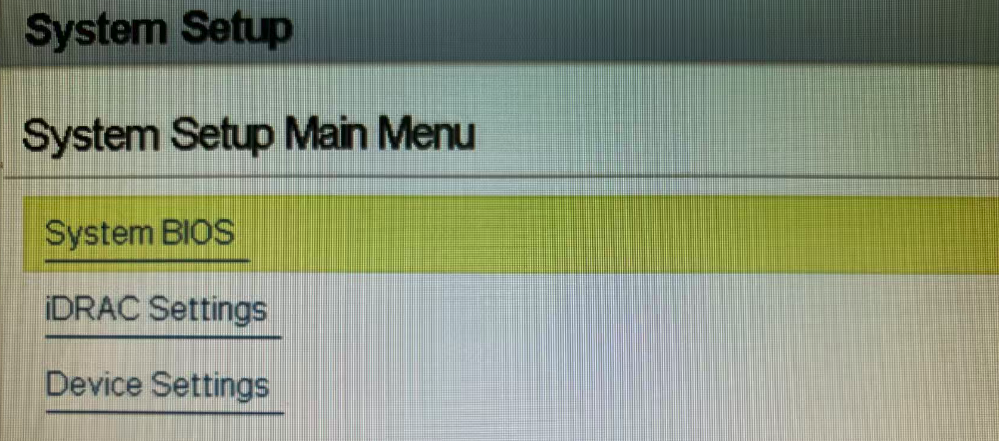

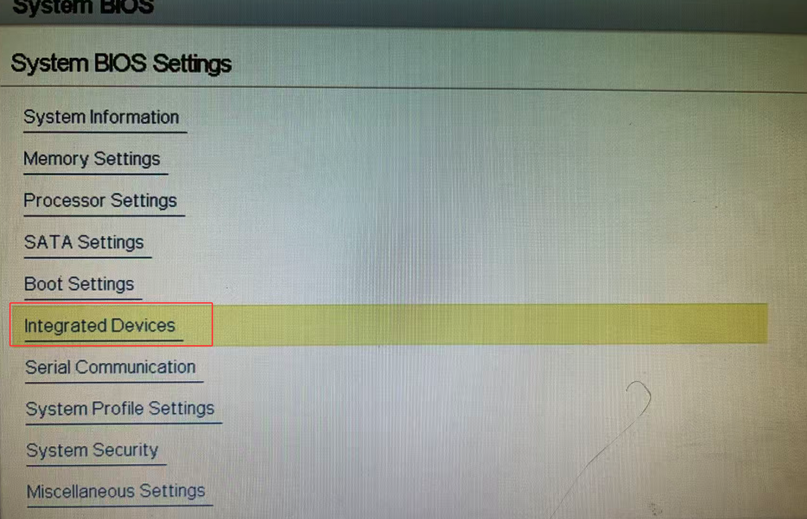

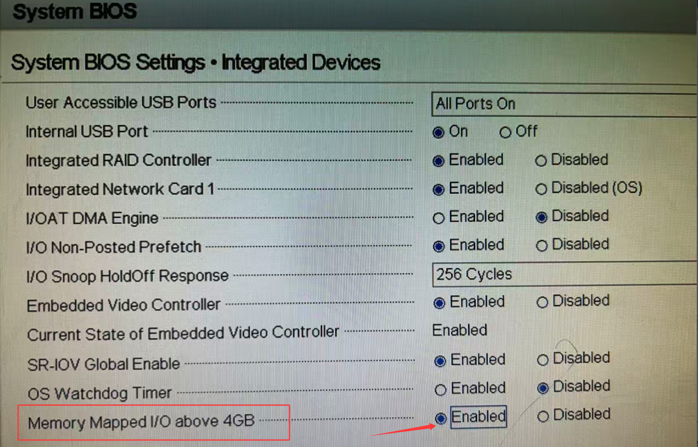

#### 配置GPU直通

登录Esxi主机的web管理界面(<https://主机ip>)

主机--->管理--->硬件,搜索Nvidia,将GPU的直通由”禁用"修改为“活动"

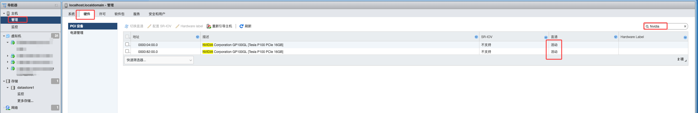

### 创建虚拟机

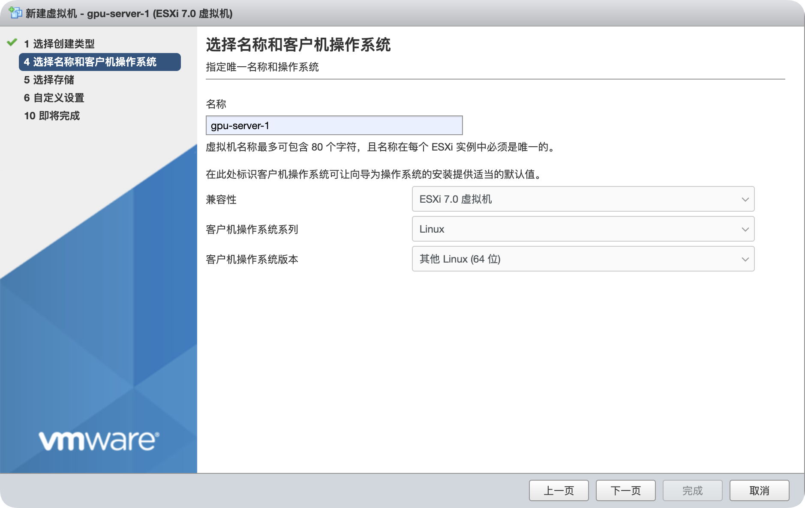

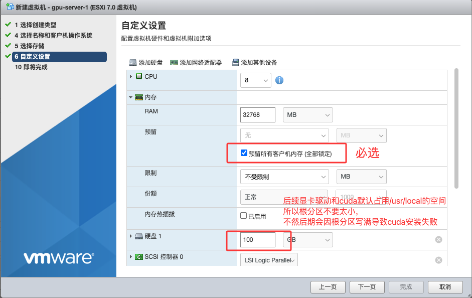

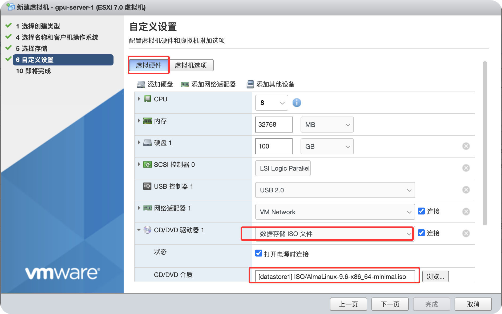

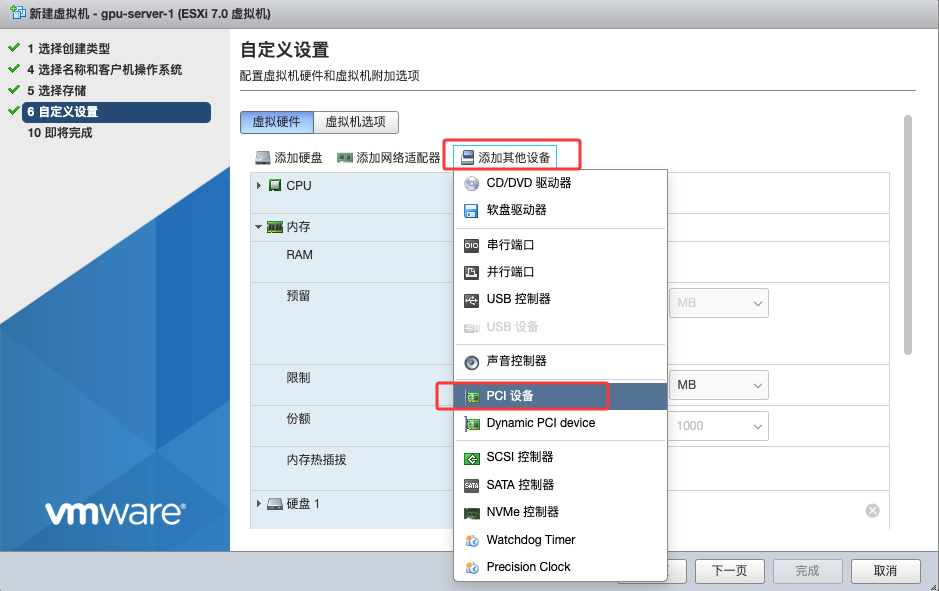

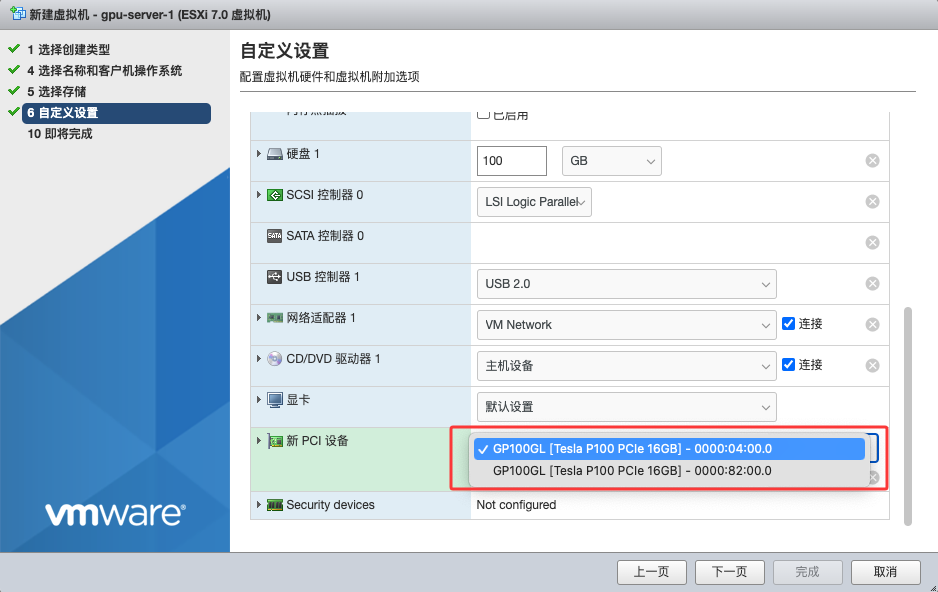

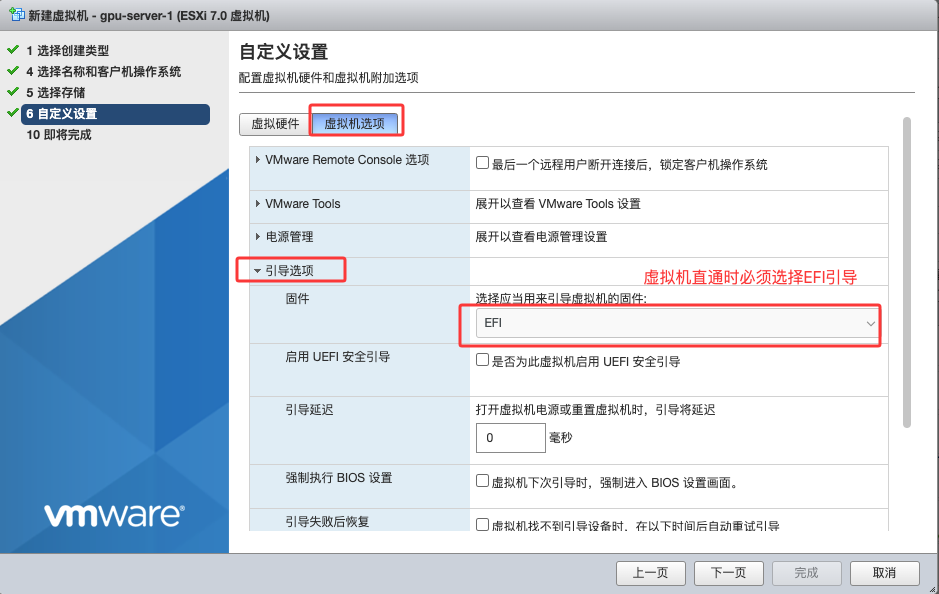

注意引导方式必须选择EFI，否则可能无法安装操作系统或者识别不到直通的显卡


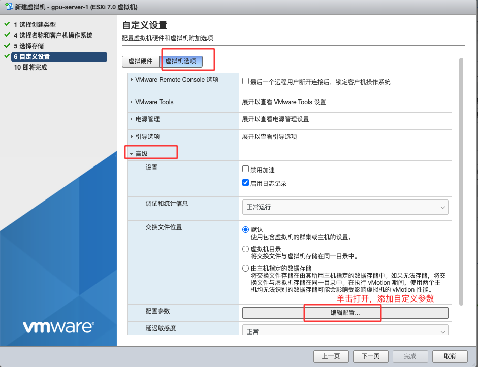

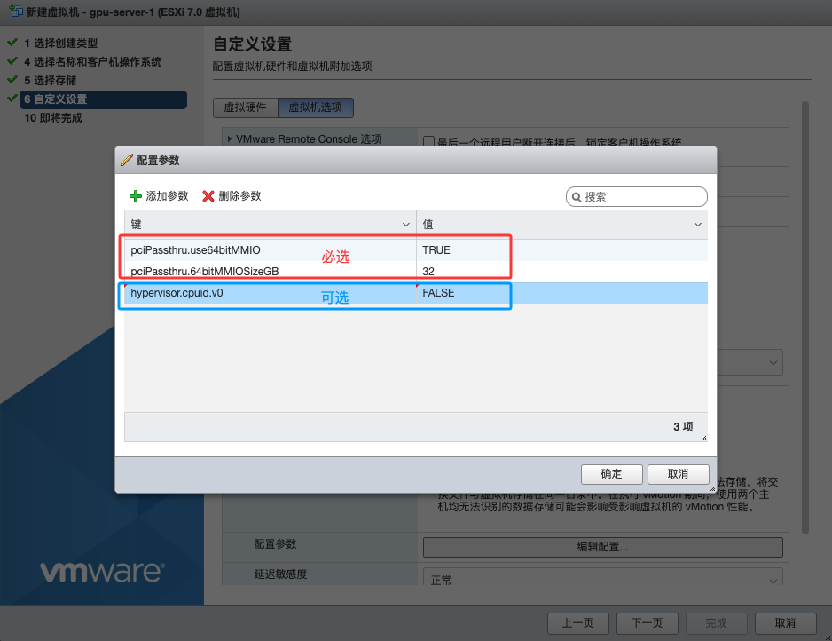

以上参数必须添加，尤其是必选的两个参数，不然虚拟机无法启动，报电源错误

附： 参数名及作用

| 参数名                      | 参数值 | 作用                             |
| --------------------------- | ------ | -------------------------------- |
| pciPassthru.use64bitMMIO    | TRUE   | 允许MMIO使用64位地址空间         |
| pciPassthru.64bitMMIOSizeGB | 32     | 为MMIO分配的最大内存，大于显存   |
| hypervisor.cpuid.v0         | FALSE  | 让虚拟机不认为自己运行在虚拟环境 |

### 安装操作系统

#### 文件系统使用XFS

GPU 服务器的典型 I/O 特征：

- **深度学习训练**：通常涉及 **大文件顺序读写**（如模型 checkpoint、数据集 tar/record 文件、Tensor 数据 dump）。
- **高并发 I/O**：多个 GPU/进程同时写日志、模型快照。
- **超大容量磁盘**：GPU 服务器常用本地 NVMe/SSD 阵列，容量几 TB 到几十 TB。

 这些特征更适合 XFS，因为它在 **大文件吞吐量 + 并发元数据更新** 上表现比 EXT4 更好

#### 根分区可用空间要足够

可用空间不要低于50G，因为Nvidia驱动安装到/lib/modules、/usr/lib`、`/usr/lib64`、`/usr/bin等目录，cuda默认安装到/usr/local目录，并且安装过程中的临时文件放到/tmp目录下，会占用大量根分区空间，可能会因根分区写满导致安装失败。

或者在安装cuda时使用--toolkitpath=/path/to/cuda参数指定安装目录


### 确认已识别到直通先看

```bash
lspci | grep -i nvi
03:00.0 3D controller: NVIDIA Corporation GP100GL [Tesla P100 PCIe 16GB] (rev a1)
```

### 禁用noueau

```bash
# 创建黑名单文件
touch /etc/modprobe.d/blacklist-nvidia-nouveau.conf

# sudo vim /etc/modprobe.d/blacklist-nvidia-nouveau.conf
# 添加下面两行
blacklist nouveau
options nouveau modeset=0 

# 更新 initramfs 并重启系统
dracut -f && sudo shutdown -r now

# 重启后验证
lsmod | grep nouveau  # 没有任何输出即为成功
```


### 安装驱动

```bash
# gcc等编译工具
yum groupinstall "Development Tools"
./NVIDIA-Linux-x86_64-535.261.03.run --silent --dkms --accept-license --no-questions
```

附：常用安装参数

| 参数名           | 作用                                                 |
| ---------------- | ---------------------------------------------------- |
| --accept-license | 自动接受协议                                         |
| --silent         | 非交互式静默安装，不输出任何信息，不利于debug        |
| --no-questions   | 缺省配置禁问答                                       |
| --dkms           | 动态内核模块支持，开启后注册内核模块以便后续内核更新 |
| --uninstall      | 卸载                                                 |


验证：

```bash
# 执行nvidia-smi
nvidia-smi

# 有一下输出代表正常
Thu Sep 18 02:24:14 2025
+---------------------------------------------------------------------------------------+
| NVIDIA-SMI 535.261.03             Driver Version: 535.261.03   CUDA Version: 12.2     |
|-----------------------------------------+----------------------+----------------------+
| GPU  Name                 Persistence-M | Bus-Id        Disp.A | Volatile Uncorr. ECC |
| Fan  Temp   Perf          Pwr:Usage/Cap |         Memory-Usage | GPU-Util  Compute M. |
|                                         |                      |               MIG M. |
|=========================================+======================+======================|
|   0  Tesla P100-PCIE-16GB           Off | 00000000:03:00.0 Off |                    0 |
| N/A   33C    P0              27W / 250W |      0MiB / 16384MiB |      0%      Default |
|                                         |                      |                  N/A |
+-----------------------------------------+----------------------+----------------------+

+---------------------------------------------------------------------------------------+
| Processes:                                                                            |
|  GPU   GI   CI        PID   Type   Process name                            GPU Memory |
|        ID   ID                                                             Usage      |
|=======================================================================================|
|  No running processes found                                                           |
+---------------------------------------------------------------------------------------+
```


### 安装cuda

```bash
# 安装
sh cuda_12.2.2_535.104.05_linux.run --toolkit --no-opengl-libs --silent --override

# 配置环境变量
# sudo vim ~/.bashrc，添加如下内容
export CUDA_HOME=/usr/local/cuda
export PATH=$PATH:/usr/local/cuda/bin

# 保存生效
source ~/.bashrc

# 验证
nvcc -V

nvcc: NVIDIA (R) Cuda compiler driver
Copyright (c) 2005-2023 NVIDIA Corporation
Built on Tue_Aug_15_22:02:13_PDT_2023
Cuda compilation tools, release 12.2, V12.2.140
Build cuda_12.2.r12.2/compiler.33191640_0
```

附： 常用参数

| 参数名           | 作用                                   |
| ---------------- | -------------------------------------- |
| --toolkit        | 只安装cuda，不安装自带驱动，这个很重要 |
| --no-opengl-libs | 不使用opengl图形库，避免和本地库冲突   |
| --silent         | 静默安装                               |
| --override       | 覆盖安装，忽略一些小的冲突检查         |
| --toolkit-path   | 指定安装路径，默认为/usr/local/cuda    |


### 节点加入k8s

#### 系统准备

```bash
# 关闭 swap（kubelet 要求）
swapoff -a
sed -i '/ swap / s/^\(.*\)$/#\1/g' /etc/fstab

# 关闭SElinux和Firewalld
setenforce 0
sed -i 's/^SELINUX=enforcing/SELINUX=disabled/' /etc/selinux/config
systemctl disable --now firewalld

# 时间同步
dnf install -y chrony
systemctl enable --now chronyd
timedatectl set-ntp true

# 主机名
hostnamectl --static set-hostname k8s-gpu-alma
echo "10.203.43.111 k8s-gpu-alma" >> /etc/hosts


# 设置内核模块
tee /etc/modules-load.d/k8s.conf <<'EOF'
overlay
br_netfilter
ip_vs
ip_vs_rr
ip_vs_wrr
ip_vs_sh
nf_conntrack
EOF
modprobe overlay
modprobe br_netfilter
modprobe ip_vs
modprobe ip_vs_rr
modprobe ip_vs_wrr
modprobe ip_vs_sh
modprobe nf_conntrack

# 配置 sysctl
tee /etc/sysctl.d/k8s.conf <<'EOF'
net.bridge.bridge-nf-call-ip6tables = 1
net.bridge.bridge-nf-call-iptables  = 1
net.ipv4.ip_forward                 = 1
EOF
sysctl --system
```

#### 安装 kubeadm  kubelet  kubectl

```bash
# 添加 Kubernetes 源
cat <<EOF > /etc/yum.repos.d/kubernetes.repo
[kubernetes]
name=Kubernetes
baseurl=https://mirrors.aliyun.com/kubernetes/yum/repos/kubernetes-el7-x86_64
enabled=1
gpgcheck=0
EOF

dnf clean all && dnf makecache
dnf install -y kubelet-1.23.17 kubeadm-1.23.17 kubectl-1.23.17
dnf install 'dnf-command(versionlock)'
dnf versionlock add kubelet kubeadm kubectl

# 设置kubelet开机自启
ystemctl enable kubelet --now

```

#### 安装docker

```bash
# 安装依赖
dnf install -y yum-utils device-mapper-persistent-data lvm2

# 添加 Docker 官方源（包含 containerd）
dnf config-manager --add-repo https://download.docker.com/linux/centos/docker-ce.repo

# 安装docker
dnf install -y docker-ce docker-ce-cli containerd.io

# 修改docker配置，启用systemd cgroup driverßß
mkdir -p /etc/docker
cat > /etc/docker/daemon.json <<EOF
{
  "exec-opts": ["native.cgroupdriver=systemd"],
  "log-driver": "json-file",
  "log-opts": {
    "max-size": "100m"
  },
  "storage-driver": "overlay2"
}
EOF


```

#### 安装Nvidia Containerd Toolkit

```bash
# 添加yum源
curl -s -L https://nvidia.github.io/libnvidia-container/stable/rpm/nvidia-container-toolkit.repo | tee /etc/yum.repos.d/nvidia-container-toolkit.repo

# 安装（当前版本1.17.8-1）
dnf install -y nvidia-container-toolkit
```

####  配置Docker runtime

```bash
nvidia-ctk runtime configure --runtime=docker --set-as-default
# 以上命令会在docker的配置文件中添加如下内容
# 为docker添加nvidia runtime,并设置为默认runtime
"default-runtime": "nvidia",
"runtimes": {
        "nvidia": {
            "args": [],
            "path": "nvidia-container-runtime"
        }
    },
    
# 这一点上container和docker不同
# Kubernetes 官方和 NVIDIA 的建议是：
# Docker runtime → 可以安全地把默认 runtime 设成 nvidia（非 GPU 容器不会受影响）。
# Containerd runtime → 不要直接修改默认 runtime，
# 而是通过 nvidia-container-runtime 配合 nvidia-device-plugin 使用 RuntimeClass 的方式来区分。
```

#### 重启docker

```bash
systemctl restart docker
systemctl enable docker
```

#### 验证GPU Runtime

```bash
docker run --rm --gpus all harbor.baway.org.cn/k8s/cuda:12.2.2-base-ubuntu22.04  nvidia-smi
# 如果能看到GPU信息说明GPU runtime 配置成功
```

#### 将GPU节点加入k8s集群

````bash
# master 节点执行以下命令，生成join语句
kubeadm token create --print-join-command

# GPU节点上执行join语句加入集群

# master节点上验证,看节点是否Ready
kubectl get node 
````

### 为GPU节点打标签、添加污点

保证GPU相关的Pod只能调度到这个节点

```bash
# 打污点
kubectl taint node gpu-alma nvidia.com/gpu=true:NoSchedule

# 打标签
kubectl label nodes gpu-alma nvidia.com/gpu.present="true"
```

### 安装k8s-device-plugin

```bash
# 项目托管地址
# https://github.com/NVIDIA/k8s-device-plugin

# 当前最新版本为0.17.4，经验证0.11版本可以与k8s 1.23兼容，不要使用最新版本
# https://raw.githubusercontent.com/NVIDIA/k8s-device-plugin/refs/heads/release-0.11/deployments/static/nvidia-device-plugin.yml

# 修改之后的yaml文件如下：
```

```yaml
# 
apiVersion: apps/v1
kind: DaemonSet
metadata:
  name: nvidia-device-plugin-daemonset
  namespace: kube-system
spec:
  selector:    
    matchLabels:
      name: nvidia-device-plugin-ds
  updateStrategy:
    type: RollingUpdate
  template:
    metadata:
      labels:
        name: nvidia-device-plugin-ds
    spec:
      nodeSelector:   # 只在GPU节点运行
        nvidia.com/gpu.present: "true"
      tolerations:
      - key: nvidia.com/gpu
        operator: Exists
        effect: NoSchedule
      # Mark this pod as a critical add-on; when enabled, the critical add-on
      # scheduler reserves resources for critical add-on pods so that they can
      # be rescheduled after a failure.
      # See https://kubernetes.io/docs/tasks/administer-cluster/guaranteed-scheduling-critical-addon-pods/
      priorityClassName: "system-node-critical"
      containers:
      - image: harbor.baway.org.cn/k8s/k8s-device-plugin:v0.11.0
        name: nvidia-device-plugin-ctr
        env:
         - name: FAIL_ON_INIT_ERROR
           value: "false"
        securityContext:
          allowPrivilegeEscalation: false
          capabilities:
            drop: ["ALL"]
        volumeMounts:
        - name: kubelet-device-plugins-dir
          mountPath: /var/lib/kubelet/device-plugins  
      volumes:
      - name: kubelet-device-plugins-dir
        hostPath:
          path: /var/lib/kubelet/device-plugins
          type: Directory

```

```bash
# 安装
kubectl apply -f nvidia-device-plugin.yaml

# 验证Pod状态
kubectl get pod -n kube-system
nvidia-device-plugin-daemonset-dpzdw       1/1     Running   0               6m24s

# 进入Pod内部验证
kubectl exec -it -n kube-system nvidia-device-plugin-daemonset-dpzdw -- bash
ls -l /dev/nvidia*
crw-rw-rw- 1 root root 237,   0 Sep 17 08:11 /dev/nvidia-uvm
crw-rw-rw- 1 root root 237,   1 Sep 17 08:11 /dev/nvidia-uvm-tools
crw-rw-rw- 1 root root 195,   0 Sep 17 08:10 /dev/nvidia0
crw-rw-rw- 1 root root 195, 255 Sep 17 08:10 /dev/nvidiactl

ls  /usr/lib/x86_64-linux-gnu/*so* # 有诸多.so文件

# 查看容器日志，有nvidia.com/gpu注册成功的消息
kubectl logs -f -n kube-system nvidia-device-plugin-daemonset-dpzdw
2025/09/18 08:48:29 Loading NVML
2025/09/18 08:48:29 Starting FS watcher.
2025/09/18 08:48:29 Starting OS watcher.
2025/09/18 08:48:29 Retreiving plugins.
2025/09/18 08:48:29 Starting GRPC server for 'nvidia.com/gpu'
2025/09/18 08:48:29 Starting to serve 'nvidia.com/gpu' on /var/lib/kubelet/device-plugins/nvidia-gpu.sock
2025/09/18 08:48:29 Registered device plugin for 'nvidia.com/gpu' with Kubelet

```

### 创建测试Pod

```yaml
# gpu-test.yaml
apiVersion: v1
kind: Pod
metadata:
  name: gpu-test
spec:
  restartPolicy: Never
  tolerations:               # 必须设置容忍度，因为GPU节点打了污点
  - key: nvidia.com/gpu
    operator: Exists
    effect: NoSchedule
  containers:
  - name: cuda
    image: harbor.baway.org.cn/k8s/cuda:12.2.2-base-ubuntu22.04
    command: ["nvidia-smi"]
    resources:
      limits:
        nvidia.com/gpu: 1
```

```bash
# 创建Pod
kubectl apply -f gpu-test.yaml

# 查看Pod日志
kubectl logs -f gpu-test

# 能够显示显卡信息代表成功
Thu Sep 18 08:54:17 2025
+---------------------------------------------------------------------------------------+
| NVIDIA-SMI 535.261.03             Driver Version: 535.261.03   CUDA Version: 12.2     |
|-----------------------------------------+----------------------+----------------------+
| GPU  Name                 Persistence-M | Bus-Id        Disp.A | Volatile Uncorr. ECC |
| Fan  Temp   Perf          Pwr:Usage/Cap |         Memory-Usage | GPU-Util  Compute M. |
|                                         |                      |               MIG M. |
|=========================================+======================+======================|
|   0  Tesla P100-PCIE-16GB           Off | 00000000:03:00.0 Off |                    0 |
| N/A   34C    P0              27W / 250W |      0MiB / 16384MiB |      0%      Default |
|                                         |                      |                  N/A |
+-----------------------------------------+----------------------+----------------------+

+---------------------------------------------------------------------------------------+
| Processes:                                                                            |
|  GPU   GI   CI        PID   Type   Process name                            GPU Memory |
|        ID   ID                                                             Usage      |
|=======================================================================================|
|  No running processes found                                                           |
+---------------------------------------------------------------------------------------+
```


