    **vmware Esxi虚拟机安装Ubuntu 22.04，直通方式使用Nvidia P100并加入k8s集群**

### 环境介绍

#### 硬件

服务器： Dell  PowerEdge R730

CPU:   Intel(R) Xeon(R) CPU E5-2683 v4 @ 2.10GHz    x2

架构：X86_64

显卡： Nvidia P100 16G

#### 软件

宿主机： vmware Esxi 7.0.0

虚拟机： Ubuntu 22.04

k8s: 1.34.1

### Esxi宿主机配置显卡直通

#### 宿主机开启MMIO大内存支持

重启服务器，开机使用F2进入BIOS界面，System BlOS--->Integrated Devices--->Memory Mapped l/O above 4GB,确保设置为Enabled

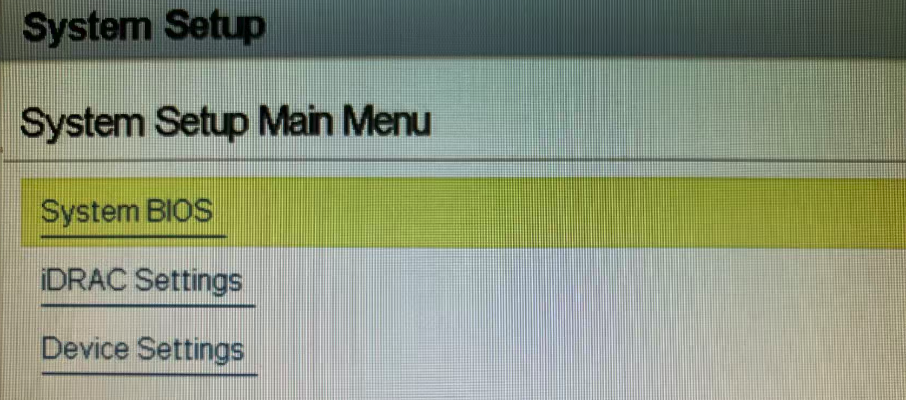


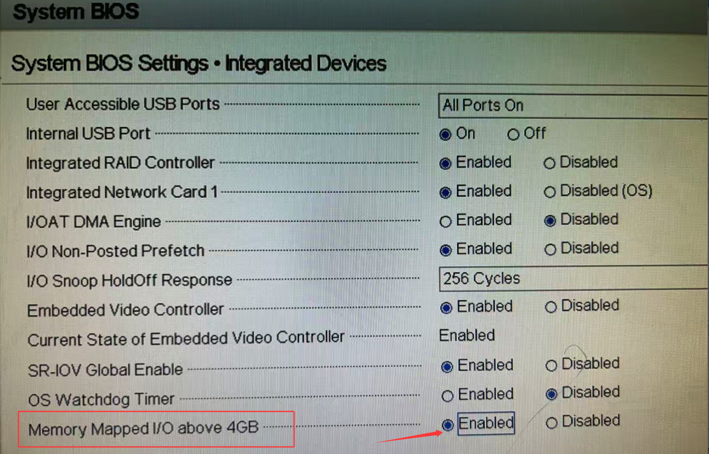

#### 配置GPU直通

登录Esxi主机的web管理界面(<https://主机ip>)

主机--->管理--->硬件,搜索Nvidia,将GPU的直通由”禁用"修改为“活动"

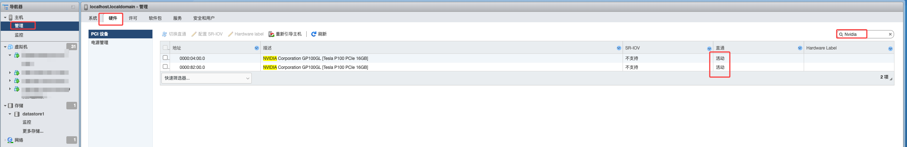

### 创建虚拟机

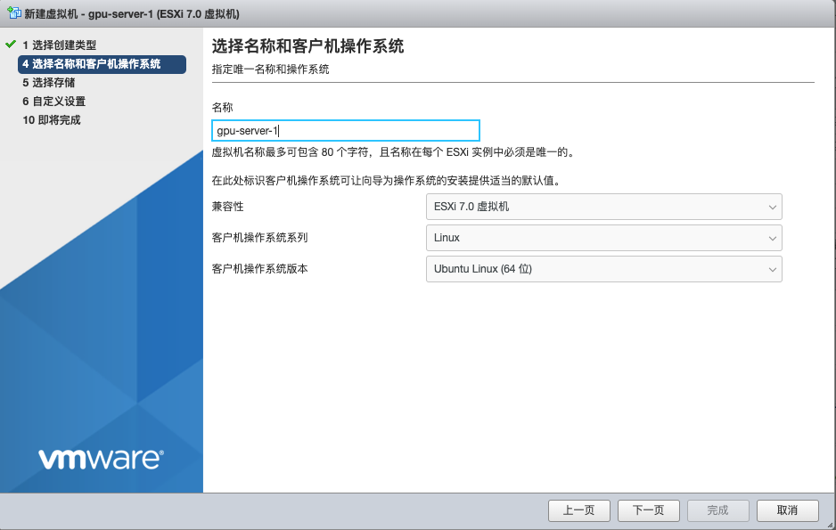

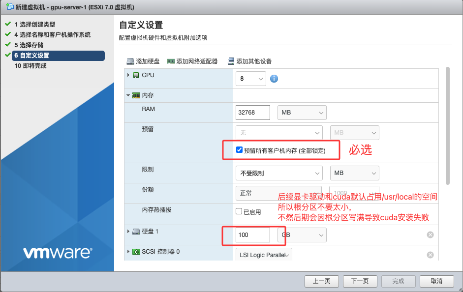

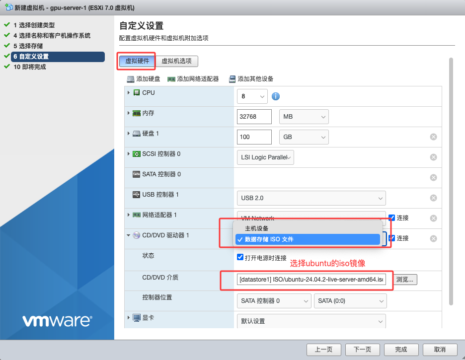

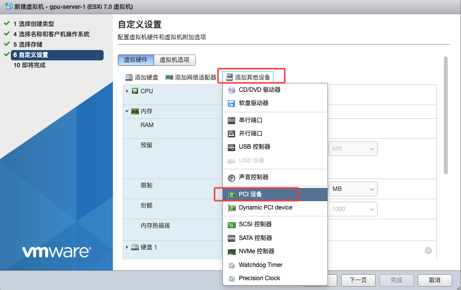

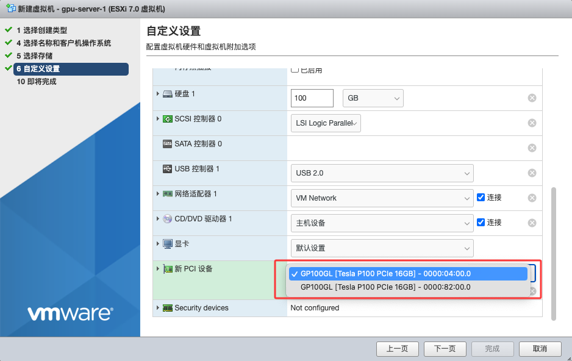

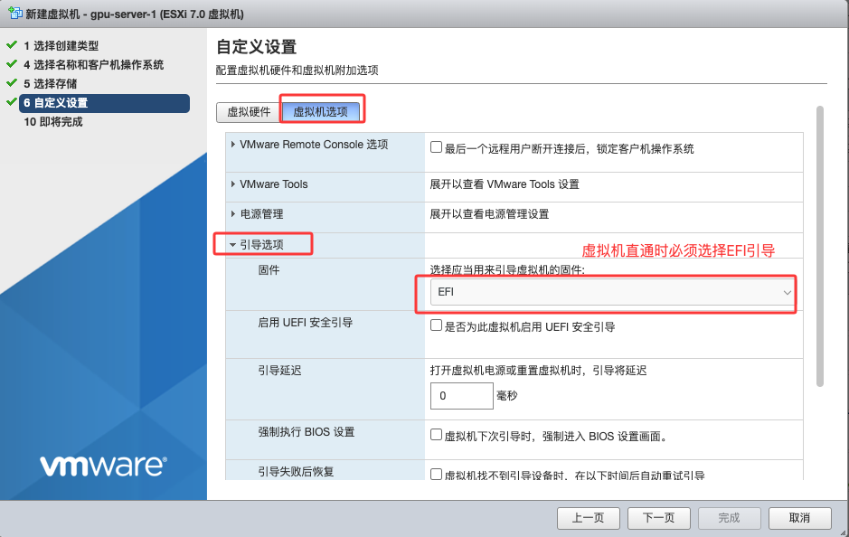

注意引导方式必须选择EFI，否则可能无法安装操作系统或者识别不到直通的显卡


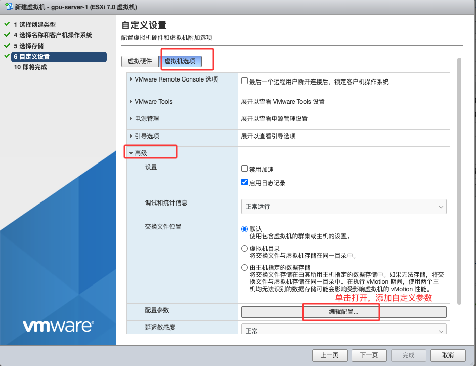

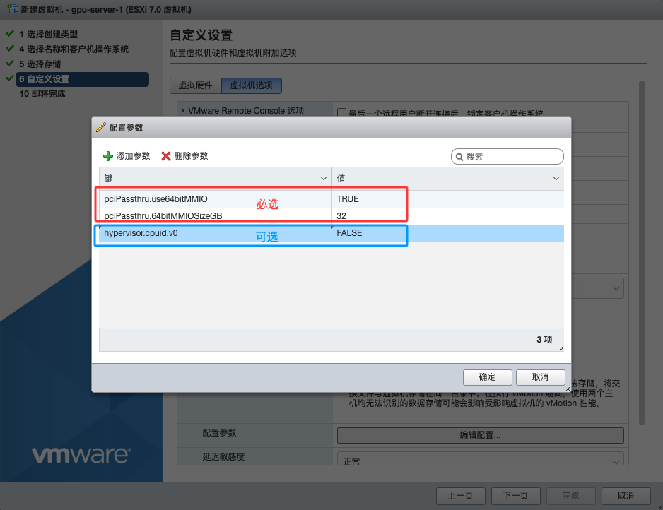

以上参数必须添加，尤其是必选的两个参数，不然虚拟机无法启动，报电源错误

附： 参数名及作用

| 参数名                      | 参数值 | 作用                             |
| --------------------------- | ------ | -------------------------------- |
| pciPassthru.use64bitMMIO    | TRUE   | 允许MMIO使用64位地址空间         |
| pciPassthru.64bitMMIOSizeGB | 32     | 为MMIO分配的最大内存，大于显存   |
| hypervisor.cpuid.v0         | FALSE  | 让虚拟机不认为自己运行在虚拟环境 |

### 安装操作系统

#### 文件系统使用XFS

GPU 服务器的典型 I/O 特征：

- **深度学习训练**：通常涉及 **大文件顺序读写**（如模型 checkpoint、数据集 tar/record 文件、Tensor 数据 dump）。
- **高并发 I/O**：多个 GPU/进程同时写日志、模型快照。
- **超大容量磁盘**：GPU 服务器常用本地 NVMe/SSD 阵列，容量几 TB 到几十 TB。

 这些特征更适合 XFS，因为它在 **大文件吞吐量 + 并发元数据更新** 上表现比 EXT4 更好

#### 根分区可用空间要足够

可用空间不要低于50G，因为Nvidia驱动安装到/lib/modules、/usr/lib`、`/usr/lib64`、`/usr/bin等目录，cuda默认安装到/usr/local目录，并且安装过程中的临时文件放到/tmp目录下，会占用大量根分区空间，可能会因根分区写满导致安装失败。

或者在安装cuda时使用--toolkitpath=/path/to/cuda参数指定安装目录


### 确认已识别到直通先看

```bash
sudo lspci | grep -i nvi
03:00.0 3D controller: NVIDIA Corporation GP100GL [Tesla P100 PCIe 16GB] (rev a1)
```

### 禁用noueau

```bash
# 创建黑名单文件
sudo touch /etc/modprobe.d/blacklist-nvidia-nouveau.conf

# sudo vim /etc/modprobe.d/blacklist-nvidia-nouveau.conf
# 添加下面两行
blacklist nouveau
options nouveau modeset=0 

# 更新 initramfs 并重启系统
sudo update-initramfs -u && sudo shutdown -r now

# 重启后验证
lsmod | grep nouveau  # 没有任何输出即为成功
```


### 安装驱动

```bash
sudo ./NVIDIA-Linux-x86_64-535.261.03.run --silent --dkms --accept-license --no-questions
```

附：常用安装参数

| 参数名           | 作用                                                 |
| ---------------- | ---------------------------------------------------- |
| --accept-license | 自动接受协议                                         |
| --silent         | 非交互式静默安装，不输出任何信息，不利于debug        |
| --no-questions   | 缺省配置禁问答                                       |
| --dkms           | 动态内核模块支持，开启后注册内核模块以便后续内核更新 |
| --uninstall      | 卸载                                                 |


验证：

```bash
# 执行nvidia-smi
nvidia-smi

# 有一下输出代表正常
Thu Sep 18 02:24:14 2025
+---------------------------------------------------------------------------------------+
| NVIDIA-SMI 535.261.03             Driver Version: 535.261.03   CUDA Version: 12.2     |
|-----------------------------------------+----------------------+----------------------+
| GPU  Name                 Persistence-M | Bus-Id        Disp.A | Volatile Uncorr. ECC |
| Fan  Temp   Perf          Pwr:Usage/Cap |         Memory-Usage | GPU-Util  Compute M. |
|                                         |                      |               MIG M. |
|=========================================+======================+======================|
|   0  Tesla P100-PCIE-16GB           Off | 00000000:03:00.0 Off |                    0 |
| N/A   33C    P0              27W / 250W |      0MiB / 16384MiB |      0%      Default |
|                                         |                      |                  N/A |
+-----------------------------------------+----------------------+----------------------+

+---------------------------------------------------------------------------------------+
| Processes:                                                                            |
|  GPU   GI   CI        PID   Type   Process name                            GPU Memory |
|        ID   ID                                                             Usage      |
|=======================================================================================|
|  No running processes found                                                           |
+---------------------------------------------------------------------------------------+
```


### 安装cuda

```bash
# 安装
sudo sh cuda_12.2.2_535.104.05_linux.run --toolkit --no-opengl-libs --silent --override

# 配置环境变量
# sudo vim ~/.bashrc，添加如下内容
export CUDA_HOME=/usr/local/cuda
export PATH=$PATH:/usr/local/cuda/bin

# 保存生效
source ~/.bashrc

# 验证
nvcc -V

nvcc: NVIDIA (R) Cuda compiler driver
Copyright (c) 2005-2023 NVIDIA Corporation
Built on Tue_Aug_15_22:02:13_PDT_2023
Cuda compilation tools, release 12.2, V12.2.140
Build cuda_12.2.r12.2/compiler.33191640_0
```

附： 常用参数

| 参数名           | 作用                                   |
| ---------------- | -------------------------------------- |
| --toolkit        | 只安装cuda，不安装自带驱动，这个很重要 |
| --no-opengl-libs | 不使用opengl图形库，避免和本地库冲突   |
| --silent         | 静默安装                               |
| --override       | 覆盖安装，忽略一些小的冲突检查         |
| --toolkit-path   | 指定安装路径，默认为/usr/local/cuda    |


### 节点加入k8s

#### 系统准备

```bash
# 关闭 swap（kubelet 要求）
sudo swapoff -a
sudo sed -i '/ swap / s/^\(.*\)$/#\1/g' /etc/fstab

# 设置内核模块
sudo tee /etc/modules-load.d/k8s.conf <<'EOF'
overlay
br_netfilter
EOF
sudo modprobe overlay
sudo modprobe br_netfilter

# 配置 sysctl
sudo tee /etc/sysctl.d/k8s.conf <<'EOF'
net.bridge.bridge-nf-call-ip6tables = 1
net.bridge.bridge-nf-call-iptables  = 1
net.ipv4.ip_forward                 = 1
EOF
sudo sysctl --system
```

#### 安装 kubeadm  kubelet  kubectl

```bash
# 添加 Kubernetes 源
sudo mkdir -p /etc/apt/keyrings
curl -fsSL https://pkgs.k8s.io/core:/stable:/v1.34/deb/Release.key | \
  sudo gpg --dearmor -o /etc/apt/keyrings/kubernetes-apt-keyring.gpg

echo "deb [signed-by=/etc/apt/keyrings/kubernetes-apt-keyring.gpg] \
  https://pkgs.k8s.io/core:/stable:/v1.34/deb/ /" \
  | sudo tee /etc/apt/sources.list.d/kubernetes.list

sudo apt update
sudo apt install -y kubelet=1.34.1-1.1 kubeadm=1.34.1-1.1 kubectl=1.34.1-1.1
sudo apt-mark hold kubelet kubeadm kubectl

# 设置kubelet开机自启
sudo systemctl enable kubelet

```

#### 安装containerd

```bash
# 安装依赖
sudo apt install -y apt-transport-https ca-certificates curl software-properties-common gnupg

# 添加 Docker 官方源（包含 containerd）
sudo mkdir -p /etc/apt/keyrings
curl -fsSL https://download.docker.com/linux/ubuntu/gpg | \
  sudo gpg --dearmor -o /etc/apt/keyrings/docker.gpg
echo "deb [arch=$(dpkg --print-architecture) signed-by=/etc/apt/keyrings/docker.gpg] \
  https://download.docker.com/linux/ubuntu $(lsb_release -cs) stable" \
  | sudo tee /etc/apt/sources.list.d/docker.list

sudo apt update
sudo apt install -y containerd.io

# 生成默认配置
sudo mkdir -p /etc/containerd
containerd config default | sudo tee /etc/containerd/config.toml

```

#### 安装Nvidia Containerd Toolkit

```bash
# 添加源
curl -fsSL https://nvidia.github.io/libnvidia-container/gpgkey | \
  sudo gpg --dearmor -o /usr/share/keyrings/nvidia-container-toolkit-keyring.gpg

curl -s -L https://nvidia.github.io/libnvidia-container/stable/deb/nvidia-container-toolkit.list | \
  sed 's#deb https://#deb [signed-by=/usr/share/keyrings/nvidia-container-toolkit-keyring.gpg] https://#g' | \
  sudo tee /etc/apt/sources.list.d/nvidia-container-toolkit.list

sudo apt update
sudo apt install -y nvidia-container-toolkit

```

#### 修改containerd配置

```bash
# 为containerd添加nvidia runtime
sudo nvidia-ctk runtime configure --runtime=containerd
# 该命令会自动在/etc/containerd/config.toml中添加runtime相关配置,如下：
[plugins."io.containerd.grpc.v1.cri".containerd.runtimes]
  [plugins."io.containerd.grpc.v1.cri".containerd.runtimes.nvidia]
    base_runtime_spec = ""
    cni_conf_dir = ""
    ni_max_conf_num = 0
    container_annotations = []
    pod_annotations = []
    privileged_without_host_devices = false
    privileged_without_host_devices_all_devices_allowed = false
    runtime_engine = ""
    runtime_path = ""
    runtime_root = ""
    runtime_type = "io.containerd.runc.v2"
    snapshotter = ""

    [plugins."io.containerd.grpc.v1.cri".containerd.runtimes.nvidia.options]
      BinaryName = "/usr/bin/nvidia-container-runtime"
      CriuImagePath = ""
      CriuPath = ""
      CriuWorkPath = ""
      IoGid = 0
      IoUid = 0
      NoNewKeyring = false
      NoPivotRoot = false
      Root = ""
      ShimCgroup = ""
      SystemdCgroup = true


# 修改containerd的Cgroup驱动为systemd，注意两个现在containerd中有runc和nvidia两个runtime
# 每个runtime都需要指定Cgroup为systemd
# 打开/etc/containerd/config.toml：
找到 [plugins."io.containerd.grpc.v1.cri".containerd.runtimes.runc.options]
把SystemdCgroup = false
修改为SystemdCgroup = true
```

#### 重启containerd

```bash
sudo systemctl restart containerd
sudo systemctl enable containerd
```

#### 验证GPU Runtime

```bash
sudo ctr run --rm -t \
  --runc-binary=/usr/bin/nvidia-container-runtime \
  --env NVIDIA_VISIBLE_DEVICES=all \
  docker.io/nvidia/cuda:12.1.1-base-ubuntu22.04 \
  test-nvidia nvidia-smi

# 如果能看到GPU信息说明GPU runtime 配置成功
```

#### 将GPU节点加入k8s集群

````bash
# master 节点执行以下命令，生成join语句
sudo kubeadm token create --print-join-command

# GPU节点上执行join语句加入集群

# master节点上验证,看节点是否Ready
kubectl get node 
````

### 创建runtimeClass

目前这个GPU节点上的容器运行时(containerd)已经被配置为同时具备runc、nvidia两个runtime，默认的runtime是自带的runc，nvidia是通过安装Containerd Toolkit并执行nvidia-ctk runtime configure --runtime=containerd命令添加的。

之后，所有需要调用GPU的Pod都将被调度到这个GPU节点，并且要使用Containerd的nvidia runtime来创建和运行容器才能成功调用GPU，runtimeClass的作用就是为Pod指定nvidia runtime

```yaml
# nvidia-runtime.yaml
apiVersion: node.k8s.io/v1
kind: RuntimeClass
metadata:
  name: nvidia
handler: nvidia


```

```bash
# 创建runtimeClass
kubectl apply -f nvidia-runtime.yaml

# 验证
kubectl get runtimeclasses.node.k8s.io

NAME     HANDLER   AGE
nvidia   nvidia    16h
```

### 为GPU节点打标签、添加污点

保证GPU相关的Pod只能调度到这个节点

```bash
# 打污点
kubectl taint node gpu-server-ubuntu nvidia.com/gpu=true:NoSchedule

# 打标签
kubectl label nodes gpu-server-ubuntu nvidia.com/gpu.present="true"
```


### 安装k8s-device-plugin

```bash
# 项目托管地址
# https://github.com/NVIDIA/k8s-device-plugin

# 当前最新版本为0.17.4，经验证0.15版本可以与P100兼容，不要使用最新版本
# https://raw.githubusercontent.com/NVIDIA/k8s-device-plugin/refs/heads/release-0.15/deployments/static/nvidia-device-plugin.yml

# 修改之后的yaml文件如下：
```

```yaml
# 
apiVersion: apps/v1
kind: DaemonSet
metadata:
  name: nvidia-device-plugin-daemonset
  namespace: kube-system
spec:
  selector:    
    matchLabels:
      name: nvidia-device-plugin-ds
  updateStrategy:
    type: RollingUpdate
  template:
    metadata:
      labels:
        name: nvidia-device-plugin-ds
    spec:
      nodeSelector:   # 只在GPU节点运行
        nvidia.com/gpu.present: "true"
      tolerations:
      - key: nvidia.com/gpu
        operator: Exists
        effect: NoSchedule
      # Mark this pod as a critical add-on; when enabled, the critical add-on
      # scheduler reserves resources for critical add-on pods so that they can
      # be rescheduled after a failure.
      # See https://kubernetes.io/docs/tasks/administer-cluster/guaranteed-scheduling-critical-addon-pods/
      priorityClassName: "system-node-critical"
      runtimeClassName: nvidia   # 指定runtimeClass
      containers:
      - image: harbor.baway.org.cn/k8s/k8s-device-plugin:v0.15.1
        name: nvidia-device-plugin-ctr
        env:
         - name: FAIL_ON_INIT_ERROR
           value: "false"
        securityContext:
          allowPrivilegeEscalation: false
          capabilities:
            drop: ["ALL"]
        volumeMounts:
        - name: kubelet-device-plugins-dir
          mountPath: /var/lib/kubelet/device-plugins  
      volumes:
      - name: kubelet-device-plugins-dir
        hostPath:
          path: /var/lib/kubelet/device-plugins
          type: Directory

```

```bash
# 安装
kubectl apply -f nvidia-device-plugin.yaml

# 验证Pod状态
kubectl get pod -n kube-system
nvidia-device-plugin-daemonset-wqnms       1/1     Running   0               6m24s

# 进入Pod内部验证
kubectl exec -it -n kube-system nvidia-device-plugin-daemonset-wqnms -- bash
ls -l /dev/nvidia*
crw-rw-rw- 1 root root 237,   0 Sep 17 08:11 /dev/nvidia-uvm
crw-rw-rw- 1 root root 237,   1 Sep 17 08:11 /dev/nvidia-uvm-tools
crw-rw-rw- 1 root root 195,   0 Sep 17 08:10 /dev/nvidia0
crw-rw-rw- 1 root root 195, 255 Sep 17 08:10 /dev/nvidiactl

ls  /usr/lib/x86_64-linux-gnu/*so* # 有诸多.so文件

# 查看容器日志，有nvidia.com/gpu注册成功的消息
kubectl logs -f -n kube-system nvidia-device-plugin-daemonset-wqnms
I0918 01:31:45.847162       1 main.go:279] Retrieving plugins.
I0918 01:31:45.849097       1 factory.go:104] Detected NVML platform: found NVML library
I0918 01:31:45.849162       1 factory.go:104] Detected non-Tegra platform: /sys/devices/soc0/family file not found
I0918 01:31:47.249701       1 server.go:216] Starting GRPC server for 'nvidia.com/gpu'
I0918 01:31:47.250996       1 server.go:147] Starting to serve 'nvidia.com/gpu' on /var/lib/kubelet/device-plugins/nvidia-gpu.sock
I0918 01:31:47.254727       1 server.go:154] Registered device plugin for 'nvidia.com/gpu' with Kubelet

```

### 创建测试Pod

```yaml
# gpu-test.yaml
apiVersion: v1
kind: Pod
metadata:
  name: gpu-test
spec:
  restartPolicy: Never
  runtimeClassName: nvidia   # 指定runtime
  tolerations:               # 必须设置容忍度，因为GPU节点打了污点
  - key: nvidia.com/gpu
    operator: Exists
    effect: NoSchedule
  containers:
  - name: cuda
    image: harbor.baway.org.cn/k8s/cuda:12.2.2-base-ubuntu22.04
    command: ["nvidia-smi"]
    resources:
      limits:
        nvidia.com/gpu: 1
```

```bash
# 创建Pod
kubectl apply -f gpu-test.yaml

# 查看Pod日志
kubectl logs -f gpu-test

# 能够显示显卡信息代表成功
Wed Sep 17 08:50:27 2025
+---------------------------------------------------------------------------------------+
| NVIDIA-SMI 535.261.03             Driver Version: 535.261.03   CUDA Version: 12.2     |
|-----------------------------------------+----------------------+----------------------+
| GPU  Name                 Persistence-M | Bus-Id        Disp.A | Volatile Uncorr. ECC |
| Fan  Temp   Perf          Pwr:Usage/Cap |         Memory-Usage | GPU-Util  Compute M. |
|                                         |                      |               MIG M. |
|=========================================+======================+======================|
|   0  Tesla P100-PCIE-16GB           Off | 00000000:03:00.0 Off |                    0 |
| N/A   33C    P0              27W / 250W |      0MiB / 16384MiB |      0%      Default |
|                                         |                      |                  N/A |
+-----------------------------------------+----------------------+----------------------+

+---------------------------------------------------------------------------------------+
| Processes:                                                                            |
|  GPU   GI   CI        PID   Type   Process name                            GPU Memory |
|        ID   ID                                                             Usage      |
|=======================================================================================|
|  No running processes found                                                           |
+---------------------------------------------------------------------------------------+
```


