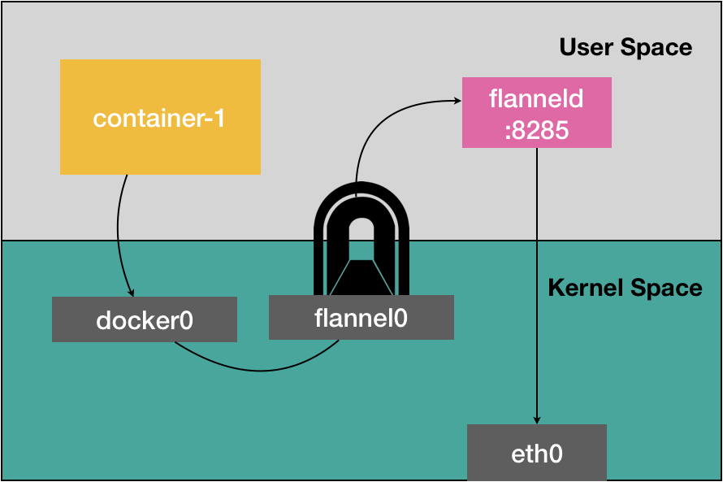

### sk8s组件、作用

master节点的组件：
 apiserver： 集群的统一入口，接收所有 REST 请求并转发给其他组件,所有交互都经过它。也是唯一可以跟etcd通信的组件
 etcd: 分布式键值存储系统，用来保存集群的元数据(配置数据和状态信息)
 kube-scheduler: 负责将新创建的 Pod 分配到合适的 Node 节点上（调度器）
 kube-controller-manager:运行各种控制器（如副本控制器、节点控制器等）来维持集群状态

worker节点的组件：
 kubelet: 负责和 apiserver 通信，管理Pod的生命周期，上报节点的健康状况
 kube-proxy：负责将Pod注册到CoreDNS， 并为Service 创建ipvs或者iptables转发规则，实现服务发现和负载均衡
 Container Runtime：容器运行时，比如 Docker、containerd、CRI-O，用于实际拉取镜像并运行容器

附加组件：
 CoreDNS:集群内的DNS服务

    CNI网络插件: Flannel、Calico等

---

### k8s指定apiserver的ip和端口

```
--advertise-address
--bind-address
--secure-port

--advertise-address ip 
用于将 apiserver 通告给集群成员的 IP 地址。此地址必须可供集群的其余部分访问。如果为空，将使用 --bind-address。
如果未指定 --bind-address，将使用主机的默认接口。
--bind-address ip 
用于侦听 --secure-port 端口的 IP 地址。相关接口必须可由集群的其余部分以及 CLI/Web 客户端访问。
如果为空，则将使用所有接口（所有 IPv4 接口为 0.0.0.0，所有 IPv6 接口为 ::）。（默认值为 0.0.0.0）

默认情况下，默认 IP 是第一个非本地主机网络接口和 6443 端口。
```

---

### kube-aggregator

kube-aggregator 是 Kubernetes 架构中的一个组件，全称为  **Kubernetes Aggregator Layer** （聚合层），是  **kube-apiserver 内部集成的一个模块** ，并非一个独立进程。它的作用是：

**扩展 Kubernetes API 的能力** ，允许将来自外部的 API 服务（即聚合 API Server）整合进主 API Server，使其表现得就像原生 Kubernetes 资源一样

二者之间的关系：

| kube-apiserver                    | kube-aggregator                        |
| --------------------------------- | -------------------------------------- |
| 主 API 服务                       | 其内部集成的聚合模块                   |
| 处理核心资源（Pod/Deployment 等） | 代理扩展 API（CRDs 或外部 API Server） |
| 无需单独部署                      | 是 kube-apiserver 的内建模块           |
| 使用时感知不到 aggregator 存在    | 聚合层“透明地”扩展 API               |

Kubernetes 的核心 API 只提供一组固定的资源（如 Pods、Services、Deployments 等）。但当你想：

* 定义新的复杂资源（如 Istio 的 VirtualService、Prometheus 的监控规则等）；
* 将自定义控制器作为 API 提供；
* 拓展 K8s 功能但不修改 kube-apiserver 源码；

这时就可以通过 Aggregator 来“挂载”外部 API 服务，使其像原生 API 一样被统一访问。

**kube-apiserver 的聚合层代理请求：**

kube-apiserver 收到访问 /apis/`<group>` 的请求时，会：

* 先检查自己是否处理该 Group；
* 如果不是，就由 aggregator 代理转发请求到对应后端；
* 聚合 API Server 处理后返回结果；
* 用户端感知不到代理行为，表现得就像访问了 kube-apiserver。

以下是一个示例

```yaml
apiVersion: apiregistration.k8s.io/v1
kind: APIService
metadata:
  name: v1alpha1.example.my.domain
spec:
  group: example.my.domain
  version: v1alpha1
  service:
    name: my-extension-apiserver
    namespace: default
  groupPriorityMinimum: 1000
  versionPriority: 15

# 这段代码的意思是，当有人访问 /apis/example.my.domain/v1alpha1时，把请求代理到 default/my-extension-apiserver这个service
```

另一个示例是，Metrics Server

```yaml
apiVersion: apiregistration.k8s.io/v1
kind: APIService
metadata:
  annotations:
    meta.helm.sh/release-name: prometheus-adapter
    meta.helm.sh/release-namespace: default
  creationTimestamp: "2025-01-16T09:18:31Z"
  labels:
    app.kubernetes.io/component: metrics
    app.kubernetes.io/instance: prometheus-adapter
    app.kubernetes.io/managed-by: Helm
    app.kubernetes.io/name: prometheus-adapter
    app.kubernetes.io/part-of: prometheus-adapter
    app.kubernetes.io/version: v0.12.0
    helm.sh/chart: prometheus-adapter-4.11.0
  name: v1beta1.custom.metrics.k8s.io
spec:
  group: custom.metrics.k8s.io
  groupPriorityMinimum: 100
  insecureSkipTLSVerify: true
  service:
    name: prometheus-adapter
    namespace: default
    port: 443
  version: v1beta1
  versionPriority: 100

#  当执行kubectl get --raw /apis/custom.metrics.k8s.io/v1beta1/nodes的时候，请求被kubeapiserver代理到了default/prometheus-adapter这个service
```

---

### k8s的metrics-server和cAdvisor的区别

| 项目         | cAdvisor                       | metrics-server                        |
| ------------ | ------------------------------ | ------------------------------------- |
| 安装方式     | 集成在 kubelet，默认启用       | 需要手动部署                          |
| 数据来源     | 容器运行时，直接采集           | 从各个 kubelet（cAdvisor）聚合数据    |
| 采集粒度     | 容器级别，细粒度               | Pod/Node 级别，粗粒度                 |
| 提供 API     | 不直接提供 API（通过 kubelet） | 提供 `metrics.k8s.io`API            |
| 使用场景     | Prometheus 等深度监控          | `kubectl top`，HPA                  |
| 是否必须部署 | 是（kubelet 自带）             | 否（非必需，但用于 HPA 等功能时需要） |

总结：

* `cAdvisor` 是负责采集容器指标的底层组件
* `metrics-server` 是负责聚合和提供指标查询接口的服务，依赖于 cAdvisor 的数据

---

### k8s集群规模限制

集群是运行 Kubernetes 代理的、 由[控制平面](https://kubernetes.io/zh-cn/docs/reference/glossary/?all=true#term-control-plane)管理的一组 [节点](https://kubernetes.io/zh-cn/docs/concepts/architecture/nodes/)（物理机或虚拟机）。 Kubernetes v1.30 单个集群支持的最大节点数为 5,000。 更具体地说，Kubernetes 旨在适应满足以下**所有**标准的配置：

* 每个节点的 Pod 数量不超过 110
* 节点数不超过 5,000
* Pod 总数不超过 150,000
* 容器总数不超过 300,000

---

### k8s版本升级（kubeadm）

1. 添加yum源

   ```shell
   cat <<EOF | sudo tee /etc/yum.repos.d/kubernetes.repo
   [kubernetes]
   name=Kubernetes
   baseurl=https://pkgs.k8s.io/core:/stable:/v1.33/rpm/
   enabled=1
   gpgcheck=1
   gpgkey=https://pkgs.k8s.io/core:/stable:/v1.33/rpm/repodata/repomd.xml.key
   EOF
   ```
2. 查看可用版本

   ```shell
   yum list --disablerepo=* --enablerepo="kubernetes"
   ```
3. 备份重要组件及重要数据
4. kube-apiserver 静态 pod 会始终处于运行状态。当执行 kubeadm 升级时，其中包括 etcd 的升级，在新的 etcd 启动期间，对kube-apiserver的请求将会卡住，因为etcd的静态 Pod 正在重新启动。作为一种解决方法，可以主动停止 kube-apiserver。在启动 kubeadm upgrade apply 命令之前，请等待几秒钟，以关闭 kube-apiserver 进程。这样可以完成正在进行的请求并关闭现有连接，从而最大限度地减少 etcd 停机的影响。这可以在控制平面节点上按如下方式完成

```shell
   killall -s SIGTERM kube-apiserver
   sleep 20
```

5. 升级顺序为，先升级控制平面再升级工作节点。

   控制平面上安装新版kubeadm

   ```shell
   yum install kubeadm-1.33.0-150500.1.1 --disableexcludes=kubernetes
   ```
6. 升级前验证

   ```shell
   kubeadm upgrade plan
   ```
7. 应用升级

   ```shell
   # 升级第一台控制平面
   kubeadm upgrade apply v1.33.0

   # 输出以下内容代表成功
   [upgrade/successful] SUCCESS! Your cluster was upgraded to "v1.33.x". Enjoy!
   [upgrade/kubelet] Now that your control plane is upgraded, please proceed with upgrading your kubelets if you haven't already done so.

   # 升级控制平面上的kubelet（若存在)
   yum install -y kubelet-'1.33.0-150500.1.1' kubectl-'1.33.0-150500.1.1' --disableexcludes=kubernetes

   systemctl daemon-reload  &&  systemctl restart kubelet
   ```
8. 升级网络插件(如需要，取决于网络插件和k8s的版本匹配情况)
9. 升级其他控制平面

   ```
    kubeadm upgrade apply
   ```
10. 升级工作节点

    ```shell
    # 清空节点
    kubectl drain <node-to-drain> --ignore-daemonsets

    # 升级并重启Kubelet
    yum install -y kubelet-'1.33.0-150500.1.1' kubectl-'1.33.0-150500.1.1' --disableexcludes=kubernetes
    systemctl daemon-reload  &&  systemctl restart kubelet

    ```
11. 取消工作节点的污点

    ```
    kubectl uncordon <node-to-uncordon>
    ```

---

### k8s的网络插件，Calico、Flannel和Cilium

#### [参考链接](https://www.cnblogs.com/BlueMountain-HaggenDazs/p/18152648)

#### calico支持的工作模式

* **BGP**:           CALICO_IPV4POOL_IPIP="Never" 且 CALICO_IPV4POOL_VXLAN=”Never“
* **IP Tunnel:**   CALICO_IPV4POOL_IPIP="Always" 且 CALICO_IPV4POOL_VXLAN=”Never“
* **VXLAN** :      CALICO_IPV4POOL_IPIP="Never" 且 CALICO_IPV4POOL_VXLAN=”Always“

#### flannel支持的工作模式

* **VXLAN**
* **HOST-GW**

```yaml
net-conf.json: |
    {
      "Network": "10.244.0.0/16",
      "Backend": {
        "Type": "host-gw" 
 #"Type": "vxlan"
      }
    }
```

* UDP （已废弃）因为存在三次用户态和内核态之间的数据拷贝，导致性能低下
  

#### 优缺点对比

##### 工作模式

两者都同时支持”路由"和"隧道"两种工作模式，

flannel的VXLAN是隧道模式，host-gw是路由模式

calico的IPIP是隧道模式，BGP是路由模式

##### 可配置性

flannel配置更为简单，在小规模集群中，如果对性能要求不是很苛刻，也没有复杂的网络要求，建议使用flannel

calico配置较为复杂，支持配置网络策略，并且能够与istio集成，配置复杂的规则以描述pod应如何发送和接受流量，提高安全性并控制网络环境。如果对性能要求较高，且有网络安全方面的需求，要使用calico

##### 性能差异

flannel的VXLAN模式下，使用overlay(覆盖网络)来实现Pod跨节点通信，将二层数据包封装到四层的UDP数据包中，并在目标节点进行反向的解封操作，会占用一定的cpu资源，导致网络性能会有损耗

calico的BGP模式下，每一个节点都作为边界网关，跨节点通信不需要进行包的封装和解封，直接使用现有的三层网络进行传输，性能更高

即使同样在"隧道模式下",calico的IPIP也比flannel的VXLAN性能更好，因为封装的header头体积更小

##### 环境要求

flannel的VXLAN模式对节点没有特殊要求，只要三层可达即可

calico的BGP模式要求所有节点必须二层可达，即在同一交换机下

---

calico的BGP模式下，每一个节点都需要和其他所有建立BGP连接，BGP连接总数就是N^2，所以当节点数量较多时(大于100台)，会有大量的BPG连接，造成网络性能下降，可以配置路由反射模式来解决

flannel的VXLAN模式使用的是overlay网络，也就是在现有的三层物理网络之上，“覆盖”一层虚拟的、由内核 VXLAN 模块负责维护的二层网络，在这个 VXLAN 二层网络上的“主机”（虚拟机或者容器都可以）之间，可以像在同一个局域网（LAN）里那样自由通信。

VXLAN的工作原理是，当pod需要跨节点访问时，源pod所在节点的VTEP 设备(flannel.1)会根据目标pod的ip定位到"下一跳"，也就是目标Pod所在节点的VTEP设备(flannel.1)的mac地址以及目标节点的物理网卡ip（node ip）,源VTEP设备将vxlan的二层数据包封装在四层数据包(UDP)中，将数据包发送到目标节点，目标节点的VTEP设备再进行数据包的“拆解",然后发送给网桥(cni0)，最终通过绑定在网桥上的Veth Pari设备转发给容器。因为有数据包的封装和拆解，会有一定的性能损耗

VXLAN模式下，同节点上的容器间通信，直接通过网桥(cni0)+Veth Pair设备完成，不需要经过flannel.1

#### 如何选择

1、是否需要细粒度网络访问控制？

这个flannel是不支持的，calico支持，所以做多租户网络方面的控制ACL，那么要选择 calico。

2、是否追求网络性能？

选择 `flannel host-gw` 模式 和 `calico BGP` 模式。

3、服务器之间是否可以跑BGP协议？

很多的公有云是不支持跑BGP协议，那么使用calico的BGP模式自然是不行的。

4、集群规模多大？

如果规模不大，100以下节点可以使用flannel，优点是维护比较简单。

5、是否有维护能力？

calico的路由表很多，而且走BGP协议，一旦出现问题排查起来也比较困难，上百台的，路由表去排查也是很麻烦，这个具体需求需要根据自己的情况而定。

---

#### flannel指定网卡、网段

```yaml
- name: kube-flannel
        image: registry.cn-hangzhou.aliyuncs.com/shidg/flannel:v0.26.1
        command:
        - /opt/bin/flanneld
        args:
        - --ip-masq
        - --kube-subnet-mgr
        - --iface=eth1   # 新增配置，指定网卡

# 网段，与pod cidr一致,且不能和docker的默认网段冲突
net-conf.json: |
    {
      "Network": "10.244.0.0/16",
      "EnableNFTables": false,
      "Backend": {
        "Type": "vxlan"     # host-gw
      }
    }
```

#### calico指定网卡、网段

当节点上有多个网卡时，需要为calico指定使用哪块网卡

```yaml
# Choose the backend to use.
 - name: CALICO_NETWORKING_BACKEND
   valueFrom:
     configMapKeyRef:
       name: calico-config
       key: calico_backend
# Cluster type to identify the deployment type
- name: CLUSTER_TYPE
  value: "k8s,bgp"
# Specify interface 这里指定网卡，支持正则
- name: IP_AUTODETECTION_METHOD
  value: "interface=e[a-z]+[0-9]+"
# Auto-detect the BGP IP address.
- name: IP
  value: "autodetect"
# Enable IPIP
- name: CALICO_IPV4POOL_IPIP
  value: "Never"
# Enable or Disable VXLAN on the default IP pool.
- name: CALICO_IPV4POOL_VXLAN
  value: "Never"
# Enable or Disable VXLAN on the default IPv6 IP pool.
- name: CALICO_IPV6POOL_VXLAN
  value: "Never"
# # The default IPv4 pool to create on startup if none exists. Pod IPs will be
  # chosen from this range. Changing this value after installation will have
  # no effect. This should fall within `--cluster-cidr`.
- name: CALICO_IPV4POOL_CIDR    # 不能和docker的默认网段冲突
  value: "192.168.0.0/16"
```

```yaml
# calico自动检测ip的方法

#first-found
#列举所有网卡 IP 地址然后返回第一个有效网卡上的第一个有效的 IP 地址(基于IP版本和地址的类型)。确切已知的"ocal”网卡会被忽略，例如 #docker 网桥。网卡和 IP 地址的顺序根据不同系统会有差异。
#这个是默认的检测方法。然而，由于这个方法只会作非常简单的假设，强烈推荐要么给节点配置一个特定的 IP 地址(应该是通过给 kubelet 指定参#数)，要么使用另外一种检测方法。
# e.g.
- name: IP_AUTODETECTION_METHOD
  value: "first-found"
- name: IP6 AUTODETECTION METHOD
  value: "first-found"


# can-reach=DESTINATION
can-reach 方法使用你的本地路由来决定使用哪个IP地址来到达提供的目的地。可以使用IP地址或者域名。
# e. g.  使用IP
- name: IP_AUTODETECTION_METHOD
  value: "can-reach=8.8.8.8"
- name: IP6_AUTODETECTION_METHOD
  value: = "can-reach=2001:4860:4860::8888"

# e.g. 使用域名:
- name: IP_AUTODETECTION_METHOD
  value: "can-reach=www.google.COM"
- name: IP6_AUTODETECTION_METHOD
  value: "can-reach=www.google.com"


# interface=INTERFACE-REGEX
# interface方法使用提供的网卡正则表达式(golang语法)去列举匹配到的网卡然后返回在第一个匹配到的网卡上的第一个|P 地址。网卡和IP 地址的顺序根据不同系统会有差异。网卡 etho, eth1,eth2 etc.
# e.g.
- name: IP_AUTODETECTION_METHOD
  value: "interface=eth.*
- name: IP6_AUTODETECTION_METHOD
  value: "interface=eth.*"
```

#### 总结

| 特性/功能            | Flannel                                 | Calico                                          | Cilium                                                                                                             |
| -------------------- | --------------------------------------- | ----------------------------------------------- | ------------------------------------------------------------------------------------------------------------------ |
| 基本原理             | 使用覆盖网络创建平面网络                | 使用BGP路由和eBPF进行高效数据包转发             | 使用eBPF进行高性能网络和安全管理                                                                                   |
| 网络模式             | VXLAN、Host-Gateway、UDP、IPIP、AWS VPC | 纯IP、IPIP、VXLAN、BGP、WireGuard、AWS VPC、GCE | Direct Routing、VXLAN、Geneve、IPIP、Egress Gateway、Cluster Mesh、Host-Reachable Services、Transparent Encryption |
| 性能                 | 较低                                    | 高                                              | 最高                                                                                                               |
| 复杂性               | 简单                                    | 中等                                            | 复杂                                                                                                               |
| 网络策略             | 不支持                                  | 支持                                            | 支持                                                                                                               |
| 安全性               | 基本                                    | 高                                              | 最高                                                                                                               |
| 跨子网通信           | 支持（VXLAN、IPIP）                     | 支持                                            | 支持                                                                                                               |
| 加密                 | 不支持                                  | 支持（WireGuard）                               | 支持（IPsec、WireGuard）                                                                                           |
| 多集群支持           | 不支持                                  | 支持（使用BGP）                                 | 支持（Cluster Mesh）                                                                                               |
| 可扩展性             | 中等                                    | 高                                              | 高                                                                                                                 |
| 监控和可视化         | 基本                                    | 高                                              | 高                                                                                                                 |
| 容器网络接口（CNI）  | 支持                                    | 支持                                            | 支持                                                                                                               |
| 应用场景             | 简单的Kubernetes集群，小规模集群        | 中大型集群，需高性能和灵活网络策略              | 需要高性能、高安全性和可扩展性的大型集群                                                                           |
| 安装配置             | 简单，适用于入门用户                    | 中等，适用于有一定经验的用户                    | 复杂，适用于高级用户和大规模部署                                                                                   |
| 支持的Kubernetes版本 | 广泛支持                                | 广泛支持                                        | 广泛支持                                                                                                           |
| 调试和故障排除       | 简单                                    | 较复杂                                          | 复杂                                                                                                               |
| 社区支持             | 活跃                                    | 非常活跃                                        | 非常活跃                                                                                                           |
| 商业支持             | 基本                                    | 提供                                            | 提供                                                                                                               |

---

### k8s pod启动流程

#### Pod被控制器管理[以Deployment为例]

1. 用户向APIServer发送创建请求[kubectl  或其他web客户端如kuboard、rancher] ；
2. APIServer对请求进行认证、鉴权和准入检查后，创建Deployment资源并初始化，写入ETCD中(/registry/deployments/default/my-deploy)；
3. controller-manager通过list-watch机制，检查到新的Deployment，将资源加入到内部工作队列，然后检查发现资源没有关联的pod和replicaset，启用Deployment controller创建replicaset资源，再通过replicaset controller创建pod。
4. controller-manager创建完成后将Deployment，replicaset，pod的信息通过apiserver更新存储到etcd(/registry/pods/default/my-deploy-xxx-xxx)；
5. scheduler通过list-watch机制，监测发现新的pod，并通过预选及优选策略算法，来计算出pod最终可调度的node节点(.spec.nodeName)，并通过APIServer将数据更新至etcd；
6. kubelet 每隔20s（可以自定义）向APIServer通过NodeName获取自身Node上所要运行的pod清单,通过与自己内部缓存进行比较，如果有新的资源则触发钩子调用CNI接口给pod创建pod网络，调用CRI接口去启动容器，调用CSI进行存储卷的挂载.kubelet会将Pod的运行状态上报给apiserver；
7. kube-proxy为新创建的pod注册动态DNS到CoreOS,给pod的service添加iptables/ipvs规则，用于服务发现和负载均衡；
8. Controller通过control loop（控制循环）将当前pod状态与用户所期望的状态做对比，如果当前状态与用户期望状态不同，则controller会将pod修改为用户期望状态，实在不行会将此pod删掉，然后重新创建pod。

#### 没有控制器管理的Pod(裸Pod)

1. 用户向APIServer发送创建请求[kubectl  或其他web客户端如kuboard、rancher] (POST /api/v1/namespaces/default/pods)；
2. APIServer对请求进行认证、鉴权和准入检查后，初始化Pod对象并把数据存储到ETCD(/registry/pods/default/`<podname>`)；
3. scheduler通过list-watch机制，监测发现新的pod，并通过预选及优选策略算法，来计算出pod最终可调度的node节点(.spec.nodeName)，并通过APIServer将数据更新至etcd；
4. kubelet 每隔20s（可以自定义）向APIServer通过NodeName获取自身Node上所要运行的pod清单,通过与自己内部缓存进行比较，如果有新的资源则触发钩子调用CNI接口给pod创建pod网络，调用CRI接口去启动容器，调用CSI进行存储卷的挂载.kubelet会将Pod的运行状态上报给apiserver；
5. kube-proxy为新创建的pod注册动态DNS到CoreOS,给pod的service添加iptables/ipvs规则，用于服务发现和负载均衡；

---

### k8s不同容器运行时配置私有仓库

#### docker

```shell
#  /etc/docker/daemon.json

# 添加信任仓库，允许http连接
"insecure-registries":["harbor.baway.org.cn","10.203.43.233"] 

# ~/.docker/config.json
{
        "auths": {
                "harbor.baway.org.cn": {
                        "auth": "YWRtaW46R01pbmZvc2VjMTIz"  # 用户名密码
                },
                "registry.cn-hangzhou.aliyuncs.com": {
                        "auth": "bmllYmlhbmVydHVvOkdNaW5mb3NlYzEyMw=="
                }
        }
}


```

#### containerd

```shell
# containerd添加自定义仓库需要修改两个文件
# /etc/containerd/config.toml中只定义仓库的用户名和密码
# 仓库的名称、地址、是否跳过安全检查这几项配置在config_path指定的子目录中单独配置
# /etc/containerd/config.toml
[plugins."io.containerd.grpc.v1.cri".registry]
   config_path = "/etc/containerd/certs.d"   # 这个目录下定义镜像仓库的名称、地址和是否跳过https
   [plugins."io.containerd.grpc.v1.cri".registry.configs] # 仓库的用户名密码
        [plugins."io.containerd.grpc.v1.cri".registry.configs."registry.cn-hangzhou.aliyuncs.com".auth]
          username = "niebianertuo"
          password = "GMinfosec123"
        [plugins."io.containerd.grpc.v1.cri".registry.configs."harbor.baway.org.cn".auth]
          username = "admin"
          password = "GMinfosec123"

#  tree  /etc/containerd/certs.d
/etc/containerd/certs.d/
├── docker.m.daocloud.io
│   └── hosts.toml
├── docker.mirrors.ustc.edu.cn
│   └── hosts.toml
├── dockerproxy.com
│   └── hosts.toml
├── harbor.baway.org.cn       # 目录名和仓库地址保持一致   
│   └── hosts.toml
└── registry.cn-hangzhou.aliyuncs.com  # 目录名和仓库地址保持一致
    └── hosts.toml

# cat hosts.toml
server = "http://harbor.baway.org.cn"

[host."http://harbor.baway.org.cn"]
  capabilities = ["pull", "resolve","push"]
  skip_verify = true      # http or https


  


```

### k8s数据备份

* etcd备份

```shell
# 备份工具 etcdctl
# https://github.com/etcd-io/etcd/releases
# go get github.com/coreos/etcd/etcdctl

######################################################### etcd 备份  ############################################################
# etcdctl  snapshot save 

############################################# 单master k8s
ETCDCTL_API=3
etcdctl \
--endpoints="https://10.203.43.100:2379" \
--cert="/etc/kubernetes/pki/etcd/server.crt" \
--key="/etc/kubernetes/pki/etcd/server.key" \
--cacert="/etc/kubernetes/pki/etcd/ca.crt" \
snapshot save \
/home/backup/snapshot.db

############################################# 多master k8s
expofrt ETCDCTL_API=3
# 备份命令
etcdctl \
--endpoints="https://10.203.43.160:2379" \   # 必须且只需指定任意1个节点
--cert="/etc/kubernetes/pki/etcd/server.crt" \
--key="/etc/kubernetes/pki/etcd/server.key" \
--cacert="/etc/kubernetes/pki/etcd/ca.crt" \
snapshot save \
/home/backup/snapshot.db


# 查看快照信息
# etcdutl --write-out=table snapshot status xxx.db
# 自 etcd v3.5.x 起，etcdctl snapshot status 已被弃用


######################################################### etcd 恢复  ############################################################
# etcdutl snapshop restore
# 自 etcd v3.5.x 版本起，使用 etcdctl 进行恢复的功能已被弃用，未来的可能会在 etcd 版本中被移除
########################################### 单master k8s
# 关闭etcd和apiserver
mv /etc/kubernetes/manifests/{etcd.yaml,kube-apiserver.yaml}  /root/

# 备份原有数据目录
mv /var/lib/etcd  /var/lib/etcd.old

# 使用快照进行恢复
etcdutl \
--name=k8s-master \  # kubectl  get node 看到的mster在集群中的节点名称
--initial-cluster=k8s-master=https://10.203.43.100:2380 \  # master的节点名称和ip
--initial-advertise-peer-urls=https://10.203.43.100:2380 \  # master的ip
--initial-cluster-token \   # 集群标识，可选
--data-dir=/var/lib/etcd \  # 为etcd集群设置一个唯一id,用来区分同一份配置文件启动的多个集群，使之互不影响
snapshot restore  /var/backups/xxx.db \
# 重启etcd和apiserver 
mv /root/{etcd.yaml,kube-apiserver.yaml}  /etc/kubernetes/manifests/
# 重启kubelet
systemctl restart kubelet


########################################### 多master k8s
# 关闭etc和apiserver,三个节点分别执行
mv /etc/kubernetes/manifests/{etcd.yaml,kube-apiserver.yaml}  /root

# 备份原有数据目录，三个节点分别执行
mv /var/lib/etcd  /var/lib/etcd.old

# 使用快照进行恢复,三个节点分别执行
etcdutl \
--name=k8s-master1 \  # kubectl  get node 看到的mster在集群中的节点名称，另外两个节点以此类推
--initial-cluster=k8s-master1=https://10.203.43.160:2380,k8s-master2=https://10.203.43.161:2380,k8s-master3=https://10.203.43.162:2380 \  # 所有initial-advertise-peer-urls的合集
--initial-advertise-peer-urls=https://10.203.43.160:2380 \  # master1的ip，另外两个节点以此类推
--initial-cluster-token=etcd-cluster-01       # 为etcd集群设置一个唯一id,用来区分同一份配置文件启动的多个集群，使之互不影响
--data-dir=/var/lib/etcd                      # 数据恢复路径，和原来的数据目录保持一致
snapshot restore  /var/backups/xxx.db \

# 重启etcd和apiserver 
mv /root/{etcd.yaml,kube-apiserver.yaml}  /etc/kubernetes/manifests/
# 重启kubelet
systemctl restart kubelet

################################################################## 查看etcd信息 ##############################################################
kubectl  exec -it -n kube-system etcd-xxx -- sh
$ export ETCDCTL_API=3
$ alias etcdctl='etcdctl --endpoints=https://127.0.0.1:2379 --cacert=/etc/kubernetes/pki/etcd/ca.crt --cert=/etc/kubernetes/pki/etcd/server.crt --key=/etc/kubernetes/pki/etcd/server.key'
$ etcdctl member list
$ etcdctl endpoints status --write-out=table
$ etcdctl endpoints health

################################################################## 使用systemd 管理 etcd ##############################################################
##  etcd with systemd
[Unit]
Description=etcd key-value store
Documentation=https://github.com/etcd-io/etcd
After=network.target

[Service]
Type=notify
EnvironmentFile=/data/etcd.env
# ExecXXX 的命令中是可以使用 ${Xxx} 插值语法的
ExecStart=/data/bin/etcd \
    --listen-client-urls http://${THIS_IP}:2379 \
    --advertise-client-urls http://${THIS_IP}:2379 \
    --listen-peer-urls http://${THIS_IP}:2380 \
    --initial-advertise-peer-urls http://${THIS_IP}:2380 \
    --initial-cluster "${NAME_1}=http://${HOST_1}:2380,${NAME_2}=http://${HOST_2}:2380,${NAME_3}=http://${HOST_3}:2380"
Restart=always
RestartSec=5s
LimitNOFILE=40000

[Install]
WantedBy=multi-user.target
```

* yaml文件备份
* 镜像备份
* 共享存储

---

### POD生命周期？(POD有哪些阶段？)

注意某些状态不属于pod的生命周期内的阶段，如 `Terminating、ErrImagePull、ImagePullBackOff、CrashLoopBackOff`

| `Pending`（悬决）   | Pod 已被 Kubernetes 系统接受，但有一个或者多个容器尚未创建亦未运行。此阶段包括等待 Pod 被调度的时间和通过网络下载镜像的时间 |
| :-------------------- | --------------------------------------------------------------------------------------------------------------------------- |
| `Running`（运行中） | Pod 已经绑定到了某个节点，Pod 中所有的容器都已被创建。至少有一个容器仍在运行，或者正处于启动或重启状态。                    |
| `Succeeded`（成功） | Pod 中的所有容器都已成功终止，并且不会再重启。                                                                              |
| `Failed`（失败）    | Pod 中的所有容器都已终止，并且至少有一个容器是因为失败终止。也就是说，容器以非 0 状态退出或者被系统终止。                   |
| `Unknown`（未知）   | 因为某些原因无法取得 Pod 的状态。这种情况通常是因为与 Pod 所在主机通信失败。                                                |

---

### pod处于Pending状态，可能得原因

* 等待拉取镜像
* 没有可用节点
* 等待PV就绪
* 分配不到IP地址

---

### pod反复重启可能是哪些原因造成？

容器进程异常退出

* 应用崩溃（`Segmentation fault`、异常退出码等）；
* 程序缺少依赖、配置错误、路径错误；
* 启动后无服务、快速退出。

内存/CPU限制导致容器被杀死

* 超过 `resources.limits.memory` → OOMKilled；
* 容器被 kubelet 杀掉（即使资源充足）；

探针检测失败

* 配置了探针（如 HTTP 检查、TCP 端口），但容器没及时响应；
* kubelet 判定容器不健康 → 重启。

镜像错误

* 容器镜像缺失、构建错误；
* ENTRYPOINT 或 CMD 配置不正确；
* 无可执行文件或权限错误。

配置或挂载失败

* 挂载 ConfigMap/Secret 错误；
* 持久卷（PVC）未绑定、挂载失败；
* 环境变量错误

---

### k8s高可用部署

k8s高可用包含两个关键点：

apiserver高可用。其原理是多个apiserver实例进行负载均衡。具体的实现可以使用nginx、lvs、Haproxy作为负载均衡器，使用keepalived生成并管理VIP，客户端请求通过VPI发送给负载均衡器，然后由负载均衡器转发给某一个apiserver。由于VIP可以在多个apiserver实例之间自动漂移，所以某一个实例的宕机不会影响整个集群的可用性。

etcd高可用。etcd本身就是一个分布式键值存储库，使用3个及以上的节点来进行集群式部署即可实现高可用。k8s支持两种方式的etcd：堆叠etcd和外部etcd。堆叠etcd运行在k8s集群内，每个master节点运行一个etcd实例，外部etcd指的是k8s集群之外单独部署的etcd。

综上，实现k8s集群的高可用部署，分为两种情况，如果使用堆叠etcd，至少需要3台master来实现高，而使用外部etcd，则至少需要两台master。

---

### k8s有哪些证书，各自的作用？

| 证书作用                | 证书路径（默认）                           |
| ----------------------- | ------------------------------------------ |
| Kubernetes API Server   | /etc/kubernetes/pki/apiserver.crt          |
| Kube Controller Manager | /etc/kubernetes/pki/controller-manager.crt |
| Kube Scheduler          | /etc/kubernetes/pki/scheduler.crt          |
| Kubelet                 | /var/lib/kubelet/pki/kubelet.crt           |
| Etcd（如使用内置）      | /etc/kubernetes/pki/etcd/server.crt        |
| Front Proxy, CA 等其他  | 多数在 /etc/kubernetes/pki/                |

---

### k8s的证书有效期？ 如何更新证书？

#### 有效期查询

```shell
kubeadm certs check-expiration
```

#### 手动续期

```shell
#############   更新master节点    #############
1. 更新组件证书
kubeadm renew all # 更新/etc/kubernetes/pki目录下除了CA根证书之外的所有证书
 
# Done renewing certificates. You must restart the kube-apiserver, kube-controller-manager, 
# kube-scheduler and etcd, so that they can use the new certificates
# 执行完此命令之后需要重启控制面Pod,并且如果是HA集群，
# 多master的集群需要在每个控制平面都执行同样的操作，不可以将一份证书同步到其他节点，因为证书中包含节点IP、主机名等信息，不能通用

2. 更新KUBECONFIG
kubeadm init phase kubeconfig all
# 这个命令会重新生成/etc/kubernetes目录下的admin.conf、controller-manager.conf、kubelet.conf和scheduler.conf

3. 重启控制平面组件和kubelet
mv  /etc/kubernetes/manifests/*  /root/manifests/
sleep 10s  # kubelet感知文件变化的间隔一般不超过5s
mv /root/manifests/*  /etc/kubernetes/manifests/

systemctl restart kubelet


############  更新worker节点 ###############

# 为节点重新生成kubelet.conf
kubeadm init phase kubeconfig kubelet  --config /root/kubeadm.yaml --node-name <node_name> --kubeconfig-dir /tmp/kubelet

# 参数解释
--config 指定当初初始化该集群的配置文件，该文件中包含了apiserver地址、k8s版本等必要信息。也可以不使用--config而是使用-control-plane-endpoint、--kubernetes-version来分别指定这些信息
--node-name 节点名称
--kubeconfig-dir 生成的配置文件存放在什么位置


# 在node节点上备份kubelet配置文件（/etc/kubernetes/kubelet.conf)
mv /etc/kubernetes/kubelet.conf{,.back}
# 将新生成的配置文件拷贝到对应节点的/etc/kubernetes
scp /tmp/kubelet/kubelet.conf  <node-name>:/etc/kubernetes

# 重启节点的kubelet服务
systemctl  restart kubelet

# 在节点上查看证书是否更新成功
ll /var/lib/kubelet/pki
kubelet-client-current.pem  # 查看该文件是否指向了最新的证书文件。可能会有延迟，需要等kubelet的自动轮转，默认每 10 分钟检查一次
```

#### 自动续期

* 控制平面证书自动续期可以使用计划任务，比如每个月检查一次证书有效期，当有效期小于30天的时候执行自动续期
* kubelet证书有自动轮换机制，一般不需要手动干预，只要保证kubelet.conf不过期即可(kubernetes版本1.8.0+)

```shell
kubelet 使用--rotate-certificates 参数来控制是否开启证书轮换
cat /var/lib/kubelet/config.yaml
……
rotateCertificates: true   # 是否开启证书轮换
……

kube-controller-manager 使用--cluster-signing-duration参数来控制签发证书的有效期
cat /etc/kubernetes/manifests/kube-controller-manager.yaml
……
- --cluster-signing-duration=87600h0m0s   # 有效期设置为1年
……
```

#### 特别注意

k8s从1.24到1.27，可以使用--cert-expiration来控制证书的有效期，不一定使用默认的1年有效期

```bash
kubeadm certs renew all  --cert-expiration=876000h  # 生成10年有效期的证书
kubeadm init phase kubeconfig --cert-expiration=876000h # 生成10年有效期的kubeconfig
```

从1.28版本开始，kubeadm的api版本升级到了v1beta4,废弃了命令行中的--cert-expiration参数，开始在kubeadm.yaml中稳定支持以下两个参数：

```yaml
# kubeadm.yaml
apiVersion: kubeadm.k8s.io/v1beta4
kind: ClusterConfiguration
certificateValidityPeriod: 876000h       # 非 CA 证书有效期，默认 8760h（1 年）
caCertificateValidityPeriod: 87600h     # CA 证书有效期，默认 87600h（10 年）

```

可以在初始化集群之前就通过修改这两个参数的值把CA证书和组件证书的默认有效期都修改为自己所期望的，不必一定使用默认的1年有效期

```bash
kubeadm init --config kubeadm.yaml  # 初始化集群并把证书有效期设置为10年
```

对于已经运行的集群，可以也可以通过修改这两个参数，然后在执行证书续期的时候直接将新证书的有效期延长为自己想要的期限，不必一年一续

```bash
kubeadm certs renew all --config kubeadm.yaml  # 组件证书续签，有效期10年
kubeadm init phase kubeconfig all --config kubeadm.yaml   # kubeconfig续签，有效期10年，如admin.conf  sechduler.conf controller-manager.conf等
kubeadm init phase kubeconfig kubelet  --config /root/kubeadm.yaml --node-name <node_name> --kubeconfig-dir /tmp/kubelet  # 为节点生成kubelet.conf，有效期10年
```

---

### 静态POD,和普通POD有什么区别?

静态 Pod 在指定的节点上由 kubelet 守护进程直接管理，不需要 API 服务器监管。

与由控制面管理的 Pod（例如，Deployment、RC、DaemonSet） 不同；kubelet 监视每个静态 Pod（在它崩溃之后重新启动）。

静态 Pod 永远都会绑定到一个指定节点上的 Kubelet。

kubelet 会尝试通过 Kubernetes API 服务器自动创建静态Pod。 这意味着节点上运行的静态 Pod 对 API 服务来说是可见的，但是不能通过 API 服务器来控制。

静态 Pod 名称将把以连字符开头的节点主机名作为后缀。

注意：如果你在运行一个 Kubernetes 集群，并且在每个节点上都运行一个静态 Pod， 就可能需要考虑使用 DaemonSet 替代这种方式；静态 Pod 的 spec 不能引用其他 API 对象 （如：ServiceAccount、 ConfigMap、 Secret 等）；静态 Pod 不支持[临时容器](https://kubernetes.io/zh-cn/docs/concepts/workloads/pods/ephemeral-containers/)。

1. 静态Pod由kubelet进行创建，并在kubelet所在的Node上运行。
2. 由于静态Pod只受所在节点的kubelet控制，可以有效预防通过kubectl或管理工具操作的误删除，可以用来部署核心组件应用，保障应用服务总是运行稳定数量和提供稳定服务。

```shell
# 静态Pod相关的配置
# /var/lib/kubelet/config.yaml
staticPodPath: /etc/kubernetes/manifests
```

---

### k8s中的资源对象

1. [X] api资源
    kubectl api-resources
2. [X] crd资源

---

### statefulSet和deployment

deployment--->rs---->pod

1. [X] 有状态应用    statefulset

    有状态应用是指应用的多个实例需要持久化状态，每个实例有其独特的身份和持久化的数据存储，不可互换

    **特点** ：

* **持久化标识** ：每个实例都有一个持久化的身份标识，即使在重新调度后也能保持不变。
* **持久化存储** ：为每个实例提供持久化存储，即使实例被重新调度，其存储也不会丢失。
* **有序部署、扩展和删除** ：StatefulSets 确保应用实例按顺序启动和关闭，这对于依赖特定启动顺序的应用非常重要。
* **头尾依赖** ：StatefulSets 支持有序的依赖关系，即一个实例的启动可能依赖于前一个实例的状态。

2. [X] 无状态应用  deployment

    无状态应用是指应用的多个实例之间没有持久化状态，每个实例都是独立的，并且可以互换。这意味着任何实例都可以处理任何请求，不需要持久化数据

    **特点** ：

* **可扩展性** ：由于没有状态，可以很容易地增加或减少实例数量来应对负载变化。
* **容错性** ：单个实例的故障不会影响整个应用，因为其他实例可以接管其工作。
* **简单性** ：由于不需要管理状态，部署和管理相对简单。

---

### 如何调整deployment的副本数？

* [X] kubectl scale¸
* [X] kubectl edit
* [X] kubectl apply -f

---

### 创建临时svc用于调试

```shell
# NodePort
kubectl  expose deployment  <deployment_name>   --name <svc_name>  --type="NodePort"  --port  <container_port>
kubectl expose pod <pod_name>  --name <svc_name> --type="NodePort" --port <container_port>

# ClusterIP
kubectl expose deployment <deployment_name>  --name <svc_name>  --port 8080 --target-port <container_port>
kubectl expose pod <pod_name> --name <svc_name>  --port 8080 --target-port <container_port>
```

---

### 创建临时容器用于调试 (k8s version >=1.25)

```shell
# 在pod中添加一个新容器用于调试，--target用来指定原有容器的进程命名空间，以便能够在新容器中看到原容器的进程
kubectl debug <pod_name> -it  --image=busybox --target=<container_name>

# 为pod创建一个副本，并在副本中添加新容器进行调试
kubectl debug <pod_name> -it --image=ubuntu --share-processes --copy-to <pod_name_debug>
```

---

### nsenter命令进行调试(该指令位于util-linux包中)

进入到**指定进程的namespace下运行本机指令，类似于进入到容器内部执行操作，可用作镜像内缺少调试工具时的调试手段**

```shell
nsenter --help
nsenter [options] [program [arguments]]

options:
-t, --target pid：指定被进入命名空间的目标进程的pid
-m, --mount[=file]：进入mount命令空间。如果指定了file，则进入file的命令空间
-u, --uts[=file]：进入uts命令空间。如果指定了file，则进入file的命令空间
-i, --ipc[=file]：进入ipc命令空间。如果指定了file，则进入file的命令空间
-n, --net[=file]：进入net命令空间。如果指定了file，则进入file的命令空间
-p, --pid[=file]：进入pid命令空间。如果指定了file，则进入file的命令空间
-U, --user[=file]：进入user命令空间。如果指定了file，则进入file的命令空间
-G, --setgid gid：设置运行程序的gid
-S, --setuid uid：设置运行程序的uid
-r, --root[=directory]：设置根目录
-w, --wd[=directory]：设置工作目录

如果没有给出program，则默认执行$SHELL

Example:
docker inspect nginx -f {{.State.Pid}} # 拿到容器Pid
33668

nsenter  -t 33668 -n # 进入该容器的网络空间
ip adr # 此时看到的是容器ip
```

---

### deployment滚动更新

1. [X] k8s的更新策略 Recreate  RollingUpdate

    ```yaml
    spec:
      strategy:
        type: RollingUpdate
        rollingUpdate:
          maxSurge: 1
          maxUnavailable: 0
    ```
2. [X] 常用命令

    ```bash
    kubectl roolout histtory 
    kubectl roolout undo  --to-revision=2
    kubectl roolout pause
    kubectl roolout resume

    # 为更新添加注释，代替原来的--record
    kubectl annotate deployment nginx kubernetes.io/change-cause=""
    ```

    ---

### k8s数据持久化

* [X] hostPath (pod.spec.volumes:)

  ```yaml
  volumes:
  - name: ngx-log
    hostPath:
      path: /data/ngx/logs
      type: DirectoryOrCreate  # 目录不存在则自动创建,默认选项
      type: Directory # 目录必须提前创建
  ```
* [X] emptyDir
* [X] configMap
* [X] subPath

volume方式挂载，且未使用subPath选项的configMap，支持热更新；
环境变量方式挂载或者使用了subPath选项，不支持热更新

```bash
spec:
  containers:
  - name: container1
    image: 
    ....
    volumeMounts:
    - name: config1
      mountPath: /etc/config
  volumes:
  - name: config1
    configMap:
      name: my-cm1
------------
spec:
  containers:
  - name: container2
    image: 
    ....
    volumeMounts:
    - name: config2
      mountPath: /etc/config/app.yaml
      subPath: application.yaml
  volumes:
  - name: config2
    configMap:
      name: my-cm2

-------------------
spec:
  containers:
  - name: container3
    image: 
    ....
    volumeMounts:
    - name: config3
      mountPath: /etc/config
  volumes:
  - name: config3
    configMap:
      name: my-cm3
      items:  # items未列出的key不会被加载到pod中
      - key: application.yaml
        path: app.yaml
      - key: application-uta.yaml
        path: uta.yaml
-----------------

## 环境变量方式挂载
spec:
  containers:
  - name: container4
    image: 
    ....
    env:
    - name: my-key
      valueFrom:
        configMapKeyRef
          name: my-cm4
          key: my-key
------------------
spec:
  containers:
  - name: container5
    image: 
    ....
    envFrom:
    - configMapRef:
      name: my-cm5


```

* [X] secret

opaque

kubenetes.io/service-account-token

```yaml
apiVersion: v1
kind: Secret
# 表示这个 secret 类型
type: kubernetes.io/service-account-token
metadata:
  name: mycontroller
  namespace: kube-system
  annotations:
    # service account 名称
    kubernetes.io/service-account.name: "mycontroller"


#  创建临时token
kubectl create token  <sa_name>   #要求k8s版本1.24+，包括kubectl的版本
```

kubernetes.io/dockerconfigjson

```shell
kubectl create secret docker-registry  docker-tiger \
    --docker-server="harbor.baway.org.cn:8000" \
    --docker-username="admin" \
    --docker-password="Harbor12345"
```

```shell
kubectl create secret generic docker-auth \
    --from-file=.dockerconfigjson=<path/to/.docker/config.json> \
    --type=kubernetes.io/dockerconfigjson
```

kubernetes.io/tls

```shell
kubectl create secret tls  my-secret \
    --cert=path/to/cert/file \
    --key=path/to/key/file
```

bootstrap.kubernetes.io/token

* [ ] pv/pvc
  pv和pvc是一一对应的绑定关系

2. [X] nfs:
3. [ ] ceph
4. [ ] local

    ```shell
    # cat pv-local.yml
    apiVersion: v1
    kind: PersistentVolume
    metadata:
      name: pv-local
    spec :
      capacity:
        storage: 2Gi
      volumeMode: Filesystem
      accessModes:
        - ReadWriteOnce
      persistentVolumeReclaimPolicy: Delete
      storageClassName: local-storage
      local:
        path: /data/localpv # k8s-node-03节点上的目录
      nodeAffinity:
        required:
          nodeSelectorTerms:
            - matchExpressions:
                - key: kubernetes.io/hostname
                  operator: In
                  values :
                    - k8s-node-03
    ```

    ```shell
    # cat pvc-local.yml
    kind: PersistentVolumeClaim
    apiVersion: v1
    metadata:
      name: pvc-local
    spec:
      accessModes:
        - ReadWriteOnce
      resources:
        requests:
          storage: 2Gi
      storageClassName: local-storage  #指定sc，集群中没有这个sc不影响pvc与pv的绑定
    ```

    ```shell
    # cat local-sc.yml 
    apiVersion: storage.k8s.io/v1
    kind: StorageClass
    metadata:
      name: local-storage
    provisioner: kubernetes.io/no-provisioner
    volumeBindingMode: WaitForFirstConsumer  #延迟绑定参数，很重要
    ```

    ```shell
    # cat hostpath-nginx-pod.yaml
    apiVersion: v1
    kind: Pod
    metadata:
      name: hostpath-nginx-pod
      labels:
        app: hostpath-nginx-pod
    spec:
      volumes:
      - name: pv-hostpath
        persistentVolumeClaim:
          claimName: pvc-local  # 声明要使用的pvc
      nodeSelector:
        kubernetes.io/hostname: k8s-node-01  指定只能运行在k8s-node-01节点上
      containers:
      - name: nginx-pod
        image: nginx:1.7.5
        imagePullPolicy: IfNotPresent
        ports:
        - containerPort: 80
        volumeMounts:
        - mountPath: "/usr/share/nginx/html"
          name: pv-hostpath
    ```
5. [X] pv的访问模式、回收策略、状态各有哪些？
    访问模式：

* ReadWriteOnce（RWO）：读写权限，但是只能被单个节点挂载
* ReadOnlyMany（ROX）：只读权限，可以被多个节点挂载
* ReadWriteMany（RWX）：读写权限，可以被多个节点挂载

5. [X] 回收策略

* Retain：该策略表示保留PV中的数据，不进行回收，必须手动处理。
* Delete：该策略表示在PV释放后自动删除PV中的数据。
* Recycle：该策略表示在PV释放后自动执行清除操作，使PV可以重新使用

  ```shell
  #在Kubernetes中，持久卷（Persistent Volume，PV）的回收策略可以通过persistentVolumeReclaimPolicy字段来定义。这个字段有以下几个可选值：
  # 1. Retain：保留持久卷，不进行自动回收。当持久卷使用完成后，需要手动进行清理和释放。
  # 2. Delete：删除持久卷，当持久卷不再被使用时，Kubernetes会自动删除并释放它。
  # 3. Recycle：回收持久卷，当持久卷不再被使用时，Kubernetes会自动进行回收操作。这种回收策略主要适用于一些旧的存储后端，它会尝试清空持久卷中的数据，但不会保证数据安全。
  # 需要注意的是，Recycle回收策略已经在Kubernetes v1.14版本中被废弃，不再推荐使用。
  # 推荐使用动态卷供应商的回收机制，例如使用StorageClass的reclaimPolicy字段来定义回收策略。
  # 另外，持久卷声明（Persistent Volume Claim，PVC）可以通过persistentVolumeReclaimPolicy字段来覆盖持久卷的回收策略。这样可以在PVC级别上定义不同的回收策略，而不影响底层的持久卷。
  # 总结起来，持久卷的回收策略可以通过persistentVolumeReclaimPolicy字段来定义，可选值包括Retain、Delete和废弃的Recycle。建议使用动态卷供应商的回收机制来定义回收策略<StorageClass>
  ```

---

### pv的状态

1. [X] Available
2. [X] Bound
3. [X] Released
4. [X] Failed

---

### k8s探针

1. [X] 启动

    ```yaml
    #  startupProbe:
          #    httpGet:
          #      path: /
          #      port: 80
          #    initialDelaySeconds: 10 #延迟加载时间
          #    failureThreshold: 3 #检测失败3次表示未就绪
          #    periodSeconds: 10 #重试时间间隔
          #    timeoutSeconds: 3 #超时时间设置
          #    successThreshold: 1 #检查成功为1次表示就绪
    ```
2. [X] 就绪

    ```yaml
    #readinessProbe:
            #  exec:
            #    command:
            #    - cat
            #    - /usr/share/nginx/html/ready.html
            #  initialDelaySeconds: 10 #延迟加载时间
            #  failureThreshold: 3 #检测失败3次表示未就绪
            #  periodSeconds: 10 #重试时间间隔
            #  timeoutSeconds: 3 #超时时间设置
            #  successThreshold: 1 #检查成功1次表示就绪
    ```
3. [X] 存活

    ```yaml
    #livenessProbe:
            #  exec:
            #    command:
            #    - cat
            #    - /usr/share/nginx/html/ready.html
            #  failureThreshold: 5 #检测失败5次表示未就绪
            #  periodSeconds: 10 #重试时间间隔
            #  timeoutSeconds: 3 #超时时间设置
            #  successThreshold: 1 #检查成功1次表示就绪
    ```

---

### k8s排错

1. [X] kubectl  describe
2. [X] kubectl  logs  -f  <--previous>
3. [X] kubectl  get  events  --sort-by='.metadata.creationTimestamp'    --sort-by='.lastTimestamp'

---

### k8s弹性扩缩容

1. [X] HPA
    kubectl autoscale

    ```shell
    kubectl autoscale  deployment  `<deployment_name> --cpu-percent=10  --min=1 --max=5
    ```

    pod级的resource

    ```yaml
    apiVersion: autoscaling/v2
    kind: HorizontalPodAutoscaler
    metadata:
      name: nginx-hpa
      namespace: default
    spec:
      # HPA的伸缩对象描述，HPA会动态修改该对象的pod数量
      scaleTargetRef:
        apiVersion: apps/v1
        kind: Deployment
        name: nginx-deployment
      # HPA的最小pod数量和最大pod数量
      minReplicas: 1
      maxReplicas: 10
      # 监控的指标数组，支持多种类型的指标共存
      metrics:
      # Resource类型的指标
      - type: Resource
        resource:
          name: cpu
          # Utilization类型的目标值，Resource类型的指标只支持Utilization和AverageValue类型的目标值
          target:
            type: Utilization
            averageUtilization: 10
          #name: memory
          #target:
          #  type: Utilization
          #  averageUtilization: 60
    ```

    容器级的resource [需要k8s版本1.30及以上]

    ```yaml
    apiVersion: autoscaling/v2
    kind: HorizontalPodAutoscaler
    metadata:
      name: nginx-hpa
      namespace: default
    spec:
      # HPA的伸缩对象描述，HPA会动态修改该对象的pod数量
      scaleTargetRef:
        apiVersion: apps/v1
        kind: Deployment
        name: nginx-deployment
      # HPA的最小pod数量和最大pod数量
      minReplicas: 1
      maxReplicas: 10
      # 监控的指标数组，支持多种类型的指标共存
      metrics:
      # ContainerResource类型的指标[k8s1.30+]
      - type: ContainerResource
        containerResource:
          name: cpu
          container: nginx
          # Utilization类型的目标值，Resource类型的指标只支持Utilization和AverageValue类型的目标值
          target:
            type: Utilization
            averageUtilization: 10
          #name: memory
          #target:
          #  type: Utilization
          #  averageUtilization: 60
    ```

    扩缩策略[k8s版本1.23及以上]

    ```yaml
    apiVersion: autoscaling/v2
    kind: HorizontalPodAutoscaler
    metadata:
      name: nginx-hpa
      namespace: default
    spec:
      # HPA的伸缩对象描述，HPA会动态修改该对象的pod数量
      scaleTargetRef:
        apiVersion: apps/v1
        kind: Deployment
        name: nginx-deployment
      # HPA的最小pod数量和最大pod数量
      minReplicas: 1
      maxReplicas: 10
      behavior:
        scaleDown:
          stabilizationWindowSeconds: 300 #稳定窗口
          policies:
          - type: Percent
            value: 100
            periodSeconds: 15
        scaleUp:
          stabilizationWindowSeconds: 0
          policies:
          - type: Percent
            value: 100
            periodSeconds: 15
          - type: Pods
            value: 4
            periodSeconds: 15
          selectPolicy: Max
          #selectPolicy: Min
          #selectPolicy: Disabled


      # 监控的指标数组，支持多种类型的指标共存
      metrics:
      # ContainerResource类型的指标[k8s1.30+]
      - type: ContainerResource
        containerResource:
          name: cpu
          container: nginx
          # Utilization类型的目标值，Resource类型的指标只支持Utilization和AverageValue类型的目标值
          target:
            type: Utilization
            averageUtilization: 10
          #name: memory
          #target:
          #  type: Utilization
          #  averageUtilization: 60
    ```

    HPA支持的四种类型的指标

    ```yaml
    apiVersion: autoscaling/v2beta2
    kind: HorizontalPodAutoscaler
    metadata:
      name: php-apache
      namespace: default
    spec:
      # HPA的伸缩对象描述，HPA会动态修改该对象的pod数量
      scaleTargetRef:
        apiVersion: apps/v1
        kind: Deployment
        name: php-apache
      # HPA的最小pod数量和最大pod数量
      minReplicas: 1
      maxReplicas: 10
      # 监控的指标数组，支持多种类型的指标共存
      metrics:
      # Object类型的指标
      - type: Object
        object:
          metric:
            # 指标名称
            name: requests-per-second
          # 监控指标的对象描述，指标数据来源于该对象
          describedObject:
            apiVersion: networking.k8s.io/v1beta1
            kind: Ingress
            name: main-route
          # Value类型的目标值，Object类型的指标只支持Value和AverageValue类型的目标值
          target:
            type: Value
            value: 10k
      # Resource类型的指标
      - type: Resource
        resource:
          name: cpu
          # Utilization类型的目标值，Resource类型的指标只支持Utilization和AverageValue类型的目标值
          target:
            type: Utilization
            averageUtilization: 50
      # Pods类型的指标
      - type: Pods
        pods:
          metric:
            name: packets-per-second
          # AverageValue类型的目标值，Pods指标类型下只支持AverageValue类型的目标值
          target:
            type: AverageValue
            averageValue: 1k
      # External类型的指标
      - type: External
        external:
          metric:
            name: queue_messages_ready
            # 该字段与第三方的指标标签相关联，（此处官方文档有问题，正确的写法如下）
            selector:
              matchLabels:
                env: "stage"
                app: "myapp"
          # External指标类型下只支持Value和AverageValue类型的目标值
          target:
            type: AverageValue
            averageValue: 30
    ```

    使用prometheus-adapter提供custom和external接口，以为HPA提供Pods和External两种类型的指标

```yaml
# values.yaml  when install prometheus-adapter with helm

rules:
  default: false

# vabeta1.custom.metrics.k8s.io
  custom:
    - seriesQuery: '{__name__="kube_pod_container_status_running",pod!="",container!="POD",namespace!=""}'
      resources:
        overrides:
          namespace:
            resource: namespace
          pod:
            resource: pods
      name:
        matches: "^(.*)"
        as: "container_running"
      metricsQuery: 'sum(<<.Series>>{<<.LabelMatchers>>}) by (<<.GroupBy>>)'

  # Mounts a configMap with pre-generated rules for use. Overrides the
  # default, custom, external and resource entries
  # existing:

# vabeta1.external.metrics.k8s.io
  external:
    - seriesQuery: '{__name__="istio_requests_total",destination_service_namespace!=""}'
      resources:
        overrides:
          destination_service_namespace:
            resource: namespace
      name:
        matches: "^(.*)"
        as: "http_requests_per_second"
      metricsQuery: 'sum(rate(<<.Series>>{<<.LabelMatchers>>}[5m])) by (<<.GroupBy>>)'

# # vabeta1.metrics.k8s.io
  resource:
    cpu:
      containerQuery: |
        sum by (<<.GroupBy>>) (
          rate(container_cpu_usage_seconds_total{container!="",<<.LabelMatchers>>}[3m])
        )
      nodeQuery: |
        sum  by (<<.GroupBy>>) (
          rate(node_cpu_seconds_total{mode!="idle",mode!="iowait",mode!="steal",<<.LabelMatchers>>}[3m])
        )
      resources:
        overrides:
          instance:
            resource: node
          namespace:
            resource: namespace
          pod:
            resource: pod
      containerLabel: container
    memory:
      containerQuery: |
        sum by (<<.GroupBy>>) (
          avg_over_time(container_memory_working_set_bytes{container!="",<<.LabelMatchers>>}[3m])
        )
      nodeQuery: |
        sum by (<<.GroupBy>>) (
          avg_over_time(node_memory_MemTotal_bytes{<<.LabelMatchers>>}[3m])
          -
          avg_over_time(node_memory_MemAvailable_bytes{<<.LabelMatchers>>}[3m])
        )
      resources:
        overrides:
          instance:
            resource: node
          namespace:
            resource: namespace
          pod:
            resource: pod
      containerLabel: container
    window: 3m


#  templates/configmap.yaml when install prometheus-adapter with helm
{{- if .Values.rules.custom }}
{{ toYaml .Values.rules.custom | indent 4 }}
{{- end -}}
{{- end -}}
{{- if .Values.rules.external }}
    externalRules:
{{ toYaml .Values.rules.external | indent 4 }}
{{- end -}}
{{- if .Values.rules.resource }}
    resourceRules:
{{ toYaml .Values.rules.resource | indent 6 }}
{{- end -}}


# kl get apiservices.apiregistration.k8s.io | grep metrics
v1beta1.custom.metrics.k8s.io          default/prometheus-adapter   True        42h
v1beta1.external.metrics.k8s.io        default/prometheus-adapter   True        15h
v1beta1.metrics.k8s.io                 default/prometheus-adapter   True        43h

# 查看指标数据 
# pods类型
kubectl get --raw "/apis/custom.metrics.k8s.io/v1beta1/namespaces/{namespace_name}/pods/{pod_name}/{metrics_name}" | jq
# {namespace_name}和{pod_name}都可以替换为*

# 没有pod标签的指标查询
kubectl get --raw "/apis/custom.metrics.k8s.io/v1beta1/namespaces/{namespace_name}/metrics/{metrics_name}" | jq

# external类型指标查询
kubectl get --raw "/apis/external.metrics.k8s.io/v1beta1/namespaces/{namespace_name}/{metrics_name}" | jq


```

2. [ ] VPA

---

### k8s服务质量(QoS)

1. [X] Guaranteed

    Pod 里的**每个容器,包含初始化容器**都必须**同时**设置了内存、CPU 的上、下限，而且值必须相等
2. [X] Burstable

    Pod 里**至少有一个**容器设置了内存**或**CPU的上限**或**下限，但是又不满足 Guarantee 等级的要求
3. [X] BestEffort

    容器必须没有任何一个容器设置了内存或者 CPU 的上限或下限

---

### pod优先级

```yaml
apiVersion: scheduling.k8s.io/v1
kind: PriorityClass
metadata:
  name: high-priority-nonpreempting
value: 1000000
preemptionPolicy: Never  #非抢占式
globalDefault: false  #这个 PriorityClass 的值是否用于没有 priorityClassName 的 Pod
description: "This priority class will not cause other pods to be preempted."
```

```yaml
apiVersion: v1
kind: Pod
metadata:
  name: nginx
  labels:
    env: test
spec:
  containers:
  - name: nginx
    image: nginx
    imagePullPolicy: IfNotPresent
  priorityClassName: high-priority-nonpreempting
```

---

### k8s资源配额

#### pod.spec.resources

```yaml
apiVersion: v1
kind: Pod
metadata:
  name: frontend
spec:
  containers:
  - name: app
    image: images.my-company.example/app:v4
    resources:
      requests:
        memory: "64Mi"
        cpu: "250m"
      limits:
        memory: "128Mi"
        cpu: "500m"
```

---

#### ResourceQuota

`apiserver`的 `--enable-admission-plugins=` 参数中包含 `ResourceQuota`

##### 计算资源配额

| 资源名称             | 描述                                                               |
| -------------------- | ------------------------------------------------------------------ |
| limits.cpu           | 所有非终止状态的 Pod，其 CPU 限额总量不能超过该值。                |
| limits.memory        | 所有非终止状态的 Pod，其内存限额总量不能超过该值。                 |
| requests.cpu         | 所有非终止状态的 Pod，其 CPU 需求总量不能超过该值。                |
| requests.memory      | 所有非终止状态的 Pod，其内存需求总量不能超过该值。                 |
| hugepages-`<size>` | 对于所有非终止状态的 Pod，针对指定尺寸的巨页请求总数不能超过此值。 |
| cpu                  | 与 `requests.cpu` 相同。                                         |
| memory               | 与 `requests.memory`相同。                                       |

##### 存储资源配额

| 资源名称                                                                    | 描述                                                                                                                                                                                  |
| --------------------------------------------------------------------------- | ------------------------------------------------------------------------------------------------------------------------------------------------------------------------------------- |
| requests.storage                                                            | 所有 PVC，存储资源的需求总量不能超过该值                                                                                                                                              |
| persistentvolumeclaims                                                      | 在该命名空间中所允许的[PVC](https://kubernetes.io/zh-cn/docs/concepts/storage/persistent-volumes/#persistentvolumeclaims) 总量。                                                         |
| `<storage-class-name>`.storageclass.storage.k8s.io/requests.storage       | 在所有与 `<storage-class-name>` 相关的持久卷申领中，<br />存储请求的总和不能超过该值。                                                                                              |
| `<storage-class-name>`.storageclass.storage.k8s.io/persistentvolumeclaims | 在与 storage-class-name 相关的所有持久卷申领中，<br />命名空间中可以存在的[持久卷申领](https://kubernetes.io/zh-cn/docs/concepts/storage/persistent-volumes/#persistentvolumeclaims)总数 |
| requests.ephemeral-storage                                                  | 在命名空间的所有 Pod 中，本地临时存储请求的总和不能超过此值。                                                                                                                         |
| limits.ephemeral-storage                                                    | 在命名空间的所有 Pod 中，本地临时存储限制值的总和不能超过此值。                                                                                                                       |
| ephemeral-storage                                                           | 与 `requests.ephemeral-storage` 相同。                                                                                                                                              |

##### 对象数量配额

| 资源名称               | 描述                                                                                                                                  |
| ---------------------- | ------------------------------------------------------------------------------------------------------------------------------------- |
| configmaps             | 在该命名空间中允许存在的 ConfigMap 总数上限                                                                                           |
| persistentvolumeclaims | 在该命名空间中允许存在的[PVC](https://kubernetes.io/zh-cn/docs/concepts/storage/persistent-volumes/#persistentvolumeclaims) 的总数上限。 |
| pods                   | 在该命名空间中允许存在的非终止状态的 Pod 总数上限。Pod 终止状态等价于 Pod 的 `.status.phase in (Failed, Succeeded)` 为真            |
| replicationcontrollers | 在该命名空间中允许存在的 ReplicationController 总数上限。                                                                             |
| resourcequotas         | 在该命名空间中允许存在的 ResourceQuota 总数上限。                                                                                     |
| services               | 在该命名空间中允许存在的 Service 总数上限                                                                                             |
| services.loadbalancers | 在该命名空间中允许存在的 LoadBalancer 类型的 Service 总数上限                                                                         |
| services.nodeports     | 在该命名空间中允许存在的 NodePort 或 LoadBalancer 类型的 Service 的 NodePort 总数上限。                                               |
| secrets                | 在该命名空间中允许存在的 Secret 总数上限。                                                                                            |

##### 配额作用域

| 作用域                    | 描述                                                                                                                         |
| ------------------------- | ---------------------------------------------------------------------------------------------------------------------------- |
| Terminating               | 匹配所有 `spec.activeDeadlineSeconds` 不小于 0 的 Pod                                                                      |
| NotTerminating            | 匹配所有 `spec.activeDeadlineSeconds` 是 nil 的 Pod                                                                        |
| BestEffort                | 匹配所有 Qos 是 BestEffort 的 Pod                                                                                            |
| NotBestEffort             | 匹配所有 Qos 不是 BestEffort 的 Pod。                                                                                        |
| PriorityClass             | 匹配所有引用了所指定的[优先级类](https://kubernetes.io/zh-cn/docs/concepts/scheduling-eviction/pod-priority-preemption)的 Pod。 |
| CrossNamespacePodAffinity | 匹配那些设置了跨名字空间[（反）亲和性条件](https://kubernetes.io/zh-cn/docs/concepts/scheduling-eviction/assign-pod-node)的 Pod |

`BestEffort` 作用域限制配额跟踪以下资源：

* `pods`

`Terminating`、`NotTerminating`、`NotBestEffort` 和 `PriorityClass` 这些作用域限制配额跟踪以下资源：

* `pods`
* `cpu`
* `memory`
* `requests.cpu`
* `requests.memory`
* `limits.cpu`
* `limits.memory`

`scopeSelector` 支持在 `operator` 字段中使用以下值：

* `In`
* `NotIn`
* `Exists`
* `DoesNotExist`

定义 `scopeSelector` 时，如果使用以下值之一作为 `scopeName` 的值，则对应的 `operator` 只能是 `Exists`。

* `Terminating`
* `NotTerminating`
* `BestEffort`
* `NotBestEffort`

如果 `operator` 是 `In` 或 `NotIn` 之一，则 `values` 字段必须至少包含一个值

```yaml
scopeSelector:
    matchExpressions:
      - scopeName: PriorityClass
        operator: In
        values:
          - middle
```

##### 基于优先级类(PriorityClass)设置资源配额

```yaml
apiVersion: v1
kind: List
items:
- apiVersion: v1
  kind: ResourceQuota
  metadata:
    name: pods-high
  spec:
    hard:
      cpu: "1000"
      memory: 200Gi
      pods: "10"
    scopeSelector:
      matchExpressions:
      - operator: In
        scopeName: PriorityClass
        values: ["high"]
- apiVersion: v1
  kind: ResourceQuota
  metadata:
    name: pods-medium
  spec:
    hard:
      cpu: "10"
      memory: 20Gi
      pods: "10"
    scopeSelector:
      matchExpressions:
      - operator: In
        scopeName: PriorityClass
        values: ["medium"]
- apiVersion: v1
  kind: ResourceQuota
  metadata:
    name: pods-low
  spec:
    hard:
      cpu: "5"
      memory: 10Gi
      pods: "10"
    scopeSelector:
      matchExpressions:
      - operator: In
        scopeName: PriorityClass
        values: ["low"]
```

```yaml
apiVersion: v1
kind: Pod
metadata:
  name: high-priority
spec:
  containers:
  - name: high-priority
    image: ubuntu
    command: ["/bin/sh"]
    args: ["-c", "while true; do echo hello; sleep 10;done"]
    resources:
      requests:
        memory: "10Gi"
        cpu: "500m"
      limits:
        memory: "10Gi"
        cpu: "500m"
  priorityClassName: high
```

#### LimitRange

`apiserver`的 `--enable-admission-plugins=` 参数中包含 `LimitRanger`

默认情况下如果创建一个 Pod 没有设置 `Limits` 和 `Requests` 对其加以限制，那么这个 Pod 可能能够使用 Kubernetes 集群中全部资源， 但是每创建 Pod 资源时都加上这个动作是繁琐的，考虑到这点 Kubernetes 提供了 `LimitRange` 对象，它能够对一个 Namespace 下的全部 Pod 使用资源设置默认值、并且设置上限大小和下限大小等操作

```yaml
apiVersion: v1
kind: LimitRange
metadata:
  name: limit-test
spec:
  limits:
    - type: Pod        #对Pod中所有容器资源总和进行限制
      max:
        cpu: 4000m
        memory: 2048Mi 
      min:
        cpu: 10m
        memory: 128Mi 
      maxLimitRequestRatio:
        cpu: 5
        memory: 5
    - type: Container  #对Pod中所有容器资源进行限制
      max:
        cpu: 2000m
        memory: 1024Mi
      min:
        cpu: 10m
        memory: 128Mi 
      maxLimitRequestRatio:
        cpu: 5
        memory: 5
      default:
        cpu: 1000m
        memory: 512Mi
      defaultRequest:
        cpu: 500m
        memory: 256Mi
```

**Container 参数：**

* max： Pod 中所有容器的 Limits 值上限。
* min：  Pod 中所有容器的 Requests 值下限。
* default： Pod 中容器未指定 Limits 时，将此值设置为默认值。
* defaultRequest： Pod 中容器未指定 Requests 时，将此值设置为默认值。
* maxLimitRequestRatio： Pod 中的容器设置 Limits 与 Requests 的比例的值不能超过 maxLimitRequestRatio 参数设置的值，即  **Limits/Requests ≤ maxLimitRequestRatio** 。

**Pod 参数：**

* max： Pod 中所有容器资源总和值上限。
* min：  Pod 中所有容器资源总和值下限。
* maxLimitRequestRatio： Pod 中全部容器设置 Limits 总和与 Requests 总和的比例的值不能超过 maxLimitRequestRatio 参数设置的值，即  **(All Container Limits)/(All Container Requests) ≤ maxLimitRequestRatio** 。

---

### 集群中出现很多"Evicted"状态的POD可能是什么原因造成的?

---

### k8s日志路径

#### 结论：不管容器运行时是docker还是containerd，kubelet最终都会把原始的日志文件软链接到

```shell
/var/log/containers/<pod_name>_<namespace>_<container_name>-<container_id>.log
```

* [ ] docker

  ```shell
  # 日志由docker管理，原始文件路径：
  /var/lib/docker/containers/<container_id>/container_id-json.log

  # kubelet先把原始的日志文件通过软链接连接到/var/log/pods/<namespace>_<pod_name>_<pod_uid>/<container_name>/[0-9]+\.log
  # 然后再使用软链接把/var/log/pods/<namespace>_<pod_name>_<pod_uid>/<container_name>/[0-9]+\.log链接到
  /var/log/containers/<pod_name>_<namespace>_<container_name>-<container_id>.log
  ```
* [ ] containerd

  ```shell
  # 日志由kubelet管理，原始日志文件路径：
  /var/log/pods/<namespace>_<pod_name>_<pod_uid>/<container_name>/[0-9]+\.log

  # kubelet会把原始的日志文件通过软链接连接到：
  /var/log/containers/<pod_name>_<namespace>_<container_name>-<container_id>.log

  ```

### k8s日志定制

1. [ ] docker

    ```shell
    # vim /etc/docker/daemon.json

    {
      "registry-mirrors": ["http://f613ce8f.m.daocloud.io"],
      "log-driver":"json-file",
      "log-opts": {"max-size":"500m", "max-file":"3"},
      "data-root": "/home/xxx"    # 默认存储目录
    }
    ```
2. [ ] containerd
    kubelet的配置文件中，添加如下配置：

    ```shell
    --container-log-max-files=10
    --container-log-max-size="100Mi"

    # kubelet配置文件

    # 主配置，主配置中会加载多个子配置
    /usr/lib/systemd/system/kubelet.service.d/10-kubeadm.conf

    # 子配置
    /etc/kubernetes/kubelet.conf
    /var/lib/kubelet/config.yaml
    /var/lib/kubelet/kubeadm-flags.env
    /etc/sysconfig/kubelet

    # kubelet启动命令加载多个ARGS变量，可以把自定义配置添加到合适的ARGS变量中，推荐$KUBELET_EXTRA_ARGS
    /usr/bin/kubelet $KUBELET_KUBECONFIG_ARGS $KUBELET_CONFIG_ARGS $KUBELET_KUBEADM_ARGS $KUBELET_EXTRA_ARGS
    ```

---

### k8s service类型

1. ClusterIP

```yaml
apiVersion: v1
 kind: Service
 metadata:
   name: my-service
   namespace: prod
 spec:
   type: ClusterIP # 关键配置
   prots:
     - port: 8848
       name: xx
       targetPort: xxx
       protocol: TCP
```

2. NodePort

```yaml
apiVersion: v1
 kind: Service
 metadata:
   name: my-service
   namespace: prod
 spec:
   type: NodePort # 关键配置
   ports:
     - port:
       name:
       targetPort:
       nodePort:
       protocol: TCP
```

3. Loadbalancer

```yaml
apiVersion: v1
 kind: Service
 metadata:
   name: my-service
   namespace: prod
 spec:
   type: Loadbalancer # 关键配置
   ports:
     - port:
       name:
       targetPort:
       protocol: TCP
```

4. ExternalName

```yaml
apiVersion: v1
kind: Service
metadata:
  name: my-service
  namespace: prod
spec:
  type: ExternalName
  externalName: www.baidu.com
```

5. 其中ClusterIP中还包含一种特殊的svc，称为Headless Service，即无头服务

```yaml
apiVersion: v1
kind: Service
metadata:
  name: my-service
  namespace: prod
spec:
  type: ClusterIP
  clusterIP: None  # 特地声明了这个参数，即为无头服务
```

#### 各种服务的应用场景

1. ClusterIP类型的svc把Pod中的业务暴露给集群内的其他服务，集群外的用户无法访问
2. NodePort类型的svc既可以把Pod中的业务暴露给集群内的其他服务，又可以通过node节点的ip+nodeport端口把服务暴露给集群外的用户
3. ExternalName类型的svc通过DNS名称解析将流量直接映射到外部服务（即集群外部的某个域名）。它的核心作用是通过 Kubernetes 的 Service 机制为外部服务提供一个内部可访问的DNS名称，从而简化集群内应用对外部服务的访问
4. Loadbalancer类型的SVC多用于公有云环境，云服务商会自动为svc分配一个可用的公网ip，用来将服务暴露给互联网上的用户

#### 特殊类型的svc：没有选择器的service

   缺陷： 这种类型的svc对自定义的endpoint没有健康检查机制

```yaml
   apiVersion: v1
   kind: Service
   metadata:
     name: my-service
   spec:
     ports:
       - protocol: TCP
         name: 'http-80'
         port: 80
         targetPort: 80

   ################################


   apiVersion: discovery.k8s.io/v1
   kind: EndpointSlice               # 新版本endpoint，k8sversion v1.21+
   metadata:
     name: my-service-1 # 按惯例将 Service 的名称用作 EndpointSlice 名称的前缀
     labels:
       # 你应设置 "kubernetes.io/service-name" 标签。
       # 设置其值以匹配 Service 的名称
       kubernetes.io/service-name: my-service
   addressType: IPv4
   ports:
     - name: 'http-80' # 应与上面定义的 Service 端口的名称匹配
       appProtocol: http
       protocol: TCP
       port: 80
   endpoints:  # 此列表中的 IP 地址可以按任何顺序显示
     - addresses:
         - "10.203.43.8"
     - addresses:
         - "10.203.43.106"

   ##
   apiVersion: v1  
   kind: Endpoints    # 旧版本endpoint
   metadata:
     name: my-service-2
   #指定自定义的point的目标地址
   subsets:
   - addresses:
     - ip: 10.203.43.8
     - ip: 10.203.43.106
     # 外部redis的真实的工作端口
     ports:
      - port: 80
        # 定义端口的名称，必须与 service 中的 ports.name 一致
        name: http-80
```

6. ingress

   1. [X] ingress-nginx

       ```yaml
       # ingress-nginx 配置https
       apiVersion: networking.k8s.io/v1
       kind: Ingress
       metadata:
         name: ingress-nginx
         namespace: default
       spec:
         tls:
         - hosts:
             - baway.com
           secretName: tls-ingress
         rules:
         - host: baway.com
           http:
             paths:
             - path: /
               pathType: Prefix
               backend:
                 service:
                   name: nginx
                   port:
                     number: 8080
         ingressClassName: nginx
       ```
   2. [X] contour

       ```yaml
       # contour配置https
       # HTTPProxy
       apiVersion: projectcontour.io/v1
       kind: HTTPProxy
       metadata:
         name: nginx-ingress
       spec:
         ingressClassName: contour
         virtualhost:
           fqdn: nginx.baway.org.cn
           tls:
             secretName: baway-https
         routes:
         - conditions:
           - prefix: /
           services:
           - name: nginx-deployment
             port: 8080

       # Ingress
       apiVersion: networking.k8s.io/v1
       kind: Ingress
       metadata:
         name: httpbin
         annotations:
           cert-manager.io/cluster-issuer: letsencrypt-staging
           ingress.kubernetes.io/force-ssl-redirect: "true"
           kubernetes.io/ingress.class: contour
           kubernetes.io/tls-acme: "true"
       spec:
         tls:
         - secretName: httpbin
           hosts:
           - httpbin.davecheney.com
         rules:
         - host: httpbin.davecheney.com
           http:
             paths:
             - pathType: Prefix
               path: /
               backend:
                 service:
                   name: httpbin
                   port:
                     number: 8080

       ```
   3. [X] Traefik

---

### Ingress

#### ingress类型

##### ingress-nginx

```yaml
# ingress-nginx 配置https
apiVersion: networking.k8s.io/v1
kind: Ingress
metadata:
  name: ingress-nginx
  namespace: default
spec:
  tls:
  - hosts:
      - baway.com
    secretName: tls-ingress
  rules:
  - host: baway.com
    http:
      paths:
      - path: /
        pathType: Prefix
        backend:
          service:
            name: nginx
            port:
              number: 8080
  ingressClassName: nginx
```

##### contour

```yaml
# contour配置https
# HTTPProxy
apiVersion: projectcontour.io/v1
kind: HTTPProxy
metadata:
  name: nginx-ingress
spec:
  ingressClassName: contour
  virtualhost:
    fqdn: nginx.baway.org.cn
    tls:
      secretName: baway-https
  routes:
  - conditions:
    - prefix: /
    services:
    - name: nginx-deployment
      port: 8080

# Ingress
apiVersion: networking.k8s.io/v1
kind: Ingress
metadata:
  name: httpbin
  annotations:
    cert-manager.io/cluster-issuer: letsencrypt-staging
    ingress.kubernetes.io/force-ssl-redirect: "true"
    kubernetes.io/ingress.class: contour
    kubernetes.io/tls-acme: "true"
spec:
  tls:
  - secretName: httpbin
    hosts:
    - httpbin.davecheney.com
  rules:
  - host: httpbin.davecheney.com
    http:
      paths:
      - pathType: Prefix
        path: /
        backend:
          service:
            name: httpbin
            port:
              number: 8080

```

##### Traefik

#### Ingress工作原理

##### ingress-nginx

默认会为ingress-controller创建一个LoadBalancer类型的同名svc,可以手动编辑该svc,为其指定一个externalP（与k8s节点同网段）,之后将域名解析到这个externalIP即可

或者将该svc修改为NodePort类型，之后在上游添加另外一层代理，将用户请求通过nodePort转发给ingress-controller

##### contour

默认会使用DaemonSet在每个节点上创建一个envoy(代理用户请求)实例，同时为这些envoy实例创建一个LoadBalancer类型的svc,同样可以通过修改svc的类型或者手动为svc指定externalIP来接收用户请求，然后把请求转发给envoy实例

不同的是，contour会在每个运行envoy实例的节点上创建iptables/ipvs规则，将该节点的80端口转发给本机的envoy实例，也就是说，contour安装完成后即使不做任何修改，也可以马上工作，所有运行了envoy实例的节点都可以自动接管本机的80/443端口

```shell
DNAT       tcp  --  0.0.0.0/0            0.0.0.0/0            tcp dpt:80 to:10.244.2.61:8080
DNAT       tcp  --  0.0.0.0/0            0.0.0.0/0            tcp dpt:443 to:10.244.2.61:8443
```

##### istio

与ingress-nginx类似，通过为istio-ingressgateway这个svc手动指定externalIP或者将其修改为NodePort类型

---

### 服务网格

* [X] istio

  ```yaml
  ##### istio 1.24.1 ######

  #### https  SIMPLE mode
  # step1  生成tls证书并保存为secret
  penssl genrsa -out server.key 2048  # 长度至少为2048
  openssl req -new -key server.key -out server.csr  # CN nor SAN names不能全部为空
  openssl x509 -req -in server.csr -out server.crt -signkey server.key -days 3650

  kl -n istio-system  create secret tls baway-https --key=server.key --cert=server.crt  # 将证书保存到secret中

  # step2 创建gateway
  apiVersion: networking.istio.io/v1
  kind: Gateway
  metadata:
    name: baway-gateway-http
    namespace: istio-system
  spec:
    selector:
      istio: ingressgateway # use Istio default gateway implementation
    servers:
    - port:
        number: 80
        name: http
        protocol: HTTP
      hosts:
      - git.baway.org.cn
      - jenkins.baway.org.cn
      tls:
        httpsRedirect: true     # http强制跳转https
    - port:
        number: 443
        name: https
        protocol: HTTPS
      tls:
        mode: SIMPLE
        credentialName: baway-https  # secret的名称，位于istio-system命名空间下
      - git.baway.org.cn
      - jenkins.baway.org.cn


  # step 3 创建virtualservices
  kind: VirtualService
  metadata:
    name: gitlab-http
    namespace: istio-system
  spec:
    hosts:
    - git.baway.org.cn
    gateways:
      - baway-gateway-http  # 选择正确的网关
    http:
    - match:
      - uri:
          prefix: /
      route:
      - destination:
          port:
            number: 80
          host: gitlab.private.svc.cluster.local


  ##### https  PASSTHROUGH mode
  # step1 创建网关
  apiVersion: networking.istio.io/v1
  kind: Gateway
  metadata:
    name: baway-gateway-https
    namespace: istio-system
  spec:
    selector:
      istio: ingressgateway # use Istio default gateway implementation
    servers:
    - port:
        number: 443
        name: https
        protocol: HTTPS
      tls:
        mode: PASSTHROUGH  # 透传模式
      hosts:
      - ldapadm.baway.org.cn

  # step2 创建virtualservices
  apiVersion: networking.istio.io/v1
  kind: VirtualService
  metadata:
    name: ldapadm-https
    namespace: istio-system
  spec:
    hosts:
    - ldapadm.baway.org.cn
    gateways:
    - baway-gateway-https  # 选择正确的网关
    tls:
    - match:
      - port: 443    # 端口和对应的网关中的端口一致
        sniHosts:    # 必须
        - ldapadm.baway.org.cn
      route:
      - destination:
          port:
            number: 443    # https协议连接后端，所以要求后端必须开启了https监听
          host: openldap.private.svc.cluster.local
  ```
* [X] skywalking

---

### k8s自动https续期

cert-manager

---

### pod中的应用如何获取用户真实IP

svc的externalTrafficPolicy选项设置为Local

---

### hostPort、hostNetwork的区别？`<pod.spec.containers.ports.hostPort> <pod.spec.hostNetwork>`

1. [X] 首先，两者的共同点是只能通过pod所在的节点IP来访问，并不是任意节点IP，这和NodePort类型的svc是不一样的
2. [X] 网络地址空间不同。hostport使用CNI分配的地址，hostNetwork使用宿主机网络地址空间；
3. [X] 宿主机端口生成。hostport宿主机不生成端口，hostNetwork宿主机生成端口；
4. [X] hostport通过iptables防火墙的nat表进行转发，hostNetwork 直接通过主机端口到容器中
5. [X] 配置层级不同：

    hostPort是container级别

    deploy.spec.template.spec.containers.ports.hostPort

    hostNetwork是pod级别

    deploy.spec.template.spec.hostNetwork

* [X] 优先级不同，hostNetwork高于hostPort

```yaml
apiVersion: apps/v1
kind: Deployment
metadata:
  name: nginx
spec:
  replicas: 1
  selector:
    matchLabels:
      app: nginx
  template:
    metadata:
      labels:
        app: nginx
    spec:
      containers:
      - name: nginx
        image: nginx:stable-alpine
        ports:
        - containerPort: 80
          hostPort: 10000
          name: http
          protocol: TCP
```

```yaml
apiVersion: apps/v1
kind: Deployment
metadata:
  name: nginx
spec:
  replicas: 1
  selector:
    matchLabels:
      app: nginx
  template:
    metadata:
      labels:
        app: nginx
    spec:
      hostNetwork: true
      dnsPolicy: ClusterFirstWithHostNet    ## 注意这，hostNetwork下，需要搭配对应的dns策略
      containers:
      - name: nginx
        image: nginx:stable-alpine
```

---

### pod的DNS配置 `<pod.spec.dnsPolicy>`

* [X] dnsPolicy

1. Default: Pod 从运行所在的节点继承名称解析配置。
2. ClusterFirst:  该参数的默认值。与配置的集群域后缀不匹配的任何 DNS 查询（例如 "www.kubernetes.io"） 都会由 DNS 服务器转发到上游名称服务器。集群管理员可能配置了额外的存根域和上游 DNS 服务器。
3. ClusterFirstWithHostNet: 对于以 hostNetwork 方式运行的 Pod，应将其 DNS 策略显式设置为 "ClusterFirstWithHostNet"。否则，以 hostNetwork 方式和 "ClusterFirst" 策略运行的 Pod 将会做出回退至 "Default" 策略的行为。注意：这在 Windows 上不支持。
4. None: 此设置允许 Pod 忽略 Kubernetes 环境中的 DNS 设置。Pod 会使用其 dnsConfig 字段所提供的 DNS 设置。

   ```yaml
   apiVersion: v1
   kind: Pod
   metadata:
     name: demo
     namespace: default
   spec:
     containers:
     - image: base/java
       command:
         - "java -jar /opt/app.jar"
       imagePullPolicy: IfNotPresent
       name: demo
     restartPolicy: Always
     dnsPolicy: ClusterFirst

   ```

* [X] dnsConfig
  dnsConfig可以和任何dns策略共存，dnsConfig中指定选项值将会合并到基于dnsPolicy生成的同名选项中，并删除重复项
  但是当dnsPolicy设置为None的时候，必须使用dnsConfig来自定义dns配置

  ```yaml
  apiVersion: v1
  kind: Pod
  metadata:
    name: demo
    namespace: default
  spec:
    containers:
    - image: base/java
      command:
        - "java -jar /opt/app.jar"
      imagePullPolicy: IfNotPresent
      name: demo
    restartPolicy: Always
    dnsPolicy: None
    dnsConfig:
      nameservers:
        - 172.xxx.xxx.201
      searches:
        - ns1.svc.cluster.local
        - my.dns.search.suffix
      options:
        - name: ndots
          value: "5"

  ```

---

### pod的主机名和/etc/hosts配置 `<pod.spec.hostname> <pod.spec.hostAliases>`

```yaml
# 自定义/etc/hosts文件内容
apiVersion: v1
kind: Pod
metadata:
  name: hostaliases-pod
spec:
  restartPolicy: Never
  hostAliases:           #hostAliases参数
  - ip: "127.0.0.1"
    hostnames:
    - "foo.local"
    - "bar.local"
  - ip: "10.1.2.3"
    hostnames:
    - "foo.remote"
    - "bar.remote"
  containers:
  - name: cat-hosts
    image: busybox:1.28
    command:
    - cat
    args:
    - "/etc/hosts"

#  自定义容器的主机名
apiVersion: v1
kind: Pod
metadata:
  name: busybox1
  labels:
    name: busybox
spec:
  hostname: busybox-1  # hostname参数
  subdomain: busybox-subdomain
  containers:
  - image: busybox:1.28
    command:
      - sleep
      - "3600"
    name: busybox

```

---

### Pod的重启策略 `<pod.spec.restartPolicy>`

1. [X] Always：容器失效时，自动重启该容器，这是默认值
2. [X] OnFailure：容器停止运行且退出码不为0时重启
3. [X] Never：不论状态为何，都不重启该容器

---

### 镜像的拉取策略：`<pod.containers.imagePullPolicy>`

* [X] Always  <默认值>
* [X] IfNotPresent
* [X] Nerver

---

### pod的调度策略有哪些

##### nodeSelector `<pod.spec.nodeSelector>`

##### nodeName `<pod.spec.nodeName>`

```shell
nodeName和nodeSelector的区别：
nodeName使用节点名称匹配节点,nodeSelector使用节点的标签进行匹配
nodeName可以忽略污点,nodeSelector不能
```

##### taints & tolerations (污点和容忍度) `<pod.spec.tolerations>`

```yaml
tolerations:
- key: "node-role.kubernetes.io/control-plane"
  operator: "Equal"
  value: "value1"
  effect: "NoSchedule"
  tolerationSeconds: 3600
#- key: "key1"
#  operator: "Exists"
#  effect: "NoSchedule"

# 如果 operator 是 Equal，则toleration的key、value都必须与污点相同
# 此时如果effect 为空，表示可以与键名为key的任意效果相匹配。

# 如果 operator 是 Exists,容忍度不能指定value，且key和effect都可以为空或省略
# 如果一个容忍度的 key 为空且 operator 为 Exists， 
# 表示这个容忍度与任意的 key、value 和 effect 都匹配，即这个容忍度能容忍任何污点。

```

##### 亲和与反亲和 (node的亲和反亲和、pod的亲和反亲和 )`<pod.spec.affinity>`

###### node亲和性

```yaml
affinity:
# 节点亲和配置
  nodeAffinity:
    requiredDuringSchedulingIgnoredDuringExecution:
      nodeSelectorTerms:
      - matchExpressions:
        - key: kubernetes.io/hostname
          operator: In
          values:
          - gfs-01
          - gfs-02
    preferredDuringSchedulingIgnoredDuringExecution:
    - weight: 1
      preference:
        matchExpressions:
        - key: kubernetes.io/control-plane
          operator: In
          values:
          - master

# requiredDuringSchedulingIgnoredDuringExecution，这个是必须满足
# preferredDuringSchedulingIgnoredDuringExecution，这个是优先满足，如果实在不能满足的话，则允许一些pod在其它地方运行
# In，NotIn，Exists，DoesNotExist，Gt，Lt。你可以使用 NotIn 和 DoesNotExist 来实现节点反亲和行为，
# 或者使用节点污点将 #pod 从特定节点中驱逐。
# 如果同时指定了nodeSelector 和 nodeAffinity，两者必须都要满足，才能将 pod 调度到候选节点上。
# 如果指定多个与 nodeAffinity 类型关联的 nodeSelectorTerms，其中一个 nodeSelectorTerms满足即可调度
# 如果指定多个与 nodeSelectorTerms 关联的 matchExpressions，必须所有 matchExpressions 满足才能调度
```

###### node反亲和

这里要注意，并没有nodeAntiAffinity选项（因为没必要），而是使用nodeAffinity+operator NotIn来实现反亲和效果

###### Pod亲和性

```yaml
affinity:
  podAffinity:
    requiredDuringSchedulingIgnoredDuringExecution: # 硬限制
      - labelSelector:
          matchExpressions:
          - key: app
            operator: In
            values:
            - prometheus
        topologyKey: failure-domain.beta.kubernetes.io/zone
            #        topologyKey: kubernetes.io/hostname
        # topologyKey 拓扑域，基于什么标准进行亲和、反亲和调度，可以是主机、机柜、机房
        # 如果指定的topology不存在，Pod无法被调度


    preferredDuringSchedulingIgnoredDuringExecution:  # 软限制
    - weight: 100
      podAffinityTerm:
        labelSelector: #标签选择
          matchExpressions: #正则匹配
          - key: project
            operator: In
            values:
            - python
        topologyKey: failure-domain.beta.kubernetes.io/zone

# topologyKey可以设置成如下几种类型
#kubernetes.io/hostname　　＃Node
#failure-domain.beta.kubernetes.io/zone　＃Zone
#failure-domain.beta.kubernetes.io/region #Region
#可以设置node上的label的值来表示node的name,zone,region等信息，pod的规则中指定topologykey的值表示指定topology范围内的node上运行的pod满足指定规则
```

###### Pod反亲和

```yaml
affinity:
podAntiAffinity:
  requiredDuringSchedulingIgnoredDuringExecution: # 硬限制
    - labelSelector:
        matchExpressions:
        - key: security
          operator: In
          values:
          - S1
        topologyKey: kubernetes.io/hostname
  preferredDuringSchedulingIgnoredDuringExecution: # 软限制
  - weight: 100
    podAffinityTerm:
      labelSelector:
        matchExpressions:
        - key: security
          operator: In
          values:
          - S2
      topologyKey: kubernetes.io/hostname
```

###### 示例：node硬亲和、Pod软反亲和

```yaml
affinity:
  nodeAffinity:
    requiredDuringSchedulingIgnoredDuringExecution:
      nodeSelectorTerms:
      - matchExpressions:
        - key: abc.com/zhongtai
          operator: In
          values:
          - standard
  podAntiAffinity:
    preferredDuringSchedulingIgnoredDuringExecution:
    - weight: 50
      podAffinityTerm:
        labelSelector:
          matchExpressions:
          - key: app
            operator: In
            values:
            - nginx
        topologyKey: "kubernetes.io/hostname"

```

---

### pod通过环境变量将信息传递给容器

##### 传递方式 `<pod.spec.containers.env>`

```yaml
# 直接赋值
env:
  - name: MY_KEY
    value: "hello world"

# 使用pod字段
env:
  - name: MY_NODE_NAME
    valueFrom:
      fieldRef:
        fieldPath: spec.nodeName
  - name: MY_POD_NAME
    valueFrom:
      fieldRef:
        fieldPath: metadata.name

# 使用容器字段
env:
  - name: MY_CPU_LIMIT
    valueFrom:
      resourceFieldRef:
        containerName: test-container
        resource: limits.cpu
  - name: MY_MEM_REQUEST
    valueFrom:
      resourceFieldRef:
        containerName: test-container
        resource: requests.memory

# 使用secret
env:
  - name: SECRET_USERNAME
    valueFrom:
      secretKeyRef:
        name: secret-config
        key: username

# 使用configmap
env:
  - name: LOG_LEVEL
    valueFrom:
      configMapKeyRef:
        name: env-config
        key: log_level

# 使用envFrom
envFrom:
  - secretRef:
      name: <name of secret>
envFrom:
  - configMapRef:
      name: <name of configmap>

```

##### 变量优先级

```shell
按顺序遍历 envFrom 引用的 ConfigMap 和 Secret 的 Key/Value
按顺序遍历 env 中的设置的 Key/Value
由于 Pod 默认开启了 EnableServiceLinks，最后还需要将 Service 相关变量注入
优先级是，Service 变量 > Env > EnvFrom，其中 EnvFrom 的优先级是后面覆盖前面

# 关于service变量
注入的范围。所在命名空间的所有 Service
注入的内容。同一命名空间下，所有的服务地址、端口、协议。
注入的格式。大写字母加下划线的格式，例如
ADMIN_WEB_PC_TEST_PORT_80_TCP=tcp://10.233.45.183:80
ADMIN_WEB_PC_TEST_PORT=tcp://10.233.45.183:80
ADMIN_WEB_PC_TEST_PORT_80_TCP_ADDR=10.233.45.183
ADMIN_WEB_PC_TEST_PORT_80_TCP_PORT=80
ADMIN_WEB_PC_TEST_PORT_80_TCP_PROTO=tcp
```

---

### PDB(Pod Disruption Budgets)    k8s v1.21之后才成为stable版本

对于对 高可用要求很高的一些[容器](https://cloud.tencent.com/product/tke?from_column=20065&from=20065)化应用，例如一些有状态的工作负载，比如[数据库](https://cloud.tencent.com/solution/database?from_column=20065&from=20065)，分布式协调服务等， K8s 集群中 Pod 频繁的调度是不能容忍的一件事。尤其涉及到应用集群数据同步，共识，心跳等诸多因素. 容易造成可用性降低，数据延迟甚至潜在的**数据丢失**。

集群中的 Pod 正常情况下不会频繁的调度，即使存在大量的超售超用，也可以通过 QoS等手段在准入的时候控制。当然，除非有人操作，或者节点故障等一些因素的干扰

* [ ] 自愿干扰
* [ ] 非自愿干扰

用最简单的话描述，`Pod Disruption Budgets(PDB)`是 K8s 中的一项功能，只对自愿干扰起作用，可以确保在进行维护、升级或扩展集群等自愿操作时，不会影响应用程序的稳定性，从而提高可用性。

一个 PodDisruptionBudget 有 3 个字段：

* `.spec.selector` 用于指定其所作用的 Pod 集合，该字段为必需字段。
* `.spec.minAvailable` 表示驱逐后仍须保证可用的 Pod 数量。即使因此影响到 Pod 驱逐 （即该条件在和 Pod 驱逐发生冲突时优先保证）。
* `.spec.maxUnavailable` （Kubernetes 1.7 及更高的版本中可用）表示驱逐后允许不可用的 Pod 的最大数量。其值可以是绝对值或是百分比。

```yaml
apiVersion: policy/v1
kind: PodDisruptionBudget
metadata:
  name: zk-pdb
spec:
  minAvailable: 5
  selector:
    matchLabels:
      app: zookeeper
```

```yaml
apiVersion: policy/v1
kind: PodDisruptionBudget
metadata:
  name: zk-pdb
spec:
  maxUnavailable: 30%
  selector:
    matchLabels:
      app: zookeeper
```

1. 用户在同一个 `PodDisruptionBudget` 中只能够指定 `maxUnavailable` 和 `minAvailable` 中的一个。
2. `maxUnavailable` 只能够用于控制存在相应控制器的 Pod 的驱逐（即不受控制器控制的 Pod 不在 `maxUnavailable` 控制范围内）。
3. 如果将 `maxUnavailable` 的值设置为 0%（或 0）或设置 minAvailable 值为 100%（或等于副本数） 则会阻止所有的自愿驱逐。将无法成功地腾空(drain )运行其中一个 Pod 的节点。
4. 如果

---

### k8s networkPolicy

```yaml
apiVersion: networking.k8s.io/v1
kind: NetworkPolicy
metadata:
  name: test-network-policy
  namespace: default
spec:
  podSelector:
    matchLabels:
      role: db
  policyTypes:
  - Ingress
  - Egress
  ingress:
  - from:
    - ipBlock:
        cidr: 172.17.0.0/16
        except:
        - 172.17.1.0/24
    - namespaceSelector:
        matchLabels:
          project: myproject
    - podSelector:
        matchLabels:
          role: frontend
    ports:
    - protocol: TCP
      port: 6379
  egress:
  - to:
    - ipBlock:
        cidr: 10.0.0.0/24
    ports:
    - protocol: TCP
      port: 5978
```

---

### 如何排空一个work节点？

```shell

# 查看获取node节点名称
kubectl get node

# 命令node节点开始释放所有pod，并将节点设置为SchedulingDisabled
kubectl drain [node-name] --force --ignore-daemonsets --delete-local-data

# 恢复调度
kubectl uncordon [node-name]
```

---

### k8s为什么要弃用docker?

---

### kubectl get pod -o

#### wide

#### yaml

#### json

#### jsonpath

```shell
kubectl get pod -o jsonpath='{.metada.name}'

# 对比docker inspect -f
docker inspect <pod_id> -f '{{.State.Pid}}'
docker inspect <pod_id> -f '{{index .Config.Labels "io.kubernetes.pod.name"}}'
```

#### custom-columns

```shell
kubectl get pod -o custom-columns=NodeName:.spec.nodeName,PodName:.metadata.name,PodUid:.metadata.uid
```

---

### kubectl apply  | patch | replace的区别

总结对比：

| 命令                | 简述                                                                                  |
| ------------------- | ------------------------------------------------------------------------------------- |
| `kubectl patch`   | **局部更新**资源，改哪儿写哪儿，改动小、风险低                                  |
| `kubectl replace` | **整体替换**资源，必须提供完整定义，改动大、风险高                              |
| `kubectl apply`   | **管理整体结构，**需要有完整的配置(yaml文件)，配置**版本可追溯 、可回滚** |

详细对比：

| 对比项            | `kubectl patch`                          | `kubectl apply`                  | `kubectl replace（慎用)`                   |
| ----------------- | ------------------------------------------ | ---------------------------------- | -------------------------------------------- |
| 操作方式          | **部分更新**资源，只提交要修改的字段 | 整体管理资源，声明式"宣告"资源状态 | **整体替换**资源，整个 YAML 被重写     |
| 参数              | `-p '{"spec":{...}}'`+`--type`         | `-f resource.yaml`               | `-f resource.yaml`                         |
| YAML 完整性       | 只需要包含要修改的部分字段                 | 需要完整的yaml文件                 | 需要完整的资源定义文件                       |
| 更新字段范围      | 通常是 metadata、spec 的某个字段           | 整体结构，适合管理资源“全貌”     | 所有字段，包括 status 以外的所有部分         |
| 风险              | 风险较低，不易误删字段                     | 较低（自动合并未声明的字段）       | 高风险，**容易因遗漏字段导致配置丢失** |
| 使用场景          | 快速修改 labels、replicas、finalizers 等   | 持续稳定地管理资源                 | 重建资源、手动 apply 失败后替代方案          |
| 是否需要完整 YAML | ❌ 不需要                                  | ✅ 必须完整                        | ✅ 必须完整                                  |

示例

```
# 修改副本数
kubectl patch deployment nginx-deploy -p '{"spec":{"replicas":5}}'

# 添加标签
kubectl patch pod mypod -p '{"metadata":{"labels":{"env":"prod"}}}''

# 删除Terminating状态的namespace
kubectl patch namespace myns -p '{"metadata":{"finalizers":[]}}' --type=merge

# 使用json patch删除字段
kubectl patch pod mypod --type=json -p='[{"op": "remove", "path": "/metadata/annotations/my-annotation"}]'

# 在指定namespace修改资源
kubectl patch deployment myapp -n dev -p '{"spec":{"replicas":2}}'
```

kubectl  patch 的三种类型(kubectl  patch  --type)

| 类型          | 说明                                                                                              | 使用场景                           |
| ------------- | ------------------------------------------------------------------------------------------------- | ---------------------------------- |
| `strategic` | 默认类型。Kubernetes 自定义的合并策略，针对结构化资源（如 Pod、Deployment）能智能合并数组和 map。 | 修改 Deployment 的 spec            |
| `merge`     | 标准 JSON Merge Patch，简单合并（替换）字段，不支持智能处理列表                                   | 修改 metadata、labels 等           |
| `json`      | JSON Patch（RFC 6902），最强大但也最复杂，需要用操作指令                                          | 精确操作，比如删除数组中的一个元素 |

---

### kubectl 管理多个集群

```shell
mkdir kube-config && cd kube-config
# 新建配置文件config,内容如下:（也可以使用kubectl  config --kubeconfig config  set-cluster 来自动创建该文件 )

```

```yaml
apiVersion: v1
kind: Config
preferences: {}

clusters:
- cluster:
  name: development
- cluster:
  name: test

users:
- name: developer
- name: tester

contexts:
- context:
  name: dev-frontend
- context:
  name: dev-storage
- context:
  name: exp-test
```

```shell
# 设置cluster
kubectl config --kubeconfig=config set-cluster develepment --server=https://1.2.3.4:6443 --certificate-authority=<ca.crt for this cluster> --embed-certs
kubectl config --kubeconfig=config set-cluster test --server=https://5.6.7.8:6443 --certificate-authority=<ca.crt for this cluster> --embed-certs

# 设置用户
kubectl config --kubeconfig=config set-credentials developer --client-certificate=<dev.crt> --client-key=<dev.key> --embed-certs

kubectl config --kubeconfig=config set-credentials tester --client-certificate=<tester.crt> --client-key=<tester.key> --embed-certs

# 设置cluster和用户的时候都可以使用--embed-certs=true选项在kubeconfig配置文件中嵌入客户端证书/key

# 设置上下文

# 该上下文表示developer用户连接development集群，默认namespace是frontend
kubectl config --kubeconfig=config set-context dev-frontend --cluster=development --namespace=frontend --user=developer

# 该上下文表示developer用户连接development集群，默认namespace是storage
kubectl config --kubeconfig=config set-context dev-storage --cluster=development --namespace=storage --user=developer

# 该上下文表示tester用户连接test集群，默认namespace是default
kubectl config --kubeconfig=config set-context exp-test --cluster=test --namespace=default --user=tester

# 切换上下文
kubectl config use-context  development

# 生成用户证书
username="my_user"
openssl genrsa -out ${username}.key 2048
openssl req -new -key ${username}.key -out ${username}.csr -subj "/CN=${username}/O=MGM"
#这里的CN为用户，O为组，分别对应RBAC中的User和Group，这里如果设置为O=kubeadm:cluster-admins或者system:masters，则直接获得管理员权限

openssl x509 -req -in ${username}.csr -CA /etc/kubernetes/pki/ca.crt -CAkey /etc/kubernetes/pki/ca.key -CAcreateserial -out ${username}.crt -days 3650

### 特别注意：k8s的认证和鉴权是分开的，以上步骤只是实现使用不同的上下文来对不同的k8s集群进行认证，认证通过不代表有权限对k8s的资源进行操作，还需要使用RBAC对用户进行授权，确保用户在对应的namespace下具备必要的权限
### 以下内容是在k8s中新建一个RoleBinding或者ClusterRoleBiniding来给用户授予权限

# 为用户授权,用户${username}在public命名空间下有最高权限
apiVersion: rbac.authorization.k8s.io/v1
kind: RoleBinding
metadata:
  name: ${username}
  namespace: public
roleRef:
  apiGroup: rbac.authorization.k8s.io
  kind: ClusterRole
  name: cluster-admin
  apiGroup: ""
subjects:
  - kind: User
    name: ${username}
    apiGroup: ""


# 也可以直接将多个集群的~/.kube/config定义到KUBECONFIG变量中(集群名称和用户名等信息不能相同)
export KUBECONFIG=~/.kube/config-dev:~/.kube/config-pro:~/.kube/config-test
kubectl  config  view --flatten > config-all # 将多个config进行合并
```

---

### kubectl插件管理工具krew

```shell
# 安装
https://github.com/kubernetes-sigs/krew/releases/
tar zxvf krew-linux_amd64.tar.gz
./krew-linux_amd64 install krew

# 查找插件
kubectl krew search
# 插件安装
kubectl krew install ktop

# 插件使用
kubectl ktop  <-n default>

```

---
