`<font color=red>` *Linux基础知识部分* `</font>`

### linux runlevel

---

### Linux 计划任务

* [ ] cron
* [X] anacron
  只能执行每天/每周/每月的任务；
  没有独立的守护进程，仍然是使用crond进程来执行具体任务；
  服务器开机后会自动执行因关机而未能执行的任务

  ```shell
  # anacron的配置文件
  cat /etc/anacrontab
  # /etc/anacrontab: configuration file for anacron

  # See anacron(8) and anacrontab(5) for details.

  SHELL=/bin/sh
  PATH=/sbin:/bin:/usr/sbin:/usr/bin
  MAILTO=root
  # the maximal random delay added to the base delay of the jobs
  RANDOM_DELAY=45  
  # the jobs will be started during the following hours only
  START_HOURS_RANGE=3-22

  #period in days   delay in minutes   job-identifier   command
  1	5	cron.daily		nice run-parts /etc/cron.daily
  7	25	cron.weekly		nice run-parts /etc/cron.weekly
  @monthly 45	cron.monthly		nice run-parts /etc/cron.monthly

  # anacron的调用链路
  cat /etc/cron.d/0hourly
  # Run the hourly jobs
  SHELL=/bin/bash
  PATH=/sbin:/bin:/usr/sbin:/usr/bin
  MAILTO=root
  01 * * * * root run-parts /etc/cron.hourly    # 调用cron.hourly下的所有脚本

  cat /etc/cron.hourly/0anacron
  #!/bin/sh
  # Check whether 0anacron was run today already
  if test -r /var/spool/anacron/cron.daily; then
      day=`cat /var/spool/anacron/cron.daily`
  fi
  if [ `date +%Y%m%d` = "$day" ]; then
      exit 0;
  fi

  # Do not run jobs when on battery power
  if test -x /usr/bin/on_ac_power; then
      /usr/bin/on_ac_power >/dev/null 2>&1
      if test $? -eq 1; then
      exit 0
      fi
  fi
  /usr/sbin/anacron -s      # 序列化执行所有作业，anacron不会在前一个作业完成之前启动新作业

  ```

---

### Linux时间同步

chronyd

```shell
# chronyc命令行接口

# chronyc tracing

chronyc tracking 显示的信息是 chronyd 服务当前同步状态的快照。主要包括正在同步的远程服务器的 ID、系统在 NTP 层次中的位置（stratum）、系统时间与 NTP 时间的差异，以及其他一些信息。如果系统时间与 NTP 时间的差异接近于 0，并且显示 "Leap status : Normal"，那么同步状态可以认为是正常的。

以下是 chronyc tracking 命令输出的各个字段的含义：

Reference ID：你的系统正在与之同步的远程 NTP 服务器的地址或者 IP。
Stratum：表示你的系统在 NTP 层次中的级别。Stratum 1 服务器直接与原子钟或 GPS 时钟等准确的时间源同步。Stratum 2 服务器与 Stratum 1 服务器同步，以此类推。这个字段表示你的系统是与哪个 stratum 的服务器同步。
Ref time (UTC)：上一次从远程服务器接收到时间更新的时间（以 UTC 表示）。
System time：你的系统时间相对于 NTP 服务器时间的差异。如果显示 "fast"，表示你的系统时间比 NTP 时钟快；如果显示 "slow"，表示你的系统时间比 NTP 时钟慢。
Last offset：上一次时间同步时，系统时间与 NTP 服务器时间的偏移量。
RMS offset：时间偏移量的均方根，是一个衡量时间同步精度的指标。
Frequency：本地系统时钟的速度，相对于完美的时间源，以每百万部分（ppm）表示。如果显示 "fast"，表示你的系统时钟运行得比完美的时钟快；如果显示 "slow"，表示你的系统时钟运行得比完美的时钟慢。
Residual freq：在最后一次同步之后，已经观察到的本地时钟频率的改变。
Skew：本地时钟频率估计的不确定性。
Root delay：到同步源的往返时间。
Root dispersion：同步源的最大可能误差。
Update interval：两次连续更新之间的间隔时间（以秒为单位）。
Leap status：闰秒状态。可以是 "Normal"、"Insert second" 或 "Delete second"。


chronyc sources -v
chronyc sources -v 命令能显示 chronyd 服务正在使用的 NTP 源服务器的详细状态。这个命令会列出每个源服务器的 IP 地址，以及每个源服务器的状态和时间偏移量。通过这个命令，你可以看到你的系统是从哪些 NTP 服务器获取时间的，以及每个服务器的状态和时间偏移量

chronyc soucestats -v
chronyc sourcestats -v 提供的是关于每个 NTP 源服务器的统计信息，包括每个源服务器的 IP 地址，以及每个源服务器的样本数量、样本的均值和标准偏差等。这个命令可以帮助我们更好地了解时间源的稳定性和可靠性。

chronyc makestep
手动同步时间
```

ntp

### mysql索引类型

---

### DDL和DML

DDL 数据定义语言  CREATE  ALTER DROP

DML 数据操作语言  INSERT  DELETE UPDATE SELECT

DCL 数据控制语言  GRANT  REVOKE  DENY

---

### Redis集群创建（3节点,每节点运行两个实例）

```shell
# redis下载地址 
# https://download.redis.io/releases/

# 安装
tar zxvf redis-6.2.9.tar.gz  &&  cd redis-6.2.9
make
make PREFIX=/usr/local/redis install

# 创建运行目录

mkdir -p /usr/local/redis-cluster/{6379,6380}
mkdir  /usr/local/redis-cluster/6379/{data,logs,pid} && mkdir  /usr/local/redis-cluster/6380/{data,logs,pid}

```

```shell
# 修改配置文件

# 守护进行模式启动
daemonize yes

# 设置数据库数量，默认数据库为0
databases 16

# 绑定地址，需要修改
bind 10.203.43.151

# 绑定端口，需要修改
port 6379

# pid文件存储位置，文件名需要修改
pidfile /usr/local/redis-cluster/6379/pid/redis_6379.pid

# log文件存储位置，文件名需要修改
logfile /usr/local/redis-cluster/6379/logs/redis_6379.log

# RDB快照备份文件名，文件名需要修改
dbfilename redis_6379.rdb

# 本地数据库存储目录，需要修改
dir /usr/local/redis-cluster/6379/data

# 集群相关配置
# 是否以集群模式启动
cluster-enabled yes

# 集群节点回应最长时间，超过该时间被认为下线
cluster-node-timeout 15000

# 生成的集群节点配置文件名，文件名需要修改
cluster-config-file nodes_6379.conf
```

```shell
# 启动服务
redis-server /usr/local/redis-cluster/6379/redis_6379.conf
redis-server /usr/local/redis-cluster/6380/redis_6380.conf

# 创建集群
 ./redis-cli --cluster create --cluster-replicas 0 10.203.43.151:6379  10.203.43.152:6379 10.203.43.153:6379 
# 这里cluster-replicas设置为0，是为了方便手动指定主从关系

# 为master指定slave
./redis-cli --cluster add-node 10.203.43.151:6380 10.203.43.151:6379 --cluster-slave --cluster-master-id 56f5b8b7000bcaa30e978885e5f68cdb82eaf97a
```

---

### Redis集群增删节点

* [ ] redis5

  ```shell
  # 增加主节点
  redis-cli --cluster add-node 10.203.43.154:6379 10.203.43.151:6379
  # 为新增的主节点分配slot
  redis-cli --cluster reshard 10.203.43.151:6379

  # 添加从节点，并指定master
  redis-cli --cluster add-node 10.203.43.151:6380 10.203.43.151:6379 --cluster-slave --cluster-master-id 56f5b8b7000bcaa30e978885e5f68cdb82eaf97a

  # 删除节点
  redis-cli --cluster del-node 10.203.43.151:6379 <node-id>
  ```

---

### linux系统中的1号进程是什么

---

### 容器中的1号进程

容器中第一个前台运行的进程

容器中的1号进程不会响应SIGKILL 和 SIGSTOP这两个特权信号

尽可能不要让bash作为容器的1号进程，

Bash默认不会处理SIGTERM信号，因此这将会导致如下的问题：第一个问题是：如果将Bash作为PID 1运行，那么发送到Docker容器docker stop的信号，最终都是将 SIGTERM信号发送到Bash，但是Bash默认不会处理SIGTERM信号，也不会将它们转发到任何地方(除非您自己编写代码实现)。docker stop命令执行后，容器会有一个关闭的时限，默认为10秒，超过十秒则用kill强制关闭。换句话说，给 Bash发送SIGTERM信号终止时，会等待十秒钟，然后被内核强制终止包含所有进程的整个容器。这些进程通过 SIGKILL 信号不正常地终止。SIGKILL是特权信号，无法被捕获，因此进程无法干净地终止。假设服务正在运行的应用程序正忙于写入文件;如果应用程序在写入过程中不干净地终止，文件可能会损坏。不干净的终止是不好的。这几乎就像从服务器上拔下电源插头一样

---

### 容器和镜像的区别

镜像（Image）就是一堆只读层（read-only layer）的统一视角,多个只读层，它们重叠在一起。除了最下面一层，其它层都会有一个指针指向下一层。这些层是Docker内部的实现细节，并且能够在主机（译者注：运行Docker的机器）的文件系统上访问到。统一文件系统（union file system）技术能够将不同的层整合成一个文件系统，为这些层提供了一个统一的视角，这样就隐藏了多层的存在，在用户的角度看来，只存在一个文件系统。我们可以在图片的右边看到这个视角的形式

容器（container）的定义和镜像（image）几乎一模一样，也是一堆层的统一视角，唯一区别在于容器的最上面那一层是可读可写的

一个运行态容器（running container）被定义为一个可读写的统一文件系统加上隔离的进程空间和包含其中的进程

---

### sysV init /  systemd

---

### ps  aux和ps -ef

* [ ] ps  aux  BSD风格
  ```shell
  # CPU占用前10的进程
  ps aux | head -1;ps aux | grep -v USER | sort -k3 -nr | head

  # 内存占用前10的进程
  ps aux | head -1;ps aux | grep -v USER | sort -k4 -nr | head
  ```
* [ ] ps  -ef   system V风格

---

### shell脚本中的\$@和\$*

\$@和\$*是shell脚本的特殊变量，作用都是获取传递给脚本或函数的所有参数

当它们在没有被双引号包裹时，两者是没有区别，都代表一个包含接收到的所有参数的数组，各个数组元素是传入的独立参数

当被双引号包裹时，\$@仍然是一个数组，\$*会变成一个字符串

---

### shell通配符

| **字符**        | **含义**                              | **实例**                                                                       |
| --------------------- | ------------------------------------------- | ------------------------------------------------------------------------------------ |
| *                     | 匹配 0 或多个字符                           | a*b  a与b之间可以有任意长度的任意字符, 也可以一个也没有, 如aabcb, axyzb, a012b, ab。 |
| ?                     | 匹配任意一个字符                            | a?b  a与b之间必须也只能有一个字符, 可以是任意字符, 如aab, abb, acb, a0b。            |
| [list]                | 匹配 list 中的任意单一字符                  | a[xyz]b   a与b之间必须也只能有一个字符, 但只能是 x 或 y 或 z, 如: axb, ayb, azb。    |
| [!list]               | 匹配 除list 中的任意单一字符                | a[!0-9]b  a与b之间必须也只能有一个字符, 但不能是阿拉伯数字, 如axb, aab, a-b。        |
| [c1-c2]               | 匹配 c1-c2 中的任意单一字符 如：[0-9] [a-z] | a[0-9]b  0与9之间必须也只能有一个字符 如a0b, a1b... a9b。                            |
| {string1,string2,...} | 匹配 sring1 或 string2 (或更多)其一字符串   | a{abc,xyz,123}b    a与b之间只能是abc或xyz或123这三个字符串之一。                     |

### 在正则中的. 、*和?

.   匹配换行符之外的任意一个字符

\*   匹配星号前边的字符或表达式出现0次或者多次

?   匹配问号前边的字符或表达式出现0次或者1次

\+  匹配加号前边的字符或者表达式出现1次或者多次

[^abc]  [^a-c]  取反，匹配不在列表中的字符

---

### shell中的test  、[ ] 、  [[  ]]、( ) 、(( ))

* [ ] test和 [ 是shell的内置命令，作用等同
* [ ] [[ 是shell语言的关键字，并不是一个命令

  ```shell
  # 既然是命令， 它就和参数组合为一体被 shell 解释，那样比如 ">" "<" 就被 shell 解释为重定向符号了。
  # 关键字则不同
  [ 2 < 1 ] && echo True || echo False
  True

  [[ 2 < 1 ]] && echo True || echo False
  False


  # 在[[中使用&&和||表示逻辑与和逻辑或。[中使用-a 和-o 表示逻辑与和逻辑或
  x=1
  y=1

  [ $x == 1 && $y == 1 ] && echo True || echo False
  -bash: [: missing `]'
  False

  [[ $x == 1 && $y == 1 ]] && echo True || echo False
  True

  [ $x == 1 -a $y == 1 ] && echo True || echo False
  True


  # [[支持字符串的模式匹配，使用=~操作符时甚至支持shell的正则表达式。
  # 字符串比较时可以把右边的作为一个模式，而不仅仅是一个字符串，比如[[ hello == hell? ]]，结果为真。
  # [[ ]] 中匹配字符串或通配符，不需要引号
  [[ 'abcd' == a*d ]] && echo True || echo False
  True

  [ 'abcd' == a*d ] && echo True || echo False
  False

  [[ coredns:v1.11.1 =~ coredns.* ]] && echo True || echo False
  True

  [ coredns:v1.11.1 =~ coredns.* ] && echo True || echo False
  -bash: [: =~: 期待二元表达式
  False


  # 总结
  # 尽量使用[[ ... ]]条件判断结构，而不是[ ... ]，能够防止脚本中的许多逻辑错误
  # 比如，&&、||、<和> 操作符能够正常存在于[[ ]]条件判断结构中
  ```
* [ ] ( )

1. **命令组** 。括号中的命令将会新开一个子shell顺序执行，所以括号中的变量不能够被脚本余下的部分使用。括号中多个命令之间用分号隔开，最后一个命令可以没有分号，各命令和括号之间不必有空格。
2. **命令替换** 。等同于 cmd，shell扫描一遍命令行，发现了(cmd)结构,便将(cmd)中的cmd执行一次，得到其标准输出，再将此输出放到原来命令。有些shell不支持，如tcsh。
3. **用于初始化数组** 。如：array=(a b c d)

* [ ] (( ))

1. 整数扩展。这种扩展计算是整数型的计算，不支持浮点型。((exp))结构扩展并计算一个算术表达式的值，如果表达式的结果为0，那么返回的退出状态码为1，或者 是"假"，而一个非零值的表达式所返回的退出状态码将为0，或者是"true"。若是逻辑判断，表达式exp为真则为1,假则为0。
2. 只要括号中的运算符、表达式符合C语言运算规则

   ```c
   for ((i=1;i<10;i++))
       do
           echo $i
       done
   ```

   3. 单纯用 (( )) 也可重定义变量值，比如 a=5; ((a++)) 可将 $a 重定义为6

---

### shell脚本中的exec和eval

exec shell替换，即启动一个新的shell来执行命令，执行完毕后不再返回当前shell

exec有一个例外，当操作文件描述符的时候，不会产生shell替换

| exec命令                   | 作用                                                                   |
| -------------------------- | ---------------------------------------------------------------------- |
| exec ls                    | 在shell中执行ls，ls结束后不返回原来的shell中了                         |
| exec <file                 | 等于exec 0<file,file中的内容作为标准输入（替代STDIN）                  |
| exec >file                 | 等于exec 1>file,将标准输出写入file（替代STDOUT）                      |
| exec 3<file                | 以只读方式打开文件file，并关联到文件描述符3（此时，创建了文件描述符3） |
| sort <&3                   | 将文件描述符3作为临时输入，用于sort排序                                |
| exec 4>file                | 以只写方式打开file，并关联到文件描述符4（此时，创建了文件描述符4）     |
| ls >&4                     | Ls将不会有显示，直接写入文件描述符4中了，即上面的file中                |
| exec 6 <> /tmp/test.fifo | 以读写方式打开命名管道，并关联到文件描述符6                            |
| exec 5<&4                  | 创建文件描述符4的拷贝文件描述符5                                       |
| exec 3<&-                  | 关闭文件描述符3                                                        |

eval  可以让shell对将要执行的命令进行 2 次扫描，第 1 次扫描时把扫描的内容替换成命令，第 2 次扫描时执行扫描到的命令

```shell
command=pwd
echo $command  # result: pwd
eval $command  # result: `pwd`


# 打印最后一个参数
#! /bin/bash
eval echo \$$#
```

---

### 怎样查看docker的运行日志（不是具体哪个容器的日志）

```shell
journalctl -u docker.service  # 查看docker.service的运行日志
journalctl -u docker.service --since "7 days ago" # 查看docker.service最近7天的日志

```

---

### 怎样得到容器在宿主机中的pid

```shell
docker inspect  -f {{.State.Pid}}  <container_id or container_name>

docker ps # 拿到容器id
ps -ef | grep container_id

docker top <container_id>
```

---

### docker磁盘空间清理

* [X] docker system df
* [X] docker system prune

  清理磁盘，删除关闭的容器、无用的数据卷和网络，以及无tag的镜像
* [X] docker system prune -a

  除清理以上内容，还会将没有容器使用Docker镜像删掉
* [X] docker system info

---

### docker定制日志大小

```shell
# vim /etc/docker/daemon.json

{
  "registry-mirrors": ["http://f613ce8f.m.daocloud.io"],
  "log-driver":"json-file",
  "log-opts": {"max-size":"500m", "max-file":"3"}   
}
```

max-size=500m，意味着一个容器日志大小上限是500M

max-file=3，意味着一个容器最多有三个日志，分别是：容器id-json.log、容器id-json.log.1、容器id-json.log.2

当日志文件的大小达到500m时，自动划分文件保存，最多划分3个文件

这两个参数设置之后说明，一个容器最多保存1500m(3 * 500)日志，超过范围的日志不会被保存，文件中保存的是最新的日志，文件会自动滚动更新

---

### Linux内核的namespace（docker目前支持前6种）

| namespace | 系统调用参数  | 隔离内容                   | 应用意义                                                           |
| --------- | ------------- | -------------------------- | ------------------------------------------------------------------ |
| UTS       | CLONE_NEWUTS  | 主机与域名                 | 每个容器在网络中可以被视作一个独立的节点，而非宿主机的一个进程     |
| Mount     | CLONE_NEWNS   | 挂载点（文件系统）         | 容器间、容器与宿主机之间的文件系统互不影响                         |
| Network   | CLONE_NEWNET  | 网络设备、网络栈、端口等   | 避免产生容器间、容器与宿主机之间产生端口已占用的问题               |
| User      | CLONE_NEWUSER | 用户和用户组               | 普通用户（组）在容器内部也可以成为超级用户（组），从而进行权限管理 |
| PID       | CLONE_NEWPID  | 进程编号                   | 隔离容器间、容器与宿主机之间的进程PID                              |
| IPC       | CLONE_NEWIPC  | 信号量、消息队列和共享内存 | 隔离容器间、容器与宿主机之间的进程间通信                           |
| Cgroup    | CLONE_CGROUP  | CGROUP                     | 对Cgroup根目录进行隔离（kernel version >= 4.6）                    |

---

### grep 常用参数

* [ ] -v   反向查找
* [ ] -m  只打印匹配到的第一行，立即返回结果
* [ ] -n   显示内容的同时，打印行号
* [ ] -i    忽略大小写
* [ ] -o    只显示匹配内容，不显示整行
* [ ] -c   只打印配到到的总行数，不打印行内容
* [ ] -E   开启正则表达式匹配
* [ ] -A   打印匹配行及其后的N行
* [ ] -B   打印匹配行及其前的N行
* [ ] -C   打印匹配行及前后各N行

### 输入输出重定向

- [ ] &ensp; <
- [ ] &ensp; >
- [ ] &ensp; >>

---

### 提取文件的50~80行

sed  -n '50,80p'  filename

---

### awk

awk  -F :  '{print  $1}'   filename

awk  -F :  '{print  $NF}'   filename

awk  'BEGIN{} {} END{}'

---

### 对目录下的文件按大小进行排序

1. 只有文件

   ll  -hS

   ll  -hrS

   2. 既有文件又有目录

   du  -m  * | sort -nr   [MB]

   du -k  * | sort -nr     [KB]

---

### lsof和fuser

```shell
lsof # 所有打开的文件
lsof -i  # 列出所有网络连接的进程
lsof -i tcp # 列出所有正式使用tcp协议的进行网络通信的进程
lsof -i tcp:8080 # 查看占用tcp 8080端口的进程
lsof -i 4 #  查看IPv4类型的进程
lsof -p PID # 查看某个进程打开的文件
lsof -i @192.168.0.100 # 查看跟某个IP相关的进程
lsof filename # 查看文件被哪个进程打开


fuser /home/work/wahaha.txt # 列出所有使用/home/work/wahaha.txt文件的进程
fuser -v /home/work/wahaha.txt # 列出进程的详细信息，而不仅仅是进程id
fuser -u /home/work/wahaha.txt # 同时列出进程的user
fuser -k /home/work/wahaha.txt # 杀死所有正在使用/home/work/wahaha.txt文件的进程
fuser -k SIGHUP /home/work/wahaha.txt # 向所有正在使用/home/work/wahaha.txt文件的进程发送HUP信号
fuser -l # 列出所有支持的信号


```

---

### find

```
# find 默认做递归查询，如过想指定查询层数，使用-maxdepth
find -maxdepth 0

#find 排除目录
find  ! -path "./skywalking/*" ! -path "./sourcecode_of_back-end/*" -name "*.yaml"  | xargs -I {} grep -w "image:" {}

find ./ -path ./database -prune -or -type f -print

```

### -exec和xargs

```shell
# 查找并批量移动文件
find . -name "aa*" -exec mv {} ~/tmp/
find . -name "aa*" | xargs -I {} mv {} ~/tmp/ # -I 将查找到的内容逐个赋值给{}
ls *.sh | xargs -P N -I {} bash {} # -P指定最大同时处理N个文件


```

---

### 新增硬盘的步骤

* [X] 找到新硬盘  fdisk -l
* [X] 分区
  fdisk
  parted   (2T以上的大分区)
* [X] 格式化
  mkfs.xfs
* [X] 挂载
  创建挂载点
  mount
* [X] 写入/etc/fstab

---

### 文件删除后磁盘不释放

lsof | grep delete

---

### IaaS PaaS SaaS


---

### Linux七种文件类型

#### **普通文件类型**

Linux中最多的一种文件类型, 包括 纯文本文件(ASCII)；二进制文件(binary)；数据格式的文件(data);各种压缩文件.第一个属性为 [-]

#### **目录文件**

就是目录， 能用 # cd 命令进入的。第一个属性为 [d]

#### **块设备文件**

 就是存储数据以供系统存取的接口设备，简单而言就是硬盘。例如一号硬盘的代码是 /dev/hda1等文件。第一个属性为 [b]

#### **字符设备**

即串行端口的接口设备，例如键盘、鼠标等等。第一个属性为 [c]

#### **套接字文件**

这类文件通常用在网络数据连接。可以启动一个程序来监听客户端的要求，客户端就可以通过套接字来进行数据通信。第一个属性为 [s]，最常在 /var/run目录中看到这种文件类型

#### **管道文件**

FIFO也是一种特殊的文件类型，它主要的目的是，解决多个程序同时存取一个文件所造成的错误。FIFO是first-in-first-out(先进先出)的缩写。第一个属性为 [p]

#### **链接文件**

第一个属性为 [l]，例如 [lrwxrwxrwx]

---

### 快速清空大文件

\>

---

### 快速删除大量的小文件

rsync -auz   a/  b/   --delete

---

### TCP七层模型，k8s的svc是几层的负载均衡？

---

### TCP全连接队列和半连接队列

```shell
# 当前系统的半连接队列长度
cat /proc/sys/net/ipv4/tcp_max_syn_backlog

# 当前系统的全连接队列长度
cat /proc/sys/net/core/somaxconn

# 查看某一进程的全连接情况，如nginx
ss -tnl | head -n 1;ss -tnl| grep -w ":80"
State      Recv-Q Send-Q Local Address:Port               Peer Address:Port
LISTEN     0      16384        *:80                       *:*

# 对于LISTEN状态的连接来说，
Recv-Q代表已经使用的全连接个数，也就是当前已完成三次握手并等待服务端 accept() 的 TCP 连接
Send-Q代表全连接最大长度

# 对非LISTEN状态的连接来说。
Recv-Q：已收到但未被应用进程读取的字节数；
Send-Q：已发送但未收到确认的字节数


```

---

### 什么叫单点登录(SSO)

---

### FTP主动模式和被动模式

主动模式(port模式)

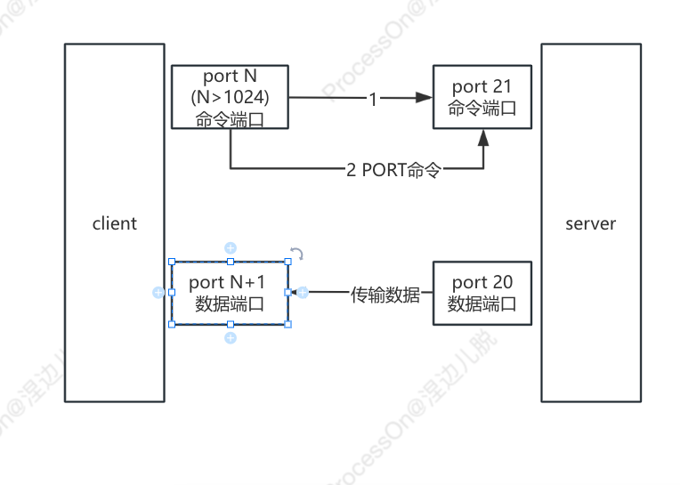

被动模式(PASV/passive模式)

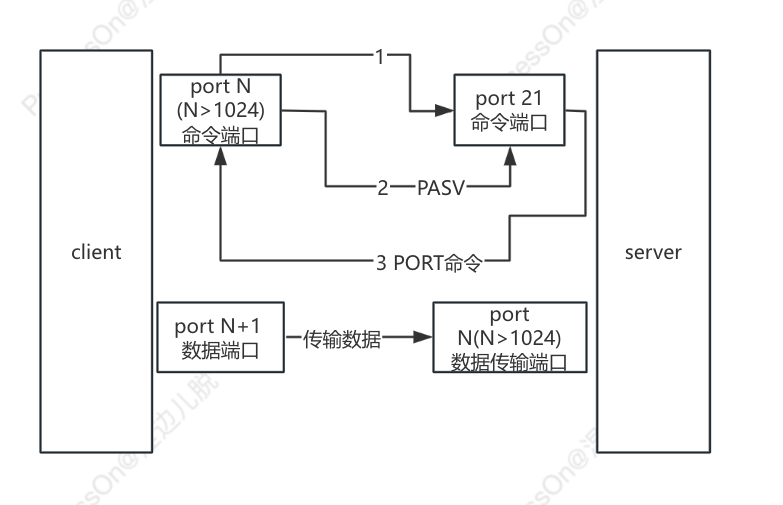

---

### Tomcat优化

##### - tomcat本身的优化（线程优化）

* [ ] 工作方式选择

  为了提升性能，首先就要对代码进行动静分离，让 Tomcat 只负责 jsp 文件的解析工作。
* [ ] Connector 连接器的配置

  Tomcat 连接器有三种方式： bio、nio 和 apr，三种方式性能差别很大，apr 的性能最优， bio 的性能最差。

  而 Tomcat 7 使用的 Connector  默认就启用的 Apr 协议，但需要系统安装 Apr 库，否则就会使用 bio 方式。

```shell
# server.xml
protocol="org.apache.coyote.http11.Http11AprProtocol"

# catalina.sh
CATALINA_OPTS="$CATALINA_OPTS -Djava.library.path=/usr/local/apr/lib"  
```

* [ ] 配置文件优化

  对 server.xml 优化，可以提大大提高 Tomcat 的处理请求的能力

  maxThreads : Tomcat 使用线程来处理接收的每个请求，这个值表示 Tomcat 可创建的最大的线程数，默认值是 200

  minSpareThreads：最小空闲线程数，默认值是 25。

  maxSpareThreads：最大备用线程数，一旦创建的线程超过这个值，Tomcat 就会关闭不再需要的 socket 线程。

  上边配置的参数，最大线程 500（一般[服务器](https://cloud.tencent.com/act/pro/promotion-cvm?from_column=20065&from=20065)足以），要根据自己的实际情况合理设置，

  设置越大会耗费内存和 CPU，因为 CPU 疲于线程上下文切换，没有精力提供请求服务了，

  线程可以配置在“tomcatThreadPool”中，也可以直接配置在“Connector”中，但不可以重复配置。

  connnectionTimeout： 网络连接超时，单位：毫秒，设置为 0 表示永不超时，这样设置有隐患的。通常可设置为 30000 毫秒

  enableLookups： 是否反查[域名](https://cloud.tencent.com/act/pro/domain-sales?from_column=20065&from=20065)，以返回远程主机的主机名，取值为：true 或 false

  如果设置为false，则直接返回IP地址，为了提高处理能力，应设置为 false。

  disableUploadTimeout：上传时是否使用超时机制。

  connectionUploadTimeout：上传超时时间，毕竟文件上传可能需要消耗更多的时间

  这个根据业务需要自己调，以使Servlet有较长的时间来完成它的执行，需要与上一个参数一起配合使用才会生效。

  acceptCount：指定当所有可以使用的处理请求的线程数都被使用时，可传入连接请求的最大队列长度，

  超过这个数的请求将不予处理，默认为100个。

  keepAliveTimeout：长连接最大保持时间（毫秒），表示在下次请求过来之前，Tomcat 保持该连接多久，

  默认是使用connectionTimeout 时间，-1 为不限制超时。

  maxKeepAliveRequests：表示在服务器关闭之前，该连接最大支持的请求数。

  超过该请求数的连接也将被关闭，1表示禁用，-1表示不限制个数，默认100个，一般设置在100~200之间。

  compression：是否对响应的数据进行 GZIP 压缩，off：表示禁止压缩；on：表示允许压缩（文本将被压缩）、

  force：表示所有情况下都进行压缩，

  默认值为off，压缩数据后可以有效的减少页面的大小，一般可以减小1/3左右，节省带宽。

  compressionMinSize：表示压缩响应的最小值，只有当响应报文大小大于这个值的时候才会对报文进行压缩，

  如果开启了压缩功能，默认值就是2048。

  compressableMimeType：压缩类型，指定对哪些类型的文件进行数据压缩。

  noCompressionUserAgents=”gozilla, traviata”： 对于以下的浏览器，不启用压缩。

  如果已经对代码进行了动静分离，静态页面和图片等数据就不需要 Tomcat 处理了，

  那么也就不需要配置在 Tomcat 中配置压缩了。

##### - jvm优化

```shell
# 在catalina.sh文件中配置jvm的内存空间，如:

JAVA_OPTS="-server -Xms256m -Xmx2048m -XX:PermSize=256m -XX:MaxNewSize=1024m -XX:MaxPermSize=1024M"
```

* [ ] -server：

  一定要作为第一个参数，在多个 CPU 时性能佳，还有一种叫 -client 的模式，特点是启动速度比较快，但运行时性能和内存管理效率不高，通常用于客户端应用程序或开发调试，在 32 位环境下直接运行 Java 程序默认启用该模式。Server 模式的特点是启动速度比较慢，但运行时性能和内存管理效率很高，适用于生产环境，在具有 64 位能力的 JDK 环境下默认启用该模式，可以不配置该参数。
* [ ] -Xms：

  初始化堆的大小，-Xms 与-Xmx 设成一样的值，避免 JVM 反复重新申请内存，导致性能大起大落
* [ ] -Xmx：

  最大堆大小，当应用程序需要的内存超出堆的最大值时虚拟机就会提示内存溢出，并且导致应用服务崩溃，

  因此一般建议堆的最大值设置为可用内存的最大值的80%。如何知道我的 JVM 能够使用最大值， 使用 java -Xmx512M -version

  命令来进行测试，然后逐渐的增大 512 的值,如果执行正常就表示指定的内存大小可用，否则会打印错误信息，
* [ ] -XX:NewSize：

  设置新生代内存大小
* [ ] -XX:MaxNewSize：

  设置最大新生代新生代内存大小
* [ ] -XX:PermSize：

  设置持久代内存大小
* [ ] -XX:MaxPermSize：

  设置最大值持久代内存大小，永久代不属于堆内存，堆内存只包含新生代和老年代。

  ###jdk1.8中持久代转换成了元空间，故不再支持PermSize与MaxPermSize参数，

  替换为了-XX:MetaspaceSize与-XX:MaxMetaspaceSize

---

### 什么是ELK/EFK/ELFK（英文发音）

---

### ES 优化

系统优化

* [ ] [禁用交换](https://www.elastic.co/guide/en/elasticsearch/reference/7.3/setup-configuration-memory.html "禁用交换")

  ```shell
  swapoff -a

  /etc/fstab
  ```
* [ ] [增加文件描述符](https://www.elastic.co/guide/en/elasticsearch/reference/7.3/file-descriptors.html "文件描述符")

  ```shell
  /etc/security/limits.conf
  * soft nofile 65535  # 文件描述符
  * hard nofile 65535
  * soft nproc  65535  # 线程数
  * hard nproc  65535
  ```
* [ ] [确保足够的虚拟内存](https://www.elastic.co/guide/en/elasticsearch/reference/7.3/vm-max-map-count.html "虚拟内存")

  Elasticsearch 默认使用  mmapfs 目录存储其索引。

  默认的操作系统对 mmap 计数的限制可能太低，这可能会导致内存不足异常。

```shell
sysctl -w vm.max_map_count=262144

# /etc/sysctl.conf
vm.max_map_count
```

* [ ] [确保足够的线程数](https://www.elastic.co/guide/en/elasticsearch/reference/7.3/max-number-of-threads.html "线程数")

  Elasticsearch 对不同类型的操作使用许多线程池。

  能够在需要时创建新线程很重要。确保 Elasticsearch 用户可以创建的线程数至少为 4096。

  可以通过设置 ulimit -u 4096 以 root 启动 Elasticsearch, 或者通过在 /etc/security/limits.conf 设置  nproc 为 4096

```shell
# /etc/security/limits.conf
* soft nofile 65535  # 文件描述符个数
* hard nofile 65535
* soft nproc  65535  # 线程数
* hard nproc  65535
```

jvm优化：

    jvm.options主要是进行内存相关配置，elasticsearch默认给的1g，官方建议分配给es的内存不要超出系统内存的50%，

    预留一半给Lucene，因为Lucene会缓存segment数据提升检索性能；

    内存配置不要超过32g，如果你的服务器内存没有远远超过64g，那么不建议将es的jvm内存设置为32g，

    因为超过32g后每个jvm对象指针的长度会翻倍，导致内存与cpu的开销增大

---

### ES集群中的节点类型：

* [ ] 主节点，master node

  ```shell
  node.master: true
  node.data: false
  ```

  负责创建索引、删除索引、分配分片、追踪集群中的节点状态等工作。Elasticsearch 中的主节点的工作量相对较轻。

  用户的请求可以发往任何一个节点，并由该节点负责分发请求、收集结果等操作，而并不需要经过主节点转发。

  通过在配置文件中设置 node.master=true 来设置该节点成为候选主节点

  （但该节点不一定是主节点，主节点是集群在候选节点中选举出来的），

  在 Elasticsearch 集群中只有候选节点才有选举权和被选举权。其他节点是不参与选举工作的
* [ ] 数据节点  data node

```shell
node.master: false
node.data: true
```

    负责数据的存储和相关具体操作，比如索引数据的创建、修改、删除、搜索、聚合。

    数据节点对机器配置要求比较高，首先需要有足够的磁盘空间来存储数据，

    其次数据操作对系统 CPU、Memory 和 I/O 的性能消耗都很大。

    需要增加更多的数据节点来提高可用性时，通过在配置文件中设置 node.data=true 来设置该节点成为数据节点。

* [ ] 客户端节点 client node

  ```shell
  node.master: false
  node.data: false
  ```

  就是既不做候选主节点也不做数据节点的节点，只负责请求的分发、汇总等，也就是下面要说到的协调节点的角色。

  其实任何一个节点都可以完成这样的工作，单独增加这样的节点更多地是为了提高并发性

#### [参考资料](https://www.cnblogs.com/davis12/p/15500158.html)

---

### es的master选举机制

#### [参考资料](https://juejin.cn/post/7074157612752699406)

---

### ES的冷热分离

#### [参考资料](https://www.cnblogs.com/xuwujing/p/14599290.html)

```shell
# 设置节点属性
node.attr.{attrite}: {value}
node.attr.box_type: hot
```

```shell
# 将索引与节点绑定
PUT test-index
{
  "settings": {
    "number_of_shards": 1,
    "number_of_replicas": 1,
    "index.routing.allocation.require.box_type": "hot"   #该索引下的数据将写入热节点
  } 
}

# 通过修改settings来将所以迁移到冷节点
PUT test-index/_settings
{
  "routing": {
    "allocation": {
      "require": {
        "box_type": "cool"
      }
    }
  }
}

# 索引滚动
PUT test-000001
{
  "aliases": {
    "log_alias": {
      "is_write_index": true
    }
  }
}
# 在我们最早设定 index 名字时，最后的一个字符必须是数字，否则自动生产 index 将会失败，
# is_write_index 必须设置为 true


POST /log_alias/_rollover
{
  "conditions": {
    "max_age": "7d",
    "max_docs": 14000,
    "max_size": "5gb"
  }
}
# 满足三个条件之一，则触发索引滚动
# 如果时间超过7天，那么自动 rollover，也就是使用新的 index
# 如果文档的数目超过 14000 个，那么自动 rollover
# 如果 index 的大小超过 5G，那么自动 rollover
# 滚动的结果是生成一个新索引test-000002,新数据写入新索引，旧索引变为只读
```

```shell
# ILM 索引生命周期管理
# 索引模板，并将ILM应用到索引模板
# 索引自动应用索引模板的属性


## 通过索引模板+生命周期策略(ilm)实现索引的自动滚动和数据冷热分离

# 创建索引模板，并与生命周期策略关联
PUT /_template/my_template_test
{
  "index_patterns": ["my-test-*"],     # 该模板对所有my-test开头的索引生效
  "settings": {
    "number_of_shards": "3",
    "number_of_replicas": "1",
    "refresh_interval": "30s",  # 索引刷新时间，每刷新一次会生成一个新段
    "index.lifecycle.name": "my_policy_test",   # 该模板关联的ILM策略
    "index.lifecycle.rollover_alias":"log-alias",  # 引用该模板的索引，在做滚动时使用的别名
    "index.routing.allocation.include.box_type": "hot"  # 引用该模板的索引会被分配到热节点
  }
}

# 创建生命周期策略
PUT _ilm/policy/my_policy_test 
{
  "policy": {
    "phases": {
        "hot": {   
	    #"min_age": "0ms"     # 索引创建后立即进入hot阶段
            "actions": {
                "rollover": {           # 索引滚动策略
                    "max_age": "7d",
                    "max_docs": 10000,
                    "max_size": "5gb"
                },
                "set_priority": {
                  "priority": 100
                }
            }
        },
        "warm": {
            "min_age": "3m",   # 从索引滚动后开始计时，3分钟后，进入到warm阶段
            "actions": {
		"forcemerge": {
                  "max_num_segments": 1    # 段合并，可提升查询效率
                }, 
                "shrink": {
                  "number_of_shards": 1    # 主分片数收缩为1
                }, 
                "allocate": {
		    "include": {
                      "_tier_preference" : "data_warm,data_hot", # 该组属性es会默认添加
                      "box_type" : "hot"   # 这里继承的是index模板的属性
                    },
                    "number_of_replicas": 0  # 副本分片收缩为0
                },
                "readonly": {}   # 转入只读状态
            }
        },
        "cold": {
          "min_age": "8m",    # 从索引滚动后开始计时，8分钟后，进入cold阶段
          "actions": {
            "set_priority": {
              "priority": 0
            },
            "freeze": {},
            "allocate": {
              "require": {
		"_tier_preference" : "data_cold",   # 在warm阶段，es会给索引添加"_tier_preference"属性，且值为
                                                    # "data_warm,data_hot"，所以这里要显示设置以覆盖其值
                "box_type": "cool"  # 覆盖模板自带的"box_type": "hot"
              }
            }
          }
        }, 
       "delete": {
         "min_age": "10m",     # 从索引滚动后开始计时，10分钟后，进入delete阶段
         "actions": {
           "delete": {}        # 索引被删除
         }
       }
    }
  }
}


# 创建索引并设置别名
PUT my-test-000001        # 索引名必须以数字结尾，否则自动rollover不生效
{
  "aliases": {
    "log-alias": {
      "is_write_index": true
    }
  }
}

# 客户端向log-alias索引读写数据，索引会根据设置好的条件进行rollover和ilm管理
```

---

### docker启动es并加入(物理机部署的)现有集群

```shell
# es的要求vm.max_map_count的值至少是262144
sysctl -w vm.max_map_count=262144 # 临时修改

# /etc/sysctl.conf # 永久修改
vm.max_map_countm=262144


# 启动命令
docker run -d  \
--name elasticsearch \
-p 9200:9200 -p 9300:9300 \
-v /elasticsearch:/usr/share/elasticsearch/data \
-v /etc/elasticsearch/elasticsearch.yml:/usr/share/elasticsearch/config/elasticsearch.yml \
harbor.baway.org.cn/elk/elasticsearch:7.17.25

# elasticsearch.yml文件内容
cluster.name: baway    # 要加入的集群名称
node.name: node-5      # 节点名称
path.data: /usr/share/elasticsearch/data   # 数据目录
path.logs: /usr/share/elasticsearch/logs   # 日志目录
network.host: 0.0.0.0  
network.publish_host: 10.203.43.105   # 必须。否则会以容器ip去连接其他节点，无法建立通信
discovery.seed_hosts: ["10.203.43.101", "10.203.43.102","10.203.43.103","10.203.43.104","10.203.43.105","10.203.43.106"]  # 所有的节点ip

# 以下为跨允许域访问 
http.cors.enabled: true
http.cors.allow-origin: "*"
ingest.geoip.downloader.enabled: false
```

---

### ELK术语

* [ ] Discovery ：

  发现是节点间在形成集群之前发现其他节点的过程。当你启动Elasticsearch节点时，

  或者当节点认为主节点发生故障时，此过程将运行，并持续到找到主节点或选择新的主节点为止。
* [ ] master-eligible nodes：候选主节点
* [ ] master-ineligible nodes：非候选主节点
* [ ] coordinating-only nodes：仅协调节点
* [ ] data-only nodes：仅数据节点
* [ ] seed hosts providers：种子主机列表
* [ ] voting configuration：投票配置
* [ ] split brain：脑裂
* [ ] initial quorum：初始仲裁——仅在整个集群首次启动时才需要初始仲裁

---

### ELK的主要配置参数

* [ ] discovery.seed_hosts

  开箱即用，无需任何网络配置，Elasticsearch 将绑定到可用的回送地址，并将扫描本地端口 9300 至 9305，

  以尝试连接到在同一服务器上运行的其他节点，这里 ES 提供了自动群集检查，而无需进行任何配置。

  如果要与其他主机上的节点组成集群，则必须设置 discovery.seed_hosts，提供集群中其他主机的列表，

  这些节点都具备主机资格，并且可能在其中处于活动状态并可以联系，以便为发现过程。

  此设置通常应包含群集中所有符合主机条件的节点的地址，是主机地址数组或逗号分隔的字符串
* [ ] data节点也可以配置到 master eligible吗？

  理论可以，实际不推荐。
* [ ] 是如何发现潜在机器的呢?

  Discovery 过程就是发现过程。
* [ ] cluster.initial_master_nodes一定是master eligible节点吧?

  是的，这个参数的值是准备作为主节点的节点名称，用来指定初始主节点。

  设置新的集群或者在主节点失效时才需要设置。否则，当您重新启动 Elasticsearch 时，

  它将从先前保存的状态中恢复，而不需要手动设置初始节点

  如果不定义 cluster.initial_master_nodes，Elasticsearch 将默认使用第一个启动的节点作为初始主节点
* [ ] 集群初始启动时, 这几个节点一定都要在是吗?

  大规模集群要注意：集群规划阶段要考虑设置：奇数个候选主节点。

  集群初始启动阶段之前候选主节点配置要设置合理。
* [ ] 初始的时候是不是可以配置一个, 然后集群初始化后, 再加master eligible节点也可以的是吗?

  可以，但不推荐。如果多节点集群，建议一步到位。
* [ ] 多加几个以后, 把initial_master里的几个去掉是不是也可以了?

  仅在集群首次启动会使用，其他阶段可以去掉。

  不过，规范管理起见，配置上不用动就可以了。
* [ ] 如果一个集群当前master为7，那他的quorum是4。es 是支持慢慢去掉节点，quorum慢慢降低的吗？

  换个思维理解，这里如果有 7 个候选主节点，意味着至少要一半以上有效集群才能存活。

  也就是干掉3个候选主节点，集群依然是存活状态的。
* [ ] 那假如慢慢去掉了3个节点，原集群正常工作，那这三个节点重启后网络分区在一起了，那会不会自己形成集群啊？

  不会，去掉的3个节点，还会继续加入原来的集群

---

### TPS、QPS、pv、uv , 并发

---

### swap的作用

---

### ICMP是几层协议

三层

---

### 常见的发布策略

蓝绿

灰度

金丝雀

滚动

---

### 什么是跨域,NGINX如何配置允许跨域请求

---

### 符号链接和硬链接

---

### 你熟悉哪几种磁盘阵列？

---

### 查看块设备信息

lsblk     `<list block> `

blkid

---

### keepalived的主要模块？

core

check

VRRP

---

### 什么是泛域名解析？

---

### 说一下git的深克隆和浅克隆

仅复制仓库的最新版本,而不是所有的历史记录

```shell
git clone -–depth 1 [remote-url]
```

仅克隆单个分支

```shell
git clone [远程URL] --branch [名称] --single-branch [remote-url]
```

---

### git 数据回滚

```
# 仅撤销commit
git reset --soft HEAD^

# 同时撤销commit和add
git reset --mixed HEAD^

# 撤销commit 、add和上次提交以来的代码修改
git reset --hard HEAD^

#撤销push（先撤销commit,再提交，即让远程仓库回到上一个版本）
git reset --soft HEAD^
git push origin HEAD --force
```

---

### git 的合并方式(git merge)

Fast-Forward Merge

Tree-Way Merge(git merge --no-ff)

Squash Merge(git merge --squash)

---

### git merge和git rebase

---

### git fetch和git pull

git pull == git fetch + git merge

---

### 什么是A记录，CNAME

---

### 你使用过哪些Linux性能分析工具？

---

### Linux的lvm是什么，有哪些基本概念？

---

### RAID5的原理是什么？什么是热备盘？

---

### prometheus的监控原理是什么？

---

### prometheus的报警实现原理说一下，如何抑制报警风暴？

alertmanager的分组、抑制和静默

---

### Prometheus有哪4种时序数据？

---

### Docker有几种网络模式，怎么实现网络隔离？

---

### kill经常发送给进程的信号有哪几种？

| 信号编号 | 信号名 | 信号含义                                   |
| :------: | :----- | ------------------------------------------ |
|    1    | HUP    | 挂起信号                                   |
|    2    | INT    | 中断信号                                   |
|    3    | QUIT   | 退出信号                                   |
|    9    | KILL   | 杀死信号                                   |
|    11    | SEGV   | 段错误信号                                 |
|    15    | TERM   | 终止信号，kill命令默认发送的信号类型       |
|    18    | CONT   | 继续运行信号，恢复之前接受了STOP信号的进程 |
|    19    | STOP   | 暂停信号                                   |

---

### kill、killall、pkill有什么区别？

**kill是杀掉单个进程** ， **killall是杀掉所有同名进程** ，**pkill是杀掉一类进程或者某个用户的所有进程**

```shell
pkill mysql         #结束 mysql 进程
pkill -u mark,danny  #结束mark,danny用户的所有进程
w  #使用w命令查询本机已经登录的用户
pkill -9 -t pts/1   #强制杀死从pts/1虚拟终端登陆的进程

```

---

### Linux进程有几种状态，分别代表什么？

---

### 僵尸进程和孤儿进程

---

### 父进程为1的僵尸进程如何处理？

---

### 容器化有哪些好处？

---

### 等保测评

---

### 什么是块设备、什么是字符设备

---

### 什么是SUID、SGID、Sticky bit

---

### 你们使用的jdk版本是什么？

---

### oracle jdk和openjdk有什么区别？

---

### JVM优化做过哪些？

---

### 什么是OOM，如何处理？

---

### 判断cpu好坏的标准是什么？

---

### 你常用的服务器品牌和型号？CPU品牌和型号?

---

### zookeeper的角色有哪些？选举机制和数据同步机制分别是什么？

#### [参考资料](https://segmentfault.com/a/1190000040777791)

---

### zookeeper的作用是什么？

#### [参考资料](https://juejin.cn/post/6844903939855351816)

---

### kafka重复消费如何避免？

#### [参考资料](https://cloud.tencent.com/developer/article/1665700)

---

### zookeeper在kafka集群中的作用是什么？

#### [参考资料](https://www.jianshu.com/p/a036405f989c)

---

### du和df的区别

**du命令是用户级的程序，它不考虑Meta Data**，而 **df命令则查看文件系统的磁盘分配图并考虑Meta Data** 。**df命令获得真正的文件系统数据，而du命令只查看文件系统的部分情况**

如果用户删除了一个正在运行的应用所打开的某个目录下的文件，则du命令返回的值显示出减去了该文件后的目录的大小。但df命令并不显示减去该文件后的大小。**直到该运行的应用关闭了这个打开的文件，du返回的值才显示出减去了该文件后的文件系统的使用情况。**

---

### 远程执行命令或脚本

#### 执行远程命令

ssh  user@host:port  "command1; command2"

```shell
ssh  k8s-master  "hostname"
ssh  k8s-master  "hostname;ls /opt"
ssh  k8s-master 'hostname;echo "$PATH"'
```

#### 执行远程脚本

ssh user@host:port "bash  /path/xxx.sh  arg1  arg2 .."

#### 执行本地脚本

ssh user@host:port "bash" < xxx.sh

```shell
cat example.sh
#!/bin/bash
name=tom
echo $name
echo "I am $(hostname)"
echo "The first arg is $1"

# 执行本地脚本并传参
ssh user@host:port "bash -s" < example.sh  aaa

```

#### bash -c 和bach -s

-c :  将字符串作为对象传递给bash执行，可以正常传递参数

-s：告诉bash需要从标准输入读取参数，或者需要使用标准输入为bash传递参数时，需要添加-s参数

#### 执行交互式命令

ssh -t user@host:port  "command"

```shell
ssh -t k8s-master "top"
```

### Linux启动过程说一下？

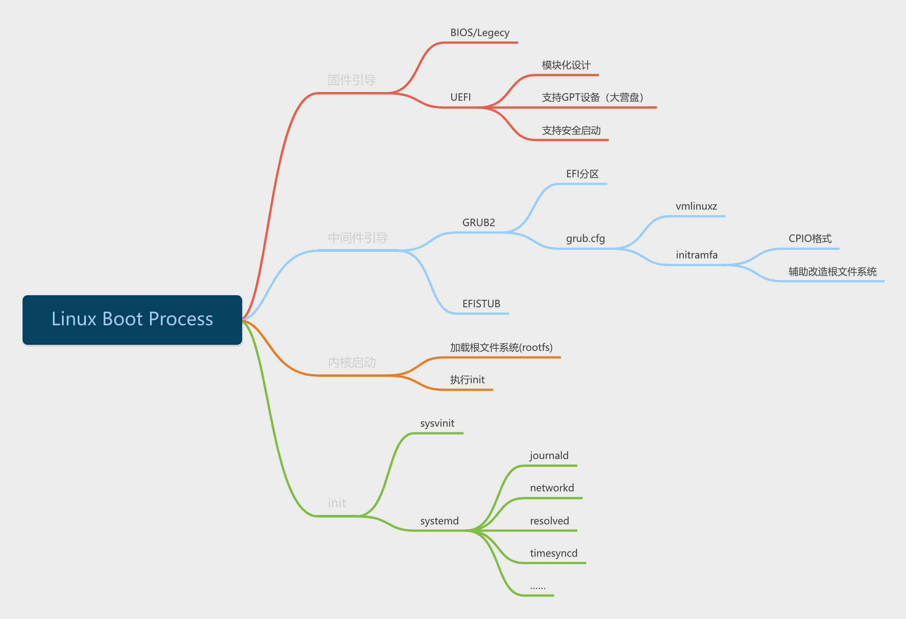

---

### nginx重新生成日志  reopen

```
nginx -s reopen


#  nignx 日志切割实现方案
1. 自研shell脚本
2. logrotate
```

---

### nginx页面中文乱码如何解决？

```shell
server {
    ...
    ...
    charset utf-8;
}
```

---

### Nginx的proxy_next_upstream  选项的作用

nginx  upstream的容错配置

默认情况下,nginx只以connect refuse和time out作为判定节点失败的依据，其他404、502、503、504、500等状态码不会计入fails，那么该节点的max_fails计数也就不会增加。

```shell
proxy_next_upstream http_500 | http_502 | http_503 | http_504 |http_404;
# 当其中一台返回错误码404,500...等错误时，可以分配到下一台服务器程序继续处理，提高访问成功率
```

反面案例：nginx proxy_next_upstream导致的重复提交错误

一个请求被重复提交，原因是nginx代理后面挂着2个服务器，请求超时的时候（其实已经处理了），结果nigix发现超时，有把请求转给另外台服务器又做了次处理

```shell
proxy_next_upstream  off;
```

[参考链接
](https://www.cnblogs.com/kevingrace/p/8185218.html)

[
](https://www.cnblogs.com/kevingrace/p/8185218.html)

---

### Nginx节点有效性的探测机制（backup、down、max_fails、fail_timeout、max_conns）

nginx通过设置max_fails（最大尝试失败次数）和fail_timeout（失效时间）

在到达最大尝试失败次数后，在fail_timeout的时间范围内节点被置为失效，除非所有节点都失效，否则该时间内，节点不进行恢复;

对节点失败的尝试次数和失效时间进行设置，当超过最大尝试次数或失效时间未超过配置失效时间，则nginx会对节点状会置为失效状态，nginx不对该后端进行连接，直到超过失效时间或者所有节点都失效后，该节点重新置为有效，重新探测；
如果探测所有节点均失效，备机也为失效时，那么nginx会对所有节点恢复为有效，重新尝试探测有效节点，如果探测到有效节点则返回正确节点内容，如果还是全部错误，那么继续探测下去，当没有正确信息时，节点失效时默认返回状态为502，但是下次访问节点时会继续探测正确节点，直到找到正确的为止。

```shell
upstream web {
  server 192.168.10.5:8080 max_fails=2 fail_timeout=5s;  # 连续2次失败，则5秒内将该节点标记为不可用
  server 192.168.10.7:8080 max_fails=2 fail_timeout=5s;
}
```

```shell
upstream web {
  server 192.168.10.5:8080 max_conns=2; # 最大接受2个TCP连接，超过会报错
  server 192.168.10.7:8080 max_conns=2;
}
```

```shell
upstream web {
  server 192.168.10.5:8080 backup;  # 标记为备份
  server 192.168.10.6:8080 down;    # 标记为下线
  server 192.168.10.7:8080;
}
```

---

### Nginx  try_files选项的作用

关键点1：按指定的file顺序查找存在的文件，并使用第一个找到的文件进行请求处理

关键点2：查找路径是按照给定的root或alias为根路径来查找的

关键点3：如果给出的file都没有匹配到，则重新请求最后一个参数给定的uri，就是新的location匹配

关键点4：如果是格式2，如果最后一个参数是 = 404 ，若给出的file都没有匹配到，则最后返回404的响应码

---

### Nginx proxy_pass有斜杠和没斜杠的区别

1. proxy_pass末尾有斜杠/，proxy_pass不拼接location的路径

   ```shell
   location  /api/ {
       proxy_pass http://127.0.0.1:8000/;
   }
   ```

   请求地址：`http://localhost/api/test`
   转发地址：`http://127.0.0.1:8000/test`
2. proxy_pass末尾无斜杠/，proxy_pass会拼接location的路径

   ```shell
   location  /api/ {
       proxy_pass http://127.0.0.1:8000;
   }
   ```

   请求地址：`http://localhost/api/test`
   转发地址：`http://127.0.0.1:8000/api/test`
3. proxy_pass中包含路径，且末尾有斜杠

   ```shell
   location  /api/ {
       proxy_pass http://127.0.0.1:8000/user/;
   }
   ```

   请求地址：`http://localhost/api/test`
   转发地址：`http://127.0.0.1:8000/user/test`
4. proxy_pass中包含路径，且末尾无斜杠

   ```shell
   location  /api/ {
       proxy_pass http://127.0.0.1:8000/user;
   }
   ```

   请求地址：`http://localhost/api/test`
   转发地址：`http://127.0.0.1:8000/usertest`

---

### Nginx转发websocket

```shell
# 与websocket相关的主要是两个header头： Upgrade和Connection
# 如果客户端向Nginx发送的是ws://请求，则会传递Upgrade头，保存到Nginx的$http_upgrade变量中，自定义变量connection_upgrade自然
# 也就被赋值为"upgrade"，如果客户端向Nginx发送的是http://请求，则$http_upgrade的值为空，connetion_upgrade的值则为"close"
map $http_upgrade $connection_upgrade { 
	default upgrade; 
	'' close; 
} 
upstream wsbackend{ 
	server ip1:port1; 
	server ip2:port2; 
	keepalive 1000;
} 
 
server { 
	listen 20038; 
	location /{ 
		proxy_http_version 1.1; 
		proxy_pass http://wsbackend; 
		proxy_redirect off; 
		proxy_set_header Host $host; 
		proxy_set_header X-Real-IP $remote_addr; 
		proxy_read_timeout 3600s; 
		proxy_set_header X-Forwarded-For $proxy_add_x_forwarded_for; 
		proxy_set_header Upgrade $http_upgrade; 
		proxy_set_header Connection $connection_upgrade; 
	} 
}
```

nginx的map参数，用来设置自定义变量，只能作用在http{}段

```shell
map $args $foo {
    default 0;
    debug  1;
}
```

如果内置变量 args的值为 debug,则设置$foo的值为1，否则foo的值默认为0

$args 是nginx内置变量，就是获取的请求 url 的参数（问号之后的部分），

等同$query_string

---

### nginx如何配置https，使用过哪家的https证书？

---

### 对称加密和非对称加密

对称：加密解密用同一组秘钥

非对称：加密用公钥，解密用私钥

---

### https的加密流程？

    #认证的过程是非对称加密，开始传输数据后使用对称加密

1. 服务端使用CA根证书生成一对公钥和私钥，把公钥发给客户端
2. 客户端验证了证书真伪(公钥是否由可信任的CA证书签发)
3. 客户端生成一个随机值，用公钥加密发给服务端
4. 服务端用私钥解密，获取随机值
5. 服务端使用该随机值作为密钥和客户端进通信
   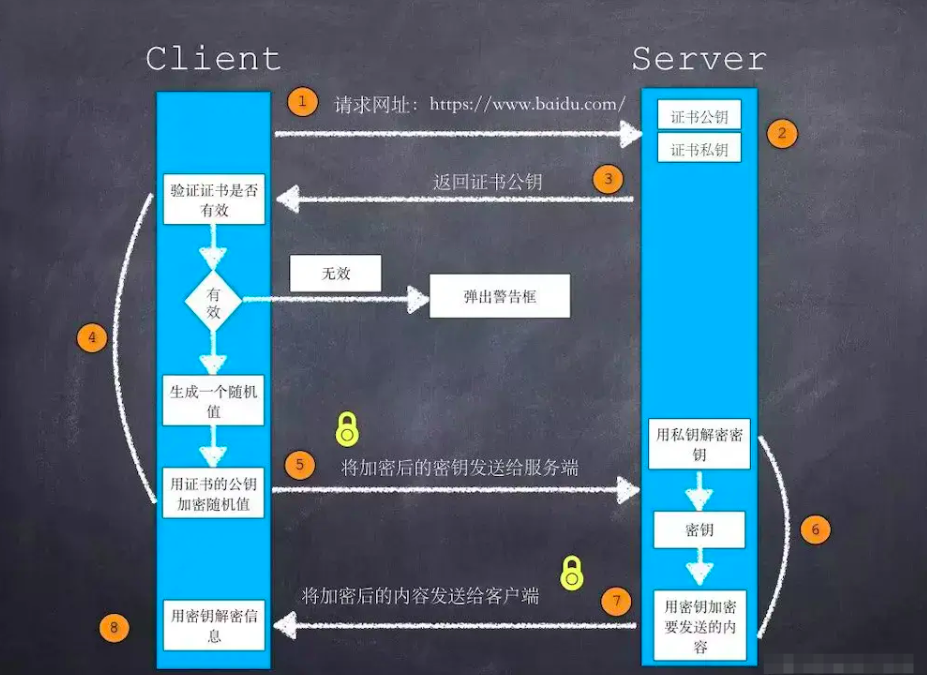

---

### Nginx双向认证 SSL（Secure Sockets Layer，安全套接字协议）

#### 单向认证：

    1. 客户端发起 HTTPS 建立连接请求，将客户端支持的 SSL 协议版本号、加密算法种类、生成的随机数等信息发送给服务端。

    2. 服务端向客户端返回 SSL 协议版本号、加密算法种类、生成的随机数等信息，以及服务端的证书（server.crt）。

    3. 客户端验证证书（server.crt）是否合法，并从此证书中获取服务端的公钥：

    3.1 检查证书是否过期。

    3.2  检查证书是否已经被吊销。

    3.3 检查证书是否可信。

    3.4 检查收到的证书中的域名与请求的域名是否一致。

    4. 证书验证通过后，客户端生成一个随机数（密钥 K），作为通信过程中对称加密的密钥，并用服务端证书的公钥进行加密，然后发送给服务端。

    5. 服务端收到客户端发送的加密信息后，使用私钥（server.key）进行解密，获取对称加密密钥（密钥 K）。

    6. 在接下来的会话中，客户端和服务端将会使用该对称加密密钥（密钥 K）进行通信，保证通信过程中信息的安全。

#### 双向认证：

    1. 客户端发起 HTTPS 建立连接请求，将客户端支持的 SSL 协议版本号、加密算法种类、生成的随机数等信息发送给服务端。

    2. 服务端向客户端返回 SSL 协议版本号、加密算法种类、生成的随机数等信息，以及服务端的证书（server.crt）。

    3. 客户端验证证书（server.crt）是否合法，并从此证书中获取服务端的公钥：

    3.1 检查证书是否过期。

    3.2 检查证书是否已经被吊销。

    3.3 检查证书是否可信。

    3.4 检查收到的证书中的域名与请求的域名是否一致。

    4. 服务端要求客户端发送客户端的证书（client.crt），客户端将自己的证书发送至服务端。

    5. 服务端验证客户端的证书（client.crt），验证通过后，服务端使用根证书（root.crt）解密客户端证书，然后获取客户端的公钥。

    6. 客户端向服务端发送自己所支持的对称加密方案。

    7. 服务端从客户端发送过来的对称加密方案中，选择加密程度最高的加密方式，并使用客户端公钥加密后，返回给客户端。

    8. 客户端使用客户端的私钥（client.key）解密加密方案，并生成一个随机数（密钥 K），作为通信过程中对称加密的密钥，然后使用服务端证书的公钥进行加密后再发送给服务端。

    9. 服务端收到客户端发送的加密信息后，使用服务端的私钥（server.key）进行解密，获取对称加密密钥（密钥 K）。

    10. 在接下来的会话中，客户端和服务端将会使用该对称加密密钥（密钥 K）进行通信，保证通信过程中信息的安全。

```shell
server {
        listen 443 ssl;
        server_name localhost;
        ssl on;
        ssl_certificate /etc/nginx/keys/server.crt;#配置证书位置
        ssl_certificate_key /etc/nginx/keys/server.key;#配置秘钥位置
        ssl_client_certificate /etc/nginx/keys/ca.crt;#双向认证
        ssl_verify_client on; #双向认证
        ssl_session_timeout 5m;
        ssl_protocols SSLv2 SSLv3 TLSv1 TLSv1.1 TLSv1.2; #按照这个协议配置
        ssl_ciphers ECDHE-RSA-AES128-GCM-SHA256:HIGH:!aNULL:!MD5:!RC4:!DHE; #按照这个套件配置
        ssl_prefer_server_ciphers on;
        root html;
        index index.html;
        location / {
                try_files $uri $uri/ =404;
        }
}
```

---

### nginx动态加载模块

* [ ] 编译
  以[nginx-module-vts](https://github.com/vozlt/nginx-module-vts)为例
  下载nginx源码包，注意版本与线上nginx保持一致
  下载nginx-module-vts包

  ```shell
  ./configure --add-dynamic-module=../nginx-module-vts-0.2.2  --with-compat
  make modules
  # 在objs目录下会生成ngx_http_vhost_traffic_status_module.so
  ```
* [ ] 加载

  ```shell
  # 修改线上nginx服务器的配置文件，加载vts模块
  # nginx.conf首行添加：
  load_module /etc/nginx/ngx_http_vhost_traffic_status_module.so;

  # nginx.conf 在http段添加
  vhost_traffic_status_zone;
  vhost_traffic_status_filter_by_host on;

  # server段添加
  location /status {
      vhost_traffic_status_display;
      vhost_traffic_status_display_format html;
  }
  ```
* [ ] prometheus监控

  镜像地址：sophos/nginx-vts-exporter:latest

  ```shell
  # docker 
  docker run  -ti --rm --env NGINX_STATUS="http://localhost/status/format/json" sophos/nginx-vts-exporter

  # k8s
  - name: vts-exporter
    image: registry.cn-hangzhou.aliyuncs.com/shidg/nginx-vts-exporter:latest
    imagePullPolicy: IfNotPresent
    ports:
    - containerPort: 9913
    env:
    - name: NGINX_STATUS
      value: "http://localhost/status/format/json"

  # prometheus job
  scrape_configs:
  - job_name: nginx-vts-exporter
    scrape_interval: 30s
    static_configs:
      - targets:
        - jenkins-proxy-svc.private:9913
  ```

---

### Nginx的proxy_next_upstream

```
location / {
        proxy_next_upstream  error timeout http_502 http_503 http_504 ;
        proxy_pass http://server_tomcat1/;
        proxy_buffer_size 64k;
        proxy_buffers  32 32k;
        proxy_busy_buffers_size 128k;
        proxy_set_header  Host  $host;
        proxy_set_header  X-Real-IP  $remote_addr;
        proxy_set_header  X-Forwarded-For $proxy_add_x_forwarded_for;
        proxy_read_timeout 120;
}
```

**#Nginx默认判断失败节点状态以connect refuse和timeout状态为准，不以HTTP错误状态进行判断失败，

**HTTP只要能返回状态说明该节点还可以正常连接，所以nginx判断其还是存活状态, 除非添加了proxy_next_upstream指令设置对404、502、503、504、500和time out等错误转到备机处理，

**   nginx记录错误数量只记录timeout 、connect refuse、502、500、503、504这6种状态，timeout和connect refuse是永远被记录错误状态，而502、500、503、504只有在配置proxy_next_upstream参数之后nginx才会记录这4种HTTP错误到fails中

---

### nginx获取用户真实ip

* [ ] X_FORWARDED_FOR(XFF)

```shell
proxy_set_header X-Forwarded-For $proxy_add_x_forwarded_for

# $http_x_forwarded_for和$proxy_add_x_forwarded_for的区别
# The $proxy_add_x_forwarded_for is equal to $http_x_forwarded_for, $remote_addr"
```

* [ ] realip模块 (--with-http_realip_module)

  作为第一层nginx代理，要将用户的握手ip赋值给X-real-ip(nginx特有的变量)向后传递，如下：
  proxy_set_header    X-real-ip $remote_addr;
  之后的nginx代理服务器这样来传递该握手ip:
  proxy_set_header    X-real-ip $http_x_real_ip;
  这样，到了最后一层代理直接取$http_x_real_ip的值就是用户的真实ip(比如配置访问日志记录用户真实ip)

  也可以将客户端ip和所有的代理ip都记录下来，再逐步排除：

```shell
location / {
    root /var/www/www.hi-linux.com;
    set_real_ip_from  192.168.2.0/24;
    set_real_ip_from  128.22.189.11;
    real_ip_header    X-Forwarded-For;
    real_ip_recursive on; #递归排除
}

# set_real_ip_from 192.168.1.0/24; #真实服务器上一级代理的IP地址或者IP段,可以写多行。
# set_real_ip_from 192.168.2.1;
# real_ip_header X-Forwarded-For;  #从哪个header头检索出要的IP地址。
# real_ip_recursive on; #递归的去除所配置中的可信IP。

# 每一条set_real_ip_from就代表一层代理
# 递归的去除所配置中的可信IP，排除set_real_ip_from里面出现的IP。如果出现了未包含在这些IP段的IP，那么这个IP将被认为是用户的IP
# 在real_ip_recursive off或者不设置的情况下,仅192.168.2.0、24(第一条set_real_ip_from)被排除掉，其它的IP地址都被认为是用户的ip地址。
# 排除掉可信ip之后的ip会写入remote_addr,所以在这种模式下，最后一台代理服务器直接使用$remote_addr就可以取到用户的真实ip了
```

---

### Nginx负载均衡算法

轮询+weight   默认的

ip_hash : 基于Hash 计算

    应用场景：保持session 一至性

url_hash: (第三方)

    应用场景：静态资源缓存,节约存储，加快速度

least_conn 最少链接

least_time 最小的响应时间,计算节点平均响应时间，然后取响应最快的那个，分配更高权重

---

### Nginx之location匹配规则

= 开头表示精确匹配

^~ 开头表示uri以某个常规字符串开头，理解为匹配 url路径即可。nginx不对url做编码，因此请求为/static/20%/aa，可以被规则^~ /static/ /aa匹配到（注意是空格）

~ 开头表示区分大小写的正则匹配

~*  开头表示不区分大小写的正则匹配

!~和!~*分别为区分大小写不匹配及不区分大小写不匹配 的正则

/ 通用匹配，任何请求都会匹配到。

多个location配置的情况下匹配顺序为：

首先匹配 =，其次匹配^~, 其次是按文件中顺序的正则匹配，最后是交给 / 通用匹配。当有匹配成功时候，停止匹配，按当前匹配规则处理请求

---

### Nginx 之proxy_pass

Nginx有两种proxy_pass，分别是ngx_http_proxy_module和ngx_stream_proxy_module,一个是七层转发，一个是四层转发

#### ngx_stream_proxy_module的proxy_pass只能用在server段

```
server {
    listen 127.0.0.1:12345;
    proxy_pass 127.0.0.1:8080;
}
 
server {
    listen 12345;
    proxy_connect_timeout 1s;
    proxy_timeout 1m;
    proxy_pass example.com:12345;
}
 
server {
    listen 53 udp;
    proxy_responses 1;
    proxy_timeout 20s;
    proxy_pass dns.example.com:53;
}
 
server {
    listen [::1]:12345;
    proxy_pass unix:/tmp/stream.socket;
}
```

#### ngx_http_proxy_module模块的proxy_pass用在location段

```
server {
    listen      80;
    server_name www.test.com;
 
    # 正常代理，不修改后端url的
    location /some/path/ {
        proxy_pass http://127.0.0.1;
    }
 
    # 修改后端url地址的代理（本例后端地址中，最后带了一个斜线)
    location /testb {
        proxy_pass http://www.other.com:8801/;
    }
 
    # 使用 if in location
    location /google {
        if ( $geoip_country_code ~ (RU|CN) ) {
            proxy_pass http://www.google.hk;
        }
    }
 
    location /yongfu/ {
        # 没有匹配 limit_except 的，代理到 unix:/tmp/backend.socket:/uri/
        proxy_pass http://unix:/tmp/backend.socket:/uri/;;
 
        # 匹配到请求方法为: PUT or DELETE, 代理到9080
        limit_except PUT DELETE {
            proxy_pass http://127.0.0.1:9080;
        }
    }
 
}
```

在nginx中配置proxy_pass代理转发时，如果在proxy_pass后面的url加/，表示绝对根路径；如果没有/，表示相对路径，把匹配的路径部分也给代理走

```
server {
    listen      80;
    server_name www.test.com;
 
    # 情形A
    # 访问 http://www.test.com/testa/aaaa
    # 后端的request_uri为: /testa/aaaa
    location ^~ /testa/ {
        proxy_pass http://127.0.0.1:8801;
    }
  
    # 情形B
    # 访问 http://www.test.com/testb/bbbb
    # 后端的request_uri为: /bbbb
    location ^~ /testb/ {
        proxy_pass http://127.0.0.1:8801/;
    }
 
    # 情形C
    # 下面这段location是正确的
    location ~ /testc {
        proxy_pass http://127.0.0.1:8801;
    }
 
    # 情形D
    # 下面这段location是错误的
    #
    # nginx -t 时，会报如下错误: 
    #
    # nginx: [emerg] "proxy_pass" cannot have URI part in location given by regular 
    # expression, or inside named location, or inside "if" statement, or inside 
    # "limit_except" block in /opt/app/nginx/conf/vhost/test.conf:17
    # 
    # 当location为正则表达式时，proxy_pass 不能包含URI部分。本例中包含了"/"
    location ~ /testd {
        proxy_pass http://127.0.0.1:8801/;   # 记住，location为正则表达式时，不能这样写！！！
    }
 
    # 情形E
    # 访问 http://www.test.com/ccc/bbbb
    # 后端的request_uri为: /aaa/ccc/bbbb
    location /ccc/ {
        proxy_pass http://127.0.0.1:8801/aaa$request_uri;
    }
 
    # 情形F
    # 访问 http://www.test.com/namea/ddd
    # 后端的request_uri为: /yongfu?namea=ddd
    location /namea/ {
        rewrite    /namea/([^/]+) /yongfu?namea=$1 break;
        proxy_pass http://127.0.0.1:8801;
    }
 
    # 情形G
    # 访问 http://www.test.com/nameb/eee
    # 后端的request_uri为: /yongfu?nameb=eee
    location /nameb/ {
        rewrite    /nameb/([^/]+) /yongfu?nameb=$1 break;
        proxy_pass http://127.0.0.1:8801/;
    }
 
    access_log /data/logs/www/www.test.com.log;
}
 
server {
    listen      8801;
    server_name www.test.com;
  
    root        /data/www/test;
    index       index.php index.html;
 
    rewrite ^(.*)$ /test.php?u=$1 last;
 
    location ~ \.php$ {
        try_files $uri =404;
        fastcgi_pass unix:/tmp/php-cgi.sock;
        fastcgi_index index.php;
        include fastcgi.conf;
    }
 
    access_log /data/logs/www/www.test.com.8801.log;
}

```

#### 总结：

情形A和情形B进行对比，可以知道 `proxy_pass`后带一个URI,可以是斜杠(/)也可以是其他uri，对后端 `request_uri`变量的影响。
情形D说明，当location为正则表达式时，`proxy_pass`不能包含URI部分。
情形E通过变量($request_uri, 也可以是其他变量)，对后端的 `request_uri`进行改写。
情形F和情形G通过rewrite配合break标志,对url进行改写，并改写后端的 `request_uri`。需要注意，`proxy_pass`地址的URI部分在情形G中无效，不管如何设置，都会被忽略

---

### Nginx之rewrite（ngx_http_rewrite_module）

** 不写last和break

流程就是依次执行这些rewrite

1. rewrite break - url重写后，直接使用当前资源，不再执行location里余下的语句，完成本次请求，地址栏url不变
2. rewrite last - url重写后，马上发起一个新的请求，再次进入server块，重试location匹配，超过10次匹配不到报500错误，地址栏url不变
3. rewrite redirect – 返回302临时重定向，地址栏显示重定向后的url，爬虫不会更新url（因为是临时），浏览器不会缓存当前域名的解析记录
4. rewrite permanent – 返回301永久重定向, 地址栏显示重定向后的url，爬虫更新url，浏览器会缓存永久重定向的DNS解析记录

   ```shell
   # 301 永久重定向
   return 301 $scheme://domain.com$request_uri;
   rewrite ^ $scheme//domain.com$uri permanent;

   $uri和$request_uri的区别：

   request_uri: full original request URI (with arguments)
   - 请求的整个生命周期里不会变化
   - 携带原始参数的完整的uri

   uri: current URI in request, normalized
   The value of $uri may change during request processing, e.g. when doing internal redirects, or when using index files.

   - 不携带参数
   - 值是可变的，比如发生内部重定向时， 通过$uri获取的值不一定是原始的请求路径， 因此当发生了内部重定向比如子请求时，要想保持原始的URI，需要使用$request_uri


   # http强制跳转https
   server {
       listen 80;
       server_name www.domain.com;
       return 301 https://www.domain.com$request_uri;
   }

   if ($scheme != “https”) {
       rewrite ^ https://www.mydomain.com$uri permanent;
   }

   ```

** 使用last会对server标签重新发起请求

1. 如果location中rewrite后是对静态资源的请求，不需要再进行其他匹配，一般要使用break或不写，直接使用当前location中的数据源，完成本次请求
2. 如果location中rewrite后，还需要进行其他处理，如动态fastcgi请求(.PHP,.jsp)等，要用last继续发起新的请求
   (根的location使用last比较好, 因为如果有.php等fastcgi请求还要继续处理)
3. 使用alias指定源：必须使用last

** last和break总结

1. 当出现在location之外时，两者的作用是一致的没有任何差异。
   注意一点就是，他们会跳过所有在他们之后的rewrite模块中的指令，去选择自己匹配的location
   Example:

```perl
rewrite url1 url2 last; ①
rewrite url3 url4 last; ②
rewrite url5 url6 last; ③
 
location ~  url2     ④
location ~  url4     ⑤
location ~  url6     ⑥
```

当① 这条rewrite 规则生效后，它后面的②和③ 将被跳过不做判断，而去直接选择 后面的location。

2. last和break当出现在location内部时，两者就存在了差异
   last: 使用了last指令，rewrite后会跳出location作用域，重新开始再走一次刚刚的行为
   break: 使用了break指令，rewrite后不会跳出location 作用域。它的生命也在这个location中终结。
   Example:

```perl
rewrite xxx1 yyy last; ⑦
rewrite xxx2 yyy last; ⑧
rewrite xxx3 yyy last; ⑨
rewrite xxx4 yyy last; ⑩
 
location ~  url1
{
    rewrite url1 url2 last; ①
}
 
location ~  url2
{
    rewrite url3 url4 break; ②
    fastcgi_pass 127.0.0.1:9000;
}
```

以上事例说明：
第一个location中的rewrite指令处理完成之后，会跳出location，再重新判断rewrite 7 ~ 9的规则。
第二个location中的rewrite指令处理完成之后，不会跳出location，更不会重新判断rewrite 7 ~ 9的规则。而只能将信息传递给后面的fastcgi_pass或者proxy_pass等指令。

** permanent和redirect总结

permanent: 大家公认的信息，永久性重定向。请求日志中的状态码为301
redirect：大家公认的信息，临时重定向。请求日志中的状态码为302
从实现功能的角度上去看，permanent 和 redirect 是一样的。不存在哪里好，哪里坏。也不存在什么性能上的问题
但从SEO(或者是百度爬你的网站时)。 类似于这样的东西，会对你到底是永久性重定向还是临时重定向感兴趣

---

### Nginx防盗链

防盗链是指本站内图片、CSS等资源只有本站点可以访问，不允许其它站点打开

其原理是判断请求头中的referer 属性是否为指定域名

```
location ~* \.(gif|png|jpg|swf|flv)$ {
    valid_referers none blocked *.tl.com;
    if ($invalid_referer) {
        #rewrite ^/ http://www.tl.com/image/403.png;
        return 404;#这里我们直接返回404
    }
}
```

说明：如果 valid_referers 条件判断未通过，nginx 则会赋值 invalid_referer 为true，进而触发return

语法: valid_referers none | blocked | server_names | string ...;

参数说明：

none:  不允许 “Referer” 来源头部为空的情况

blocked 不允许“Referer”值为空情况，有可能Referer被的值被代理或者防火墙删除

server_names “Referer”来源头部包必须含当前的server_names （当前域名）可以多个

---

### Nginx下载限速

```
limit_conn_zone $binarr_remote_addr zone=perip:10m;
limit_conn_zone $server_name zone=perserver:10m;

server {
location /download {
    limit_rate 1m;  # 单个连接数据量达到1M以后再开始限速
    limit_rate_after 30m;
    limit_conn perip 10;
    limit_conn perserver 100;
}
}
```

---

### Nginx限流降级

RPS限制  ngx_http_limit_req_module

```
http {
    limit_req_zone $binary_remote_addr zone=limit_zone:10m rate=10r/s;

    server {
        listen 80;
        server_name example.com;

        location / {
            limit_req zone=limit_zone burst=5 nodelay;
            proxy_pass http://backend;
        }
    }
}
```

* 参数：
  limit_req_zone指令用于定义一个名为limit_zone的限流区域。
  $binary_remote_addr变量表示客户端的IP地址，
  zone=limit_zone:10m 表示定义一个limit_zone的10M内存区,存放限流信息
  rate=10r/s 表示限制每秒最多允许10个请求。
* 在location块中
  limit_req 指令用于将请求限制应用于特定的URL路径。
  burst=20 表示允许在超过限制速率后的短时间内处理最多20个请求。
  proxy_pass 指令用于将请求转发到后端服务器

并发连接数限制 ngx_http_limit_conn_module

```
http {
    limit_conn_zone $binary_remote_addr zone=perip:10m;
    limit_conn_zone $server_name zone=perserver:10m;
    ...
    server {
        ...
        location /download/ {
            limit_conn perip 1;
            limit_conn perserver 100;
        }
    }
}
```

### Nginx黑名单

创建IP黑名单

echo 'deny 192.168.0.132;' >> balck.ip

屏蔽单个ip访问

deny IP;

允许单个ip访问

allow IP;

屏蔽所有ip访问

deny all;

允许所有ip访问

allow all;

#屏蔽整个段即从123.0.0.1到123.255.255.254访问的命令

deny 123.0.0.0/8

#屏蔽IP段即从123.45.0.1到123.45.255.254访问的命令

deny 124.45.0.0/16

#屏蔽IP段即从123.45.6.1到123.45.6.254访问的命令

deny 123.45.6.0/24

#http 配置块中引入 黑名单文件，也可以在 *server, location, limit_except语句块*

include       black.ip;

---

### Nginx的负载均衡算法

---

### LVS的工作模式和负载均衡算法

---

### Prometheus报警

触发告警的流程：

1.Prometheus Server监控目标主机上暴露的http接口（这里假设接口A），通过上述Promethes配置的'scrape_interval'定义的时间间隔，定期采集目标主机上监控数据。

2.当接口A不可用的时候，Server端会持续的尝试从接口中取数据，直到"scrape_timeout"时间后停止尝试。这时候把接口的状态变为"DOWN"。

3.Prometheus同时根据配置的"evaluation_interval"的时间间隔，定期（默认1min）的对Alert Rule进行评估；当到达评估周期的时候，发现接口A为DOWN，即UP=0为真，激活Alert，进入“PENDING”状态，并记录当前active的时间；

4.当下一个alert rule的评估周期到来的时候，发现UP=0继续为真，然后判断警报Active的时间是否已经超出rule里的"for" 持续时间，如果未超出，则进入下一个评估周期；如果时间超出，则alert的状态变为"FIRING"；同时调用Alertmanager接口，发送相关报警数据。

5.AlertManager收到报警数据后，会将警报信息进行分组，然后根据alertmanager配置的"group_wait"时间先进行等待。等wait时间过后再发送报警信息。

6.属于同一个Alert Group的警报，在等待的过程中可能进入新的alert，如果之前的报警已经成功发出，那么间隔"group_interval"的时间间隔后再重新发送报警信息。比如配置的是邮件报警，那么同属一个group的报警信息会汇总在一个邮件里进行发送。

7.如果Alert Group里的警报一直没发生变化并且已经成功发送，等待"repeat_interval"时间间隔之后再重复发送相同的报警邮件；如果之前的警报没有成功发送，则相当于触发第6条条件，则需要等待group_interval时间间隔后重复发送。

8.同时最后至于警报信息具体发给谁，满足什么样的条件下指定警报接收人，设置不同报警发送频率，这里有alertmanager的route路由规则进行配置。

```yaml
# prometheus 报警规则示例
# /usr/local/prometheus/rules/node.yml

groups:
- name: node.rules
  rules:
  - alert: NodeFilesystemUsage
    expr: 100 - (node_filesystem_free_bytes{fstype=~"ext4|xfs"} / node_filesystem_size_bytes{fstype=~"ext4|xfs"} * 100) > 80
    for: 2m
    labels:
      severity: warning
    annotations:
      summary: "{{$labels.instance}}: {{$labels.mountpoint }} 分区使用过高"
      description: "{{$labels.instance}}: {{$labels.mountpoint }} 分区使用大于 80% (当前值: {{ $value }})"
  - alert: NodeMemoryUsage
    expr: 100 - (node_memory_MemFree_bytes+node_memory_Cached_bytes+node_memory_Buffers_bytes) / node_memory_MemTotal_bytes * 100 > 80
    for: 2m
    labels:
      severity: warning
    annotations:
      summary: "{{$labels.instance}}: 内存使用过高"
      description: "{{$labels.instance}}: 内存使用大于 80% (当前值: {{ $value }})"
  - alert: NodeCPUUsage
    expr: 100 - (avg(irate(node_cpu_seconds_total{mode="idle"}[5m])) by (instance) * 100) > 80
    for: 2m
    labels:
      severity: warning
    annotations:
      summary: "{{$labels.instance}}: CPU使用过高"
      description: "{{$labels.instance}}: CPU使用大于 80% (当前值: {{ $value }})"
```

```yaml
# alertmanager示例文件#全局配置
global:
  resolve_timeout: 5m #处理超时时间，默认为5min
  smtp_smarthost: 'smtp.126.com:465' # 邮箱smtp服务器代理
  smtp_from: '****.com' # 发送邮箱名称
  smtp_auth_username: '****.com' # 邮箱名称
  smtp_auth_password: '****' # 邮箱密码或授权码 
  smtp_require_tls: false


#路由配置
route:
  group_by: ['alertname']
  group_wait: 10s
  group_interval: 10s
  repeat_interval: 1h
  receiver: 'email'      #所有报警均发邮件
  routes:  #路由正则
    - match_re: 
       severity: warning  #如果是warning告警，接收者是webhook1
      receiver: webhook1
    - match_re:
       severity: critical   #如果是error告警，接收者是webhook2
      receiver: webhook2
#接收人信息
receivers:
  - name: 'email' # 警报
    email_configs: # 邮箱配置
    - to: ****@qq.com'  # 接收警报的email配置
  - name: 'webhook1'
    webhook_configs:
       send_resolved: false
       url: http://localhost:8060/dingtalk/webhook1/send

  - name: 'webhook2'
    webhook_configs
       send_resolved: true
       url: http://localhost:8060/dingtalk/webhook2/send


inhibit_rules:
  - source_match:
      severity: 'critical'
    target_match:
      severity: 'warning'
    equal: ['alertname', 'dev', 'instance']
```

---

# `<font color=red>` *技术扩展部分* `</font>`

### 怎么理解运维（有哪些心得）?

---

### 了解哪些国产操作系统？

open欧拉 (openEuler): 华为开源，兼容CentOS

龙蜥（OpenAnolis）: 阿里，兼容CentOS

Deepin : 武汉深之度，基于Debian

统信UOS: Deepin下游发行版

银河麒麟：ubuntu

中标麒麟:  ubuntu

---

### 怎么理解DevOPS?

---

### git的主流分支管理模型有哪些，你们公司的分支策略是什么？

* [ ] Git flow
* [ ] GitHub flow
* [ ] GitLab flow
* [ ] TBD flow

---

### 你们的发布流程是什么？发布周期多长？

---

### 故障报告怎么写？

---

### 什么是带外管理和带内管理？

管理数据是否和业务数据在同一个逻辑通道内传输，

带外管理作为一个紧急备用通道，在业务网络无法使用的时候，仍可以对服务器进行操作

典型的带外管理： 服务器远程管理卡  （iDRAC/IPMI/BMC）

---

### linux下的网络测试工具

* [ ] ping
* [ ] traceroute
* [ ] iperf
* [ ] iftop

---

### iptables 四表五链

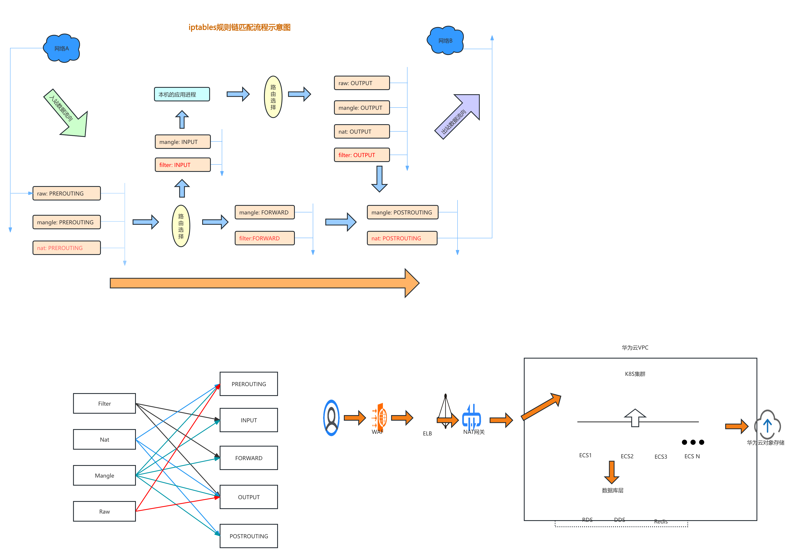

---

### 你们的研发团队有多少人，运维团队如何分工？

---

### 你了解敏捷开发吗？你们公司的开发模式是什么？

---

### 你工作中遇到过什么棘手的问题？

---

### 值班期间生产环境出现问题且不能快速解决你怎么处理？

---

### 你的学习途径有哪些？

---

### 堡垒机的作用是什么？

认证

授权

审计

---

### 你了解CMDB吗？

---

### CI/CD

概念、两者的区别、相关的工具及其部署、配置

---

### Jenkins的分布式架构了解吗？

##### 多个物理节点

##### jenkins in kubernetes

###### **jenkins连接k8s之Token认证：**

1. 安装插件"Kunernetes plugin"
2. k8s中创建永久Token(service-account-token类型的secret),并与jenkins使用的sa绑定，这样当pod使用该token认证的同时也获得了该sa的权限
3. Jenkins中新建Secret text类型的全局凭证，将token值写入Secret字段
4. 配置jenkins连接k8s

```yaml
# 创建Token
kubectl apply -f - <<-EOF
apiVersion: v1
kind: Secret
metadata:
  name: jenkins-secret
  namespace: kube-jenkins
  annotations:
    kubernetes.io/service-account.name: jenkins
type: kubernetes.io/service-account-token
EOF

# 查看Token
kl describe secrets -n kube-jenkins jenkins-secret
Name:         jenkins-secret
Namespace:    kube-jenkins
Labels:       kubernetes.io/legacy-token-last-used=2024-09-03
Annotations:  kubernetes.io/service-account.name: jenkins
              kubernetes.io/service-account.uid: e257ec67-9a75-47df-b907-23f029806b98

Type:  kubernetes.io/service-account-token

Data
====
ca.crt:     1107 bytes
namespace:  12 bytes
token:      eyJhbGciOiJSUzI1NiIsImtpZCI6ImdnRnVz……
```

```shell
# 以下为jenkins配置截图
```

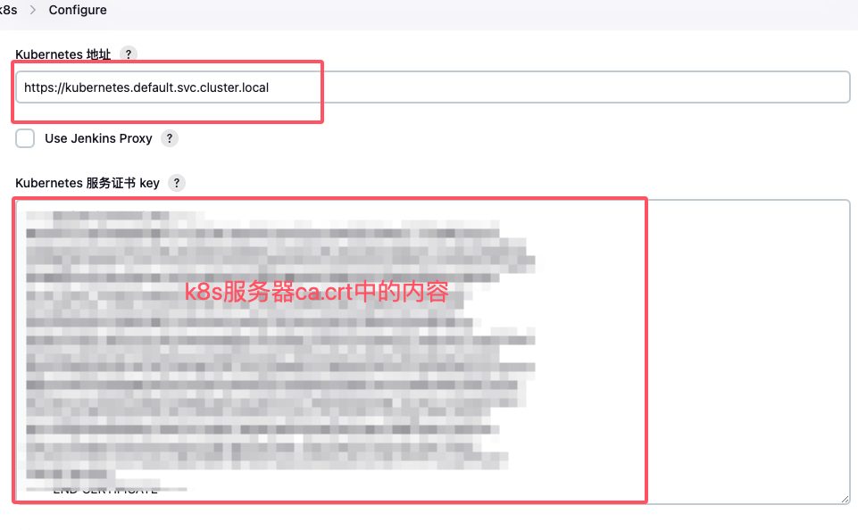

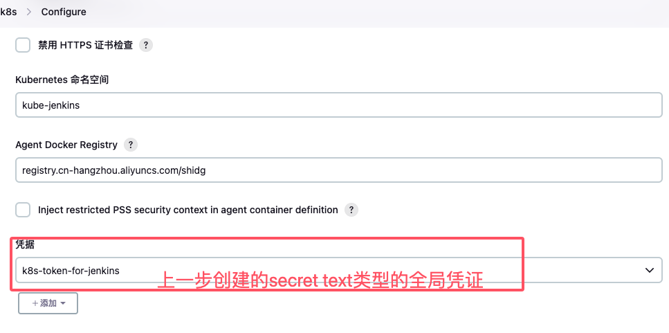

###### **jenkins连接k8s之客户端证书认证：**

1. 生成证书,客户端以"jenkins"用户的身份去请求k8s api进行认证
2. 授权，确保认证通过后，jenkins用户能够有足够的权限进行相关操作，这里是限制了jenkins用户只能在kube-jenkins命名空间下有足够权限(使用rolebinding绑定的clusterrole角色)
3. Jenkins中创建X.509 Client Certificate类型的全局凭据

```shell
# 为jenkins用户生成证书
username=jenkins
openssl genrsa -out ${username}.key 2048
openssl req -new -key ${username}.key -out ${username}.csr -subj "/CN=${username}/O=MGM"
openssl x509 -req -in ${username}.csr -CA /etc/kubernetes/pki/ca.crt -CAkey /etc/kubernetes/pki/ca.key -CAcreateserial -out ${username}.crt -days 3650

```

```yaml
# 将jenkins用户与jenkins这个clusterrole绑定，并限制在kube-jenkins命名空间内
apiVersion: rbac.authorization.k8s.io/v1
kind: RoleBinding
metadata:
  name: jenkins-connect-to-k8s
  namespace: kube-jenkins
roleRef:
  apiGroup: rbac.authorization.k8s.io
  kind: ClusterRole
  name: jenkins
  apiGroup: ""
subjects:
  - kind: User
    name: jenkins
    apiGroup: ""
```

```shell
# jenkins中创建X.509类型的全局凭据
```

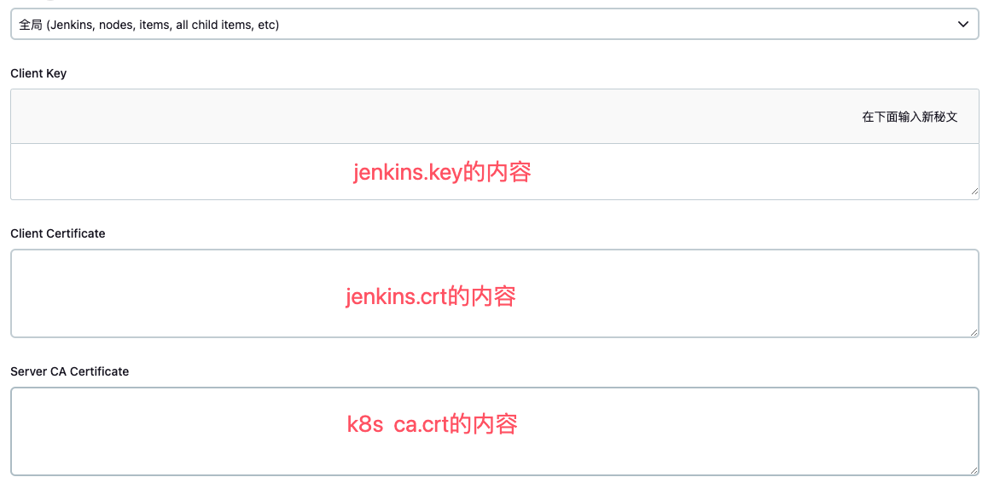

要注意，在配置Container Template的时候，容器镜像使用jenkins/inbound-agent，之前的jenkins/jnlp-slave已经废弃

如果有多个容器，除了jnlp，其他容器都需要使用sleep来维持在running状态，否则pod不能正常运行，pipeline任务无法执行

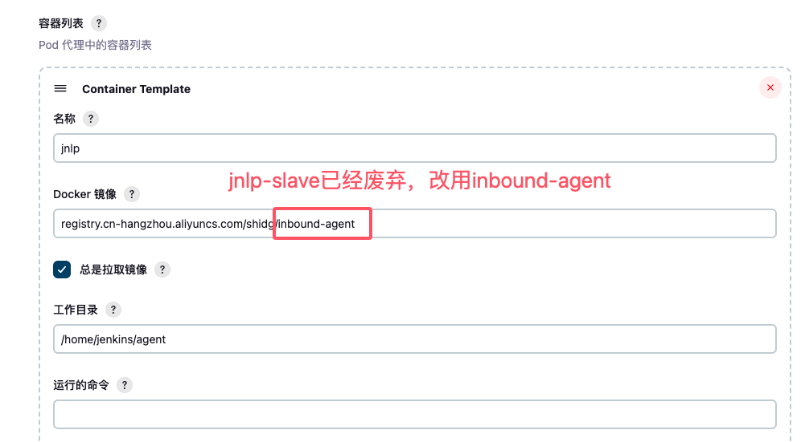

```java
# 一个动态创建slave执行构建任务的pipeline示例
pipeline {
    agent {
        node {
            label 'jenkins-slave'
        }
    }
    parameters {
        choice choices: ['pro','dev'],description: '目标环境',name: 'TARGET_ENV'
    }

    stages {
         stage('get code') {
            steps {
                git branch: 'main', credentialsId: '96185bf6-59a0-49f7-9c19-08ebb85b6aaa', url: 'git@git.baway.org.cn:teacher/cicdtest.git'
            }
        }
        stage('mvn build') {
            steps {
                script {
                    container('maven') {
                        sh 'mvn package'
                    }
                }
            }
        }
         stage('dockerfile') {
            environment {
                docker_directory = 'docker-app'
                target_env="${params.TARGET_ENV}"
            } 
            steps {
                script {
                    container('docker') {
                        sh '''
                        rm -rf ${docker_directory}
                        mkdir -p ${docker_directory}
                        cp target/jartestone-2.4.3.jar ${docker_directory}/jartestone-2.4.3.jar
                        cd ${docker_directory}
                        echo "GMinfosec123" | docker login registry.cn-hangzhou.aliyuncs.com --username niebianertuo --password-stdin
cat > Dockerfile <<EOF
FROM  registry.cn-hangzhou.aliyuncs.com/shidg/openjdk:8-alpine
COPY  jartestone-2.4.3.jar jartestone-2.4.3.jar
ENTRYPOINT ["java","-jar","jartestone-2.4.3.jar"]
EOF
                        docker build -t registry.cn-hangzhou.aliyuncs.com/shidg/myapp-v1:latest .
                        docker push registry.cn-hangzhou.aliyuncs.com/shidg/myapp-v1:latest
                        '''
                    }
                }
            }
        }
        stage('run app') {
          steps {
              script {
                  container('jdk') {
                      sh 'sleep 60'
                  }
              }
          }
        }
    }
}

```

---

### jenkins pipeline

node: 节点

stages： 阶段

steps：步骤

```shell
# 声明式pipeline，包含在pipeline{}块中
pipeline {
    agent {
        node {
            label 'jenkins-slave'
        }
    }
    parameters {
        choice choices: ['pro','dev'],description: '目标环境',name: 'TARGET_ENV'
	gitParameter(  // 需要安装Git Parameter插件
                name: 'BRANCH', 
                type: 'PT_BRANCH_TAG',
                branchFilter: 'origin/(.*)',
                defaultValue: 'dev',
                selectedValue: 'DEFAULT',
                sortMode: 'DESCENDING_SMART',
                useRepository: 'git@git.baway.org.cn:teacher/cicdtest.git', 
                description: '本次发布要使用的代码分支'
    }

    stages {
         stage('get code') {
            steps {
		script {
			def currentBranch = "${BRANCH}"
                	git branch: currentBranch, credentialsId: '96185bf6-59a0-49f7-9c19-08ebb85b6aaa', url: 'git@git.baway.org.cn:teacher/cicdtest.git'
		}
            }
        }
        stage('mvn build') {
            steps {
                script {
                    container('maven') {
                        sh 'mvn package'
                    }
                }
            }
        }
         stage('dockerfile') {
            environment {
                docker_directory = 'docker-app'
                target_env="${params.TARGET_ENV}"
            } 
            steps {
                script {
                    container('docker') {
                        sh '''
                        rm -rf ${docker_directory}
                        mkdir -p ${docker_directory}
                        cp target/jartestone-2.4.3.jar ${docker_directory}/jartestone-2.4.3.jar
                        cd ${docker_directory}
                        echo "GMinfosec123" | docker login registry.cn-hangzhou.aliyuncs.com --username niebianertuo --password-stdin
cat > Dockerfile <<EOF
FROM  registry.cn-hangzhou.aliyuncs.com/shidg/openjdk:8-alpine
COPY  jartestone-2.4.3.jar jartestone-2.4.3.jar
ENTRYPOINT ["java","-jar","jartestone-2.4.3.jar"]
EOF
                        docker build -t registry.cn-hangzhou.aliyuncs.com/shidg/myapp-${TARGET_ENV}:v${BUILD_NUMBER}: .
                        docker push registry.cn-hangzhou.aliyuncs.com/shidg/myapp-${TARGET_ENV}:v${BUILD_NUMBER}
                        '''
                    }
                }
            }
        }
        stage('run app') {
          steps {
              script {
                  container('jdk') {
                      sh 'sleep 60'
                  }
              }
          }
        }
    }
}
```

---

### Jenkins自动触发

##### Gitlab Plugin插件提供的自动触发

```shell
# webhook地址
http://jenkins-servername/project/projectname   +  Secret

```

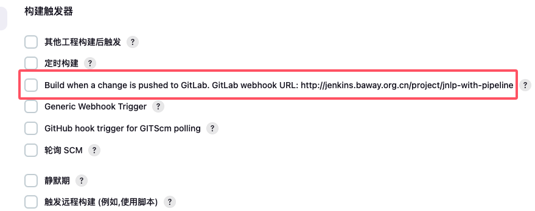

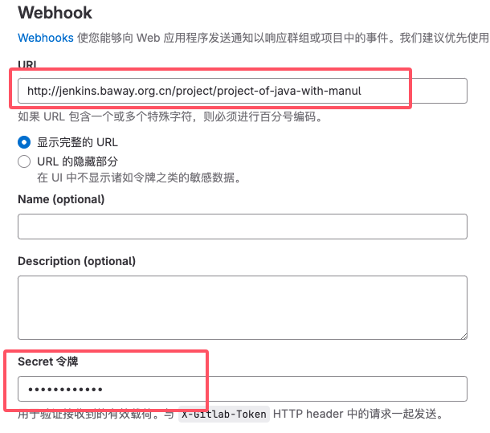

##### Generic Webhook Trigger插件提供的自动触发

```shell
# webhook地址
http://ljenkins-servername/generic-webhook-trigger/invoke?token=my-token

# 可以在jenkins job配置中手动激活Generic Webhook Trigger插件并进行配置
# 也可以将Generic Webhook Trigger的配置写到Jenkinsfile中，首次构建后，Jenkins将会自动激活该job的Generic Webhook Trigger插件并将Jenkinsfile中的配置同步过来
```

```json
pipeline {
    agent {
        node {
            label 'jenkins-slave'
        }
    }

    triggers {
        GenericTrigger(
            genericVariables: [
                [defaultValue: '', key: 'ref', regexpFilter: '', value: '$.ref'],
                [defaultValue: '', key: 'WEBHOOK_USER_NAME', regexpFilter: '', value: '$.user_name'],
                [defaultValue: '', key: 'Project name', regexpFilter: '', value: '$project.name'],
                [defaultValue: '', key: 'WEBHOOK_RECENT_COMMIT_ID', value: '$.commits[-1].id'],
                [defaultValue: '', key: 'WEBHOOK_RECENT_COMMIT_MESSAGE', value: '$.commits[-1].message']
            ],
            causeString: 'Triggered on $ref',
            silentResponse: false,
            shouldNotFlatten: false,
            printContributedVariables: true,
            printPostContent: true,
            regexpFilterExpression: 'refs/heads/dev',
            regexpFilterText: '$ref',
            token: '123098'
        )
    }
    stages {
	 ……
    }
```

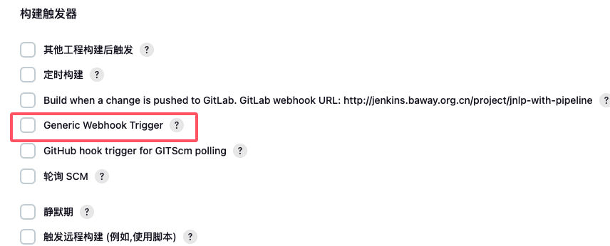

##### Multibranch Scan Webhook Trigger插件提供的自动触发

```shell
# webhook地址
http://ljenkins-servername/multibranch-webhook-trigger/invoke?token=my-token

# 该插件适用与多分支流水线类型的构建任务
```

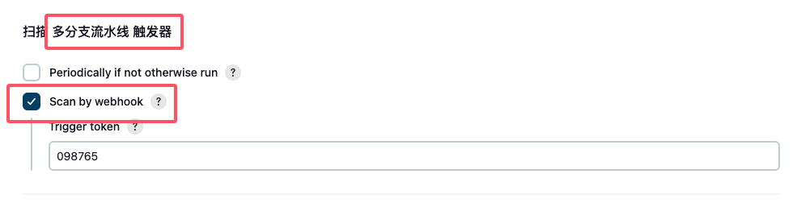

---

### Jenkins的权限控制了解吗？

Role-based Authorization Strategy插件的配置

---

### docker-in-docker

    当需要在容器中执行docker命令的时候，可以将宿主机的docker.sock挂载到容器中。称之为docker in docker

### 你每天到公司第一件事是什么？

---

### 你每天下班前会做什么？

---

# `<font color=red>`*HR部分* `</font>`

### 1. 你上家公司在什么位置？你的通勤方式和通勤时间？

---

### 2. 你上家公司的业务是什么，做什么产品，产品面向的用户是哪些？

---

### 3. 你上家公司规模？公司架构？你所在的部门有多少人，你的岗位有多少人？

---

### 4. 你的工作汇报对象是谁？汇报形式，日常工作汇报如何做？

---

### 5. 你上家公司用什么即时通讯软件，有没有企业邮箱？请假的流程是什么？请假扣工资吗？

---

### 6. 你上家公司的待遇？入职的时候多少，离职的时候多少？每月什么时候发工资？实际到手有多少？五险一金缴纳基数是多少？

---

### 7. 你的离职原因是什么，后续的职业规划是什么？

---

### 8. 你对我们公司有了解吗？

---

### 9. 你的学历是什么？是统招吗？

---

### 10. 你现在住哪？

---

### 11. 假如入职，你打算怎么开展工作？

---

### 12. 之前公司有绩效考核机制吗  具体是怎么进行的？

---

### 13. 驻场过程中能够体现沟通能力的经典场景
