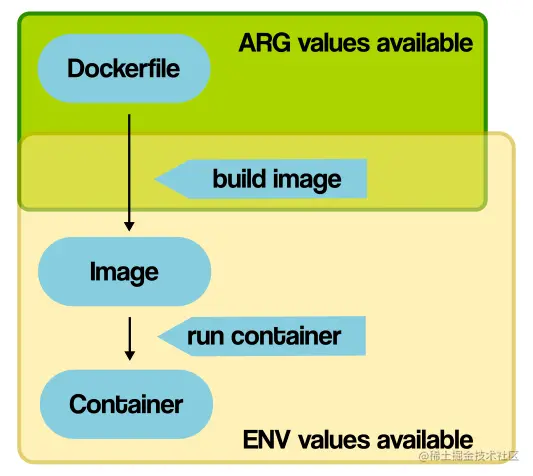

 `<font color=red>` *Linux基础知识部分* `</font>`

### linux runlevel

---

### Linux欢迎信息

```
# 本地控制台登录时的欢迎信息(ssh远程登录不显示)，登录前显示
/etc/issue
```

```
# 所有用户登录后都可以看到的欢迎信息，登录后显示
/etc/motd
```

```
# ssh登录时的欢迎信息，只对ssh登录有效，登录后显示
/etc/ssh/sshd_config
Banner /etc/ssh/ssh_banner
```

---

### Linux 计划任务

* [X] cron
* [X] anacron
  只能执行每天/每周/每月的任务；
  没有独立的守护进程，仍然是使用crond进程来执行具体任务；
  服务器开机后会自动执行因关机而未能执行的任务

  ```shell
  # anacron的配置文件
  cat /etc/anacrontab
  # /etc/anacrontab: configuration file for anacron

  # See anacron(8) and anacrontab(5) for details.

  SHELL=/bin/sh
  PATH=/sbin:/bin:/usr/sbin:/usr/bin
  MAILTO=root
  # the maximal random delay added to the base delay of the jobs
  RANDOM_DELAY=45  
  # the jobs will be started during the following hours only
  START_HOURS_RANGE=3-22

  #period in days   delay in minutes   job-identifier   command
  1 5 cron.daily  nice run-parts /etc/cron.daily
  7 25 cron.weekly  nice run-parts /etc/cron.weekly
  @monthly 45 cron.monthly  nice run-parts /etc/cron.monthly

  # anacron的调用链路
  cat /etc/cron.d/0hourly
  # Run the hourly jobs
  SHELL=/bin/bash
  PATH=/sbin:/bin:/usr/sbin:/usr/bin
  MAILTO=root
  01 * * * * root run-parts /etc/cron.hourly    # 调用cron.hourly下的所有脚本

  cat /etc/cron.hourly/0anacron
  #!/bin/sh
  # Check whether 0anacron was run today already
  if test -r /var/spool/anacron/cron.daily; then
      day=`cat /var/spool/anacron/cron.daily`
  fi
  if [ `date +%Y%m%d` = "$day" ]; then
      exit 0;
  fi

  # Do not run jobs when on battery power
  if test -x /usr/bin/on_ac_power; then
      /usr/bin/on_ac_power >/dev/null 2>&1
      if test $? -eq 1; then
      exit 0
      fi
  fi
  /usr/sbin/anacron -s      # 序列化执行所有作业，anacron不会在前一个作业完成之前启动新作业

  ```

---

### Linux时间同步

chronyd

```shell
# chronyc命令行接口

# chronyc tracking

chronyc tracking 显示的信息是 chronyd 服务当前同步状态的快照。主要包括正在同步的远程服务器的 ID、系统在 NTP 层次中的位置（stratum）、系统时间与 NTP 时间的差异，以及其他一些信息。如果系统时间与 NTP 时间的差异接近于 0，并且显示 "Leap status : Normal"，那么同步状态可以认为是正常的。

以下是 chronyc tracking 命令输出的各个字段的含义：

Reference ID：你的系统正在与之同步的远程 NTP 服务器的地址或者 IP。
Stratum：表示你的系统在 NTP 层次中的级别。Stratum 1 服务器直接与原子钟或 GPS 时钟等准确的时间源同步。Stratum 2 服务器与 Stratum 1 服务器同步，以此类推。这个字段表示你的系统是与哪个 stratum 的服务器同步。
Ref time (UTC)：上一次从远程服务器接收到时间更新的时间（以 UTC 表示）。
System time：你的系统时间相对于 NTP 服务器时间的差异。如果显示 "fast"，表示你的系统时间比 NTP 时钟快；如果显示 "slow"，表示你的系统时间比 NTP 时钟慢。
Last offset：上一次时间同步时，系统时间与 NTP 服务器时间的偏移量。
RMS offset：时间偏移量的均方根，是一个衡量时间同步精度的指标。
Frequency：本地系统时钟的速度，相对于完美的时间源，以每百万部分（ppm）表示。如果显示 "fast"，表示你的系统时钟运行得比完美的时钟快；如果显示 "slow"，表示你的系统时钟运行得比完美的时钟慢。
Residual freq：在最后一次同步之后，已经观察到的本地时钟频率的改变。
Skew：本地时钟频率估计的不确定性。
Root delay：到同步源的往返时间。
Root dispersion：同步源的最大可能误差。
Update interval：两次连续更新之间的间隔时间（以秒为单位）。
Leap status：闰秒状态。可以是 "Normal"、"Insert second" 或 "Delete second"。


chronyc sources -v
chronyc sources -v 命令能显示 chronyd 服务正在使用的 NTP 源服务器的详细状态。这个命令会列出每个源服务器的 IP 地址，以及每个源服务器的状态和时间偏移量。通过这个命令，你可以看到你的系统是从哪些 NTP 服务器获取时间的，以及每个服务器的状态和时间偏移量

chronyc soucestats -v
chronyc sourcestats -v 提供的是关于每个 NTP 源服务器的统计信息，包括每个源服务器的 IP 地址，以及每个源服务器的样本数量、样本的均值和标准偏差等。这个命令可以帮助我们更好地了解时间源的稳定性和可靠性。

chronyc makestep
手动同步时间
```

ntp

---

### DNS解析流程

#### DNS服务器概念

根DNS服务器：全球共13组，维护顶级域的指向信息（如 `.com`、`.cn`）

顶级域DNS服务器：为 `.com`、`.org`、`.cn`等提供对应域的权威服务器信息

权威DNS服务器：最终存储域名与IP对应关系的地方，如 `example.com` 的A记录、MX记录等

递归DNS服务器：由运营商或企业提供，帮客户端查询最终的IP地址

#### DNS解析流程（以www.example.com为例）

##### **本地缓存查询**

* 客户端（浏览器或操作系统） **首先查本地缓存** （浏览器DNS缓存、系统DNS缓存等）是否已有该域名的解析记录（A记录）。
* 如果找到了，直接使用， **不再发起网络请求** 。

##### 本地DNS服务器（通常由ISP或企业提供，也就是递归DNS服务器）查询

如果递归DNS服务器有缓存则直接返回结果，不会再走下边的流程

如果递归DNS服务器也没有缓存，它会按以下流程依次发起查询：

##### **请求根DS服务器** ：`www.example.com` 的解析权归哪个顶级域（这里是 `.com`）

  → 返回 `.com` 顶级域DNS服务器地址

##### **请求.com 的顶级域DNS服务器** ：`example.com` 的权威DNS服务器在哪？

  → 返回 `example.com` 对应权威DNS服务器地址

##### **请求权威DNS服务器** ：请告诉我 `www.example.com` 的IP地址

  → 返回A记录，如 `93.184.216.34`

##### **递归DNS服务器缓存结果** ：保存解析结果一段时间（根据TTL）

  → 返回客户端使用

#### 查询流程图解


---

### Linux时间配置

#### date

* 查看日期并格式化显示， date +"`<format参数>`"

```shell
## 常用format参数
%Y   年
%m   月份(01..12)
%d   日(01..31)

%H   小时(00..23)
%M   分钟(00..59)
%S   秒(00..60)

%F   完整的日期；等价于%Y-%m-%d
%D   日期，等价于%m/%d/%y
%T   时间;等价于%H:%M:%S

%s   自1970-01-0100:00:00 UTC 到现在的秒数(时间戳)

# 其他format参数
%y   年份后两位数字(00..99)
%I   小时(01..12)
%j   一年中的第几天(001..366)
%k   小时，使用空格填充(0..23);等价于%_H
%l   小时,使用空格填充(1..12);等价于%_I
%n   新的一行，换行符
%N   纳秒(000000000..999999999)
%p   用于表示当地的AM或PM，如果未知则为空白
%P   类似%p,但是是小写的
%r   本地的12小时制时间(例如11:11:04 PM)
%R   24小时制的小时与分钟;等价于%H:%M
%t   插入水平制表符 tab
%u   一周中的一天(1..7);1表示星期一
%U   一年中的第几周，周日作为一周的起始(00..53)
%V   ISO 标准计数周，该方法将周一作为一周的起始(01..53)
%w   一周中的一天（0..6），0代表星期天
%W   一年中的第几周，周一作为一周的起始（00..53）
%x   本地的日期格式（例如，12/31/99）
%X   本地的日期格式（例如，23:13:48）
%z   +hhmm 格式的数值化时区格式（例如，-0400）
%:z  +hh:mm 格式的数值化时区格式（例如，-04:00）
%::z  +hh:mm:ss格式的数值化时区格式（例如，-04:00:00）
%:::z  数值化时区格式，相比上一个格式增加':'以显示必要的精度（例如，-04，+05:30）
%Z  时区缩写（如 EDT）
%%输出字符%
%a   星期几的缩写(Sun..Sat)
%A   星期的完整名称(Sunday..Saturday)。 
%b   缩写的月份名称（例如，Jan）
%B   完整的月份名称（例如，January）
%c   本地日期和时间（例如，ThuMar323:05:252005）
%C   世纪，和%Y类似，但是省略后两位（例如，20）
%e   一月中的一天，格式使用空格填充，等价于%_d
%g   ISO 标准计数周的年份的最后两位数字
%G   ISO 标准计数周的年份，通常只对%V有用
%h   等价于%b
```

-s  --set   时间设置

```shell
 # 设置当前时间，只有root权限才能设置，其他只能查看
# 设置具体时间，不更改日期
date -s 01:01:01   

# 设置日期,不更改具体时间 
date -s 20120523# 设置成20120523，这样会把具体时间设置成00:00:00

# 设置全部时间
date -s "01:01:01 2012-05-23"
date -s "01:01:01 20120523"
date -s "2012-05-23 01:01:01"
date -s "20120523 01:01:01"
```

* -d   --date  日期计算

```shell
date +%Y%m%d                   # 显示年月日
date -d "+1 day"+%Y%m%d       # 显示后一天的日期
date -d "-1 day"+%Y%m%d       # 显示前一天的日期
date -d "-1 month"+%Y%m%d     # 显示上一月的日期
date -d "+1 month"+%Y%m%d     # 显示下一月的日期
date -d "-1 year"+%Y%m%d      # 显示前一年的日期
date -d "+1 year"+%Y%m%d      # 显示下一年的日期
```

* -u  --utc 查看UTC时间(世界标准时间，比北京时间落后8个小时)

#### timedatectl

```shell
timedatectl 是一个较新的命令,主要在使用 systemd 的系统中提供
它不仅能显示和设置日期时间，还能管理系统时区、启用或禁用 NTP（网络时间协议）服务，以及检查当前的时间同步状态。
timedatectl 是一个系统级别的工具，能够与 systemd 的时间管理功能集成，提供更强大的时间管理功能。
```

显示当前时间、时区、NTP 状态等

```shell
timedatectl

Local time: 三 2025-05-28 14:34:18 CST
  Universal time: 三 2025-05-28 06:34:18 UTC
        RTC time: 三 2025-05-28 14:34:17
       Time zone: Asia/Shanghai (CST, +0800)
     NTP enabled: yes
NTP synchronized: yes
 RTC in local TZ: yes
      DST active: n/a
```

设置时区

```shell
timedatectl set-timezone Asia/Shanghai
```

启用或禁用 NTP 时间同步

```shell
timedatectl set-ntp true | false
```

设置系统时间

```shell1
timedatectl set-time '2025-06-10 14:35:00'
```

#### 时间相关的几个概念

Local time

本地系统时间

UTC (Coordinated Universal Time)

```shell
UTC（Coodinated Universal Time），协调世界时，又称世界统一时间、世界标准时间、国际协调时间。由于英文（CUT）和法文（TUC）的缩写不同，作为妥协，简称UTC

# 和GMT的关系
UTC 是现在全球通用的时间标准，全球各地都同意将各自的时间进行同步协调。UTC 时间是经过平均太阳时（以格林威治时间GMT为准）、地轴运动修正后的新时标以及以秒为单位的国际原子时所综合精算而成
GMT是前世界标准时，UTC是现世界标准时。
UTC 比 GMT更精准，以原子时计时，适应现代社会的精确计时。
但在不需要精确到秒的情况下，二者可以视为等同。
每年格林尼治天文台会发调时信息，基于UTC
```

RTC (Real-Time Clock)

```shell
# RTC默认使用UTC,可以使用以下命令设置是否使用本地时间
timedatectl set-local-rtc true | false

# 可以使用以下命令将系统时间同步给RTC或者做相反操作
hwclock --systohc
hwclock --hctosys
```

Unix时间戳 (Unix timestamp)

```shell
从1970年1月1日（UTC/GMT的午夜）开始所经过的秒数
```

---

### 查看Linux发行版

```shell
cat  /etc/os-release
```

### 服务器网络管理

#### CentOS

systemd-network ,网卡配置文件/etc/sysconfig/network-scripts

修改网卡配置文件，重启network

```shell
IPADDR=10.203.43.8
NETMASK=255.255.252.0
GATEWAY=10.203.40.1
NM_CONTROLLED=no  # 该网卡不受NetworkManager管理
PEERDNS=no        # /etc/resolv.conf 在network重启后不会被重写
DNS1=10.203.43.8


systemctl restart network
```

#### Ubuntu(22.04+)

netplan,网卡配置文件 /etc/netplan/

修改网卡配置文件，执行netplan  apply

```shell
network:
  ethernets:
    ens32:
      dhcp4: false
      addresses:
      - 10.203.43.106/22
      routes:
      - to: default
        via: 10.203.40.1
      nameservers:
        addresses:
        - 10.203.43.8

netplan apply
```

#### Rocky、Alma Linux

nmcli,网卡配置文件/etc/NetworkManager/system-connections

#### nmcli管理网络

nmcli是NetworkManager组件提供的命令行工具，能够完成以下事情：

* 管理网络接口（启用/禁用）
* 创建、编辑、查看网络连接（有线、无线、VPN）
* 查看连接状态、IP、DNS 等
* 脚本自动化配置网络

  在NM里，有2个维度：连接（connection）和设备（device），这是多对一的关系。想给某个网卡配ip，首先NM要能纳管这个网卡。设备里存在的网卡（即 nmcli d可以看到的），就是NM纳管的。接着，可以为一个设备配置多个连接（即 nmcli c可以看到的），每个连接可以理解为一个ifcfg配置文件。同一时刻，一个设备只能有一个连接活跃。可以通过 nmcli c up切换连接。

```shell
nmcli device 可简写为nmcli d，有4种状态：
connected：已被NM纳管，并且当前有活跃的connection
disconnected：已被NM纳管，但是当前没有活跃的connection
unmanaged：未被NM纳管
unavailable：不可用，NM无法纳管，通常出现于网卡link为down的时候（比如ip link set ethX down）


nmcli connection,可简写为nmcli c ,有2中状态：
活跃（带颜色字体）：表示当前该connection生效
非活跃（正常字体）：表示当前该connection不生效

配置动态ip（相当于配置ifcfg,其中BOOTPROTO=dhcp)
nmcli c add type ethernet con-name ens33 ifname ens33 ipv4.method auto
type ethernet：创建连接时候必须指定类型，类型有很多，可以通过nmcli c add type -h看到，这里指定为ethernet。
con-name eth0 ifname ens33：第一个eth0表示连接（connection）的名字，这个名字可以任意定义，无需和网卡名相同；第二个ens33表示网卡名，这个ens33必须是在nmcli d里能看到的。


配置静态ip（相当于配置ifcfg,其中BOOTPROTO=static)
nmcli c add type ethernet con-name eth0 ifname ens33 ipv4.addr 192.168.1.100/24 ipv4.gateway 192.168.1.254 ipv4.dns '8.8.8.8,4.4.4.4' ipv4.method manual

ipv4.method对应ifcfg文件内容的BOOTPROTO，ipv4.method默认为auto，对应为BOOTPROTO=dhcp，这种时候如果指定ip，就可能导致网卡同时有dhcp分配的ip和静态ip。设置为manual表示BOOTPROTO=none，即只有静态ip。


nmcli c add   # 为网卡添加新的网络配置(connection)
nmcli c modify  # 编辑现有的网络配置(connection)
nmcli c show 查看所有的connection (connections默认位于/etc/NetworkManager/system-connections)
nmcli c show ethX 查看指定的connection
nmcli c up/down/delete ethX（connetction name)
nmcli c reload 重载所有的connection，但不会立即生效

立即使网卡配置文件生效
nmcli c up eth0 (connection name)
nmcli d connect ens33 (connection name)
nmcli d repply ens33 (device name)


查看网卡列表
nmcli d

查看网卡详细信息
nmcli d show （ethX)

激活网卡
nmcli d connect eth0

```

#### Linux ip命令

ip是iproute提供的命令行工具,取代由net-tools提供的ifconfig，用法是

```
ip  [OBJECT] [COMMAND] [OPTIONS]

OBJECT：操作对象（如 addr、link、route 等）
COMMAND：要执行的操作（如 add、del、show）
OPTIONS：具体参数
```

| 对象（OBJECT） | 作用          | 示例                                      |
| -------------- | ------------- | ----------------------------------------- |
| link           | 管理网络接口  | ip link show，ip link set eth0 up         |
| addr           | 管理 IP 地址  | ip addr add 192.168.1.10/24 dev eth0      |
| route          | 管理路由表    | ip route add default via 192.168.1.1      |
| neigh          | 管理 ARP 缓存 | ip neigh show                             |
| rule           | 策略路由规则  | ip rule add from 192.168.1.0/24 table 100 |
| netns          | 网络命名空间  | ip netns add test                         |
| maddr          | 多播地址      | ip maddr show                             |
| link set       | 修改状态/MTU  | ip link set dev eth0 mtu 1400             |

link:网络设备

```shell
ip link show                     # 显示网络接口信息
ip link set eth0 up             # 开启网卡
ip link set eth0 down            # 关闭网卡
ip link set eth0 promisc on      # 开启网卡的混合模式
ip link set eth0 promisc offi    # 关闭网卡的混个模式
ip link set eth0 txqueuelen 1200 # 设置网卡队列长度
ip link set eth0 mtu 1500        # 设置网卡最大传输单元

```

addr: 设备上的协议地址

```shell
ip addr show     # 显示网卡IP信息
ip addr add 192.168.0.1/24 dev eth0 # 设置eth0网卡IP地址192.168.0.1
ip addr del 192.168.0.1/24 dev eth0 # 删除eth0网卡IP地址
```

route: 路由表

```shell
ip route show # 显示系统路由
ip route add default via 192.168.1.254   # 设置系统默认路由
ip route list                 # 查看路由信息
ip route add 192.168.4.0/24  via  192.168.0.254 dev eth0 # 设置192.168.4.0网段的网关为192.168.0.254,数据走eth0接口
ip route add default via  192.168.0.254  dev eth0        # 设置默认网关为192.168.0.254
ip route del 192.168.4.0/24   # 删除192.168.4.0网段的网关
ip route del default          # 删除默认路由
ip route delete 192.168.1.0/24 dev eth0 # 删除路由
```

---

### 根据进程查看端口，根据端口查看进程

ss -tnlp

lsof -i:tcpprot

---

### CentOS 7 单用户模式

```shell
在系统开始引导前按e键进入编辑模式
对“linux16"开头的行做如下修改:
# method1
ro ---> rw init=/bin/sh
然后ctr+x进入单用户模式
chroot /sysroot
passwd修改密码
touch /.autorelabel   # 如果确认系统的Selinux是关闭的，则此步骤可以省略
exit # 退出sysroot
reboot # 重启

# method2
直接在行尾添加init=/bin/sh
ctr+x进入单用户模式
mount -o remount,rw /
passwd修改密码
touch /.autorelabel   # 如果确认系统的Selinux是关闭的，则此步骤可以省略
exec /sbin/init  # 重启

# 关于/.autorelabel
在单用户模式下，修改用户密码后必须执行重新标记SElinux文件系统的操作，否则修改密码不能成功
/.autorelabel文件的作用是，在系统重新启动的时候修正档案的预设security context(安全上下文)，因为在系统启动时发现存在/.autorelabel文件，就会调用fixfiles命令对整个文件系统进行relabeling。
```

---

### CentOS 7 永久添加路由

ip route指令对路由的修改不能永久保存
把ip route指令写到/etc/rc.local也是徒劳的
RHEL7 官网文档没有提到/etc/sysconfig/static-routes，经测试此文件已经无效
/etc/sysconfig/network配置文件仅仅可以提供全局默认网关，语法同 CentOS 6 一样： GATEWAY=
永久静态路由需要写到”/etc/sysconfig/network-scripts/route-interface“文件中

```shell
cat /etc/sysconfig/network-scripts/route-eth0
10.18.196.0/255.255.254.0 via 192.168.56.11 dev eth0

nmcli dev disconnect eth0 && nmcli dev connect eth0 # 重启系统或者重新连接网卡生效
```

---

### MySQL索引类型

---

### MySQL二进制部署[MySQL Community Server  8.4.5]

```shell
#  下载二进制安装包并解压
tar zxvf mysql-8.4.5-linux-glibc2.17-x86_64.tar.gz -C /usr/local/
cd  /usr/local && ln -s  mysql-8.4.5-linux-glibc2.17-x86_64/  ./mysql

# 准备所需目录并修改目录权限
mkdir  {/var/run/mysql,/var/lib/mysql,var/log/mysql}
useradd  mysql && chown -R mysql:mysql {/var/run/mysql,/var/lib/mysql,var/log/mysql}

# 生成配置文件
cat > /etc/my.cnf << -EOF
[mysqld]
skip-grant-tables
datadir=/var/lib/mysql
socket=/var/lib/mysql/mysql.sock
server-id = 1
#开启二进制日志
log_bin = db1.binlog
# 配置自增主键从一开始
auto_increment_offset=1
# 配置自增主键每隔一进一，以防止主键自增的冲突
auto_increment_increment=2
# 不需要同步的数据库
binlog-ignore-db = mysql
binlog_ignore_db = information_schema
binlog_ignore_db = performation_schema
binlog_ignore_db = sys

init_connect='SET NAMES utf8'
character-set-server=utf8mb4
collation-server=utf8mb4_general_ci
max_allowed_packet=256M

skip-external-locking
key_buffer_size = 16M
table_open_cache = 64
sort_buffer_size = 512K
net_buffer_length = 8K
read_buffer_size = 256K
read_rnd_buffer_size = 512K


[client]
default-character-set=utf8mb4

[mysqld_safe]
log-error = /var/log/mysql/mysql.log
pid-file = /var/run/mysql/mysql.pid

#
# include all files from the config directory
#
!includedir /etc/my.cnf.d
EOF

# 初始化
/usr/local/mysql//bin/mysqld --defaults-file=/etc/my.cnf --initialize --console
# 初始化成功后会为root生成一个临时密码,和初始化过程一起记录到errorlog中[log-error参数指定的文件]

# MySQL启动
cp support-files/mysql.server /etc/init.d/mysqld && service mysqld start

# 使用临时密码登录MySQL
# 修改临时密码。临时密码只能用来登录MySQL，但不允许执行任何操作，所以第一步是修改临时密码
ALTER USER 'root'@'localhost' IDENTIFIED BY 'admincp';


```

---

### MySQL8和MySQL5在密码验证机制方面的差异

MySQL8默认的密码验证插件和MySQL5是不同的，区别如下：

| 比较点   | MySQL 5.7                 | MySQL 8.0                  |
| -------- | ------------------------- | -------------------------- |
| 默认插件 | `mysql_native_password` | `caching_sha2_password`  |
| 安全性   | SHA1，较弱                | SHA256，较强，支持加密传输 |
| 向后兼容 | 较好                      | 需要注意旧客户端连接问题   |
| 密码策略 | 基本支持                  | 更完善的策略和插件支持     |

由于插件变化，MySQL 8 的新用户默认使用 `caching_sha2_password`，这可能会导致 **旧客户端（如 MySQL 5.x 的连接库）无法连接 MySQL 8 服务器** ，报错示例如下：

```shell
Authentication plugin 'caching_sha2_password' cannot be loaded
```

解决方法：

使用 MySQL 8 的客户端连接；

或者将用户认证插件手动改回 `mysql_native_password`：

```shell
ALTER USER 'user'@'host' IDENTIFIED WITH mysql_native_password BY 'password';
```

如何修改MySQL8的默认密码认证插件：

```
在MySQL配置文件中添加以下配置
default-authentication-plugin=caching_sha2_password | mysql_native_password
```

---

### MySQL高可用方案

#### MHA

#### PXC

#### MySQL组复制（MGR  MySQL Group Replication）

```shell
# 前提条件
MySQL版本5.7.17+
存储引擎必须是Innodb，并且每张表一定要有主键，用于解决write冲突
必须打开GTID特性
binlog日志格式必须设置为ROW   [Statement,ROW,MiXED]
```

```
目前一个MGR集群组最多支持9个节点

# 部署过程 

############################################################ 单主模式  ##################################################################

docker 运行MySQL8
# 事先准备好my.cnf和plugin目录下的所有.so文件

docker run -d --name mysql \
-v /data/volumes/mysql/data:/var/lib/mysql \
-v /data/volumes/mysql/conf/my.cnf:/etc/my.cnf \
-v /data/volumes/mysql/plugin:/usr/lib64/mysql/plugin \
-v /data/volumes/mysql/logs:/logs \
--net=host \    # 三个实例要互相通信，这里使用主机网络
--hostname=db1  # 三个MySQL实例主机名唯一
--add-host=db1:10.203.43.170 \
--add-host=db2:10.203.43.171 \
--add-host=db3:10.203.43.172 \
-e MYSQL_ROOT_PASSWORD=admin \
harbor.baway.org.cn/library/mysql:8.0.40

my.cnf内容如下:
[mysqld]
# Remove leading # to revert to previous value for default_authentication_plugin,
# this will increase compatibility with older clients. For background, see:
# https://dev.mysql.com/doc/refman/8.0/en/server-system-variables.html#sysvar_default_authentication_plugin
# default-authentication-plugin=mysql_native_password
skip-host-cache
skip-name-resolve
datadir=/var/lib/mysql
socket=/dev/shm/mysqld.sock
secure-file-priv=/var/lib/mysql-files
user=mysql
disabled_storage_engines="MyISAM,BLACKHOLE,FEDERATED,ARCHIVE,MEMORY" # 禁用InnoDB之外的存储引擎

# MGR相关配置
server_id=1   # 各节点不能冲突
gtid_mode=ON
enforce_gtid_consistency=ON
master_info_repository=TABLE
relay_log_info_repository=TABLE
log_bin=binlog
binlog_format=ROW       # MySQL 8.4之后该参数已删除
log_replica_updates=ON  # 也就是8.0.26之前的log_slave_updates
binlog_checksum=CRC32      # MySQL 8.0.21+的默认值, MySQL 8.0.20及之前的值NONE
transaction_write_set_extraction=XXHASH64
loose-group_replication_recovery_use_ssl=ON
loose-group_replication_group_name="aaaaaaaa-aaaa-aaaa-aaaa-aaaaaaaaaaaa"  #组id,自定义，内容随意，格式正确即可
loose-group_replication_start_on_boot=OFF
loose-group_replication_local_address= "db1:33061"   # 主机名和ip的对应关系要写入/etc/hosts，端口号自定义
loose-group_replication_group_seeds= "db1:33061,db2:33061,db3:33061"
loose-group_replication_bootstrap_group=OFF
loose-group_replication_member_weight=50   # 优先级越高，越被优先选举为新master
loose-group_replication_single_primary_mode=TRUE  # 开启单主模式
loose-group_replication_enforce_update_everywhere_checks=FALSE  # 关闭多主模式
relay-log = db1-relay-bin   # relay-log前缀，文件名由MySQL根据主机名自动生成


pid-file=/dev/shm/mysqld.pid
[client]
socket=/var/run/mysqld/mysqld.sock

!includedir /etc/mysql/conf.d/

# 创建同步账号，3台服务器均执行
mysql>CREATE USER rpl_user@'%' IDENTIFIED BY 'qaz123456!';
mysql>GRANT REPLICATION SLAVE ON *.* TO rpl_user@'%';
mysql>FLUSH PRIVILEGES;
mysql>RESET MASTER; 
# 因为刚才Binglog包含创建用户这种高权限操作，用于主从同步的账户没有权限执行,RelayLog重放无法正确执行，导致从属服务器卡死在"RECEVERING"状态
# RESET MASTER删除这些无法执行的binlog


# 安装mrg插件，3台服务器均执行
mysql> INSTALL PLUGIN group_replication SONAME 'group_replication.so';

# primary节点开始组复制
# 之前在配置文件中把 group_replication_bootstrap_group 参数设置成 OFF
# 所以服务器启动时并不会直接启动复制组，通过下面的命令动态的开启复制组
SET GLOBAL group_replication_bootstrap_group=ON;
START GROUP_REPLICATION;
SET GLOBAL group_replication_bootstrap_group=OFF;

# 从节点开启组复制
# 指定主从账户与指定通信频道
CHANGE MASTER TO MASTER_USER="rpl_user", MASTER_PASSWORD="qaz123" FOR CHANNEL 'group_replication_recovery';
# 开启组网数据同步
START GROUP_REPLICATION;

# 验证结果
SELECT * FROM performance_schema.replication_group_members;

############################################################ 多主模式  ##################################################################

# 基于MySQL 8.4.5，二进制方式安装

# 配置文件
[mysqld]
user = mysql
datadir = /var/lib/mysql
socket = /dev/shm/mysql.sock
pid-file = /dev/shm/mysql.pid

# MGR相关配置
server-id = 1    # 不能冲突
gtid_mode = ON
enforce_gtid_consistency = ON
log_bin = db1.binlog
log_replica_updates=ON  # 也就是8.0.26之前的log_slave_updates
binlog_checksum=CRC32    # MySQL 8.0.21+的默认值, MySQL 8.0.20及之前的值NONE
loose-group_replication_recovery_use_ssl=ON
loose-group_replication_group_name="aaaaaaaa-aaaa-aaaa-aaaa-aaaaaaaaaaaa"
loose-group_replication_start_on_boot=OFF
loose-group_replication_local_address= "db1:33061"   # 本机主名
loose-group_replication_group_seeds= "db1:33061,db2:33061,db3:33061"
loose-group_replication_bootstrap_group=OFF
loose-group_replication_member_weight=50
loose-group_replication_single_primary_mode=OFF    # 关闭单主模式
loose-group_replication_enforce_update_everywhere_checks=ON   # 开启多主模式
relay-log = db1-relay-bin   # relay-log前缀，文件名由MySQL根据主机名自动生成

# 配置自增主键从一开始
auto_increment_offset=1
# 配置自增主键每隔一进一，以防止主键自增的冲突
auto_increment_increment=3

init_connect='SET NAMES utf8'
character-set-server=utf8mb4
collation-server=utf8mb4_general_ci
max_allowed_packet=256M

skip-external-locking
key_buffer_size = 16M
table_open_cache = 64
sort_buffer_size = 512K
net_buffer_length = 8K
read_buffer_size = 256K
read_rnd_buffer_size = 512K

log-error = /var/log/mysql/mysql.log

[client]
default-character-set=utf8mb4
socket=/dev/shm/mysql.sock


#
# include all files from the config directory
#
!includedir /etc/my.cnf.d


# 创建同步账号，3台服务器均执行
mysql>CREATE USER rpl_user@'%' IDENTIFIED BY 'qaz123456!';
mysql>GRANT REPLICATION SLAVE ON *.* TO rpl_user@'%';
mysql>FLUSH PRIVILEGES;
mysql>RESET BINARY LOGS AND GTIDS;   # MySQL8.4开始不再有RESET MASTER命令
# 因为刚才Binglog包含创建用户这种高权限操作，用于主从同步的账户没有权限执行,RelayLog重放无法正确执行，导致从属服务器卡死在"RECEVERING"状态
# RESET BINARY LOGS AND GTIDS删除这些无法执行的binlog


# 安装mrg插件，3台服务器均执行
mysql> INSTALL PLUGIN group_replication SONAME 'group_replication.so';

# 第一台主机开启组复制
SET GLOBAL group_replication_bootstrap_group=ON;
START GROUP_REPLICATION;
SET GLOBAL group_replication_bootstrap_group=OFF;

# 剩余主机开启主复制
START GROUP_REPLICATION;

# 查看MGR状态
SELECT * FROM performance_schema.replication_group_members;

# 所有节点都是PRIMARY
+---------------------------+--------------------------------------+-------------+-------------+--------------+-------------+----------------+----------------------------+
| CHANNEL_NAME              | MEMBER_ID                            | MEMBER_HOST | MEMBER_PORT | MEMBER_STATE | MEMBER_ROLE | MEMBER_VERSION | MEMBER_COMMUNICATION_STACK |
+---------------------------+--------------------------------------+-------------+-------------+--------------+-------------+----------------+----------------------------+
| group_replication_applier | 5b713306-402b-11f0-88b9-000c29a28c54 | db2         |        3306 | ONLINE       | PRIMARY     | 8.4.5          | XCom                       |
| group_replication_applier | c343f5f4-402c-11f0-b45d-000c29849bec | db3         |        3306 | ONLINE       | PRIMARY     | 8.4.5          | XCom                       |
| group_replication_applier | e39ec12b-3fbe-11f0-b80c-000c29534d0b | db1         |        3306 | ONLINE       | PRIMARY     | 8.4.5          | XCom                       |
+---------------------------+--------------------------------------+-------------+-------------+--------------+-------------+----------------+----------------------------+


## 节点或者节点上的MySQL重启之后需要重新执行START GROUP_REPLICATION来加入组复制
```

---

### mysqldump的使用

#### 如何避免锁表

方法一

```
mysqldump --single-transaction -u root -p mydb > mydb.sql

在导出开始时创建一个事务快照；
不会加锁表，不会阻止读写；
只适用于 InnoDB 表；
对大库导出非常友好，不会影响线上业务。
⚠️ 要求表 必须是 InnoDB；MyISAM 不支持事务，仍会被锁
```

方法二：

```
mysqldump --single-transaction --skip-lock-tables --quick -u root -p mydb > mydb.sql

--single-transaction   启动事务快照，避免锁表（InnoDB 专用）
--skip-lock-tables     不显式加 `LOCK TABLES`（对某些引擎更友好）
--quick                一行一行读取，避免内存爆炸，适合大数据表 
```

方法三：

```
SELECT table_schema, table_name, engine
FROM information_schema.tables
WHERE table_schema = 'your_db' AND engine != 'InnoDB';

如果输出结果非空，说明你的库中有非 InnoDB 表，使用 --single-transaction 仍然会加锁这些表；
推荐提前转成 InnoDB，或分离导出
```

推荐的mysqldump参数：

```
mysqldump \
  --single-transaction \
  --quick \
  --skip-lock-tables \
  --routines \
  --events \
  --triggers \
  -u root -p mydb > mydb.sql

```

参数解释：

| 参数                     | 作用                                                                                       | 是否推荐生产使用        |
| ------------------------ | ------------------------------------------------------------------------------------------ | ----------------------- |
| `--single-transaction` | 开始导出时开启一个一致性事务快照，**避免锁表** ，确保导出数据一致（仅适用于 InnoDB） | ✅ 强烈推荐             |
| `--quick`              | 一行一行读取数据，而不是一次性加载到内存（使用流式输出）适合大表导出                       | ✅ 强烈推荐             |
| `--skip-lock-tables`   | 跳过显式执行 `LOCK TABLES`， **避免对 MyISAM 表加锁** （已弃用 MyISAM 时无副作用） | ✅ 推荐搭配使用         |
| `--routines`           | 包含存储过程（Stored Procedures）                                                          | ✅ 如数据库中使用了过程 |
| `--events`             | 包含事件调度器（Event Scheduler）中的事件                                                  | ✅ 如数据库中启用了事件 |
| `--triggers`           | 包含触发器（Triggers），防止逻辑缺失                                                       | ✅ 一般都需要           |
| `-u root`              | 指定连接用户名                                                                             | ✅                      |
| `-p`                   | 提示输入密码（会在执行后让你输入密码）                                                     | ✅                      |
| `mydb`                 | 要导出的数据库名                                                                           | ✅                      |
| `> mydb.sql`           | 将输出内容重定向到文件中                                                                   | ✅                      |

#### 开启了GTID的MySQL，在使用mysqldump导出导入数据的时候需要注意什么？

主要是避免引发 GTID 错误、主从复制中断、数据冲突等问题

##### 数据导出，建议使用以下组合参数

```shell
mysqldump \
  --single-transaction \
  --set-gtid-purged=OFF \
  --routines \
  --events \
  --triggers \
  -u root -p mydb > mydb.sql
```

参数解释：

| 参数                                       | 作用                                                                   |
| ------------------------------------------ | ---------------------------------------------------------------------- |
| `--single-transaction`                   | 保证数据一致性，避免锁表（前提：表是 InnoDB 引擎）                     |
| `--set-gtid-purged=OFF`                  | **最关键** ，避免导出文件中包含 `SET @@GLOBAL.GTID_PURGED`指令 |
| `--routines`/`--events`/`--triggers` | 保证函数、事件、触发器被完整导出                                       |

##### 数据导入

**普通导入：**

```
mysql -u root -p mydb < mydb.sql

如果你导出的 SQL 文件中 没有包含 GTID_PURGED（即设置为 OFF），可以放心导入；
导入过程中的语句会生成新的 GTID 事务
```

**导入到主从复制环境中（尤其是MGR,异步复制）**

```
不要导入含有 SET @@GLOBAL.GTID_PURGED 的 SQL 文件，否则会引起 GTID 冲突或跳过已有事务；
使用 --set-gtid-purged=OFF 导出；
导入时如需要保持事务一致性，应确保没有其他写入并使用 --single-transaction。
```

**特殊情况，恢复主库**

如果需要恢复主库，并想保留 GTID，可以这样操作：

```
# 数据导出
mysqldump --set-gtid-purged=ON ...

# 数据导入
RESET MASTER;  清除当前服务器的 GTID,这会清空当前 server 的 GTID 集，必须 慎用，适用于恢复到一个干净的新节点。(8.4之后是RESET BINARY LOGS AND GTIDS)
mysql -u root -p mydb < mydb.sql
```

##### 总结

| 操作场景              | 推荐设置                                                |
| --------------------- | ------------------------------------------------------- |
| 普通数据导出导入      | `--set-gtid-purged=OFF`                               |
| 复制环境（从库）导入  | `--set-gtid-purged=OFF`，避免 GTID 冲突               |
| 恢复主库，迁移原 GTID | `--set-gtid-purged=ON`，但导入前必须 `RESET MASTER` |
| 目标是备份而非迁移    | `--set-gtid-purged=OFF`即可                           |

---

### MySQL快速备份数据表

```
或者
CREATE TABLE <new tables> LIKE <old table>;
或者
SHOW CREATE TABLE <old table>;#拿到旧表的建表语句，然后手动执行创建新表
```

复制旧表的数据到新表

```
# 表结构一样
CREATE TABLE <new table> AS SELECT * FROM <old table>

# INSERT INTO 
# INSERT INTO 不能自动创建数据表
CREATE TABLE <new tables> LIKE <old table>;
INSERT INTO <new table>  SELECT * FROM <old table>  

# 表结构不一样
CREATE TABLE <new table> (column1 datatype,column2 datatype……)
INSERT INTO <new table>(column1,column2,……) SELECT column1,column2,…… FROM <old table>
```

总结：

| 特性                            | `SELECT INTO`          | `INSERT INTO ... SELECT`   |
| ------------------------------- | ------------------------ | ---------------------------- |
| 是否插入表                      | ❌ 不能插入表            | ✅ 插入数据到目标表          |
| 赋值作用                        | ✅ 赋值给变量            | ❌ 不能用于变量赋值          |
| 多行支持                        | ❌ 只支持单行            | ✅ 支持插入多行              |
| 使用场景                        | 存储过程、脚本、单值查询 | 数据迁移、历史归档、批量插入 |
| 是否会创建新表（SQL Server 中） | ⚠️ MySQL 不支持        | ❌ 不创建新表                |

PS: 有的数据库（如 SQL Server 或 PostgreSQL）中 `SELECT INTO new_table ...` 是创建新表并填充数据的语法，**但 MySQL 不支持这种用法**

---

### MySQL清空数据表

```shell
delete from <table_name>       #  不带where条件的delete
truncate table <table_name>
```

效率上truncate比delete快，但truncate删除后不记录mysql日志，不可以恢复数据。
delete的效果有点像将mysql表中所有记录一条一条删除到删完，可以回滚

truncate相当于保留mysql表的结构，重新创建了这个表，所有的状态都相当于新表

delete之后自增ID不会归零，需要单独执行 alter table   `tablename`  AUTO_INCREMENT=0;

truncate会将自增ID归零

---

### DDL和DML

DDL 数据定义语言  CREATE  ALTER DROP

DML 数据操作语言  INSERT  DELETE UPDATE SELECT

DCL 数据控制语言  GRANT  REVOKE  DENY

---

### MySQL主从同步的原理？

---

### MySQL binlog的格式

STATEMENT

ROW   [MySQL 5.1.5开始支持，5.7.7开始成为默认值]

MIXED [MySQL 5.1.8开始支持]

| 格式      | 特点                            | 优点                                                                                                          | 缺点                                                                                                                             |
| --------- | ------------------------------- | ------------------------------------------------------------------------------------------------------------- | -------------------------------------------------------------------------------------------------------------------------------- |
| STATEMENT | binlog记录的是SQL语句           | 日志文件小，节约IO，性能不错                                                                                  | 准确性差，当使用系统函数时，slave会产生数据偏差,<br />也就是存在数据不一致的问题<br />master的慢SQL，slave还会再执行一遍，效率低 |
| ROW       | binlog记录的是变更的实际数据    | 准确性高，master是什么数据，slave就是什么数据<br />master的慢SQL不会在slave上再执行一遍，因为已经具体到数据行 | 日志文件大，磁盘IO压力大，性能相对低一些                                                                                         |
| MIEXED    | statemenet格式为主，row格式为辅 | 日志文件比较小，数据准确性比较高                                                                              | 存在主从不一致的问题，master的慢SQL，<br />slave还是会再执行一遍                                                                 |

建议值：

MySQL5.7.7之后，建议使用ROW格式，配合binlog_row_image参数

```shell
binlog-format=ROW
binlog_row_image=MINIMAL
```

---

### MySQL主从同步的配置过程？

---

### Redis集群创建（3节点,每节点运行两个实例）

```shell
# redis下载地址 
# https://download.redis.io/releases/

# 安装
tar zxvf redis-6.2.9.tar.gz  &&  cd redis-6.2.9
make
make PREFIX=/usr/local/redis install

# 创建运行目录

mkdir -p /usr/local/redis-cluster/{6379,6380}
mkdir  /usr/local/redis-cluster/6379/{data,logs,pid} && mkdir  /usr/local/redis-cluster/6380/{data,logs,pid}

```

```shell
# 修改配置文件

# 守护进行模式启动
daemonize yes

# 设置数据库数量，默认数据库为0
databases 16

# 绑定地址，需要修改
bind 10.203.43.151

# 绑定端口，需要修改
port 6379

# pid文件存储位置，文件名需要修改
pidfile /usr/local/redis-cluster/6379/pid/redis_6379.pid

# log文件存储位置，文件名需要修改
logfile /usr/local/redis-cluster/6379/logs/redis_6379.log

# RDB快照备份文件名，文件名需要修改
dbfilename redis_6379.rdb

# 本地数据库存储目录，需要修改
dir /usr/local/redis-cluster/6379/data

# 集群相关配置
# 是否以集群模式启动
cluster-enabled yes

# 集群节点回应最长时间，超过该时间被认为下线
cluster-node-timeout 15000

# 生成的集群节点配置文件名，文件名需要修改
cluster-config-file nodes_6379.conf
```

```shell
# 启动服务
redis-server /usr/local/redis-cluster/6379/redis_6379.conf
redis-server /usr/local/redis-cluster/6380/redis_6380.conf

# 创建集群
 ./redis-cli --cluster create --cluster-replicas 0 10.203.43.151:6379  10.203.43.152:6379 10.203.43.153:6379 
# 这里cluster-replicas设置为0，是为了方便手动指定主从关系

# 为master指定slave
./redis-cli --cluster add-node 10.203.43.151:6380 10.203.43.151:6379 --cluster-slave --cluster-master-id 56f5b8b7000bcaa30e978885e5f68cdb82eaf97a
```

---

### Redis集群增删节点

* [ ] redis5

  ```shell
  # 增加主节点
  redis-cli --cluster add-node 10.203.43.154:6379 10.203.43.151:6379
  # 为新增的主节点分配slot
  redis-cli --cluster reshard 10.203.43.151:6379

  # 添加从节点，并指定master
  redis-cli --cluster add-node 10.203.43.151:6380 10.203.43.151:6379 --cluster-slave --cluster-master-id 56f5b8b7000bcaa30e978885e5f68cdb82eaf97a

  # 删除节点
  redis-cli --cluster del-node 10.203.43.151:6379 <node-id>
  ```

---

### Redis Cluster为什么至少需要6个节点？

Redis Cluster模式下，其中一个master挂掉之后，它所对应的slave会把记录的集群currentEpoch加1，并广播FALVOER_AUTH_REQUEST,这个广播只有master会响应，判断请求的合法性并回复FAILOVER_AUTH_ACK,对每个epoch只发送一次ack,

尝试failover的slave收集master返回的FAILOVER_AUTH_ACK,必须收到超过半数的master返回的ack，slave才能变成新的master,所以要求master的数量至少是3，如果只有2台master，那么一台master挂掉之后，剩下的一台master是没办法让slave完成failover的

Redis cluster的内部通信协议为gossip，包含meet、ping、pong、fail等多种消息，而且gossip的通信端口是服务端口+10000，所以在部署Redis Cluster的时候要注意防火墙策略，开放服务端口之外，还要开放服务端口+10000的端口号

---

### Redis Cluster模式下，slve是怎么被选举为master的

1. **slave 会定期向 master 节点发送 PING，检测其存活性**
2. 如果 slave 发现自己的 master 无响应，它会标记为疑似下线（`PFAIL`）
3. **其他 master 节点也会检测该 master 状态**
4. 如果超过一定数量（默认 2 个以上的 master）判断该节点为故障（`FAIL`），此时集群进入“主观下线” + “客观下线”的共识机制
5. 如果有符合条件的 slave（处于正常状态、数据不落后太多），**它会被选举为新的 master**

选举条件

| 条件                     | 说明                                                      |
| ------------------------ | --------------------------------------------------------- |
| slave 状态正常           | 即 `CLUSTER`状态良好，没有断开                          |
| 和旧 master 同步情况良好 | `replication offset`越接近的 slave 优先                 |
| slave priority 设置较高  | 配置项 `slave-priority`值越小优先级越高（0 表示不参与） |
| 得到大多数 master 投票   | 默认是集群中一半以上 master 同意，才能执行提升            |

总结：

| 问题                           | 答案                                                                |
| ------------------------------ | ------------------------------------------------------------------- |
| slave 是自动提升为 master 吗？ | ✅ 是的                                                             |
| 是自己决定的还是集群选举的？   | ❌ 不是自己决定，是由**其他健康的 master 节点投票选举出来**的 |
| 需要多少节点投票？             | 默认需要集群中**一半以上 master 的同意**                      |
| slave 如何优先被选中？         | 数据最新、优先级高（replica-priority 小）、状态良好                 |

---

### Reddis雪崩、击穿和穿透


---

### Redis大key

* [ ] 定义
  并非真正指key过大，而是key所对应的value过大，比如string>100KB或者集合成员>5000
* [ ] 危害
  响应时间过长、进程阻塞、带宽消耗大
* [ ] 应对措施
  避免生产大key,拆分成若干个key,(代码层面是要做改动的)
  找出并删除掉大key ，Redis中的SCAN、bigkeys(阻塞操作，不要在业务高峰期执行),然后清理掉大key，使用unlink（功能等同于del，但是后台执行，不阻塞工作进程）
  添加监控策略，监控Redis的总体内存使用情况，或者内存在一段时间内的增长率，如果内存的使用率突然直线上升，一般都意味着有异常状况

---

### linux系统中的1号进程是什么

---

### 容器中的1号进程

容器中第一个前台运行的进程

容器中的1号进程不会响应SIGKILL 和 SIGSTOP这两个特权信号

尽可能不要让bash作为容器的1号进程，

Bash默认不会处理SIGTERM信号，因此这将会导致如下的问题：第一个问题是：如果将Bash作为PID 1运行，那么发送到Docker容器docker stop的信号，最终都是将 SIGTERM信号发送到Bash，但是Bash默认不会处理SIGTERM信号，也不会将它们转发到任何地方(除非您自己编写代码实现)。docker stop命令执行后，容器会有一个关闭的时限，默认为10秒，超过十秒则用kill强制关闭。换句话说，给 Bash发送SIGTERM信号终止时，会等待十秒钟，然后被内核强制终止包含所有进程的整个容器。这些进程通过 SIGKILL 信号不正常地终止。SIGKILL是特权信号，无法被捕获，因此进程无法干净地终止。假设服务正在运行的应用程序正忙于写入文件;如果应用程序在写入过程中不干净地终止，文件可能会损坏。不干净的终止是不好的。这几乎就像从服务器上拔下电源插头一样

---

### 容器和镜像的区别

镜像（Image）就是一堆只读层（read-only layer）的统一视角,多个只读层，它们重叠在一起。除了最下面一层，其它层都会有一个指针指向下一层。这些层是Docker内部的实现细节，并且能够在主机（译者注：运行Docker的机器）的文件系统上访问到。统一文件系统（union file system）技术能够将不同的层整合成一个文件系统，为这些层提供了一个统一的视角，这样就隐藏了多层的存在，在用户的角度看来，只存在一个文件系统。

容器（container）的定义和镜像（image）几乎一模一样，也是一堆层的统一视角，唯一区别在于容器的最上面那一层是可读可写的

一个运行态容器（running container）被定义为一个可读写的统一文件系统加上隔离的进程空间和包含其中的进程

---

### sysV init /  systemd

---

### ps  aux和ps -ef

* [ ] ps  aux  BSD风格

  ```shell
  # CPU占用前10的进程
  ps aux | head -1;ps aux | grep -v USER | sort -k3 -nr | head

  # 内存占用前10的进程
  ps aux | head -1;ps aux | grep -v USER | sort -k4 -nr | head
  ```

* [ ] ps  -ef   system V风格

### Linux  ss命令

ss的Recv-Q和Send-Q字段的含义随着State字段的值不同(也就是socket的连接状态不同)而有所变化：

| State 状态                     | Recv-Q 的含义                                                                    | Send-Q 的含义                                                                                 |
| ------------------------------ | -------------------------------------------------------------------------------- | --------------------------------------------------------------------------------------------- |
| **LISTEN**               | 这个监听 socket 当前排队的**连接请求数** （已经完成三次握手，等待 accept） | **允许排队的最大连接数** （即 backlog，受 `listen(fd, backlog)`和 `somaxconn`影响） |
| **ESTABLISHED**          | 内核中收到但**尚未被应用程序读取**的数据大小（单位：字节）                 | 应用写入但**尚未发送完毕**或**等待对方确认**的数据大小（单位：字节）              |
| **CLOSE-WAIT**           | 与 ESTABLISHED 类似，表示还有未读的数据                                          | 通常为 0，表示对方已关闭连接，我方无法再发送                                                  |
| **SYN-SENT / SYN-RECV**  | 通常都为 0（因为连接还未完全建立）                                               | 通常为 0 或很小，表示 SYN 包尚未完全确认                                                      |
| **TIME-WAIT / FIN-WAIT** | 一般为 0（等待状态，无需收发数据）                                               | 一般为 0                                                                                      |

---

### shell脚本中的\$@和\$*

\$@和\$*是shell脚本的特殊变量，作用都是获取传递给脚本或函数的所有参数

当它们在没有被双引号包裹时，两者是没有区别，都代表一个包含接收到的所有参数的数组，各个数组元素是传入的独立参数

当被双引号包裹时，\$@仍然是一个数组，\$*会变成一个字符串

---

### shell通配符

| **字符**        | **含义**                              | **实例**                                                                       |
| --------------------- | ------------------------------------------- | ------------------------------------------------------------------------------------ |
| *                     | 匹配 0 或多个字符                           | a*b  a与b之间可以有任意长度的任意字符, 也可以一个也没有, 如aabcb, axyzb, a012b, ab。 |
| ?                     | 匹配任意一个字符                            | a?b  a与b之间必须也只能有一个字符, 可以是任意字符, 如aab, abb, acb, a0b。            |
| [list]                | 匹配 list 中的任意单一字符                  | a[xyz]b   a与b之间必须也只能有一个字符, 但只能是 x 或 y 或 z, 如: axb, ayb, azb。    |
| [!list]               | 匹配 除list 中的任意单一字符                | a[!0-9]b  a与b之间必须也只能有一个字符, 但不能是阿拉伯数字, 如axb, aab, a-b。        |
| [c1-c2]               | 匹配 c1-c2 中的任意单一字符 如：[0-9] [a-z] | a[0-9]b  0与9之间必须也只能有一个字符 如a0b, a1b... a9b。                            |
| {string1,string2,...} | 匹配 sring1 或 string2 (或更多)其一字符串   | a{abc,xyz,123}b    a与b之间只能是abc或xyz或123这三个字符串之一。                     |

### 在正则中的. 、*和?

.   匹配换行符之外的任意一个字符

\*   匹配星号前边的字符或表达式出现0次或者多次

?   匹配问号前边的字符或表达式出现0次或者1次

\+  匹配加号前边的字符或者表达式出现1次或者多次

[^abc]  [^a-c]  取反，匹配不在列表中的字符

\b和\B都是零宽度断言，不匹配任何实际字符，只匹配位置,\b匹配单词边界，\B匹配非单词边界

```shell
正则表达式 \bword\b 匹配整个单词 "word"，但不匹配 "words" 或 "sword"
正则表达式 \b\d+\b 匹配一个完整的数字，例如 "123"，但不匹配 "abc123
正则表达式 \b[A-Z]+\b 匹配一个完整的大写字母单词，例如 "HELLO"，但不匹配 "hello"
正则表达式 \Bword\B 匹配 "sword1" 中的 "word"，但不匹配 "password" 或 "words"
正则表达式 \B\d+\B 匹配 "abc123def" 中的 "123"，但不匹配 "123" 或 "abc123"
正则表达式 \B[A-Z]+\B 匹配 "HELLO WORLD" 中的 "ELL" 和 "ORL"，但不匹配 "HELLO" 或 "WORLD"
```

---

### 使用rename命令批量修改文件名

```shell
#rename分C版本和perl版本
rename --version的回显结果中如果包含util-linux,为C版本，反之则为per版本，CentOS 7默认为C版本
C版本支持通配符，语法为rename foo foo1 foo*,例如：
rename dir directory dir* 表示将所有dir开头的文件名中的"dir"修改为"directory"

Perl版本支持正则（替换规则支持正则，文件名匹配时仍是通配符)，语法为rename  's/foo/foo1/' foo[0-9]+\.txt表示将所有foo开头、.txt结尾，中间包含若干个数字的文件中的foo修改为foo1
```

---

### shell中的test  、[ ] 、  [[  ]]、( ) 、(( ))

* [ ] test和 [ 是shell的内置命令，作用等同
* [ ] [[ 是shell语言的关键字，并不是一个命令

  ```shell
  # 既然是命令， 它就和参数组合为一体被 shell 解释，那样比如 ">" "<" 就被 shell 解释为重定向符号了。
  # 关键字则不同
  [ 2 < 1 ] && echo True || echo False
  True

  [[ 2 < 1 ]] && echo True || echo False
  False


  # 在[[中使用&&和||表示逻辑与和逻辑或。[中使用-a 和-o 表示逻辑与和逻辑或
  x=1
  y=1

  [ $x == 1 && $y == 1 ] && echo True || echo False
  -bash: [: missing `]'
  False

  [[ $x == 1 && $y == 1 ]] && echo True || echo False
  True

  [ $x == 1 -a $y == 1 ] && echo True || echo False
  True


  # [[支持字符串的模式匹配，使用=~操作符时甚至支持shell的正则表达式。
  # 字符串比较时可以把右边的作为一个模式，而不仅仅是一个字符串，比如[[ hello == hell? ]]，结果为真。
  # [[ ]] 中匹配字符串或通配符，不需要引号
  [[ 'abcd' == a*d ]] && echo True || echo False
  True

  [ 'abcd' == a*d ] && echo True || echo False
  False

  [[ coredns:v1.11.1 =~ coredns.* ]] && echo True || echo False
  True

  [ coredns:v1.11.1 =~ coredns.* ] && echo True || echo False
  -bash: [: =~: 期待二元表达式
  False


  # 总结
  # 尽量使用[[ ... ]]条件判断结构，而不是[ ... ]，能够防止脚本中的许多逻辑错误
  # 比如，&&、||、<和> 操作符能够正常存在于[[ ]]条件判断结构中
  ```

* [ ] ( )

1. **命令组** 。括号中的命令将会新开一个子shell顺序执行，所以括号中的变量不能够被脚本余下的部分使用。括号中多个命令之间用分号隔开，最后一个命令可以没有分号，各命令和括号之间不必有空格。
2. **命令替换** 。等同于 cmd，shell扫描一遍命令行，发现了(cmd)结构,便将(cmd)中的cmd执行一次，得到其标准输出，再将此输出放到原来命令。有些shell不支持，如tcsh。
3. **用于初始化数组** 。如：array=(a b c d)

* [ ] (( ))

1. 整数扩展。这种扩展计算是整数型的计算，不支持浮点型。((exp))结构扩展并计算一个算术表达式的值，如果表达式的结果为0，那么返回的退出状态码为1，或者 是"假"，而一个非零值的表达式所返回的退出状态码将为0，或者是"true"。若是逻辑判断，表达式exp为真则为1,假则为0。
2. 只要括号中的运算符、表达式符合C语言运算规则

   ```c
   for ((i=1;i<10;i++))
       do
           echo $i
       done
   ```

   3. 单纯用 (( )) 也可重定义变量值，比如 a=5; ((a++)) 可将 $a 重定义为6

---

### shell脚本中的exec和eval

exec shell替换，即启动一个新的shell来执行命令，执行完毕后不再返回当前shell

exec有一个例外，当操作文件描述符的时候，不会产生shell替换

| exec命令                   | 作用                                                                   |
| -------------------------- | ---------------------------------------------------------------------- |
| exec ls                    | 在shell中执行ls，ls结束后不返回原来的shell中了                         |
| exec <file                 | 等于exec 0<file,file中的内容作为标准输入（替代STDIN）                  |
| exec >file                 | 等于exec 1>file,将标准输出写入file（替代STDOUT）                      |
| exec 3<file                | 以只读方式打开文件file，并关联到文件描述符3（此时，创建了文件描述符3） |
| sort <&3                   | 将文件描述符3作为临时输入，用于sort排序                                |
| exec 4>file                | 以只写方式打开file，并关联到文件描述符4（此时，创建了文件描述符4）     |
| ls >&4                     | Ls将不会有显示，直接写入文件描述符4中了，即上面的file中                |
| exec 6 <> /tmp/test.fifo | 以读写方式打开命名管道，并关联到文件描述符6                            |
| exec 5<&4                  | 创建文件描述符4的拷贝文件描述符5                                       |
| exec 3<&-                  | 关闭文件描述符3                                                        |

eval  可以让shell对将要执行的命令进行 2 次扫描，第 1 次扫描时把扫描的内容替换成命令，第 2 次扫描时执行扫描到的命令

```shell
command=pwd
echo $command  # result: pwd
eval $command  # result: `pwd`


# 打印最后一个参数
#! /bin/bash
eval echo \$$#
```

---

### Docker有几种网络模式，怎么实现网络隔离？

| 网络模式           | 简介                                                                                                                           |
| ------------------ | ------------------------------------------------------------------------------------------------------------------------------ |
| Bridge（默认模式） | 此模式会为每一个容器分配、设置IP等，并将容器连接到一个docker0虚拟网桥，通过docker0网桥以及netfilter的 nat表配置与宿主机通信。 |
| Host               | 容器将不会虚拟出自己的网卡，配置自己的IP等，而是使用宿主机的IP和端口。                                                         |
| Container          | 创建的容器不会创建自己的网卡，配置自己的IP，而是和一个指定的容器共享IP、端口范围。                                             |
| None               | 该模式关闭了容器的网络功能，与宿主机、与其他容器都不连通的.                                                                    |

---

### docker的数据持久化

#### 修改docker默认存储路径

```shell
/etc/docker/daemon.json
"data-root": "/var/lib/docker"
```

#### Docker 保存容器数据的方法

* Docker 卷（`Docker Volumes`）：可以将数据保存在 Docker 卷中，这样可以在容器和宿主机之间共享数据，并保证容器中的数据不会因为容器被删除而丢失。Docker 卷可以用来保存应用程序的配置、日志、[数据库](https://so.csdn.net/so/search?q=%E6%95%B0%E6%8D%AE%E5%BA%93&spm=1001.2101.3001.7020)等数据，还可以用于多个容器之间共享数据。
* Docker 挂载点（`Docker Mounts`）：可以将主机文件系统中的目录或文件挂载到容器中，通过挂载点可以将主机文件系统中的数据共享到容器中，并进行持久化保存。
* Docker 数据卷容器（`Docker Data Container`）：可以创建一个特殊的容器，专门用来存储数据卷。在其他容器中挂载这个数据卷容器，可以实现数据在不同容器之间的共享。
* Docker 备份和恢复（`Docker Backup and Restore`）：可以使用 Docker 的备份和恢复功能来保存容器数据。使用 Docker 的命令可以将容器的数据备份到一个 tar 包中，然后将这个 tar 包恢复到另一个容器中。

以上这些方法都可以用来保存 [Docker 容器](https://so.csdn.net/so/search?q=Docker%20%E5%AE%B9%E5%99%A8&spm=1001.2101.3001.7020)中的数据，并进行持久化保存。具体使用哪种方法，需要根据应用场景和需求进行选择。

#### Docker 三种不同的挂载方式

* `bind mount`：将主机的文件或目录直接挂载到容器中。这种挂载方式可以让容器访问主机上的文件系统，也可以让主机访问容器中的文件系统。bind mount 挂载是针对文件或目录进行的，支持读写模式。
* `volumes`：是 Docker 容器中持久化数据的一种方法，可以将数据保存在 Docker 卷中，并在容器和宿主机之间共享数据。volumes 挂载是针对卷进行的，支持读写模式。
* `tmpfs mount`：将主机的 tmpfs 文件系统挂载到容器中。tmpfs 文件系统是一个基于内存的文件系统，使用 tmpfs mount 挂载可以在容器中创建一个临时文件系统，这个文件系统的数据将保存在内存中，不会写入主机磁盘。tmpfs mount 挂载也是针对目录进行的，支持读写模式。

总的来说，bind mount 挂载是针对主机文件系统的，而 volumes 和 tmpfs mount 挂载是针对 Docker 卷和内存文件系统的。bind mount 挂载适合用于开发环境和持续集成环境，volumes 和 tmpfs mount 挂载适合用于生产环境和分布式环境。

#### 数据卷的使用

```shell
-v 和 -mount的区别
```

-v 只能创建bind mount
–mount默认情况下用来挂载volume，但也可以用来创建bind mount和tmpfs
创建bind mount和挂载volume的比较

| 对比项       | bind mount        | volume                   |
| ------------ | ----------------- | ------------------------ |
| Source位置   | 用户指定          | /var/lib/docker/volumes/ |
| Source为空   | 覆盖dest为空      | 保留dest内容             |
| Source非空   | 覆盖dest内容      | 覆盖dest内容             |
| Source种类   | 文件或目录        | 只能是目录               |
| 可移植性     | 一般（自行维护）  | 强（docker托管）         |
| 宿主直接访问 | 容易（仅需chown） | 受限（需登陆root用户）\* |

#### 匿名挂载和具名挂载

在 Docker 中，可以使用匿名挂载和具名挂载两种方式将主机文件系统或 Docker Volume 挂载到容器中。

##### 匿名挂载

匿名挂载是指在创建容器时，不指定挂载卷的名称，直接将主机文件系统或 Docker Volume 挂载到容器中。匿名挂载的语法格式如下：

```shell
docker run -v <host-path>:<container-path> image-name
```

或

```shell
docker run --mount type=<type>,source=<source>,target=<destination> image-name
```

这种方式会在容器内创建临时挂载点，其名称是由 Docker 自动生成的。一旦容器被删除，挂载点也会随之被删除。

例如，以下命令将主机上的 /data 目录匿名挂载到容器中的 /mydata 目录：

```shell
docker run -v /data:/mydata nginx
```

或

```shell
docker run --mount type=bind,source=/data,target=/mydata nginx
```

##### 具名挂载

具名挂载是指在创建容器时，为挂载卷指定一个名称。具名挂载的语法格式如下：

```shell
docker run -v <volume-name>:<container-path> image-name
```

或

```shell
docker run --mount type=<type>,source=<volume-name>,target=<destination> image-name
```

该方式将主机文件系统或 Docker Volume 挂载到容器中，并在容器内创建一个指定名称的挂载点。一旦容器被删除，挂载点和数据不会被删除，可以在其他容器中继续使用。

例如，以下命令将名为 my-volume 的 Docker Volume 挂载到容器中的 /mydata 目录：

```shell
docker run -v my-volume:/mydata nginx
```

或

```shell
docker run --mount type=volume,source=my-volume,target=/mydata nginx
```

综上所述，匿名挂载和具名挂载是将主机文件系统或 Docker Volume 挂载到容器中的两种方式。匿名挂载是一种快捷简单的方式，但不方便数据的管理和共享；具名挂载可以方便地对数据进行管理和共享，但需要手动创建和管理 Docker Volume。

#### 卷的备份和还原

在 Docker 中，可以使用 docker volume 命令对数据卷进行备份和还原，以便在需要的时候恢复数据卷中的数据

##### 备份数据卷

使用 docker run 命令创建一个带有 --rm 参数的容器，将要备份的数据卷挂载到容器中，并使用 tar 命令将数据卷中的数据打包成一个 tar 文件（容器挂载目录下）例如，以下命令将名为 my-volume 的数据卷备份到 /backup 目录下：

```shell
docker run --rm -v my-volume:/data -v /backup:/backup busybox tar czvf /backup/my-volume.tar.gz /data
```

该命令将创建一个临时容器，在容器中将 my-volume 数据卷挂载到 /data 目录，并将数据卷中的数据打包成一个 tar 文件，保存到主机上的 /backup 目录下。完成备份后，临时容器会被删除。

##### 还原数据卷

如果需要恢复数据卷中的数据，可以使用 docker run 命令创建一个带有 --rm 参数的容器，将备份文件挂载到容器中，并使用 tar 命令解压备份文件到数据卷中。例如，以下命令从 /backup 目录中的 my-volume.tar.gz 文件还原 my-volume 数据卷：

```shell
docker run --rm -v my-volume:/data -v /backup:/backup busybox tar xzvf /backup/my-volume.tar.gz -C /data
```

该命令将创建一个临时容器，在容器中将备份文件 /backup/my-volume.tar.gz 挂载到 /backup 目录，并将备份文件中的数据解压到 my-volume 数据卷中。完成数据还原后，临时容器会被删除。

#### 容器间卷的共享

使用 `docker run --volumes-from` 命令来在创建容器时，将一个或多个数据卷从已有的容器中挂载到新容器中，实现容器之间数据的共享和传递。以下是 docker run --volumes-from 命令的使用示例：

首先，假设已经有一个名为 my-container 的容器，该容器使用了一个名为 my-volume 的 Docker Volume，存储了一些数据。现在需要创建一个新的容器，使用 my-volume 数据卷中的数据，可以使用以下命令：

```shell
docker run --volumes-from my-container --name my-new-container image-name
```

该命令将创建一个名为 my-new-container 的新容器，并将 my-container 容器中使用的所有数据卷都挂载到 my-new-container 中。这样，在 my-new-container 中就可以使用 my-volume 数据卷中的数据，无需重新创建和初始化数据卷。

除了使用容器名称进行挂载，docker run --volumes-from 命令还支持使用容器 ID、容器名称前缀等方式进行挂载。例如，以下命令将使用 ID 为 123456 的容器中的所有数据卷挂载到新容器中：

```shell
docker run --volumes-from 123456 --name my-new-container image-name
```

需要注意的是，使用 docker run --volumes-from 命令挂载数据卷时，**应该确保被挂载的容器和新建的容器都在同一个 Docker 主机上**，否则将无法实现数据的共享和传递。

通过使用 docker run --volumes-from 命令，可以方便地将一个或多个数据卷从已有的容器中挂载到新容器中，实现容器之间数据的共享和传递。这个命令可以避免重复创建数据卷，提高容器的可复用性和可扩展性。

---

### 怎样保证容器的自动启动？（其实考察的是容器的重启策略）docker run --restart

```shell
docker run --restart always


docker-compose 

services:
  web:
    image: nginx
    restart: always  


# 容器的重启策略有哪些？
no               默认策略，在容器退出时不重启容器
always           在容器非正常退出时（退出状态非0），才会重启容器
on-failure:3       在容器非正常退出时重启容器，最多重启3次
unless-stoped    在容器退出时总是重启容器，但是不考虑在Docker守护进程启动时就已经停止了的容器

```

### 怎么实现docker守护进程退出后容器仍保持运行？

```shell
# vim /etc/docker/daemon.json

{
  "live-restore": true

}
```

---

### 怎样查看docker的运行日志（不是具体哪个容器的日志）

```shell
journalctl -u docker.service  # 查看docker.service的运行日志
journalctl -u docker.service --since "7 days ago" # 查看docker.service最近7天的日志

```

---

### 怎样得到容器在宿主机中的pid

```shell
docker inspect  -f {{.State.Pid}}  <container_id or container_name>

docker ps # 拿到容器id
ps -ef | grep container_id

docker top <container_id>
```

---

### docker磁盘空间清理

* [X] docker system df
* [X] docker system prune

  清理磁盘，删除关闭的容器、无用的数据卷和网络，以及无tag的镜像
* [X] docker system prune -a

  除清理以上内容，还会将没有容器使用Docker镜像删掉
* [X] docker system info

---

### docker定制日志大小

```shell
# vim /etc/docker/daemon.json

{
  "registry-mirrors": ["http://f613ce8f.m.daocloud.io"],
  "log-driver":"json-file",
  "log-opts": {"max-size":"500m", "max-file":"3"},
  {
  "storage-driver": "overlay2",  # 指定使用overlay2文件系统
  "storage-opts": [
    "overlay2.size=20G",         # 限制单个容器最大使用20G磁盘空间，需要配合xfs的pquota挂载参数
    "overlay2.override_kernel_check=true"
  ]
}
}
```

max-size=500m，意味着一个容器日志大小上限是500M

max-file=3，意味着一个容器最多有三个日志，分别是：容器id-json.log、容器id-json.log.1、容器id-json.log.2

当日志文件的大小达到500m时，自动划分文件保存，最多划分3个文件

这两个参数设置之后说明，一个容器最多保存1500m(3 * 500)日志，超过范围的日志不会被保存，文件中保存的是最新的日志，文件会自动滚动更新

---

### docker的退出状态码


---

### Dockerfile中的RUN、CMD和ENTRYPOINT的区别？

###### RUN 、CMD、ENTRYPOINT

1. RUN 执行命令并创建新的镜像层，经常用于安装软件包。
2. CMD 设置容器启动后默认执行的命令及其参数，但能够被 `docker run` 后面跟的命令行参数替换。
3. ENTRYPOINT 配置容器启动时运行的命令

###### Exec、Shell

1. exec
   `<instruction>` ["executable","param1","param2",...]
   exec格式下，指令不会被shell解析，直接调用 `<command>`

   1.1 ENTRYPOINT 的 Exec 格式用于设置要执行的命令及其参数，同时可通过 CMD 提供额外的参数，ENTRYPOINT 中的参数始终会被使用，而 CMD 的额外参数可以在容器启动时动态替换掉

   1.2 CMD有一种特殊用法，就是只有参数没有可执行命令，这种情况必须与exec格式的ENTRYPOINT组合使用，用来为ENTRYPOINT提供参数
2. shell
   `<instruction> <command>`
   shell格式下，当执行指令时，会调用/bin/sh -c  `<command>`

   2.1 **Shell 格式的ENTRYPOINT会忽略任何 CMD 或 docker run 提供的参数**

```yaml
ENV name Cloud Man  
ENTRYPOINT ["/bin/echo", "Hello, $name"]
```

以上写法，运行容器将输出 Hello,$name,因为exec格式下指令不会被shell解析

```yaml
ENV name Cloud Man  
ENTRYPOINT ["/bin/echo", "Hello, $name"]
```

若要对$name进行解析，可修改成如下写法：

```yaml
ENV name Cloud Man  
ENTRYPOINT ["/bin/sh","-c","echo Hello,$name"]
```

```yaml
ENV name Cloud Man  
ENTRYPOINT echo "Hello,$name"
```

---

### Dockerfile中的ARG和ENV的区别

`ARG`和 `ENV`指令的最大区别在于它们的作用域。`ARG`指令定义的参数仅在构建镜像期间可用，而 `ENV`指令定义的环境变量在容器运行时可用。因此，你可以使用 `ARG`指令来传递构建参数，而使用 `ENV`指令来设置容器的环境变量。

`ARG`指令可以在 `FROM`指令之前使用，但 `ENV`指令则不能。这是因为 `FROM`指令之前的任何指令都在构建上下文中执行，而 `FROM`指令之后的指令则在新的构建阶段中执行

example：

```shell
ARG VERSION=1.0
RUN echo "Version: $VERSION"
```

在这个例子中，我们定义了一个名为 `VERSION`的构建参数，并在 `RUN`指令中使用它。当我们使用 `docker build`命令构建映像时，可以使用 `--build-arg`选项来传递该参数的值。例如：

```shell
docker build --build-arg VERSION=2.0 .
```

`ENV`指令用于定义环境变量。这些变量在容器运行时是可用的，并且可以在容器内部的任何进程中使用。例如：

```shell
ENV DB_HOST localhost
```

我们定义了一个名为 `DB_HOST`的环境变量，并将其设置为 `localhost`。在容器运行时，这个环境变量将在整个容器中可用



---

### Linux内核的namespace（docker目前支持前8种）

| namespace | 系统调用参数    | 隔离内容                   | 应用意义                                                           |
| :-------- | --------------- | -------------------------- | ------------------------------------------------------------------ |
| UTS       | CLONE_NEWUTS    | 主机与域名                 | 每个容器在网络中可以被视作一个独立的节点，而非宿主机的一个进程     |
| Mount     | CLONE_NEWNS     | 挂载点（文件系统）         | 容器间、容器与宿主机之间的文件系统互不影响                         |
| Network   | CLONE_NEWNET    | 网络设备、网络栈、端口等   | 避免产生容器间、容器与宿主机之间产生端口已占用的问题               |
| User      | CLONE_NEWUSER   | 用户和用户组               | 普通用户（组）在容器内部也可以成为超级用户（组），从而进行权限管理 |
| PID       | CLONE_NEWPID    | 进程编号                   | 隔离容器间、容器与宿主机之间的进程PID                              |
| IPC       | CLONE_NEWIPC    | 信号量、消息队列和共享内存 | 隔离容器间、容器与宿主机之间的进程间通信                           |
| Cgroup    | CLONE_NEWCGROUP | CGROUP                     | 对Cgroup根目录进行隔离（kernel version >= 4.6）                    |
| Time      | CLONE_NEWTIME   |                            | Boot and monotonic clocks（启动和单调时钟）(kernel version>=5.6)   |

---

### grep 常用参数

* [ ] -v   反向查找
* [ ] -m  只打印匹配到的第一行，立即返回结果
* [ ] -n   显示内容的同时，打印行号
* [ ] -i    忽略大小写
* [ ] -o    只显示匹配内容，不显示整行
* [ ] -c   只打印配到到的总行数，不打印行内容
* [ ] -E   开启正则表达式匹配
* [ ] -A   打印匹配行及其后的N行
* [ ] -B   打印匹配行及其前的N行
* [ ] -C   打印匹配行及前后各N行
* [ ] -H  在输出时始终显示文件名 ，即使只查一个文件也显示

### 输入输出重定向

* [ ] &ensp; <
* [ ] &ensp; >
* [ ] &ensp; >>

---

### sed

```shell
# 提取文件50~80行
sed  -n '50,80p'  filename

# 删除每行开个的空格
sed 's/^ *//'  filename
sed 's/^[[:space:]]*//' filename
```

---

### awk

awk  -F :  '{print  $1}'   filename

awk  -F :  '{print  $NF}'   filename

awk  'BEGIN{} {} END{}'

---

### tr

```shell
# "压缩"所有重复的a或者o,只保留第一个
echo "Helloooo  Javaaaa" | tr -s [ao]

# 删除所有的空格或者tab
echo "   Hello World  " | tr -d [ \t]

# 大小写替换
echo "Hello World" | tr [a-z] [A-Z]

# 大小写互换
echo "Hello World" | tr '[A-Za-z]' '[a-zA-Z]' #大小写互换，输出hELLO wORLD

# 多行合并为一行
echo -e  "1\n2\n3\n4" | tr -d '\n'
```

---

### 对目录下的文件按大小进行排序

1. 只有文件

   ll  -hS

   ll  -hrS

   2. 既有文件又有目录

   du  -m  * | sort -nr   [MB]

   du -k  * | sort -nr     [KB]

---

### lsof和fuser

```shell
lsof # 所有打开的文件
lsof -i  # 列出所有网络连接的进程
lsof -i tcp # 列出所有正式使用tcp协议的进行网络通信的进程
lsof -i tcp:8080 # 查看占用tcp 8080端口的进程
lsof -i 4 #  查看IPv4类型的进程
lsof -p PID # 查看某个进程打开的文件
lsof -i @192.168.0.100 # 查看跟某个IP相关的进程
lsof filename # 查看文件被哪个进程打开


fuser /home/work/wahaha.txt # 列出所有使用/home/work/wahaha.txt文件的进程
fuser -v /home/work/wahaha.txt # 列出进程的详细信息，而不仅仅是进程id
fuser -u /home/work/wahaha.txt # 同时列出进程的user
fuser -k /home/work/wahaha.txt # 杀死所有正在使用/home/work/wahaha.txt文件的进程
fuser -k SIGHUP /home/work/wahaha.txt # 向所有正在使用/home/work/wahaha.txt文件的进程发送HUP信号
fuser -l # 列出所有支持的信号


```

---

### find

```
# find 默认做递归查询，如过想指定查询层数，使用-maxdepth
find -maxdepth 0

#find 排除目录
find  ! -path "./skywalking/*" ! -path "./sourcecode_of_back-end/*" -name "*.yaml"  | xargs -I {} grep -w "image:" {}

find ./ -path ./database -prune -or -type f -print

```

### -exec和xargs

```shell
# 查找并批量移动文件
# -exec 是查找结果一次性发给后续的命令
# xargs 是将查询结果依次发送给后续命令，默认每次处理一个，可以使用-P参数指定同时处理的文件数

find . -name "aa*" -exec mv {} ~/tmp/
find . -name "aa*" | xargs -I {} mv {} ~/tmp/ # -I 将查找到的内容逐个赋值给{}
ls *.sh | xargs -P N -I {} bash {} # -P指定最大同时处理N个文件

删除20天前的目录
find /home/prestat/bills/test -type d -mtime +20 -exec rm {} \;

```

---

### 新增硬盘的步骤

* [X] 找到新硬盘  fdisk -l
* [X] 分区
  fdisk
  parted   (2T以上的大分区)
* [X] 格式化
  mkfs.xfs
* [X] 挂载
  创建挂载点
  mount
* [X] 写入/etc/fstab

---

### 常见的服务器磁盘类型

| 类型                   | 接口协议                    | 描述说明                                                                   |
| ---------------------- | --------------------------- | -------------------------------------------------------------------------- |
| **SATA盘**       | SATA                        | 成本低、性能中等，常用于大容量存储。适合冷数据、归档等。                   |
| **SAS盘**        | SAS（Serial Attached SCSI） | 企业级接口，比SATA更稳定、更快，支持多任务并发。常用于业务主盘、数据库等。 |
| **SCSI盘**       | 并行 SCSI（已过时）         | 较老的技术，现在被SAS取代。仍有历史命名保留。                              |
| **NVMe盘**       | NVMe over PCIe              | 高性能固态盘，直连PCIe总线，I/O性能远超SAS/SATA。                          |
| **SSD盘**        | 可用 SATA / SAS / NVMe      | 固态硬盘，不是接口而是一种存储介质。                                       |
| **光纤盘（FC）** | Fiber Channel               | 主要用于SAN存储，通过光纤网络连接，带宽高。                                |

---

### 操作系统的SCSI总线是什么？

**是一个通用术语，指内核中的一种设备抽象和访问机制** ，负责管理和调度连接到 SCSI/SAS/SATA 总线的块设备

```
/sys/class/scsi_host/hostX 表示 SCSI Host 控制器

/sys/class/scsi_device 显示每个 SCSI 设备

/dev/sdX 设备就是通过 SCSI 层管理的块设备（不管是 SATA 还是 SAS）
```

---

### 新增的磁盘操作系统不识别，如何处理

```
# 原理：触发SCSI总线重新扫描
# 1. 让系统识别新硬件（常用于虚拟机或热插拔场景）
echo "- - -" > /sys/class/scsi_host/hostX/scan  # X 是主机号，可遍历所有 host
# 例如：
for host in /sys/class/scsi_host/host*; do
    echo "- - -" > "$host/scan"
done

# 2. 或者重扫整个 SCSI 总线（更直接）
rescan-scsi-bus

# 3. 检查新磁盘是否出现
lsblk
fdisk -l

```

---

### 文件删除后磁盘不释放

lsof | grep delete

---

### IaaS PaaS SaaS


---

### Linux七种文件类型

#### **普通文件类型**

Linux中最多的一种文件类型, 包括 纯文本文件(ASCII)；二进制文件(binary)；数据格式的文件(data);各种压缩文件.第一个属性为 [-]

#### **目录文件**

就是目录， 能用 # cd 命令进入的。第一个属性为 [d]

#### **块设备文件**

 就是存储数据以供系统存取的接口设备，简单而言就是硬盘。例如一号硬盘的代码是 /dev/hda1等文件。第一个属性为 [b]

#### **字符设备**

即串行端口的接口设备，例如键盘、鼠标等等。第一个属性为 [c]

#### **套接字文件**

这类文件通常用在网络数据连接。可以启动一个程序来监听客户端的要求，客户端就可以通过套接字来进行数据通信。第一个属性为 [s]，最常在 /var/run目录中看到这种文件类型

#### **管道文件**

FIFO也是一种特殊的文件类型，它主要的目的是，解决多个程序同时存取一个文件所造成的错误。FIFO是first-in-first-out(先进先出)的缩写。第一个属性为 [p]

#### **链接文件**

第一个属性为 [l]，例如 [lrwxrwxrwx]

---

### 快速清空大文件

\>

---

### 快速删除大量的小文件

rsync -avz   --delete a/  b/

---

### TCP七层模型，k8s的svc是几层的负载均衡？

---

### TCP全连接队列和半连接队列

| 名称       | 队列别名         | 状态            | 说明                                                       |
| ---------- | ---------------- | --------------- | ---------------------------------------------------------- |
| 半连接队列 | `SYN Queue`    | `SYN_RECV`    | 存放收到客户端 SYN 后回复了 SYN+ACK，但还没收到 ACK 的连接 |
| 全连接队列 | `Accept Queue` | `ESTABLISHED` | 存放三次握手完成、等待 `accept()`的连接                  |

客户端状态                                                                          服务器状态                                                           队列变化（服务器端）
───────────────          ────────────────             ────────────────────────────────
CLOSED                                                                      LISTEN                                                               空

SYN-SENT ────  SYN ───▶                       SYN-RECV                                           半连接队列 +1（进入 SYN Queue）

    ◀─── SYN+ACK ──

ESTABLISHED ─── ACK ───▶                     ESTABLISHED                                     半连接队列 -1，转入全连接队列 +1（Accept Queue）

```shell
# 当前系统的半连接队列长度
cat /proc/sys/net/ipv4/tcp_max_syn_backlog

# 当前系统的全连接队列长度
cat /proc/sys/net/core/somaxconn

# 查看某一进程的全连接情况，如nginx
ss -tnl | head -n 1;ss -tnl| grep -w ":80"
State      Recv-Q Send-Q Local Address:Port               Peer Address:Port
LISTEN     0      16384        *:80                       *:*

# 对于LISTEN状态的连接来说，
Recv-Q代表已经使用的全连接个数，也就是当前已完成三次握手并等待服务端 accept() 的 TCP 连接
Send-Q代表全连接最大长度

# 对非LISTEN状态的连接来说。
Recv-Q：已收到但未被应用进程读取的字节数；
Send-Q：已发送但未收到确认的字节数


```

---

### 什么叫单点登录(SSO)

---

### FTP主动模式和被动模式

主动模式(port模式)


被动模式(PASV/passive模式)


---

### Tomcat优化

##### - tomcat本身的优化（线程优化）

* [ ] 工作方式选择

  为了提升性能，首先就要对代码进行动静分离，让 Tomcat 只负责 jsp 文件的解析工作。
* [ ] Connector 连接器的配置

  Tomcat 连接器有三种方式： bio、nio 和 apr，三种方式性能差别很大，apr 的性能最优， bio 的性能最差。

  而 Tomcat 7 使用的 Connector  默认就启用的 Apr 协议，但需要系统安装 Apr 库，否则就会使用 bio 方式。

```shell
# server.xml
protocol="org.apache.coyote.http11.Http11AprProtocol"

# catalina.sh
CATALINA_OPTS="$CATALINA_OPTS -Djava.library.path=/usr/local/apr/lib"  
```

* [ ] 配置文件优化

  对 server.xml 优化，可以提大大提高 Tomcat 的处理请求的能力

  maxThreads : Tomcat 使用线程来处理接收的每个请求，这个值表示 Tomcat 可创建的最大的线程数，默认值是 200

  minSpareThreads：最小空闲线程数，默认值是 25。

  maxSpareThreads：最大备用线程数，一旦创建的线程超过这个值，Tomcat 就会关闭不再需要的 socket 线程。

  上边配置的参数，最大线程 500（一般[服务器](https://cloud.tencent.com/act/pro/promotion-cvm?from_column=20065&from=20065)足以），要根据自己的实际情况合理设置，

  设置越大会耗费内存和 CPU，因为 CPU 疲于线程上下文切换，没有精力提供请求服务了，

  线程可以配置在“tomcatThreadPool”中，也可以直接配置在“Connector”中，但不可以重复配置。

  connnectionTimeout： 网络连接超时，单位：毫秒，设置为 0 表示永不超时，这样设置有隐患的。通常可设置为 30000 毫秒

  enableLookups： 是否反查[域名](https://cloud.tencent.com/act/pro/domain-sales?from_column=20065&from=20065)，以返回远程主机的主机名，取值为：true 或 false

  如果设置为false，则直接返回IP地址，为了提高处理能力，应设置为 false。

  disableUploadTimeout：上传时是否使用超时机制。

  connectionUploadTimeout：上传超时时间，毕竟文件上传可能需要消耗更多的时间

  这个根据业务需要自己调，以使Servlet有较长的时间来完成它的执行，需要与上一个参数一起配合使用才会生效。

  acceptCount：指定当所有可以使用的处理请求的线程数都被使用时，可传入连接请求的最大队列长度，

  超过这个数的请求将不予处理，默认为100个。

  keepAliveTimeout：长连接最大保持时间（毫秒），表示在下次请求过来之前，Tomcat 保持该连接多久，

  默认是使用connectionTimeout 时间，-1 为不限制超时。

  maxKeepAliveRequests：表示在服务器关闭之前，该连接最大支持的请求数。

  超过该请求数的连接也将被关闭，1表示禁用，-1表示不限制个数，默认100个，一般设置在100~200之间。

  compression：是否对响应的数据进行 GZIP 压缩，off：表示禁止压缩；on：表示允许压缩（文本将被压缩）、

  force：表示所有情况下都进行压缩，

  默认值为off，压缩数据后可以有效的减少页面的大小，一般可以减小1/3左右，节省带宽。

  compressionMinSize：表示压缩响应的最小值，只有当响应报文大小大于这个值的时候才会对报文进行压缩，

  如果开启了压缩功能，默认值就是2048。

  compressableMimeType：压缩类型，指定对哪些类型的文件进行数据压缩。

  noCompressionUserAgents=”gozilla, traviata”： 对于以下的浏览器，不启用压缩。

  如果已经对代码进行了动静分离，静态页面和图片等数据就不需要 Tomcat 处理了，

  那么也就不需要配置在 Tomcat 中配置压缩了。

##### - jvm优化

```shell
# 在catalina.sh文件中配置jvm的内存空间，如:

JAVA_OPTS="-server -Xms256m -Xmx2048m -XX:PermSize=256m -XX:MaxNewSize=1024m -XX:MaxPermSize=1024M"
```

* [ ] -server：

  一定要作为第一个参数，在多个 CPU 时性能佳，还有一种叫 -client 的模式，特点是启动速度比较快，但运行时性能和内存管理效率不高，通常用于客户端应用程序或开发调试，在 32 位环境下直接运行 Java 程序默认启用该模式。Server 模式的特点是启动速度比较慢，但运行时性能和内存管理效率很高，适用于生产环境，在具有 64 位能力的 JDK 环境下默认启用该模式，可以不配置该参数。
* [ ] -Xms：

  初始化堆的大小，-Xms 与-Xmx 设成一样的值，避免 JVM 反复重新申请内存，导致性能大起大落
* [ ] -Xmx：

  最大堆大小，当应用程序需要的内存超出堆的最大值时虚拟机就会提示内存溢出，并且导致应用服务崩溃，

  因此一般建议堆的最大值设置为可用内存的最大值的80%。如何知道我的 JVM 能够使用最大值， 使用 java -Xmx512M -version

  命令来进行测试，然后逐渐的增大 512 的值,如果执行正常就表示指定的内存大小可用，否则会打印错误信息，
* [ ] -XX:NewSize：

  设置新生代内存大小
* [ ] -XX:MaxNewSize：

  设置最大新生代新生代内存大小
* [ ] -XX:PermSize：

  设置持久代内存大小
* [ ] -XX:MaxPermSize：

  设置最大值持久代内存大小，永久代不属于堆内存，堆内存只包含新生代和老年代。

  ###jdk1.8中持久代转换成了元空间，故不再支持PermSize与MaxPermSize参数，

  替换为了-XX:MetaspaceSize与-XX:MaxMetaspaceSize

---

### 什么是ELK/EFK/ELFK（英文发音）

---

### ES CRUD 常用操作

* 查看集群健康状态

```bash
curl -X GET http://<es>:9200/_cluster/health?pretty
```

* 查看分片状态

```
curl -X GET http://<es>:9200/_cat/shards?v
```

* 查看未分配的分片

```
curl -X GET http://<es>:9200/_cat/shards | grep UNASSIGNED
```

* es创建索引：

```
curl -X PUT http://<es>:9200/<index>
```

* es创建索引的同时指定分片数：

```
curl -X PUT http://<es>:9200/<index>
{
    "settings": {
    "number_of_shards": 2,    #主分片数,一旦创建之后不能修改
    "number_of_replicas": 1   #副本分片数，创建之后也可以修改
    }
}
```

* es创建索引的同时指定分片数和mapping:

```
curl -X PUT http://<es>:9200/<index>
{
    "settings": {
    "number_of_shards": 2,    #主分片数,一旦创建之后不能修改
    "number_of_replicas": 1   #副本分片数，创建之后也可以修改
    }
    "mapping": {
        "properties": {
        "music": {
                "type": "text"
            },
            "author": {
                "type": "text"
            },
            "create_time":{
                "type": "date"
        }
     }
    }
}
```

* es插入文档

```
curl -X POST http://<es>:9200/<index>/_doc
{
  "music": "青花瓷",
  "author": "周杰伦",
  "create_time": "2000-10-10"
}
```

* es修改文档

```
curl -X POST http://<es>:9200/<index>/_update/id     #修改指定字段
{
    "doc": {
        "filed": "字段值"
    }
}

# 如果不调用_update接口，像以下这样，修改的是整条文档，且修改后的值值保留最后一次提交的字段，其他字段清空
curl -X POST http://<es>:9200/<index>/_doc/id
{
    "field": "字段值"
}
```

* es查询索引下的所有文档：

```
curl -X GET http://<es>:9200/<index> #只显示索引的元信息，配置信息，不显示具体文档


curl -X GET http://<es>:9200/<index>/_search # 显示索引下的所有文档

```

* es查询索引下的某条文档：

```
curl -X GET http://<es>:9200/<index>/_doc/id

```

* es查询按照字段值来查询文档：

```
curl -X GET http://<es>:9200/xiaoshuo1/_search?pretty
{
  "query": {
    "match": {
      "filed": "TEXT"
    }
  }
}
```

* es删除索引下的某条文档

```
curl -X DELETE http://<es>:9200/<index>/_doc/id
```

* es删除索引下的所有文档,但是保留索引

```
curl -X POST http://<es>:9200/index/_delete_by_query
{
    "query": {
    "match_all": {}
    }
}
```

* es删除整个索引

```bash
curl -X DELETE http://<es>:9200/<index>
```

---

### ES 优化

系统优化

* [ ] [禁用交换](https://www.elastic.co/guide/en/elasticsearch/reference/7.3/setup-configuration-memory.html "禁用交换")

  ```shell
  swapoff -a

  /etc/fstab
  ```

* [ ] [增加文件描述符](https://www.elastic.co/guide/en/elasticsearch/reference/7.3/file-descriptors.html "文件描述符")

  ```shell
  /etc/security/limits.conf
  * soft nofile 65535  # 文件描述符
  * hard nofile 65535
  ```

* [ ] [确保足够的虚拟内存](https://www.elastic.co/guide/en/elasticsearch/reference/7.3/vm-max-map-count.html "虚拟内存")

  Elasticsearch 默认使用  mmapfs 目录存储其索引。

  默认的操作系统对 mmap 计数的限制可能太低，这可能会导致内存不足异常。

```shell
sysctl -w vm.max_map_count=262144

# /etc/sysctl.conf
vm.max_map_count
```

* [ ] [确保足够的线程数](https://www.elastic.co/guide/en/elasticsearch/reference/7.3/max-number-of-threads.html "线程数")

  Elasticsearch 对不同类型的操作使用许多线程池。

  能够在需要时创建新线程很重要。确保 Elasticsearch 用户可以创建的线程数至少为 4096。

  可以通过设置 ulimit -u 4096 以 root 启动 Elasticsearch, 或者通过在 /etc/security/limits.conf 设置  nproc 为 4096

```shell
# /etc/security/limits.conf
* soft nproc  65535  # 线程数
* hard nproc  65535
```

jvm优化：

    jvm.options主要是进行内存相关配置，elasticsearch默认给的1g，官方建议分配给es的内存不要超出系统内存的50%，

```
不要直接修改jvm.options文件，而是在jvm.options.d下创建单独的文件
```

    预留一半给Lucene，因为Lucene会缓存segment数据提升检索性能；

    内存配置不要超过32g，如果你的服务器内存没有远远超过64g，那么不建议将es的jvm内存设置为32g，

    因为超过32g后每个jvm对象指针的长度会翻倍，导致内存与cpu的开销增大

---

### ES集群中的节点类型

#### 1. 主节点，Master Node

```shell
  node.master: true
  node.data: false
```

负责管创建索引、删除索引、分配分片、追踪集群中的节点状态(节点的注册和退出)等工作。**每个集群中最多只有一个主节点处于激活状态（其余为候选）**

用户的请求可以发往任何一个节点，并由该节点负责分发请求、收集结果等操作，而并不需要经过主节点转发。

通过在配置文件中设置 node.master=true 来设置该节点成为候选主节点

但该节点不一定是主节点，主节点是集群在候选节点中选举出来的），

在 Elasticsearch 集群中只有候选节点才有选举权和被选举权。其他节点是不参与选举工作的

#### 2. 数据节点  Data Node

```shell
node.master: false
node.data: true
```

负责数据的存储和相关具体操作，比如索引数据的创建、修改、删除、搜索、聚合。

数据节点对机器配置要求比较高，首先需要有足够的磁盘空间来存储数据，

其次数据操作对系统 CPU、Memory 和 I/O 的性能消耗都很大。

需要增加更多的数据节点来提高可用性时，通过在配置文件中设置 node.data=true 来设置该节点成为数据节点。

#### 3. 协调节点 Coordinating Node

```shell
node.master: false
node.data: false
node.ingest: false
```

仅负责接收客户端请求，拆分转发至各个数据节点,并聚合查询结果并返回给客户端.本质上是“负载均衡 + 分布式协调器”

其实任何一个节点都可以完成这样的工作，单独增加这样的节点更多地是为了提高并发性

#### 4. 索引预处理节点 Ingest Node

```
node.ingest: true

```

执行 Ingest Pipelines，即在写入前对文档进行预处理（如解析、转换、添加字段等）,使用 grok 解析日志、添加地理位置字段、格式化时间戳等

#### 总结

| 节点类型   | 推荐角色组合                     | 说明                |
| ---------- | -------------------------------- | ------------------- |
| 主节点     | `node.master: true` 其他 false | 不存数据、轻量部署  |
| 数据节点   | `node.data: true`              | 支持主分片/副本分片 |
| 协调节点   | 所有设为 false                   | 接收请求、聚合查询  |
| Ingest节点 | `node.ingest: true`            | 写入前处理数据      |

---

### es的master选举机制

master节点的选举有两个典型场景：新集群创建、Master切换，自 7.x 起，Elasticsearch 引入了新的基于 Raft 的 Zen2 选举机制，比旧的 Zen Discovery 更健壮

#### 一、新集群创建

**触发条件：**

* 一个 Elasticsearch 新集群首次启动时
* 所有节点之间能通信，开始组建集群
* 至少达到 quorum（多数节点）后，开始选主

**选举机制：**

| 项目                                     | 描述                                                               |
| ---------------------------------------- | ------------------------------------------------------------------ |
| **discovery.seed\_hosts**          | 指定初始节点列表，供集群发现其他节点                               |
| **cluster.initial\_master\_nodes** | **（仅第一次启动时需要）** 指定可能成为 master 的节点名      |
| **node.master: true**              | 节点是否具备参与 master 选举的资格                                 |
| **quorum（法定票数）**             | 至少要有 `N/2 + 1` 个 master-eligible 节点通信成功，才可进行选举 |

> **注意** cluster.initial_master_nodes 只在首次启动新集群时使用一次，之后必须移除，否则重启集群可能引发错误的分裂（split brain）。

#### 二、Master发生切换

**触发条件：**

* 当前 master 节点宕机、网络隔离、或主动下线
* 剩余的节点检测到 master 消失（通过 ping）

**选举机制：**

* 剩余的 master-eligible 节点 发起新一轮选举；
* 谁赢得多数节点的支持（quorum），谁就成为新的 master；
* 新 master 会重新发布集群状态，保持一致性。

#### 影响选主优先级的因素

| 优先级依据   | 描述                                           |
| ------------ | ---------------------------------------------- |
| 节点加入时间 | 越早加入的节点越优先                           |
| 节点 ID      | ID 较小者优先（在时间相同情况下）              |
| 票数法定数   | 必须满足多数节点在线，避免 split-brain（脑裂） |

#### [参考资料](https://juejin.cn/post/7074157612752699406)

---

### ES的冷热分离

#### [参考资料](https://www.cnblogs.com/xuwujing/p/14599290.html)

```shell
# 设置节点属性
node.attr.{attrite}: {value}
node.attr.box_type: hot
```

```shell
# 将索引与节点绑定
PUT test-index
{
  "settings": {
    "number_of_shards": 1,
    "number_of_replicas": 1,
    "index.routing.allocation.require.box_type": "hot"   #该索引下的数据将写入热节点
  } 
}

# 通过修改settings来将所以迁移到冷节点
PUT test-index/_settings
{
  "routing": {
    "allocation": {
      "require": {
        "box_type": "cool"
      }
    }
  }
}

# 索引滚动
PUT test-000001
{
  "aliases": {
    "log_alias": {
      "is_write_index": true
    }
  }
}
# 在我们最早设定 index 名字时，最后的一个字符必须是数字，否则自动生产 index 将会失败，
# is_write_index 必须设置为 true


POST /log_alias/_rollover
{
  "conditions": {
    "max_age": "7d",
    "max_docs": 14000,
    "max_size": "5gb"
  }
}
# 满足三个条件之一，则触发索引滚动
# 如果时间超过7天，那么自动 rollover，也就是使用新的 index
# 如果文档的数目超过 14000 个，那么自动 rollover
# 如果 index 的大小超过 5G，那么自动 rollover
# 滚动的结果是生成一个新索引test-000002,新数据写入新索引，旧索引变为只读
```

```shell
# ILM 索引生命周期管理
# 索引模板，并将ILM应用到索引模板
# 索引自动应用索引模板的属性


## 通过索引模板+生命周期策略(ilm)实现索引的自动滚动和数据冷热分离

# 创建索引模板，并与生命周期策略关联
PUT /_template/my_template_test
{
  "index_patterns": ["my-test-*"],     # 该模板对所有my-test开头的索引生效
  "settings": {
    "number_of_shards": "3",
    "number_of_replicas": "1",
    "refresh_interval": "30s",  # 索引刷新时间，每刷新一次会生成一个新段
    "index.lifecycle.name": "my_policy_test",   # 该模板关联的ILM策略
    "index.lifecycle.rollover_alias":"log-alias",  # 引用该模板的索引，在做滚动时使用的别名
    "index.routing.allocation.include.box_type": "hot"  # 引用该模板的索引会被分配到热节点
  }
}

# 创建生命周期策略
PUT _ilm/policy/my_policy_test 
{
  "policy": {
    "phases": {
        "hot": {   
     #"min_age": "0ms"     # 索引创建后立即进入hot阶段
            "actions": {
                "rollover": {           # 索引滚动策略
                    "max_age": "7d",
                    "max_docs": 10000,
                    "max_size": "5gb"
                },
                "set_priority": {
                  "priority": 100
                }
            }
        },
        "warm": {
            "min_age": "3m",   # 从索引滚动后开始计时，3分钟后，进入到warm阶段
            "actions": {
  "forcemerge": {
                  "max_num_segments": 1    # 段合并，可提升查询效率
                }, 
                "shrink": {
                  "number_of_shards": 1    # 主分片数收缩为1
                }, 
                "allocate": {
      "include": {
                      "_tier_preference" : "data_warm,data_hot", # 该组属性es会默认添加
                      "box_type" : "hot"   # 这里继承的是index模板的属性
                    },
                    "number_of_replicas": 0  # 副本分片收缩为0
                },
                "readonly": {}   # 转入只读状态
            }
        },
        "cold": {
          "min_age": "8m",    # 从索引滚动后开始计时，8分钟后，进入cold阶段
          "actions": {
            "set_priority": {
              "priority": 0
            },
            "freeze": {},
            "allocate": {
              "require": {
  "_tier_preference" : "data_cold",   # 在warm阶段，es会给索引添加"_tier_preference"属性，且值为
                                                    # "data_warm,data_hot"，所以这里要显示设置以覆盖其值
                "box_type": "cool"  # 覆盖模板自带的"box_type": "hot"
              }
            }
          }
        }, 
       "delete": {
         "min_age": "10m",     # 从索引滚动后开始计时，10分钟后，进入delete阶段
         "actions": {
           "delete": {}        # 索引被删除
         }
       }
    }
  }
}


# 创建索引并设置别名
PUT my-test-000001        # 索引名必须以数字结尾，否则自动rollover不生效
{
  "aliases": {
    "log-alias": {
      "is_write_index": true
    }
  }
}

# 客户端向log-alias索引读写数据，索引会根据设置好的条件进行rollover和ilm管理
```

---

### docker启动es并加入(物理机部署的)现有集群

```shell
# es的要求vm.max_map_count的值至少是262144
sysctl -w vm.max_map_count=262144 # 临时修改

# /etc/sysctl.conf # 永久修改
vm.max_map_countm=262144


# 启动命令
docker run -d  \
--name elasticsearch \
-p 9200:9200 -p 9300:9300 \
-v /elasticsearch:/usr/share/elasticsearch/data \
-v /etc/elasticsearch/elasticsearch.yml:/usr/share/elasticsearch/config/elasticsearch.yml \
harbor.baway.org.cn/elk/elasticsearch:7.17.25

# elasticsearch.yml文件内容
cluster.name: baway    # 要加入的集群名称
node.name: node-5      # 节点名称
path.data: /usr/share/elasticsearch/data   # 数据目录
path.logs: /usr/share/elasticsearch/logs   # 日志目录
network.host: 0.0.0.0  
network.publish_host: 10.203.43.105   # 必须。否则会以容器ip去连接其他节点，无法建立通信
discovery.seed_hosts: ["10.203.43.101", "10.203.43.102","10.203.43.103","10.203.43.104","10.203.43.105","10.203.43.106"]  # 所有的节点ip

# 以下为跨允许域访问 
http.cors.enabled: true
http.cors.allow-origin: "*"
ingest.geoip.downloader.enabled: false
```

---

### ELK术语

* [ ] Discovery ：

  发现是节点间在形成集群之前发现其他节点的过程。当你启动Elasticsearch节点时，

  或者当节点认为主节点发生故障时，此过程将运行，并持续到找到主节点或选择新的主节点为止。
* [ ] master-eligible nodes：候选主节点
* [ ] master-ineligible nodes：非候选主节点
* [ ] coordinating-only nodes：仅协调节点
* [ ] data-only nodes：仅数据节点
* [ ] seed hosts providers：种子主机列表
* [ ] voting configuration：投票配置
* [ ] split brain：脑裂
* [ ] initial quorum：初始仲裁——仅在整个集群首次启动时才需要初始仲裁

---

### ELK的主要配置参数

* [ ] discovery.seed_hosts

  开箱即用，无需任何网络配置，Elasticsearch 将绑定到可用的回送地址，并将扫描本地端口 9300 至 9305，

  以尝试连接到在同一服务器上运行的其他节点，这里 ES 提供了自动群集检查，而无需进行任何配置。

  如果要与其他主机上的节点组成集群，则必须设置 discovery.seed_hosts，提供集群中其他主机的列表，

  这些节点都具备主机资格，并且可能在其中处于活动状态并可以联系，以便为发现过程。

  此设置通常应包含群集中所有符合主机条件的节点的地址，是主机地址数组或逗号分隔的字符串
* [ ] data节点也可以配置到 master eligible吗？

  理论可以，实际不推荐。
* [ ] 是如何发现潜在机器的呢?

  Discovery 过程就是发现过程。
* [ ] cluster.initial_master_nodes一定是master eligible节点吧?

  是的，这个参数的值是准备作为主节点的节点名称，用来指定初始主节点。

  设置新的集群或者在主节点失效时才需要设置。否则，当您重新启动 Elasticsearch 时，

  它将从先前保存的状态中恢复，而不需要手动设置初始节点

  如果不定义 cluster.initial_master_nodes，Elasticsearch 将默认使用第一个启动的节点作为初始主节点
* [ ] 集群初始启动时, 这几个节点一定都要在是吗?

  大规模集群要注意：集群规划阶段要考虑设置：奇数个候选主节点。

  集群初始启动阶段之前候选主节点配置要设置合理。
* [ ] 初始的时候是不是可以配置一个, 然后集群初始化后, 再加master eligible节点也可以的是吗?

  可以，但不推荐。如果多节点集群，建议一步到位。
* [ ] 多加几个以后, 把initial_master里的几个去掉是不是也可以了?

  仅在集群首次启动会使用，其他阶段可以去掉。

  不过，规范管理起见，配置上不用动就可以了。
* [ ] 如果一个集群当前master为7，那他的quorum是4。es 是支持慢慢去掉节点，quorum慢慢降低的吗？

  换个思维理解，这里如果有 7 个候选主节点，意味着至少要一半以上有效集群才能存活。

  也就是干掉3个候选主节点，集群依然是存活状态的。
* [ ] 那假如慢慢去掉了3个节点，原集群正常工作，那这三个节点重启后网络分区在一起了，那会不会自己形成集群啊？

  不会，去掉的3个节点，还会继续加入原来的集群

---

### ES和Kafka的一些对比

#### 数据与分片/Partition的对应关系

| 特性     | Kafka                             | Elasticsearch              |
| -------- | --------------------------------- | -------------------------- |
| 数据单位 | 一条消息                          | 一条文档                   |
| 存储分片 | Partition                         | Shard（主分片）            |
| 写入策略 | 每条消息只进一个 Partition        | 每条文档只进一个主分片     |
| 并发能力 | 多 Partition 并发写入             | 多主分片并发写入           |
| 读取方式 | 每条消息从一个 Partition 顺序读取 | 每条文档从一个分片随机读取 |

#### 分片之间的关系

| 特性                    | Elasticsearch 主分片        | Kafka Partition                       |
| ----------------------- | --------------------------- | ------------------------------------- |
| 是否保存不同数据子集？  | ✅ 是                       | ✅ 是                                 |
| 分片/分区之间是否同步？ | ❌ 否                       | ❌ 否                                 |
| 主 → 副本是否同步？    | ✅ 是（主分片 → 副本分片） | ✅ 是（Leader Partition → Follower） |
| 副本的用途              | 高可用、查询负载均衡        | 容错、Leader挂掉可切换                |

#### 节点角色对比

| 对比项               | Elasticsearch                      | Kafka                                                       |
| -------------------- | ---------------------------------- | ----------------------------------------------------------- |
| 控制节点             | Master 节点（可多个，1 active）    | Controller Broker（自动选主）                               |
| 数据节点             | Data 节点                          | Broker（按分区分布消息）                                    |
| 存储结构             | 索引 → 分片 → 文档               | Topic → Partition → 消息                                  |
| 节点职责是否可复合   | ✅（一个节点可以同时担任多个角色） | ❌（每个 broker 动态承担不同 partition 的 leader/follower） |
| 是否依赖额外协调系统 | ❌（内部选主）                     | ✅（2.x 使用 ZooKeeper；3.x 可用 KRaft）                    |
| 客户端类型           | Coordinating、Ingest Node          | Producer、Consumer                                          |
| 分布式一致性机制     | Zen Discovery / Raft-like 机制     | ISR（In-Sync Replicas）机制                                 |

#### 主分片、Leader Partition的选举机制

| 特性                     | Elasticsearch 分片                                   | Kafka Partition                            |
| ------------------------ | ---------------------------------------------------- | ------------------------------------------ |
| 主副配置                 | 主分片 + 副本分片（`number_of_replicas`）          | Leader + Follower（replication factor）    |
| 是否需多个副本才能选主？ | ❌ 不需要，只要一个副本即可接管                      | ❌ 不需要，只要 ISR 中有一个 follower 即可 |
| 选主机制                 | 集群 Master 发起主分片切换，优先 fully synced 的副本 | Kafka Controller 从 ISR 中挑选新的 leader  |
| 副本要求                 | 副本需处于 available 状态                            | 副本必须在 ISR 中                          |
| 多副本好处               | 提高查询吞吐、冗余备份                               | 容灾能力更强、提升可靠性                   |

---

### TPS、QPS、pv、uv , 并发

---

### swap的作用

---

### ICMP是几层协议

三层网络层

---

### 常见的发布策略

蓝绿

灰度

金丝雀

滚动

---

### 什么是跨域,NGINX如何配置允许跨域请求

---

### 符号链接和硬链接

---

### 你熟悉哪几种磁盘阵列？

---

### 查看块设备信息

lsblk     `<list block>`

blkid

---

### Linux的lvm是什么，有哪些基本概念？

#### lvm的定义：Linux 的逻辑卷管理器（Logical Volume Manager)

#### PV（Physical Volume，物理卷）

```
定义：PV 是 LVM 的基本存储单元，它对应着系统中实际的物理存储设备，比如硬盘分区（如 /dev/sda1 ）或者整个物理硬盘（如 /dev/sda ）。通过将物理存储设备初始化为物理卷，LVM 才能对其进行管理和使用。
作用：物理卷为 LVM 提供了底层的存储空间。在创建物理卷时，会在物理存储设备上写入特定的元数据，这些元数据记录了物理卷的相关信息，例如所属的卷组、物理块的分配情况等，使得 LVM 能够识别和操作该存储设备。
创建方式：使用 pvcreate 命令可以将一个或多个物理存储设备初始化为物理卷。例如，要将 /dev/sdb1 分区初始化为物理卷，可以执行以下命令:
```

```
pvcreate /dev/sdb1
```

#### VG（Volume Group，卷组）

```
定义：VG 是由一个或多个物理卷组成的集合，它可以看作是一个存储池，将多个分散的物理卷整合在一起，为逻辑卷的创建和管理提供了一个统一的空间。
作用：通过卷组，LVM 实现了对物理存储资源的抽象和管理。它屏蔽了底层物理存储设备的差异，使得用户可以像使用一个大的存储设备一样使用卷组中的存储空间。在卷组中，LVM 可以灵活地分配和调整存储空间，满足不同的存储需求。此外，卷组还提供了一定的扩展性，当需要增加存储容量时，可以方便地将新的物理卷添加到卷组中。
创建方式：使用 vgcreate 命令来创建卷组。例如，要创建一个名为 myvg 的卷组，并将 /dev/sdb1 和 /dev/sdc1 这两个物理卷添加到该卷组中，可以执行以下命令：
```

```
vgcreate myvg /dev/sdb1 /dev/sdc1
```

#### LV（Logical Volume，逻辑卷）

```
定义：LV 是从卷组中划分出来的逻辑存储单元，它建立在卷组之上，可以像普通的存储设备（如硬盘分区）一样被格式化、挂载，并用于存储数据。逻辑卷可以根据实际需求动态地调整大小。
作用：逻辑卷为用户提供了灵活的存储解决方案。它可以根据应用程序的需求创建不同大小的逻辑卷，并且在使用过程中，如果发现存储空间不足，可以通过扩展逻辑卷的大小来满足需求，而不需要重新调整底层的物理存储设备。同时，逻辑卷的删除和重新分配也非常方便，使得存储资源的管理更加高效。
创建方式：使用 lvcreate 命令来创建逻辑卷。例如，要在 myvg 卷组中创建一个名为 mylv ，大小为 5GB 的逻辑卷，可以执行以下命令：
```

```
lvcreate -L 5G -n mylv myvg
```

#### 总结

PV 是基础的物理存储资源，VG 将多个 PV 整合起来形成一个统一的存储池，而 LV 则是从 VG 这个存储池中划分出来的、供用户实际使用的逻辑存储单元。通过这三个概念，LVM 实现了对物理存储资源的高效管理和灵活分配，满足了不同场景下对存储的各种需求。

---

### lvm分区扩缩容

#### 文件系统类型为ext4

```shell
# 前提该分区为逻辑卷分区

# 扩容步骤   先扩容物理层面(pv)，再扩容文件系统层面(fs)
# pvcreate
pvvreate  /dev/sdc1 
# vgextend
vgextend  <vg_name>  <lv_path>
# lvextend
lvextend -L 10G <lv_path> # 扩容后lv为10G
lvextend -L +10G <lv_path> # 扩容后lv增加10G
# resize2fs
resize2fs  <lv_path>

# lvextend和lvresize的区别：
lvextend只能增加逻辑卷大小，lvresize可以增加或减小


# 缩容步骤    先缩容文件系统层面(fs)，再扩容物理层面(pv)
umount  <lvs_path>          # 卸载要执行缩容的分区
e2fsck -f <lv_path>         # 缩容前强制检查文件大系统
resize2fs -L 1G  <lv_path>  # 缩减文件系统
lvreduce -L 1G <lv_path>    # 缩减逻辑卷
mount <lv_path>             # 重新挂载
# 检测重新挂载后的分区是否可用

```

#### 文件系统类型为xfs

```shell
# 前提该分区为逻辑卷分区

# 扩容步骤
# 与ext4基本相同，最后一步的命令有差异
xfs_growfs <lv_path>


# 缩容步骤
yum install xfsdump                         # 安装xfs备份工具
xfsdump -f /opt/backup/home.dump  /home     # 备份分区数据
umount /home                                # 卸载分区
lvresize -L 10G /dev/mapper/centos-home     # 分区缩容
mkfs.xfs /dev/mapper/centos-home            # 重新格式化
mount /dev/mapper/centos-home /home         # 重新挂载
xfsrestore -f /opt/backup/home.dump /home   # 恢复数据


```

---

### keepalived的主要模块？

core

check

VRRP

---

### 什么是泛域名解析？

---

### 说一下git的深克隆和浅克隆

仅复制仓库的最新版本,而不是所有的历史记录

```shell
git clone -–depth 1 [remote-url]
```

仅克隆单个分支

```shell
git clone [远程URL] --branch [名称] --single-branch [remote-url]
```

---

### git 数据回滚

```
# 仅撤销commit
git reset --soft HEAD^

# 同时撤销commit和add
git reset --mixed HEAD^

# 撤销commit 、add和上次提交以来的代码修改
git reset --hard HEAD^

#撤销push（先撤销commit,再提交，即让远程仓库回到上一个版本）
git reset --soft HEAD^
git push origin HEAD --force
```

---

### git 的合并方式(git merge)

Fast-Forward Merge

Tree-Way Merge(git merge --no-ff)

Squash Merge(git merge --squash)

---

### git merge和git rebase

---

### git fetch和git pull

git pull == git fetch + git merge

---

### 什么是A记录，CNAME

---

### 你使用过哪些Linux性能分析工具？

---

---

### 常见的RAID类型及其工作原理

#### 1. RAID0

至少需要两块盘，数据被分为N片(N代表磁盘数量)，并在多块盘上并行读写，所以性能是所有RAID中最高的
但是没有数据冗余，只要一块盘损坏则所有数据丢失
磁盘使用率100%

#### 2. RAID1

至少需要2块盘，也可以使用多块，但是通常使用2块，性价比最高
数据安全性高，只要有一块盘正常数据就能够使用
多块盘并行读写，但是数据不分片，写性能接近单盘，读性能比单盘高
磁盘使用率50%

#### 3. RAID5

至少需要3块盘,会有一块盘的容量用来存储校验数据，只允许一块盘损坏
数据分片写入多块磁盘，但是因为要写校验数据，所以写性能可能比单盘还要差，但是读取性能高，适合读多写少的场景
磁盘使用率N-1

#### 4. RAID10

至少需要4块盘，实际上是把两组RAID1组成RAID0 ，允许每组RAID1中有1块盘损坏
数据被分片写入两组RAID1，读写性能是单盘的2倍，兼顾了性能和数据冗余，但是成本也比较高
磁盘使用率50%

#### 以下为详细讲解

##### RAID0


又称为striping(数据粉条)，系统向N(N>=2)块磁盘组成的逻辑硬盘（RAID0 磁盘组）发出的I/O数据请求被转化为N项操作，其中的每一项操作都对应于一块物理硬盘，数据被分条分布到多块磁盘，进行并行读写，所以理论上的读写速度是单块磁盘的N倍

优缺点：

读写性能是所有RAID级别中最高的。

RAID 0的缺点是不提供数据冗余，因此一旦用户数据损坏，损坏的数据将无法得到恢复。RAID0运行时只要其中任一块硬盘出现问题就会导致整个数据的故障。一般不建议企业用户单独使用。

总结：

磁盘空间使用率：100%，故成本最低。

读性能：N*单块磁盘的读性能

写性能：N*单块磁盘的写性能

冗余：无，任何一块磁盘损坏都将导致数据不可用

##### RAID1


又称为镜像，在成对的独立磁盘上产生互为备份的数据，当原始数据繁忙时，可直接从镜像拷贝中读取数据，因此RAID 1可以提高读取性能。RAID 1是磁盘阵列中单位成本最高的，但提供了很高的数据安全性和可用性。当一个磁盘失效时，系统可以自动切换到镜像磁盘上读写，而不需要重组失效的数据

优缺点：

RAID1通过硬盘数据镜像实现数据的冗余，保护数据安全，在两块盘上产生互为备份的数据，当原始数据繁忙时，可直接从镜像备份中读取数据，因此RAID1可以提供读取性能。
RAID1是硬盘中单位成本最高的，但提供了很高的数据安全性和可用性，当一个硬盘失效时，系统可以自动切换到镜像硬盘上读/写，并且不需要重组失效的数据。

总结：

磁盘空间使用率：50%，故成本最高。

读性能：只能在一个磁盘上读取，取决于磁盘中较快的那块盘

写性能：两块磁盘都要写入，虽然是并行写入，但因为要比对，故性能单块磁盘慢。

冗余：只要系统中任何一对镜像盘中有一块磁盘可以使用，甚至可以在一半数量的硬盘出现问题时系统都可以正常运行。

##### RAID5


RAID 5是RAID 0和RAID 1的折中方案。RAID 5具有和RAID0相近似的数据读取速度，只是多了一个奇偶校验信息，写入数据的速度比对单个磁盘进行写入操作稍慢。同时由于多个数据对应一个奇偶校验信息，RAID5的磁盘空间利用率要比RAID 1高，存储成本相对较低，是目前运用较多的一种解决方案。

工作原理：

RAID5把数据和相对应的奇偶校验信息存储到组成RAID5的各个磁盘上，并且奇偶校验信息和相对应的数据分别存储于不同的磁盘上，其中任意N-1块磁盘上都存储完整的数据，也就是说有相当于一块磁盘容量的空间用于存储奇偶校验信息。因此当RAID5的一个磁盘发生损坏后，不会影响数据的完整性，从而保证了数据安全。当损坏的磁盘被替换后，RAID还会自动利用剩下奇偶校验信息去重建此磁盘上的数据，来保持RAID5的高可靠性。

做raid 5阵列所有磁盘容量必须一样大，当容量不同时，会以最小的容量为准。 最好硬盘转速一样，否则会影响性能，而且可用空间=磁盘数n-1，Raid 5 没有独立的奇偶校验盘，所有校验信息分散放在所有磁盘上， 只占用一个磁盘的容量。

总结：

磁盘空间利用率：(N-1)/N，即只浪费一块磁盘用于奇偶校验。

读性能：(n-1)*单块磁盘的读性能，接近RAID0的读性能。

写性能：比单块磁盘的写性能要差（这点不是很明白，不是可以并行写入么？）

冗余：只允许一块磁盘损坏。

##### RAID10


RAID10也被称为镜象阵列条带。象RAID0一样，数据跨磁盘抽取；象RAID1一样，每个磁盘都有一个镜象磁盘, 所以RAID 10的另一种会说法是 RAID 0+1。RAID10提供100%的数据冗余，支持更大的卷尺寸，但价格也相对较高。对大多数只要求具有冗余度而不必考虑价格的应用来说，RAID10提供最好的性能。使用RAID10，可以获得更好的可靠性，因为即使两个物理驱动器发生故障（每个阵列中一个），数据仍然可以得到保护。RAID10需要4 + 2*N 个磁盘驱动器（N >=0)， 而且只能使用其中一半(或更小, 如果磁盘大小不一)的磁盘用量, 例如 4 个 250G 的硬盘使用RAID10 阵列， 实际容量是 500G。

实现原理：

Raid10其实结构非常简单，首先创建2个独立的Raid1，然后将这两个独立的Raid1组成一个Raid0，当往这个逻辑Raid中写数据时，数据被有序的写入两个Raid1中。磁盘1和磁盘2组成一个Raid1，磁盘3和磁盘4又组成另外一个Raid1;这两个Raid1组成了一个新的Raid0。如写在硬盘1上的数据1、3、5、7，写在硬盘2中则为数据1、3、5、7，硬盘中的数据为0、2、4、6，硬盘4中的数据则为0、2、4、6，因此数据在这四个硬盘上组合成Raid10，且具有raid0和raid1两者的特性。
虽然Raid10方案造成了50%的磁盘浪费，但是它提供了200%的速度和单磁盘损坏的数据安全性，并且当同时损坏的磁盘不在同一Raid1中，就能保证数据安全性。假如磁盘中的某一块盘坏了，整个逻辑磁盘仍能正常工作的。
当我们需要恢复RAID10中损坏的磁盘时，只需要更换新的硬盘，按照RAID10的工作原理来进行数据恢复，恢复数据过程中系统仍能正常工作。原先的数据会同步恢复到更换的硬盘中。

总结：

磁盘空间利用率：50%。

读性能：N/2*单块硬盘的读性能

写性能：N/2*单块硬盘的写性能

冗余：只要一对镜像盘中有一块磁盘可以使用就没问题。

---

### Prometheus的监控原理是什么？

---

### Prometheus的核心组件

| 组件名称                         | 作用简介                                                                                        |
| -------------------------------- | ----------------------------------------------------------------------------------------------- |
| **Prometheus Server**      | 主核心组件，负责抓取（scrape）监控目标暴露的指标数据并存储在本地时间序列数据库中。              |
| **Exporter**               | 指标数据暴露者，通常以 HTTP 接口形式提供被监控系统的指标（如 node_exporter、mysqld_exporter）。 |
| **Pushgateway**            | 用于支持“推送”模式的组件，适用于短生命周期任务（如批处理 Job）上报指标。                      |
| **Alertmanager**           | 告警管理器，接收 Prometheus 发出的告警规则并进行告警通知（如邮件、Slack、Webhook）。            |
| **Web UI / HTTP API**      | 提供可视化界面和 API 查询接口，用于查看数据、查询语句调试等。                                   |
| **PromQL（查询语言）**     | Prometheus 的强大查询语言，用于从时间序列数据库中提取和聚合监控数据。                           |
| **TSDB（本地时序数据库）** | Prometheus 自带的存储引擎，用于高效存储抓取到的指标数据。                                       |
| **Service Discovery**      | 服务发现模块，动态发现需要监控的目标，如通过 Kubernetes、Consul、静态配置等。                   |

---

### Prometheus高可用

#### Thanos

原理与作用：

**Sidecar** ：每个 Prometheus 实例旁边部署 Thanos Sidecar，它实时暴露 Prometheus 的查询接口，把 Prometheus 写好的 TSDB blocks 上传到对象存储；

**Querier** ：统一的查询层，可以从多个 Prometheus（通过 Sidecar）和对象存储（通过 Store Gateway）中读取数据；

**Store Gateway** ：对接对象存储中的历史数据；

**Compactor** ：进行数据合并、压缩和保留策略清理；

**Ruler（可选）** ：支持跨 Prometheus 实例的规则评估和告警。

#### 联邦

原理与作用：

**核心原理** ：Prometheus 的联邦是一种  **层级查询机制** ，高层的 Prometheus（称为“联邦节点”）可以通过 HTTP API（/federate）从多个下层 Prometheus 节点拉取部分聚合数据或指标。

**数据拉取** ：联邦节点定期拉取子节点暴露的 `/federate` 接口上的指标数据。

**数据选择** ：可以通过配置 `match[]` 参数，控制只拉取指定的 metrics（如 `job=~"web.*"`）。

两种方式的对比：

| 项目               | Prometheus 联邦部署            | Prometheus + Thanos               |
| ------------------ | ------------------------------ | --------------------------------- |
| 高可用             | ❌ 单点故障可能丢数据          | ✅ 支持 Prometheus 多副本         |
| 长期存储           | ❌ 不支持                      | ✅ 支持对象存储如 S3/OSS          |
| 查询统一性         | ⚠️ 有限支持，需手工配置      | ✅ Querier 全局统一查询接口       |
| 历史数据回查       | ❌ 无法查老数据                | ✅ 支持任意时间范围查询           |
| 系统复杂度         | ✅ 简单，部署维护轻            | ❌ 相对复杂，组件较多             |
| 多租户、跨集群支持 | ⚠️ 可手工配置 match 标签支持 | ✅ 天然支持去重、合并、多集群     |
| 适合场景           | 中小型系统、数据聚合展示       | 大规模监控系统，需高可用/长期存储 |

选型建议：

* 如果是一个 **中等规模** 的集群，需求主要是  **中心化查询和展示** ，但数据保留期不长，不要求高可用， **联邦部署已经足够**
* 如果是一个  **大型企业或云平台** ，需要：

  * Prometheus 高可用（双实例去重）；
  * 长时间（如 1 年）数据存储；
  * 跨区域统一查询；
  * 面向租户的指标平台；

  那么  **Prometheus + Thanos 是更推荐的架构** 。

---

### Prometheus自动发现

### consul

---

### prometheus的报警实现原理说一下

触发告警的流程：

1.Prometheus Server监控目标主机上暴露的http接口（这里假设接口A），通过上述Promethes配置的'scrape_interval'定义的时间间隔，定期采集目标主机上监控数据。

2.当接口A不可用的时候，Server端会持续的尝试从接口中取数据，直到"scrape_timeout"时间后停止尝试。这时候把接口的状态变为"DOWN"。

3.Prometheus同时根据配置的"evaluation_interval"的时间间隔，定期（默认1min）的对Alert Rule进行评估；当到达评估周期的时候，发现接口A为DOWN，即UP=0为真，激活Alert，进入“PENDING”状态，并记录当前active的时间；

4.当下一个alert rule的评估周期到来的时候，发现UP=0继续为真，然后判断警报Active的时间是否已经超出rule里的"for" 持续时间，如果未超出，则进入下一个评估周期；如果时间超出，则alert的状态变为"FIRING"；同时调用Alertmanager接口，发送相关报警数据。

5.AlertManager收到报警数据后，会将警报信息进行分组，然后根据alertmanager配置的"group_wait"时间先进行等待。等wait时间过后再发送报警信息。

6.属于同一个Alert Group的警报，在等待的过程中可能进入新的alert，如果之前的报警已经成功发出，那么间隔"group_interval"的时间间隔后再重新发送报警信息。比如配置的是邮件报警，那么同属一个group的报警信息会汇总在一个邮件里进行发送。

7.如果Alert Group里的警报一直没发生变化并且已经成功发送，等待"repeat_interval"时间间隔之后再重复发送相同的报警邮件；如果之前的警报没有成功发送，则相当于触发第6条条件，则需要等待group_interval时间间隔后重复发送。

8.同时最后至于警报信息具体发给谁，满足什么样的条件下指定警报接收人，设置不同报警发送频率，这里有alertmanager的route路由规则进行配置。

```yaml
# prometheus 报警规则示例
# /usr/local/prometheus/rules/node.yml

groups:
- name: node.rules
  rules:
  - alert: NodeFilesystemUsage
    expr: 100 - (node_filesystem_free_bytes{fstype=~"ext4|xfs"} / node_filesystem_size_bytes{fstype=~"ext4|xfs"} * 100) > 80
    for: 2m
    labels:
      severity: warning
    annotations:
      summary: "{{$labels.instance}}: {{$labels.mountpoint }} 分区使用过高"
      description: "{{$labels.instance}}: {{$labels.mountpoint }} 分区使用大于 80% (当前值: {{ $value }})"
  - alert: NodeMemoryUsage
    expr: 100 - (node_memory_MemFree_bytes+node_memory_Cached_bytes+node_memory_Buffers_bytes) / node_memory_MemTotal_bytes * 100 > 80
    for: 2m
    labels:
      severity: warning
    annotations:
      summary: "{{$labels.instance}}: 内存使用过高"
      description: "{{$labels.instance}}: 内存使用大于 80% (当前值: {{ $value }})"
  - alert: NodeCPUUsage
    expr: 100 - (avg(irate(node_cpu_seconds_total{mode="idle"}[5m])) by (instance) * 100) > 80
    for: 2m
    labels:
      severity: warning
    annotations:
      summary: "{{$labels.instance}}: CPU使用过高"
      description: "{{$labels.instance}}: CPU使用大于 80% (当前值: {{ $value }})"
```

```yaml
# alertmanager示例文件#全局配置
global:
  resolve_timeout: 5m #处理超时时间，默认为5min
  smtp_smarthost: 'smtp.126.com:465' # 邮箱smtp服务器代理
  smtp_from: '****.com' # 发送邮箱名称
  smtp_auth_username: '****.com' # 邮箱名称
  smtp_auth_password: '****' # 邮箱密码或授权码 
  smtp_require_tls: false


#路由配置
route:
  group_by: ['alertname']
  group_wait: 10s
  group_interval: 10s
  repeat_interval: 1h
  receiver: 'email'      #所有报警均发邮件
  routes:  #路由正则
    - match_re: 
       severity: warning  #如果是warning告警，接收者是webhook1
      receiver: webhook1
    - match_re:
       severity: critical   #如果是error告警，接收者是webhook2
      receiver: webhook2
#接收人信息
receivers:
  - name: 'email' # 警报
    email_configs: # 邮箱配置
    - to: ****@qq.com'  # 接收警报的email配置
  - name: 'webhook1'
    webhook_configs:
       send_resolved: false
       url: http://localhost:8060/dingtalk/webhook1/send

  - name: 'webhook2'
    webhook_configs
       send_resolved: true
       url: http://localhost:8060/dingtalk/webhook2/send


inhibit_rules:
  - source_match:
      severity: 'critical'
    target_match:
      severity: 'warning'
    equal: ['alertname', 'dev', 'instance']
```

---

### 如何抑制报警风暴？

alertmanager的分组、抑制和静默

---

### Prometheus有哪4种时序数据？

---

### Prometheus relabel_configs

```shell
source_labels：源标签，没有经过relabel处理之前的标签名字

target_labels：通过relabel处理之后的标签名字

separator：源标签的值的连接分隔符。默认是";"

module：取源标签值散列的模数

regex：正则表达式，匹配源标签的值。默认是(.*)

replacement：通过分组替换后标签（target_label）对应的值。默认是$1

action：根据正则表达式匹配执行的动作。默认是replace

replace：替换标签值，根据regex正则匹配到原标签值，使用replacement来引用表达式匹配的分组
keep：满足regex正则条件的实例进行采集，把source_labels中没有匹配到regex正则内容的target实例丢掉，即只采集匹配成功的实例
drop：满足regex正则条件的实例不采集，把source_labels中没有匹配到regex正则内容的target实例丢掉，即只采集没有匹配成功的实例
hashmod： 使用hashmod计算source_labels的hash值并进行对比，基于自定义的模数取模，以实现对目标进行分类、重新赋值等功能
labelmap： 匹配regex所有标签名称，然后复制匹配标签的值进行分组，通过replacement分组引用($1,$2,...)替代
labeldrop： 匹配regex所有标签名称，对匹配到的实例标签进行删除
labelkeep： 匹配regex所有标签名称，对匹配到的实例标签进行保留
```

示例：

```
# labelmap
scrape_configs:
  # The job name is added as a label `job=<job_name>` to any timeseries scraped from this config.
  - job_name: "prometheus"
 
    # metrics_path defaults to '/metrics'
    # scheme defaults to 'http'.
 
    static_configs:
      - targets: ["localhost:9090"]
 
  - job_name: "nodes"
    static_configs:
      - targets:
        - 192.168.88.201:9100
        labels:
          __hostname__: node01
          __region_id__: "shanghai"
          __zone__: a
      - targets:
        - 192.168.88.202:9100
        labels:
          __hostname__: node02
          __region_id__: "beijing"
          __zone__: b
    relabel_configs:
    - regex: "__(.*)__"
      action: labelmap
# 最终效果如下：
```


---

### kill经常发送给进程的信号有哪几种？

| 信号编号 | 信号名 | 信号含义                                   |
| :------: | :----- | ------------------------------------------ |
|    1    | HUP    | 挂起信号                                   |
|    2    | INT    | 中断信号     CTR+C                      |
|    3    | QUIT   | 退出信号                                   |
|    9    | KILL   | 杀死信号                                   |
|    11    | SEGV   | 段错误信号                                 |
|    15    | TERM   | 终止信号，kill命令默认发送的信号类型       |
|    18    | CONT   | 继续运行信号，恢复之前接受了STOP信号的进程 |
|    19    | STOP   | 暂停信号                                   |

---

### kill、killall、pkill有什么区别？

**kill是杀掉单个进程** ， **killall是杀掉所有同名进程** ，**pkill是杀掉一类进程或者某个用户的所有进程**

```shell
pkill mysql         #结束 mysql 进程
pkill -u mark,danny  #结束mark,danny用户的所有进程
w  #使用w命令查询本机已经登录的用户
pkill -9 -t pts/1   #强制杀死从pts/1虚拟终端登陆的进程

```

---

### Linux进程有几种状态，分别代表什么？

---

### 僵尸进程和孤儿进程

---

### 父进程为1的僵尸进程如何处理？

---

### 容器化有哪些好处？

---

### 等保测评

---

### 什么是块设备、什么是字符设备

---

### 什么是SUID、SGID、Sticky bit，如何设置？

SUID和SGID都可以作用于二进制文件，当用户对该二进制文件拥有x权限时，执行该二进制文件的时候会获得该文件的所有者/所属组的权限

SGID还可以作用于目录，当目录被设置了SGID后：

1. 用户若对此目录具有 r 和 x 权限，该用户能够进入该目录
2. 用户在此目录下的有效用户组将变成该目录的用户组
3. 若用户在此目录下拥有 w 权限，则用户所创建的新文件的用户组与该目录的用户组相同

粘贴位(sticky bit)

对目录设置了sticky bit，则所有用户在该目录下只能删除自己创建的文件，如/tmp目录

**如何设置以上特殊权限**
setuid：chmod u+s xxx

setgid: chmod g+s xxx

stick bit : chmod o+t xxx

或者使用八进制方式，在原先的数字前加一个数字，三个权限所代表的进制数与一般权限的方式类似，如下:

suid   guid    stick bit

  1        1          1

所以：suid的二进制串为：100，换算十进制为：4

guid的二进制串为:010,换算：2

stick bit 二进制串：001，换算：1

于是也可以这样设:setuid:

chmod 4755 xxx

setgid:chmod 2755 xxx

stick bit:chmod 1755 xxx

---

### 你们使用的jdk版本是什么？

---

### oracle jdk和openjdk有什么区别？

---

### JVM优化做过哪些？

---

### 什么是OOM，如何处理？

---

### 判断cpu好坏的标准是什么？

---

### 你常用的服务器品牌和型号？CPU品牌和型号?

---

### zookeeper的角色有哪些？选举机制和数据同步机制分别是什么？

#### [参考资料](https://segmentfault.com/a/1190000040777791)

---

### zookeeper的作用是什么？

#### [参考资料](https://juejin.cn/post/6844903939855351816)

---

### kafka重复消费如何避免？

#### [参考资料](https://cloud.tencent.com/developer/article/1665700)

---

### zookeeper在kafka集群中的作用是什么？

#### [参考资料](https://www.jianshu.com/p/a036405f989c)

---

### du和df的区别

**du命令是用户级的程序，它不考虑Meta Data**，而 **df命令则查看文件系统的磁盘分配图并考虑Meta Data** 。**df命令获得真正的文件系统数据，而du命令只查看文件系统的部分情况**

如果用户删除了一个正在运行的应用所打开的某个目录下的文件，则du命令返回的值显示出减去了该文件后的目录的大小。但df命令并不显示减去该文件后的大小。**直到该运行的应用关闭了这个打开的文件，du返回的值才显示出减去了该文件后的文件系统的使用情况。**

---

### ssh端口转发

#### 本地转发

工作原理：

本地端口转发会在客户端本地开启一个端口，SSH 客户端把通过这个端口的数据，转发给 SSH 服务器，由 SSH 服务器再转发到目标地址

使用场景：

* 访问内网服务（如数据库）；
* 穿越防火墙访问 SSH 服务器能访问但本地无法访问的服务

示例：

```
# host2的80端口映射到本地的50000端口，前提是待登录主机host1上可以正常连接到host2的80端口
ssh -L 0.0.0.0:50000:host2:80 user@host1

ssh -L 0.0.0.0:3307:10.203.43.101:30036 <-p port>  root@10.203.43.8
# 本地访问 localhost:3307，相当于访问远程服务器10.203.43.101的3306端口
```

#### 远程转发

工作原理：

远程端口转发会在 SSH 服务器上监听一个端口，所有访问这个端口的数据都会被转发回 SSH 客户端，再由客户端发送给目标主机。

使用场景：

* 把本地服务暴露给远程用户；
* 反向隧道连接（比如远程访问在防火墙后、NAT 后的设备）

示例：

```
# host2的80端口映射到待登录主机host1的8080端口，前提是本地主机可以正常连接host2的80端口
ssh -R 0.0.0.0:8080:host2:80 user@host1
## sshd_config里要打开AllowTcpForwarding选项，否则-R远程端口转发会失败。
## 默认转发到远程主机上的端口绑定的是127.0.0.1，如要绑定0.0.0.0需要打开sshd_config里的GatewayPorts选项。
## 这个选项如果由于权限没法打开也有办法，可配合ssh -L将端口绑定到0.0.0.0

ssh -R 0.0.0.0:8080:127.0.0.1:80 user@remote-server

远程服务器访问 localhost:8080，就相当于访问 SSH 客户端上的 127.0.0.1:80
```

#### 动态转发

工作原理：

本地开启一个 SOCKS 代理端口，SSH 客户端会根据实际请求动态决定目的地，并通过 SSH 隧道转发请求

使用场景：

* 构建一个 SOCKS5 代理（浏览器、curl、其他程序可以用）；
* 访问被墙网站或测试跨网络访问

示例：

```
ssh -D 50000 user@host1
# 创建一个SOCKS代理，所有通过该SOCKS代理发出的数据包将经过host1转发出去

```

---

### ssh ProxyJump [OpenSSH 7.3+]

只要能够免密登录跳板机，就能免密登录跳板机可达的任何机器.

这样就不需要在跳板机上保存私钥，降低安全风险

```shell
ssh -p <port_number> user@target_server -J user@jump_server:<port_number>
```

---

### 远程执行命令或脚本

#### 执行远程命令

ssh  user@host:port  "command1; command2"

```shell
ssh  k8s-master  "hostname"
ssh  k8s-master  "hostname;ls /opt"
ssh  k8s-master 'hostname;echo "$PATH"'
```

#### 执行远程脚本

ssh user@host:port "bash  /path/xxx.sh  arg1  arg2 .."

#### 执行本地脚本

ssh user@host:port "bash" < xxx.sh

```shell
cat example.sh
#!/bin/bash
name=tom
echo $name
echo "I am $(hostname)"
echo "The first arg is $1"

# 执行本地脚本并传参
ssh user@host:port "bash -s" < example.sh  aaa

```

#### bash -c 和bach -s

-c :  将字符串作为对象传递给bash执行，可以正常传递参数

-s：告诉bash需要从标准输入读取参数，或者需要使用标准输入为bash传递参数时，需要添加-s参数

#### 执行交互式命令

ssh -t user@host:port  "command"

```shell
ssh -t k8s-master "top"
```

### Linux启动过程说一下？


---

### 常见的http状态码及其含义

✅ 1xx：信息响应（了解即可）

| 状态码 | 含义                | 触发场景                                                           |
| ------ | ------------------- | ------------------------------------------------------------------ |
| 100    | Continue            | 客户端发送了请求头，服务器允许继续发送请求体（通常用于大文件上传） |
| 101    | Switching Protocols | 通常用于 WebSocket 协议升级时                                      |

✅ 2xx：成功响应（表示一切正常）

| 状态码 | 含义       | 触发场景                                             |
| ------ | ---------- | ---------------------------------------------------- |
| 200    | OK         | 请求成功，返回所请求的数据                           |
| 201    | Created    | 成功创建了一个资源（如 POST 请求创建用户）           |
| 202    | Accepted   | 请求已接受，但还未处理完（异步任务）                 |
| 204    | No Content | 请求成功，但服务器没有返回内容（常用于 DELETE 请求） |

⚠️ 3xx：重定向（需客户端进一步操作）

| 状态码 | 含义              | 触发场景                                     |
| ------ | ----------------- | -------------------------------------------- |
| 301    | Moved Permanently | 请求的资源永久移动到了新地址（SEO 优化常见） |
| 302    | Found             | 请求的资源临时移动（例如登录后跳转）         |
| 304    | Not Modified      | 客户端缓存的内容未过期，可直接使用缓存       |

❗ 4xx：客户端错误（请求有问题）

| 状态码 | 含义               | 触发场景                                               |
| ------ | ------------------ | ------------------------------------------------------ |
| 400    | Bad Request        | 请求格式错误、参数错误、或含有敏感内容（你遇到的错误） |
| 401    | Unauthorized       | 未提供有效身份验证信息（如未带 token）                 |
| 403    | Forbidden          | 拒绝访问，权限不足，即使登录了也无权访问               |
| 404    | Not Found          | 请求的资源不存在（如拼错 URL）                         |
| 405    | Method Not Allowed | 请求方法不被允许（如用 POST 请求了只允许 GET 的接口）  |
| 408    | Request Timeout    | 客户端发送请求超时或未及时发送数据                     |
| 409    | Conflict           | 请求与服务器资源当前状态冲突（如重复创建）             |
| 413    | Payload Too Large  | 请求体过大（上传文件超限）                             |
| 429    | Too Many Requests  | 请求频率太高，触发限流机制（常见于接口防刷）           |

🔥 5xx：服务器错误（不是你的错）

| 状态码 | 含义                  | 触发场景                           |
| ------ | --------------------- | ---------------------------------- |
| 500    | Internal Server Error | 服务器内部错误，如程序崩溃、空指针 |
| 501    | Not Implemented       | 服务器不支持当前请求方法           |
| 502    | Bad Gateway           | 作为网关或代理时，接收到无效响应   |
| 503    | Service Unavailable   | 服务临时不可用（维护、过载）       |
| 504    | Gateway Timeout       | 网关或代理超时未收到上游响应       |

📌 特别说明：你遇到的 400 错误
400 Bad Request 意味着请求格式合法，但内容不被接受。

在大模型或 API 服务中，这种错误常见于：

输入内容中包含 敏感词、非法字符、格式异常

请求参数缺失或类型错误

JSON 格式错误

🧠 小技巧：如何快速排查 HTTP 错误

| 状态码前缀 | 分类说明   | 常见原因                       |
| ---------- | ---------- | ------------------------------ |
| 2xx        | 成功       | 一切正常                       |
| 3xx        | 重定向     | URL 发生了跳转                 |
| 4xx        | 客户端问题 | 请求格式、权限、资源等问题     |
| 5xx        | 服务器问题 | 程序异常、服务崩溃、依赖异常等 |

---

### Nginx做过哪些优化？

```shell
### 并发能力相关的优化
worker参数
worker_processes auto;              # 根据 CPU 核心数自动设置
worker_connections 65535;          # 每个 worker 支持的最大连接数
multi_accept on;                   # 尽可能多地接受连接请求
use epoll;                         # 在 Linux 上使用高效的 I/O 模型

### 吞吐能力与延迟优化
sendfile on;                 # 零拷贝，提升静态文件读取效率
tcp_nopush on;               # 减少 TCP 包数量
tcp_nodelay on;              # 适用于小数据包，避免延迟发送
gzip on;                     # 开启传输压缩
gzip_types text/plain text/css application/json application/javascript text/xml;

### 长连接优化
keepalive_timeout 65;        # 保持连接时间，适中设置可减轻频繁建立 TCP 的开销
keepalive_requests 1000;     # 每个连接可处理的请求数

### 对静态资源进行缓存
location ~* \.(jpg|jpeg|png|gif|ico|css|js)$ {
    expires 30d;
    add_header Cache-Control "public";
}

### 对后端接口进行缓存
proxy_cache_path /tmp/nginx_cache levels=1:2 keys_zone=mycache:10m max_size=1g inactive=60m use_temp_path=off;

location /api/data {
    proxy_pass http://backend;
    proxy_cache mycache;
    proxy_cache_valid 200 302 10m;
    proxy_cache_valid 404 1m;
    add_header X-Proxy-Cache $upstream_cache_status;
}

# 参数作用
proxy_cache_path：定义缓存路径和参数。
/tmp/nginx_cache：缓存文件存储目录。
levels=1:2：文件夹层级，用于存放缓存文件。
keys_zone=mycache:10m：分配一块共享内存作为缓存区索引。
max_size=1g：最大缓存空间。
inactive=60m：60 分钟未访问则清除。
proxy_cache mycache：指定使用哪个缓存区。
proxy_cache_valid：指定响应码的缓存时间。
X-Proxy-Cache：可用于调试，查看是否命中缓存（HIT, MISS, BYPASS）。


### 安全相关优化

server_tokens off;  # 隐藏 Nginx 版本号,防止恶意请求z
add_header X-Frame-Options DENY;
add_header X-XSS-Protection "1; mode=block";
# 限制请求速率
http {
    limit_req_zone $binary_remote_addr zone=req_limit_per_ip:10m rate=10r/s;
    server {
        location / {
            limit_req zone=req_limit_per_ip burst=20 nodelay;
        }
    }
}
# 限制连接数
http {
    limit_conn_zone $binary_remote_addr zone=perip:10m;
    limit_conn_zone $server_name zone=perserver:10m;
    ...
    server {
        ...
        location /download/ {
            limit_conn perip 1;
            limit_conn perserver 100;
        }
    }
}


### 反向代理与负载均衡相关的优化
# 对后端服务器进行健康检查
upstream backend {
    server 192.168.0.1 max_fails=3 fail_timeout=30s;
    server 192.168.0.2 backup;
    keepalive 32;
}

location /api/ {
    proxy_pass http://backend;
    proxy_next_upstream error timeout http_500 http_502;
    proxy_set_header Host $host;
}

# 日志相关的优化
分离 access log 和 error log，定期归档+压缩

使用 JSON 格式日志，便于收集进 ELK / Loki 等系统中

```

### nginx重新生成日志  reopen

```
nginx -s reopen
```

---

### Nginx的日志切割

```shell
# 使用shell脚本

# 使用logrotate
```

---

### nginx页面中文乱码如何解决？

```shell
server {
    ...
    ...
    charset utf-8;
}
```

---

### Nginx平滑升级以及回滚

原理：

Nginx 自带的信号量机制方便地帮助我们实现了不停机的平滑升级。其原理简单概括，就是：

* 在不停掉旧进程的情况下，启动新进程（向旧的master进程发送USR2信号）
* 旧进程负责处理仍然没有处理完的请求，但不再接受处理请求。
* 新进程接受新请求。
* 旧进程处理完所有请求，关闭所有连接后，停止进程

附：

Nginx主进程支持的信号：

| 信号  | 作用                                                         |
| ----- | ------------------------------------------------------------ |
| TERM  | 立即退出                                                     |
| INT   | 立即退出                                                     |
| QUIT  | 优雅退出master和worker                                       |
| KILL  | 强制终止进程                                                 |
| HUP   | 重新加载配置文件，使用新的配置启动工作进程，并逐步关闭旧进程 |
| USR1  | 重新打开日志文件                                             |
| USR2  | 启动新的主进程，实现热升级                                   |
| WINCH | 让 master 平滑关闭 worker（不退出 master 本身）              |

Nginx工作进程支持的信号

| 信号  | 作用                     |
| ----- | ------------------------ |
| TERM  | 立即退出                 |
| INT   | 立即退出                 |
| QUIT  | 等待请求处理结束后再退出 |
| USER1 | 重新打开日志文件         |

```shell
# 备份当前版本Nginx的配置，主要是nginx.conf

# 拿到当前版本Nginx的编译参数
nginx -V

# 使用相同的参数对新版本Nginx进行编译安装,可以直接覆盖安装，安装程序会自动将旧版本的二进制文件备份为nginx.old,配置文件也不会被覆盖。保险起见还是先对配置文件进行备份

# 对当前版本Nginx的master进程发送USR2信号
kill -SIGUSR2  <pid of old nginx master> 
# 接到USR2信号后，旧的master进程会使用新版本的二进制文件，启动一个新的master进程，此时新旧版本同时在线。新的master进程PID保存在nginx.pid中，原来的nginx.pid会被重命名为nginx.pid.oldbin

# 通过向旧版本的master进程发送WINCH信号，优雅关闭旧版本的worker进程
kill -SIGWINCH  <pid of old nginx master>

# 此时旧版本只剩master进程，全部请求都已经由新版本nginx来处理
# 如果新的nginx工作正常,那么发送QUIT信号给旧的master,结束旧版本master进程，升级完毕
kill  -QUIT <pid of old nginx master>


# 回滚
# 如果新的nginx工作不正常,那么可以发送HUP信号给旧的master,旧master会重新启动worker而且不会重读配置(即保持旧有的配置不变),然后发送QUIT信号给新的master要求退出,也可以直接发送TERM命令给新master,新master退出后旧master会重启worker process.
kill -HUP <pid of old nginx master>
kill -QUIT <pid of new nginx master>


```

---

### Nginx的proxy_next_upstream  选项的作用

nginx  upstream的容错配置

默认情况下,nginx只以connect refuse和time out作为判定节点失败的依据，其他404、502、503、504、500等状态码不会计入fails，那么该节点的max_fails计数也就不会增加。

```shell
proxy_next_upstream http_500 | http_502 | http_503 | http_504 |http_404;
# 当其中一台返回错误码404,500...等错误时，可以分配到下一台服务器程序继续处理，提高访问成功率
```

反面案例：nginx proxy_next_upstream导致的重复提交错误

一个请求被重复提交，原因是nginx代理后面挂着2个服务器，请求超时的时候（其实已经处理了），结果nigix发现超时，有把请求转给另外台服务器又做了次处理

```shell
proxy_next_upstream  off;
```

[参考链接
](https://www.cnblogs.com/kevingrace/p/8185218.html)

[
](https://www.cnblogs.com/kevingrace/p/8185218.html)

---

### Nginx节点有效性的探测机制（backup、down、max_fails、fail_timeout、max_conns）

nginx通过设置max_fails（最大尝试失败次数,默认为1）和fail_timeout（失效时间，默认10s）

在到达最大尝试失败次数后，在fail_timeout的时间范围内节点被置为失效，除非所有节点都失效，否则该时间内，节点不进行恢复;

对节点失败的尝试次数和失效时间进行设置，当超过最大尝试次数或失效时间未超过配置失效时间，则nginx会对节点状会置为失效状态，nginx不对该后端进行连接，直到超过失效时间或者所有节点都失效后，该节点重新置为有效，重新探测；
如果探测所有节点均失效，备机也为失效时，那么nginx会对所有节点恢复为有效，重新尝试探测有效节点，如果探测到有效节点则返回正确节点内容，如果还是全部错误，那么继续探测下去，当没有正确信息时，节点失效时默认返回状态为502，但是下次访问节点时会继续探测正确节点，直到找到正确的为止。

```shell
upstream web {
  server 192.168.10.5:8080 max_fails=2 fail_timeout=5s;  # 连续2次失败，则5秒内将该节点标记为不可用
  server 192.168.10.7:8080 max_fails=2 fail_timeout=5s;
}
```

```shell
upstream web {
  server 192.168.10.5:8080 max_conns=2; # 最大接受2个TCP连接，超过会报错
  server 192.168.10.7:8080 max_conns=2;
}
```

```shell
upstream web {
  server 192.168.10.5:8080 backup;  # 标记为备份
  server 192.168.10.6:8080 down;    # 标记为下线
  server 192.168.10.7:8080;
}
```

---

### Nginx  try_files选项的作用

关键点1：按指定的file顺序查找存在的文件，并使用第一个找到的文件进行请求处理

关键点2：查找路径是按照给定的root或alias为根路径来查找的

关键点3：如果给出的file都没有匹配到，则重新请求最后一个参数给定的uri，就是新的location匹配

关键点4：如果是格式2，如果最后一个参数是 = 404 ，若给出的file都没有匹配到，则最后返回404的响应码

---

### Nginx proxy_pass有斜杠和没斜杠的区别

1. proxy_pass末尾有斜杠/，proxy_pass不拼接location的路径

   ```shell
   location  /api/ {
       proxy_pass http://127.0.0.1:8000/;
   }
   ```

   请求地址：`http://localhost/api/test`
   转发地址：`http://127.0.0.1:8000/test`
2. proxy_pass末尾无斜杠/，proxy_pass会拼接location的路径

   ```shell
   location  /api/ {
       proxy_pass http://127.0.0.1:8000;
   }
   ```

   请求地址：`http://localhost/api/test`
   转发地址：`http://127.0.0.1:8000/api/test`
3. proxy_pass中包含路径，且末尾有斜杠

   ```shell
   location  /api/ {
       proxy_pass http://127.0.0.1:8000/user/;
   }
   ```

   请求地址：`http://localhost/api/test`
   转发地址：`http://127.0.0.1:8000/user/test`
4. proxy_pass中包含路径，且末尾无斜杠

   ```shell
   location  /api/ {
       proxy_pass http://127.0.0.1:8000/user;
   }
   ```

   请求地址：`http://localhost/api/test`
   转发地址：`http://127.0.0.1:8000/usertest`

---

### Nginx转发websocket

在 Nginx 中配置 WebSocket 支持时，需要特别处理两件事：

1. **保持连接升级（Upgrade）头部**
2. **维持连接的持久性（Connection: upgrade）**

因为 WebSocket 是从 HTTP 升级而来（基于 HTTP 协议的握手），如果没有正确转发这些头部，WebSocket 将无法正常工作。

```shell
# 与websocket相关的主要是两个header头： Upgrade和Connection
# 如果客户端向Nginx发送的是ws://请求，则会传递Upgrade头，保存到Nginx的$http_upgrade变量中，自定义变量connection_upgrade自然
# 也就被赋值为"upgrade"，如果客户端向Nginx发送的是http://请求，则$http_upgrade的值为空，connetion_upgrade的值则为"close"
map $http_upgrade $connection_upgrade { 
 default upgrade; 
 '' close; 
} 
upstream wsbackend{ 
 server ip1:port1; 
 server ip2:port2; 
 keepalive 1000;
} 
 
server { 
 listen 20038; 
 location /{ 
  proxy_http_version 1.1;          # WebSocket 需要 HTTP/1.1 才能 Upgrade
  proxy_pass http://wsbackend; 
  proxy_redirect off; 
  proxy_set_header Host $host; 
  proxy_set_header X-Real-IP $remote_addr; 
  proxy_read_timeout 3600s;       # 避免连接在空闲时被断开，根据业务设置
  proxy_set_header X-Forwarded-For $proxy_add_x_forwarded_for; 
  proxy_set_header Upgrade $http_upgrade;    # 转发 Upgrade 头（WebSocket 握手关键）
  proxy_set_header Connection $connection_upgrade;  # 保持连接升级状态
 } 
}
```

nginx的map参数，用来设置自定义变量，只能作用在http{}段

```shell
map $args $foo {
    default 0;
    debug  1;
}
```

如果内置变量 args的值为 debug,则设置$foo的值为1，否则foo的值默认为0

$args 是nginx内置变量，就是获取的请求 url 的参数（问号之后的部分），

等同$query_string

---

### nginx如何配置https，使用过哪家的https证书？

---

### 对称加密和非对称加密

对称：加密解密用同一组秘钥

非对称：加密用公钥，解密用私钥

---

### https的加密流程？

    #认证的过程是非对称加密，开始传输数据后使用对称加密

1. 服务端使用CA根证书生成一对公钥和私钥，把公钥发给客户端
2. 客户端验证了证书真伪(公钥是否由可信任的CA证书签发)
3. 客户端生成一个随机值，用公钥加密发给服务端
4. 服务端用私钥解密，获取随机值
5. 服务端使用该随机值作为密钥和客户端进通信
   

---

### Nginx双向认证 SSL（Secure Sockets Layer，安全套接字协议）

#### 单向认证

    1. 客户端发起 HTTPS 建立连接请求，将客户端支持的 SSL 协议版本号、加密算法种类、生成的随机数等信息发送给服务端。

    2. 服务端向客户端返回 SSL 协议版本号、加密算法种类、生成的随机数等信息，以及服务端的证书（server.crt）。

    3. 客户端验证证书（server.crt）是否合法，并从此证书中获取服务端的公钥：

    3.1 检查证书是否过期。

    3.2  检查证书是否已经被吊销。

    3.3 检查证书是否可信。

    3.4 检查收到的证书中的域名与请求的域名是否一致。

    4. 证书验证通过后，客户端生成一个随机数（密钥 K），作为通信过程中对称加密的密钥，并用服务端证书的公钥进行加密，然后发送给服务端。

    5. 服务端收到客户端发送的加密信息后，使用私钥（server.key）进行解密，获取对称加密密钥（密钥 K）。

    6. 在接下来的会话中，客户端和服务端将会使用该对称加密密钥（密钥 K）进行通信，保证通信过程中信息的安全。

#### 双向认证

    1. 客户端发起 HTTPS 建立连接请求，将客户端支持的 SSL 协议版本号、加密算法种类、生成的随机数等信息发送给服务端。

    2. 服务端向客户端返回 SSL 协议版本号、加密算法种类、生成的随机数等信息，以及服务端的证书（server.crt）。

    3. 客户端验证证书（server.crt）是否合法，并从此证书中获取服务端的公钥：

    3.1 检查证书是否过期。

    3.2 检查证书是否已经被吊销。

    3.3 检查证书是否可信。

    3.4 检查收到的证书中的域名与请求的域名是否一致。

    4. 服务端要求客户端发送客户端的证书（client.crt），客户端将自己的证书发送至服务端。

    5. 服务端验证客户端的证书（client.crt），验证通过后，服务端使用根证书（root.crt）解密客户端证书，然后获取客户端的公钥。

    6. 客户端向服务端发送自己所支持的对称加密方案。

    7. 服务端从客户端发送过来的对称加密方案中，选择加密程度最高的加密方式，并使用客户端公钥加密后，返回给客户端。

    8. 客户端使用客户端的私钥（client.key）解密加密方案，并生成一个随机数（密钥 K），作为通信过程中对称加密的密钥，然后使用服务端证书的公钥进行加密后再发送给服务端。

    9. 服务端收到客户端发送的加密信息后，使用服务端的私钥（server.key）进行解密，获取对称加密密钥（密钥 K）。

    10. 在接下来的会话中，客户端和服务端将会使用该对称加密密钥（密钥 K）进行通信，保证通信过程中信息的安全。

```shell
server {
        listen 443 ssl;
        server_name localhost;
        ssl on;
        ssl_certificate /etc/nginx/keys/server.crt;#配置证书位置
        ssl_certificate_key /etc/nginx/keys/server.key;#配置秘钥位置
        ssl_client_certificate /etc/nginx/keys/ca.crt;#双向认证
        ssl_verify_client on; #双向认证
        ssl_session_timeout 5m;
        ssl_protocols SSLv2 SSLv3 TLSv1 TLSv1.1 TLSv1.2; #按照这个协议配置
        ssl_ciphers ECDHE-RSA-AES128-GCM-SHA256:HIGH:!aNULL:!MD5:!RC4:!DHE; #按照这个套件配置
        ssl_prefer_server_ciphers on;
        root html;
        index index.html;
        location / {
                try_files $uri $uri/ =404;
        }
}
```

---

### ACME自动获取ssl证书并自动续期

#### acme.sh

```shell
# acme.sh安装
curl https://get.acme.sh | sh -s email=94586572@qq.com

# 如果网络有问题，可以使用以下方式安装
git clone https://gitee.com/neilpang/acme.sh.git
cd acme.sh &&  acme.sh --install -m 94586572@qq.com

# 默认安装到~/.acme.sh目录下，并会在~/.bashrc下新增相关配置，可能需要手动重载一下~/.bashrc来使安装生效


# 申请证书
acme.sh  --issue -d example.com  -d '*.example.com'  --dns dns_ali  --server letsencrypt

# 安装证书
acme.sh --installcert -d cmt004.com --key-file /usr/local/nginx/conf/certs/cmt004.com.key --fullchain-file /usr/local/nginx/conf/certs/cmt004.com.pem --reloadcmd "nginx -s reload"

# 自动更新证书

acme.sh会自动添加计划任务，每天零点检查证书有效期

```

#### certbot

### 使用openssl自建https证书

```shell
## 自建ca证书并使用ca证书签发https证书
1. 生成服务器私钥
openssl genrsa -out server.key 2048

2. 生成证书签发请求
openssl req -new -key server.key -out server.csr

3. 生成ca私钥
openssl genrsa -out ca.key 2048

4. 生成ca自己的证书申请请求
openssl req -new -key ca.key -out ca.csr

5. 生成自签名证书，CA机构用自己的私钥和证书申请文件生成自己签名的证书，俗称自签名证书，这里可以理解为根证书
openssl x509 -req -in ca.csr -signkey ca.key -out ca.crt

6. 根据CA机构的自签名证书ca.crt或者叫根证书生、CA机构的私钥ca.key、服务器的证书申请文件server.csr生成服务端证书
openssl x509 -req -CA ca.crt -CAkey ca.key -CAcreateserial -in server.csr -out server.crt


## 不使用ca,直接生成证书,自签名证书

1.创建服务器证书密钥文件 server.key：
openssl genrsa -des3 -out server.key 2048
输入密码，确认密码，自己随便定义，但是要记住，后面会用到。

2.创建服务器证书的申请文件 server.csr
openssl req -new -key server.key -out server.csr
输出内容为：
Enter pass phrase for root.key: ← 输入前面创建的密码
Country Name (2 letter code) [AU]:CN ← 国家代号，中国输入CN
State or Province Name (full name) [Some-State]:BeiJing ← 省的全名，拼音
Locality Name (eg, city) []:BeiJing ← 市的全名，拼音
Organization Name (eg, company) [Internet Widgits Pty Ltd]:MyCompany Corp. ← 公司英文名
Organizational Unit Name (eg, section) []: ← 可以不输入
Common Name (eg, YOUR name) []: ← 输入域名，如：iot.conet.com
Email Address []:admin@mycompany.com ← 电子邮箱，可随意填
Please enter the following ‘extra’ attributes
to be sent with your certificate request
A challenge password []: ← 可以不输入
An optional company name []: ← 可以不输入

3.备份一份服务器密钥文件
cp server.key server.key.org

4.去除文件口令
openssl rsa -in server.key.org -out server.key

5.生成证书文件server.crt
openssl x509 -req -days 3650 -in server.csr -signkey server.key -out server.crt

# 两种证书的区别

如果私钥不小心被恶意获取，私有证书不能被吊销，那么黑客有可能伪装成受信任的服务端与用户进行通信
如果需要创建多个客户端证书，使用自建签名证书的方法比较合适，只要给所有客户端都安装了CA根证书，那么以该CA根证书签名过的客户端证书都是信任的，不需要重复的安装客户端证书。

不过因为是自建的CA证书，在使用这个临时证书的时候，会在客户端浏览器报一个错误，签名证书授权未知或不受信任(signing certificate authority is unknown and not trusted)，但只要配置正确，继续操作并不会影响正常通信。自签名证书的issuer和subject是一样的


######################################################   扩展内容  ############################################################
SAN，中文译为 主题备用名称，是 SSL/TLS 证书中一个非常重要的扩展字段。它在现代网络通信中几乎是必不可少的，因为它解决了早期证书仅支持一个域名的问题

# csr.conf
[ req ]
distinguished_name = req_distinguished_name
req_extensions = req_ext
prompt = no

[ req_distinguished_name ]
countryName = CN
stateOrProvinceName = Beijing
localityName = Beijing
organizationName = My Company
commonName = www.example.com

[ req_ext ]
subjectAltName = @alt_names

[ alt_names ]
DNS.1 = www.example.com
DNS.2 = example.com
DNS.3 = blog.example.com
IP.1 = 192.168.1.1

# 证书签发请求
openssl req -new -config csr.cnf -key server.key -out server.csr

# 签发证书
openssl x509 -req -in server.csr -CA ca.crt -CAkey ca.key -CAcreateserial -out server.crt -days 365 -sha256 -extfile csr.cnf -extensions req_ext # 重点是后两个参数
```

---

### Nginx编译参数

```
./configure --prefix=/usr/local/nginx \
--with-pcre=../pcre-8.45 \
--with-openssl=../openssl-3.5.0 \
--with-http_sub_module \
--with-http_ssl_module \
--with-http_stub_status_module \
--with-http_realip_module \
--with-stream \
--with-compat \    # 支持动态编译加载模块，无需重新编译二进制文件
--pid-path=/var/run/nginx.pid \
--add-module=../echo-nginx-module-master 
```

---

### Nginx systemd file

```
[Unit]
Description=nginx(compile) - high performance web server
Documentation=http://nginx.org/en/docs/
After=syslog.target network.target remote-fs.target nss-lookup.target

[Service]
Type=forking
PIDFile=/var/run/nginx.pid
ExecStartPre=/usr/local/nginx/sbin/nginx -t
ExecStart=/usr/local/nginx/sbin/nginx -c /usr/local/nginx/conf/nginx.conf
ExecReload=/usr/sbin/nginx -s reload
ExecStop=/usr/sbin/nginx -s stop
ExecQuit=/usr/sbin/nginx -s quit
# 管网示例
#ExecReload=/bin/kill -s HUP $MAINPID
#ExecStop=/bin/kill -s QUIT $MAINPID
PrivateTmp=true

[Install]
WantedBy=multi-user.target
```

---

### Nginx动态加载模块

* [ ] 编译
  以[nginx-module-vts](https://github.com/vozlt/nginx-module-vts)为例
  下载nginx源码包，注意版本与线上nginx保持一致
  下载nginx-module-vts包

  ```shell
  ./configure --add-dynamic-module=../nginx-module-vts-0.2.2  --with-compat
  make modules
  # 在objs目录下会生成ngx_http_vhost_traffic_status_module.so
  ```

* [ ] 加载

  ```shell
  # 修改线上nginx服务器的配置文件，加载vts模块
  # nginx.conf首行添加：
  load_module /etc/nginx/ngx_http_vhost_traffic_status_module.so;

  # nginx.conf 在http段添加
  vhost_traffic_status_zone;
  vhost_traffic_status_filter_by_host on;

  # server段添加
  location /status {
      vhost_traffic_status_display;
      vhost_traffic_status_display_format html;
  }
  ```

* [ ] prometheus监控

  镜像地址：sophos/nginx-vts-exporter:latest

  ```shell
  # docker 
  docker run  -ti --rm --env NGINX_STATUS="http://localhost/status/format/json" sophos/nginx-vts-exporter

  # k8s
  - name: vts-exporter
    image: registry.cn-hangzhou.aliyuncs.com/shidg/nginx-vts-exporter:latest
    imagePullPolicy: IfNotPresent
    ports:
    - containerPort: 9913
    env:
    - name: NGINX_STATUS
      value: "http://localhost/status/format/json"

  # prometheus job
  scrape_configs:
  - job_name: nginx-vts-exporter
    scrape_interval: 30s
    static_configs:
      - targets:
        - jenkins-proxy-svc.private:9913
  ```

---

### Nginx的proxy_next_upstream

```
location / {
        proxy_next_upstream  error timeout http_502 http_503 http_504 ;
        proxy_pass http://server_tomcat1/;
        proxy_buffer_size 64k;
        proxy_buffers  32 32k;
        proxy_busy_buffers_size 128k;
        proxy_set_header  Host  $host;
        proxy_set_header  X-Real-IP  $remote_addr;
        proxy_set_header  X-Forwarded-For $proxy_add_x_forwarded_for;
        proxy_read_timeout 120;
}
```

**#Nginx默认判断失败节点状态以connect refuse和timeout状态为准，不以HTTP错误状态进行判断失败，

**HTTP只要能返回状态说明该节点还可以正常连接，所以nginx判断其还是存活状态, 除非添加了proxy_next_upstream指令设置对404、502、503、504、500和time out等错误转到备机处理，

**   nginx记录错误数量只记录timeout 、connect refuse、502、500、503、504这6种状态，timeout和connect refuse是永远被记录错误状态，而502、500、503、504只有在配置proxy_next_upstream参数之后nginx才会记录这4种HTTP错误到fails中

---

### nginx获取用户真实ip

* [ ] X_FORWARDED_FOR(XFF)

```shell
proxy_set_header X-Forwarded-For $proxy_add_x_forwarded_for

# $http_x_forwarded_for和$proxy_add_x_forwarded_for的区别
# The $proxy_add_x_forwarded_for is equal to $http_x_forwarded_for, $remote_addr"
```

* [ ] realip模块 (--with-http_realip_module)

  作为第一层nginx代理，要将用户的握手ip赋值给X-real-ip(nginx特有的变量)向后传递，如下：
  proxy_set_header    X-real-ip $remote_addr;
  之后的nginx代理服务器这样来传递该握手ip:
  proxy_set_header    X-real-ip $http_x_real_ip;
  这样，到了最后一层代理直接取$http_x_real_ip的值就是用户的真实ip(比如配置访问日志记录用户真实ip)

  也可以将客户端ip和所有的代理ip都记录下来，再逐步排除：

```shell
location / {
    root /var/www/www.hi-linux.com;
    set_real_ip_from  192.168.2.0/24;
    set_real_ip_from  128.22.189.11;
    real_ip_header    X-Forwarded-For;
    real_ip_recursive on; #递归排除
}

# set_real_ip_from 192.168.1.0/24; #真实服务器上一级代理的IP地址或者IP段,可以写多行。
# set_real_ip_from 192.168.2.1;
# real_ip_header X-Forwarded-For;  #从哪个header头检索出要的IP地址。
# real_ip_recursive on; #递归的去除所配置中的可信IP。

# 每一条set_real_ip_from就代表一层代理
# 递归的去除所配置中的可信IP，排除set_real_ip_from里面出现的IP。如果出现了未包含在这些IP段的IP，那么这个IP将被认为是用户的IP
# 在real_ip_recursive off或者不设置的情况下,仅192.168.2.0、24(第一条set_real_ip_from)被排除掉，其它的IP地址都被认为是用户的ip地址。
# 排除掉可信ip之后的ip会写入remote_addr,所以在这种模式下，最后一台代理服务器直接使用$remote_addr就可以取到用户的真实ip了
```

---

### Nginx内置变量

```shell
$uri vs $request_uri
request_uri: full original request URI (with arguments)
- 请求的整个生命周期里不会变化
- 携带原始参数的完整的uri

uri: current URI in request, normalized
The value of $uri may change during request processing, e.g. when doing internal redirects, or when using index files.
- 不携带参数
- 值是可变的，比如发生内部重定向时， 通过$uri获取的值不一定是原始的请求路径， 因此当发生了内部重定向比如子请求时，要想保持原始的URI，需要使用$request_uri

$http_port vs $proxy_port vs $proxy_host
$http_port是nginx服务器自身端口，$proxy_port是后端服务器的端口,$proxy_host则是后端服务器的地址+端口

$host vs $http_host vs $server_name
$host是core模块内部的一个变量
当请求头里不存在Host属性或者是个空值，$host则等于$server_name，$server_name则表示接受请求的那个server的名称
如果请求头里有Host属性，那么$host等于Host属性除了端口号的部分，例如Host属性是www.example.com，那么$host就是www.example.com
$http_host不是一个固定的变量，他其实是$http_HEADER通配后的结果。
注意，这里的HEADER是一个通配符，通配的是请求头里的header属性，例如$http_content_type表示请求头里content-type属性的值，同理，$http_host指的就是请求头里的host属性。

```

---

### Nginx之location匹配顺序

= 开头表示精确匹配

^~ 开头表示uri以某个常规字符串开头，理解为匹配 url路径即可。nginx不对url做编码，因此请求为/static/20%/aa，可以被规则^~ /static/ /aa匹配到（注意是空格）

~ 开头表示区分大小写的正则匹配

~*  开头表示不区分大小写的正则匹配

!~和!~*分别为区分大小写不匹配及不区分大小写不匹配 的正则

/ 通用匹配，任何请求都会匹配到。

多个location配置的情况下匹配顺序为：

首先匹配 =，其次匹配^~, 其次是按文件中顺序的正则匹配，最后是交给 / 通用匹配。当有匹配成功时候，停止匹配，按当前匹配规则处理请求

---

### Nginx之server_name匹配顺序

1. 精确匹配
2. 以*开头的最长通配符名称
3. 以*结尾的最长通配符名称
4. 根据在配置文件出现的顺序第一个匹配上的正则表示式名称
5. 默认配置，在listen指令中指明了default_server的server块，若无，为配置文件中第一个声明的server块

```shell
    # 这里主要是方便下面输出结果可以直接在浏览器显示
    default_type  text/plain;
    # 这里使用geo指令主要是为了输出$,直接在return输出$会报错
    # 参见https://stackoverflow.com/questions/57466554/how-do-i-escape-in-nginx-variables
    geo $dollar {
        default "$";
    }

    server {
        listen 80;
        server_name ~^www\.a\..*$;
        return 200 "~^www\.a\..*$dollar";
    }

    server {
        listen 80;
        server_name ~^.*a\..*$;
        return 200 "~^.*a\..*$dollar";
    }

    server {
        listen 80;
        server_name www.code.a.*;
        return 200 "www.code.a.*";
    }

    server {
        listen 80;
        server_name *.a.com;
        return 200 "*.a.com";
    }

    server {
        listen       80;
        server_name  www.a.com;
        return 200 "www.a.com";
    }
```

| input                                                                                                                                  | output            | 匹配类型  |
| -------------------------------------------------------------------------------------------------------------------------------------- | ----------------- | --------- |
| [http://www.a.com](https://link.segmentfault.com/?enc=hV4vK3LmgN2FO3v7%2FnqfVg%3D%3D.VkvaAGuDdT6pC5FKwh95EyxGfoLDqoPaa78pXQRa5Y8%3D)      | <www.a.com>       | 精确匹配  |
| [http://www.code.a.com](https://link.segmentfault.com/?enc=I4gBgYrauMyXR8uh8qGTyQ%3D%3D.nQD81yrXClNuSSktBKCAHJBpzOl%2FrkJXLQWnH06XVK8%3D) | *.a.com           | 前导*匹配 |
| [http://www.code.a.cn](https://link.segmentfault.com/?enc=uEJcs5PGy3VCX59ewdV4%2FQ%3D%3D.t8gzMxH3RPy5hMXcN7i1woSlPWm252VE4MdGKTFTk8k%3D)  | <www.code.a>.*    | 后导*匹配 |
| [http://www.a.oa.com](https://link.segmentfault.com/?enc=StKNBE3vjxA8OxVPRpUdSw%3D%3D.4Zp3FywQqTg3UF4vC2CBRtPPPUGNgy02BpVAwfie9KU%3D)     | `~^www\.a\..*$` | 正则匹配  |
| [http://dev.a.cn](https://link.segmentfault.com/?enc=pqjdk8Gjrk6chhX%2B302gwQ%3D%3D.Dg%2FBHjH0EUHI3TMoJdxIbw%3D%3D)                       | `~^.*a\..*$`    | 正则匹配  |
| [http://www.b.com](https://link.segmentfault.com/?enc=rP8agVDpfxKLEMqJnvd%2FBA%3D%3D.qG7pYYxewHYGcGFILWs74NPNNvIGC3TxFuxX%2FAqgUbI%3D)    | `~^www\.a\..*$` | 默认匹配  |

值得说明的是，由于上面的配置没有显示指定默认server,所以会默认匹配到第一个配置,假如我们在配置最后再添加如下配置:

```shell
    server {
        listen 80 default_server;
        server_name _;
        return 200 "default_server";
    }

重启后，再访问http://www.b.com ,会输出default_server,其他访问结果不变。注意这里的default_server是配置在listen指令下的
```

关于listen指令,有几点需要注意的地方:

1. 如果server指令块里没有指定listen指令,则根据运行nginx的用户不同，默认监听的端口也不同,root用户启动默认监听80端口，否则默认监听8000端口
2. 如果配置了listen且只指定了IP,则监听端口为80,此时操作系统可能会不允许非root用户启动nginx，提示

   ```shell
   nginx: [emerg] bind() to 127.0.0.1:80 failed (13: Permission denied)
   ```

---

### Nginx 之proxy_pass

Nginx有两种proxy_pass，分别是ngx_stream_proxy_module和ngx_http_proxy_module,一个是四层转发，一个是七层转发

#### ngx_stream_proxy_module的proxy_pass只能用在server段

```
server {
    listen 127.0.0.1:12345;
    proxy_pass 127.0.0.1:8080;
}
 
server {
    listen 12345;
    proxy_connect_timeout 1s;
    proxy_timeout 1m;
    proxy_pass example.com:12345;
}
 
server {
    listen 53 udp;
    proxy_responses 1;
    proxy_timeout 20s;
    proxy_pass dns.example.com:53;
}
 
server {
    listen [::1]:12345;
    proxy_pass unix:/tmp/stream.socket;
}
```

#### ngx_http_proxy_module模块的proxy_pass用在location段

```
# ngx_http_upstream_module
upstream backend {   
   server 10.203.43.109 8090 weight 5;
   server 10.203.43.110 8090 weight 2;
   server 10.203.43.111 8090 weight 3;
}
server {
    listen      80;
    server_name www.test.com;
 
    # 正常代理，不修改后端url的
    location /some/path/ {
        proxy_pass http://backend;
    }
 
    # 修改后端url地址的代理（本例后端地址中，最后带了一个斜线)
    location /testb {
        proxy_pass http://www.other.com:8801/;
    }
 
    # 使用 if in location
    location /google {
        if ( $geoip_country_code ~ (RU|CN) ) {
            proxy_pass http://www.google.hk;
        }
    }
 
    location /yongfu/ {
        # 没有匹配 limit_except 的，代理到 unix:/tmp/backend.socket:/uri/
        proxy_pass http://unix:/tmp/backend.socket:/uri/;;
 
        # 匹配到请求方法为: PUT or DELETE, 代理到9080
        limit_except PUT DELETE {
            proxy_pass http://127.0.0.1:9080;
        }
    }
 
}
```

#### proxy_pass后的 /

```
# proxy_pass后面的url加/，表示绝对根路径；如果没有/，表示相对路径，把匹配的路径部分也给代理走
server {
    listen      80;
    server_name www.test.com;
 
    # 情形A
    # 访问 http://www.test.com/testa/aaaa
    # 后端的request_uri为: /testa/aaaa
    location ^~ /testa/ {
        proxy_pass http://127.0.0.1:8801;
    }
  
    # 情形B
    # 访问 http://www.test.com/testb/bbbb
    # 后端的request_uri为: /bbbb
    location ^~ /testb/ {
        proxy_pass http://127.0.0.1:8801/;
    }
 
    # 情形C
    # 下面这段location是正确的
    location ~ /testc {
        proxy_pass http://127.0.0.1:8801;
    }
 
    # 情形D
    # 下面这段location是错误的
    #
    # nginx -t 时，会报如下错误: 
    #
    # nginx: [emerg] "proxy_pass" cannot have URI part in location given by regular 
    # expression, or inside named location, or inside "if" statement, or inside 
    # "limit_except" block in /opt/app/nginx/conf/vhost/test.conf:17
    # 
    # 当location为正则表达式时，proxy_pass 不能包含URI部分。本例中包含了"/"
    location ~ /testd {
        proxy_pass http://127.0.0.1:8801/;   # 记住，location为正则表达式时，不能这样写！！！
    }
 
    # 情形E
    # 访问 http://www.test.com/ccc/bbbb
    # 后端的request_uri为: /aaa/ccc/bbbb
    location /ccc/ {
        proxy_pass http://127.0.0.1:8801/aaa$request_uri;
    }
 
    # 情形F
    # 访问 http://www.test.com/namea/ddd
    # 后端的request_uri为: /yongfu?namea=ddd
    location /namea/ {
        rewrite    /namea/([^/]+) /yongfu?namea=$1 break;
        proxy_pass http://127.0.0.1:8801;
    }
 
    # 情形G
    # 访问 http://www.test.com/nameb/eee
    # 后端的request_uri为: /yongfu?nameb=eee
    location /nameb/ {
        rewrite    /nameb/([^/]+) /yongfu?nameb=$1 break;
        proxy_pass http://127.0.0.1:8801/;
    }
 
    access_log /data/logs/www/www.test.com.log;
}
 
server {
    listen      8801;
    server_name www.test.com;
  
    root        /data/www/test;
    index       index.php index.html;
 
    rewrite ^(.*)$ /test.php?u=$1 last;
 
    location ~ \.php$ {
        try_files $uri =404;
        fastcgi_pass unix:/tmp/php-cgi.sock;
        fastcgi_index index.php;
        include fastcgi.conf;
    }
 
    access_log /data/logs/www/www.test.com.8801.log;
}

```

#### url自动添加 /

```shell
location  /api/test {
    rewrite ^(.*)/([^/])$ http://$host/$1$2/ break;
    proxy_pass http://localhost:8080;
}
# 在该location中，如果访问http://host/api/test,而test是个目录，会触发nginx的重定向，且返回Location头，导致访问的url跳转到http://localhost/test,此时需要使用rewrite在url末尾添加/，让nginx把test当做一个目录或者一个匹配路径去处理，而不是触发重定向


# 当访问目标为目录时，自动在url末尾添加/
server {
……
if (-d $request_filename) {
    rewrite ^(.*)/([^/])$ http://$host$1$2/ permanent;
}
……
}
```

#### 总结

情形A和情形B进行对比，可以知道 `proxy_pass`后带一个URI,可以是斜杠(/)也可以是其他uri，对后端 `request_uri`变量的影响。
情形D说明，当location为正则表达式时，`proxy_pass`不能包含URI部分。
情形E通过变量($request_uri, 也可以是其他变量)，对后端的 `request_uri`进行改写。
情形F和情形G通过rewrite配合break标志,对url进行改写，并改写后端的 `request_uri`。需要注意，`proxy_pass`地址的URI部分在情形G中无效，不管如何设置，都会被忽略

---

### Nginx之rewrite（ngx_http_rewrite_module）

** 不写last和break

流程就是依次执行这些rewrite

1. rewrite break - url重写后，直接使用当前资源，不再执行location里余下的语句，完成本次请求
2. rewrite last - url重写后，马上发起一个新的请求，再次进入server块，重试location匹配，超过10次匹配不到报500错误，
3. rewrite redirect – 返回302临时重定向，地址栏显示重定向后的url，爬虫不会更新url（因为是临时），浏览器不会缓存当前域名的解析记录
4. rewrite permanent – 返回301永久重定向, 地址栏显示重定向后的url，爬虫更新url，浏览器会缓存永久重定向的DNS解析记录

   ```shell
   # 301 永久重定向
   return 301 $scheme://domain.com$request_uri;
   rewrite ^ $scheme//domain.com$uri permanent;

   # http强制跳转https
   server {
       listen 80;
       server_name www.domain.com;
       return 301 https://$host$request_uri;
   }

   if ($scheme != “https”) {
       rewrite ^(.*) https://server_name$1 permanent;
   }

   ```

** 使用last会对server标签重新发起请求

1. 如果location中rewrite后是对静态资源的请求，不需要再进行其他匹配，一般要使用break或不写，直接使用当前location中的数据源，完成本次请求
2. 如果location中rewrite后，还需要进行其他处理，如动态fastcgi请求(.PHP,.jsp)等，要用last继续发起新的请求
   (根的location使用last比较好, 因为如果有.php等fastcgi请求还要继续处理)
3. 使用alias指定源：必须使用last

** last和break总结

1. 当出现在location之外时，两者的作用是一致的没有任何差异。
   注意一点就是，他们会跳过所有在他们之后的rewrite模块中的指令，去选择自己匹配的location
   Example:

```perl
rewrite url1 url2 last; ①
rewrite url3 url4 last; ②
rewrite url5 url6 last; ③
 
location ~  url2     ④
location ~  url4     ⑤
location ~  url6     ⑥
```

当① 这条rewrite 规则生效后，它后面的②和③ 将被跳过不做判断，而去直接选择 后面的location。

2. last和break当出现在location内部时，两者就存在了差异
   last: 使用了last指令，rewrite后会跳出location作用域，重新开始再走一次刚刚的行为
   break: 使用了break指令，rewrite后不会跳出location 作用域。它的生命也在这个location中终结。
   Example:

```perl
rewrite xxx1 yyy last; ⑦
rewrite xxx2 yyy last; ⑧
rewrite xxx3 yyy last; ⑨
rewrite xxx4 yyy last; ⑩
 
location ~  url1
{
    rewrite url1 url2 last; ①
}
 
location ~  url2
{
    rewrite url3 url4 break; ②
    fastcgi_pass 127.0.0.1:9000;
}
```

以上事例说明：
第一个location中的rewrite指令处理完成之后，会跳出location，再重新判断rewrite 7 ~ 9的规则。
第二个location中的rewrite指令处理完成之后，不会跳出location，更不会重新判断rewrite 7 ~ 9的规则。而只能将信息传递给后面的fastcgi_pass或者proxy_pass等指令。

** permanent和redirect总结

permanent: 大家公认的信息，永久性重定向。请求日志中的状态码为301
redirect：大家公认的信息，临时重定向。请求日志中的状态码为302
从实现功能的角度上去看，permanent 和 redirect 是一样的。不存在哪里好，哪里坏。也不存在什么性能上的问题
但从SEO(或者是百度爬你的网站时)。 类似于这样的东西，会对你到底是永久性重定向还是临时重定向感兴趣

---

### Nginx缓存管理

#### 开启缓存

Nginx缓存静态文件有两种方式，浏览器缓存和Nginx本地磁盘缓存，两者可以同时使用

**浏览器缓存**

通过向浏览器发送特定的Header实现

```shell
server {
    listen 80;
    server_name example.com;

    location /static/ {
        root /var/www/html;

        # 设置缓存头
        expires 30d;  # 告诉浏览器缓存30天
        add_header Cache-Control "public";
    }
}
# expires 是 Nginx 提供的简写方式，实质是设置 Expires 和 Cache-Control。
# Cache-Control: public 表示允许任何缓存服务器缓存该响应
```

**本地磁盘缓存**

使用的是proxy_module的内置功能

```
proxy_cache_path /tmp/nginx_cache levels=1:2 keys_zone=static_cache:10m max_size=1g inactive=60m use_temp_path=off;
server {
        listen          80;
        server_name     img.baway.org.cn;


        location /img {
            proxy_pass http://10.203.43.180;
            proxy_set_header Host $host;
            proxy_cache static_cache;
            proxy_cache_key "$scheme$request_method$host$request_uri";
            proxy_cache_valid 200 302 20m;
            proxy_cache_valid 404 1m;
            add_header X-Proxy-Cache $upstream_cache_status;
        }
        access_log off;
}
# 参数解释
proxy_cache_path：定义缓存路径和参数。
/tmp/nginx_cache：缓存文件存储目录。
levels=1:2：文件夹层级，用于存放缓存文件。
keys_zone=static_cache:10m：分配一块共享内存作为缓存区索引。
max_size=1g：最大缓存空间。
inactive=60m：60 分钟未访问则清除。
proxy_cache static_cache：指定使用哪个缓存区。
proxy_cache_valid：指定响应码的缓存时间。
X-Proxy-Cache：可用于调试，查看是否命中缓存（HIT, MISS, BYPASS）
```

**第三方模块实现的缓存 [ngx_slowfs_cache](https://github.com/FRiCKLE/ngx_slowfs_cache)**

```
# 核心思想就是把慢盘上的数据缓存到快盘上，所以如果缓存路径和源文件所在位置相同，没有意义
http {
    slowfs_cache_path  /tmp/cache levels=1:2 keys_zone=fastcache:10m;
    slowfs_temp_path   /tmp/temp 1 2;

    server {
        location / {
            root                /var/www;
            slowfs_cache        fastcache;
            slowfs_cache_key    $uri;
            slowfs_cache_valid  1d;
        }
   }
}
```

#### 缓存清理

基于第三方模块 [ngx_cache_purge](https://github.com/FRiCKLE/ngx_cache_purge)

```shell
proxy_cache_path /tmp/nginx_cache levels=1:2 keys_zone=static_cache:10m max_size=1g inactive=7d use_temp_path=off;
server {
        listen          80;
        server_name     img.baway.org.cn;


        location /img {
            proxy_pass http://10.203.43.180;
            proxy_set_header Host $host;
            proxy_cache static_cache;
            proxy_cache_key "$scheme$request_method$host$request_uri";
            proxy_cache_valid 200 302 20m;
            proxy_cache_valid 404 1m;
            add_header X-Proxy-Cache $upstream_cache_status;
        }

        location ~ /purge(/.*) {
            proxy_cache_purge static_cache "$scheme$request_method$host$1";
            allow 127.0.0.1;
            deny all;
        }
        access_log off;
}
# 清理方法
curl --interface 127.0.0.1 http://img.baway.org.cn/purge/img/xxx.png

# 注意事项
proxy_cache_key 必须与 proxy_cache_purge 使用的 key 一致
ngx_cache_purge 默认只能清除命中的缓存 key，如果 key 算法不一致就无法删除
proxy_cache_purge 必须在 location ~ /purge 中使用，不能用于常规的缓存位置
```

---

### Nginx防盗链

防盗链是指本站内图片、CSS等资源只有本站点可以访问，不允许其它站点打开

其原理是判断请求头中的referer 属性是否为指定域名

```
location ~* \.(gif|png|jpg|swf|flv)$ {
    valid_referers none blocked *.tl.com;
    if ($invalid_referer) {
        #rewrite ^/ http://www.tl.com/image/403.png;
        return 404;#这里我们直接返回404
    }
}
```

说明：如果 valid_referers 条件判断未通过，nginx 则会赋值 invalid_referer 为true，进而触发return

语法: valid_referers none | blocked | server_names | string ...;

参数说明：

none:  不允许 “Referer” 来源头部为空的情况

blocked 不允许“Referer”值为空情况，有可能Referer被的值被代理或者防火墙删除

server_names “Referer”来源头部包必须含当前的server_names （当前域名）可以多个

---

### Nginx下载限速

```
limit_conn_zone $binarr_remote_addr zone=perip:10m;
limit_conn_zone $server_name zone=perserver:10m;

server {
location /download {
    limit_rate 1m;  # 单个连接数据量达到1M以后再开始限速
    limit_rate_after 30m;
    limit_conn perip 10;
    limit_conn perserver 100;
}
}
```

---

### Nginx上传限制

Nginx 默认情况下 **没有硬性限制** 上传文件的大小，理论上可以接受任意大小的文件，直到：

* 服务器磁盘空间耗尽
* 客户端或网络中断

但实际上会受到以下因素影响：

#### 客户端限制

* **浏览器** ：不同浏览器可能有自己的默认限制（通常几MB到几十MB）
* **HTTP客户端库** ：如curl、Postman等可能有自己的限制

#### 服务器配置限制

虽然默认无限制，但常见需要配置的参数：

| `client_max_body_size`     | 1m     | 客户端请求体最大大小     |
| :--------------------------- | :----- | :----------------------- |
| `client_body_buffer_size`  | 8k/16k | 请求体缓冲区大小         |
| `client_body_temp_path`    | /tmp   | 临时文件存储路径         |
| `client_body_in_file_only` | off    | 是否始终将请求体存入文件 |

#### 建议的配置

```
# 小型文件上传
client_max_body_size 10m; 

# 中型文件上传
client_max_body_size 100m;
client_body_buffer_size 256k;

# 大型文件上传
client_max_body_size 1024m;
client_body_buffer_size 1m;
client_body_temp_path /data/nginx/temp 1 2;
```

#### 注意事项

##### **代理服务器场景**

* 如果Nginx作为反向代理，需要在**两个地方**都设置：
  * 接收客户端请求的server块
  * 向后端转发请求的location块

##### **PHP等后端限制**

* 即使Nginx允许大文件上传，还需检查：
  * PHP的 `upload_max_filesize`和 `post_max_size`
  * 其他后端语言的相关配置

##### **临时目录权限**

```
chown -R nginx:nginx /var/nginx/client_body_temp
```

---

### Nginx限流降级

RPS限制  ngx_http_limit_req_module

```
http {
    limit_req_zone $binary_remote_addr zone=limit_zone:10m rate=10r/s;

    server {
        listen 80;
        server_name example.com;

        location / {
            limit_req zone=limit_zone burst=5 nodelay;
            proxy_pass http://backend;
        }
    }
}
```

* 参数：
  limit_req_zone指令用于定义一个名为limit_zone的限流区域。
  $binary_remote_addr变量表示客户端的IP地址，
  zone=limit_zone:10m 表示定义一个limit_zone的10M内存区,存放限流信息
  rate=10r/s 表示限制每秒最多允许10个请求。
* 在location块中
  limit_req 指令用于将请求限制应用于特定的URL路径。
  burst=20 表示允许在超过限制速率后的短时间内处理最多20个请求。
  proxy_pass 指令用于将请求转发到后端服务器

并发连接数限制 ngx_http_limit_conn_module

```
http {
    limit_conn_zone $binary_remote_addr zone=perip:10m;
    limit_conn_zone $server_name zone=perserver:10m;
    ...
    server {
        ...
        location /download/ {
            limit_conn perip 1;
            limit_conn perserver 100;
        }
    }
}
```

---

### Nginx黑名单

#### 创建IP黑名单

echo 'deny 192.168.0.132;' >> balck.ip

#### 屏蔽单个ip访问

deny IP;

#### 允许单个ip访问

allow IP;

#### 屏蔽所有ip访问

deny all;

#### 允许所有ip访问

allow all;

#### 屏蔽整个段即从123.0.0.1到123.255.255.254访问的命令

deny 123.0.0.0/8

#### 屏蔽IP段即从123.45.0.1到123.45.255.254访问的命令

deny 124.45.0.0/16

#### 屏蔽IP段即从123.45.6.1到123.45.6.254访问的命令

deny 123.45.6.0/24

#### http 配置块中引入 黑名单文件，也可以在 *server, location, limit_except语句块*

include       black.ip;

---

### Nginx的负载均衡调度算法及其应用场景

#### 轮询（默认）

```
upstream backend {
    server 192.168.0.101;
    server 192.168.0.102;
}
# 每个请求依次轮流转发给后端服务器 
# 简单、高效、不依赖请求内容
```

应用场景：

    后端节点性能相近、请求处理时间均匀

    无状态应用，如静态资源服务、API 接口服务等

#### weight(轮询+权重)

```
upstream backend {
    server 192.168.0.101 weight=3;
    server 192.168.0.102 weight=1;
}
# 按权重分配请求，权重越高，分配请求越多
# 默认权重是 1
```

* 后端节点性能差异明显（如一台 8 核，一台 2 核）
* 服务处理能力不同，需要按比例分发流量

#### ip_hash   根据客户端ip进行会话保持

```
upstream backend {
    ip_hash;
    server 192.168.0.101;
    server 192.168.0.102;
}
# 以客户端 IP 哈希值确定后端节点
# 相同 IP 总是命中同一台服务器（除非节点挂了）
```

* 需要“会话保持”的应用（如不使用共享 Session 的 Web 服务）
* 后端没有实现 Session 跨节点同步

#### 最小连接数

```
upstream backend {
    least_conn;
    server 192.168.0.101;
    server 192.168.0.102;
}
# 将请求分配给当前活跃连接数最少的后端节点
```

* 后端服务处理时间不均，连接生命周期差异大
* 比如文件下载、视频流、长连接服务（WebSocket）

#### url_hash(nginx1.7.2+) 根据url将请求定向到一台后端服务器，可以提高后端缓存的命中率

```
upstream backend {
    hash $request_uri consistent;
    server 192.168.0.101;
    server 192.168.0.102;
}
# hash $request_uri：对 URL 进行哈希
# consistent：启用一致性哈希（避免节点变动引发大规模重新分布）
```

* 缓存命中优化、CDN 分发、一致性服务映射

#### fari(第三方,需要添加nginx-upstream-fair模块) 最小响应时间

```
upstream backserver { 
fair; 
server 192.168.0.14; 
server 192.168.0.15; 
} 
```

#### sticky(第三方，需要添加nginx-sticky-module)，根据cookie进行会话保持

```
upstream zyi {
    #使用sticky，不设置expires则浏览器关闭时结束会话
    sticky domain=zy.csxiuneng.com path=/;
    server localhost:9001;
}
sticky [name=route] [domain=.foo.bar] [path=/] [expires=1h] 
       [hash=index|md5|sha1] [no_fallback] [secure] [httponly];
    [name=route]　　　　　　　设置用来记录会话的cookie名称
    [domain=.foo.bar]　　　　设置cookie作用的域名
    [path=/]　　　　　　　　  设置cookie作用的URL路径，默认根目录
    [expires=1h] 　　　　　　 设置cookie的生存期，默认不设置，浏览器关闭即失效
    [hash=index|md5|sha1]   设置cookie中服务器的标识是用明文还是使用md5值，默认使用md5
    [no_fallback]　　　　　　 设置该项，当sticky的后端机器挂了以后，nginx返回502 (Bad Gateway or Proxy Error) ，而不转发到其他服务器，不建议设置
    [secure]　　　　　　　　  设置启用安全的cookie，需要HTTPS支持
    [httponly]　　　　　　　  允许cookie不通过JS泄漏，没用过
# 工作原理
1.客户端首次发起访问请求，nginx接收后，发现请求头没有cookie，则以轮询方式将请求分发给后端服务器。
2.后端服务器处理完请求，将响应数据返回给nginx。
3.此时nginx生成带route的cookie，返回给客户端。route的值与后端服务器对应，可能是明文，也可能是md5、sha1等Hash值
4.客户端接收请求，并保存带route的cookie。
5.当客户端下一次发送请求时，会带上route，nginx根据接收到的cookie中的route值，转发给对应的后端服务器
```

#### 表格总结

| 算法                              | 特点                                                                                   | 适用场景                                                                                         |
| --------------------------------- | -------------------------------------------------------------------------------------- | ------------------------------------------------------------------------------------------------ |
| round-robin(轮询)                 | 默认算法<br />每个请求依次轮流转发给后端节点<br />简单、高效、不依赖请求内容           | <br />后端节点性能相近、请求处理时间均匀;<br />无状态应用，如静态资源服务、API 接口服务等        |
| weighted round-robin（轮询+权重） | 支持权重<br />按权重分配请求，权重越高，分配请求越多                                   | 后端节点性能差异明显（如一台 8 核，一台 2 核）;<br />服务处理能力不同，需要按比例分发流量        |
| ip_hash(ip哈希)                   | <br />以客户端 IP 哈希值确定后端节点<br />相同 IP 总是命中同一台服务器（除非节点挂了） | 需要会话保持的 Web 应用(如不使用共享 Session 的 Web 服务）;<br />后端没有实现 Session 跨节点同步 |
| least_conn（最小连接数）          | 将请求分配给当前活跃连接数最少的后端节点                                               | 后端服务处理时间不均，连接生命周期差异大;<br />文件下载、视频流、长连接服务（WebSocket）         |
| url_hash(url哈希)                 | 对 URL 进行哈希，同一个URL总是分配到同一台后端节点                                     | 需要优化缓存命中，比如CDN 分发、一致性服务映射                                                   |
| fari（最小响应时间)               | 非Nginx内置，需要第三方模块nginx-upstream-fair<br />把请求发送给响应最快的后端节点     | 后端节点性能差异较大；<br />能够提升后端节点的综合利用率，提升吞吐能力                           |
| sticky（）                        | 非Nginx内置，需要第三方模块nginx-sticky-module<br />基于Cookie进行会话保持             | 更精准绑定用户会话                                                                               |

---

### LVS的工作模式和负载均衡算法

#### 工作模式

* [ ] NAT
  工作模式：

  1. Client向Director server发送带有 [CIP-VIP] 的请求数据报文，PREROUTING 链接收数据报文发现目标ip是本机ip，随后将报文转发至INPUT链
  2. 工作在INPUT链上的IPVS比对数据包请求的服务是否为集群服务，如果是，修改数据包的目标IP:PORT地址为后端服务器IP:PORT，然后将数据包发至POSTROUTING链。

  此时报文的源IP为CIP，目标IP为RIP

  3. POSTROUTING发给后端realy server[IP包转发，也就是三层转发，所以需要ip_forward是开启的]，realy server收到数据包发现目标ip是自己，然后向Director响应请求，

  此时响应报文中的源IP地址信息为 RIP,目标地址IP为CIP

  4. Director server在响应Client之前再将报文中ip信息源IP地址改为 VIP，目标IP仍为CIP

  特点：

  1.**RIP和DIP应在同一个物理网络**，且应使用私网地址；**RS的网关要指向DIP**

  2. 请求报文和响应报文都必须经由Director转发，Director易于成为系统瓶颈

  3.**支持端口映射**，可修改请求报文的目标PORT

  4. LVS必须是Linux系统，RS可以是任意OS系统

```shell
###### Director Server #######

# 是否必须双网卡??  否

# step1 打开IP转发，使Director Server充当RS的路由器,必须
# /etc/sysctl.d/lvs_nat.conf
net.ipv4.ip_forward = 1 

# step2 关闭路由重定向。安全考虑，非必须
net.ipv4.conf.default.send_redirects = 0
net.ipv4.conf.all.send_redirects = 0
net.ipv4.conf.ens33.send_redirects = 0 

###### Real Server #######
# step1 默认路由指向DIP,也就是Director Server的内网VIP，必须
# 也就是要保证RS回的回应包(RIP-->CIP)的下一跳地址是Director Server
# 但是这个操作会导致管理机无法ssh到Real Server,因为指向了"错误"的路由
# 可以手动添加一条管理机到Real Server的路由规则，让管理机能够ssh到Real Server，不然Real Server的管理会有问题，除非有办法能够本地登录(当面登录或者非远程登录的控制台)

# FullNAT
# 非开源功能，需要重新编译内核
```

* [ ] DR

  1. 当用户请求到达Director Server，此时请求的数据报文会先到内核空间的PREROUTING链。 此时报文的源IP为CIP，目标IP为VIP
  2. PREROUTING检查发现数据包的目标IP是本机，将数据包送至INPUT链
  3. IPVS比对数据包请求的服务是否为集群服务，若是，将请求报文中的源MAC地址修改为DIP的MAC地址，将目标MAC地址修改RIP的MAC地址，然后将数据包发至POSTROUTING链。 此时的源IP和目的IP、端口均未修改，仅修改了源MAC地址为DIP的MAC地址，目标MAC地址为RIP的MAC地址
  4. 数据包是根据mac地址进行转发的，也就是通过二层来传输[ip_forward不需要开启]，所以也要求DS和RS在同一个物理网络中，POSTROUTING链检查目标MAC地址为RIP的MAC地址，那么此时数据包将会发至Real Server。
  5. RS发现请求报文的MAC地址是自己的MAC地址，就接收此报文。处理完成之后，将响应报文通过lo接口传送给eth0网卡然后向外发出。 此时的源IP地址为VIP，目标IP为CIP

特点：

    1. 保证前端路由将目标地址为VIP的报文全部发送给DS，而不是RS

    2. RS的RIP可以使用私有地址，但也可以使用公网地址

    3.**RS和director必须在同一物理网络中，RS的网关不能指向DIP**

    4. 请求报文由director调度，但响应报文不一定经由director

    5.**不支持端口映射**

    6. RS可以支持大多数OS

```shell
#### Director Server #####
# 是否必须双网卡??  否

# /etc/sysctl.d/lvs_nat.conf
net.ipv4.ip_forward = 0 # 非必须。
# 直接路由模式下，不需要开启IP转发
# 根据DR模式的原理，调度器只修改请求报文的目的mac
# 也就是转发是在二层进行，因此调度器和RS,需要在同一个网段，从而ip_forward也不需要开启

# 关闭路由重定向。安全考虑，非必须
net.ipv4.conf.default.send_redirects = 0
net.ipv4.conf.all.send_redirects = 0
net.ipv4.conf.ens33.send_redirects = 0 


###### Real Server #######

# step1 默认路由指向局域网的真实网关，必须

# step2 抑制lo接口的arp响应，必须
echo 1 > /proc/sys/net/ipv4/conf/lo/arp_ignore
echo 2 > /proc/sys/net/ipv4/conf/lo/arp_announce
echo 1 >/proc/sys/net/ipv4/conf/all/arp_ignore
echo 2 >/proc/sys/net/ipv4/conf/all/arp_announce

# step3 为lo接口绑定VIP，必须
# 命令行方式(临时)
ip addr add 10.203.43.88/32 dev lo label lo:0  # NETMASK必须设置为255.255.255.255
# 这是由于lo设备的特殊性导致， 
# 如果lo绑定10.203.43.88/22
# 则该设备会响应该网段所有IP(10.203.40.1~10.203.43.254)
# 的请求，而不是只响应10.203.43.88这一个地址


# 配置文件方式(永久)
# CentOS 
cat > /etc/sysconfig/network-scripts/ifcfg-lo:0 -<<EOF
DEVICE=lo:0
IPADDR=10.203.43.88
NETMASK=255.255.255.255
ONBOOT=yes
EOF

# Ubuntu
# Rocky


# step4 添加一条路由，让VIP网段的数据由lo接口处理，非必须
ip route add $VIP dev lo:0

```

* [ ] TUN

  1. 当用户请求到达Director Server，此时请求的数据报文会先到内核空间的PREROUTING链。 此时报文的源IP为CIP，目标IP为VIP 。
  2. PREROUTING检查发现数据包的目标IP是本机，将数据包送至INPUT链
  3. IPVS比对数据包请求的服务是否为集群服务，若是，在请求报文的首部再次封装一层IP报文，封装源IP为为DIP，目标IP为RIP。然后发至POSTROUTING链。 此时源IP为DIP，目标IP为RIP
  4. POSTROUTING链根据最新封装的IP报文，将数据包发至RS（因为在外层封装多了一层IP首部，所以可以理解为此时通过隧道传输）。 此时源IP为DIP，目标IP为RIP
  5. RS接收到报文后发现是自己的IP地址，就将报文接收下来，拆除掉最外层的IP后，会发现里面还有一层IP首部，而且目标是自己的lo接口VIP，那么此时RS开始处理此请求，处理完成之后，通过lo接口送给eth0网卡，然后向外传递。 此时的源IP地址为VIP，目标IP为CIP

特点：

    1. RIP、VIP、DIP全是公网地址

    2. RS的网关不会也不可能指向DIP

    3. 所有的请求报文经由Director Server，但响应报文必须不能经过Director Server

    4. 不支持端口映射,

    5. RS的系统必须支持隧道

```shell
#### Director Server #####
# 是否必须双网卡??  否

# /etc/sysctl.d/lvs_nat.conf
# 打开IP转发，使Director Server充当RS的路由器
net.ipv4.ip_forward = 1 # 必须。RS不必和DS在同一网段，三层可达即可。

# 关闭路由重定向。安全考虑，非必须
net.ipv4.conf.default.send_redirects = 0
net.ipv4.conf.all.send_redirects = 0
net.ipv4.conf.ens33.send_redirects = 0 


###### Real Server #######

# step1 加载ipip模块，必须
modprobe ipip # 加载成功后会多出tunl0网卡

# step2 抑制tunl0接口的arp响应，必须
echo 1 > /proc/sys/net/ipv4/conf/tunl0/arp_ignore
echo 2 > /proc/sys/net/ipv4/conf/tunl0/arp_announce
echo 1 >/proc/sys/net/ipv4/conf/all/arp_ignore
echo 2 >/proc/sys/net/ipv4/conf/all/arp_announce
echo 0 > /proc/sys/net/ipv4/conf/all/rp_filter
echo 0 > /proc/sys/net/ipv4/conf/tunl0/rp_filter

# step3 为tunl0接口绑定VIP，必须
# 命令行方式(临时)
ip addr add 10.203.43.88/32 dev tunl0  # NETMASK必须设置为255.255.255.255

# step4 添加一条路由，让VIP网段的数据由lo接口处理，非必须
ip route add $VIP dev lo:0

```

* [ ] FullNat
  fullnat模式和nat模式比较类似，客户端的请求和响应都会经过lvs，不同的是nat模式下转换仅存在于目的方向，也就是说客户端的发来的请求经过lvs后，请求的目的ip会转化成rs的ip地址，目的端口会转化成rs的目的端口，而在fullnat模式下，客户端发来的请求的源ip和源端口都会被转换成lvs的内网ip地址和端口，同理对于rs回复的响应，nat模式下，响应的目的ip和目的端口均为客户端的，而fullnat模式下，响应的目的ip和目的端口均为lvs内网的，这样lvs收到这个响应后会将源ip和源端口转换成vip的地址和端口，目的ip和目的端口会被转换成客户端的ip地址和端口，也就是说在nat模式下对于客户端的请求仅发生DNAT转换，对于RS的响应仅发生SNAT转换，而fullnat模式下，在请求和响应上都会发生SNAT和DNAT转换；另一点不同是nat模式下要求lvs的内网ip和rs的ip地址在同一物理网络中[必须二层可通]，lvs和rs之间需要二层交换设备，而fullnat对于请求和响应都会发生DNAT和SNAT所以lvs的内网ip地址可以和rs不在同一物理网络[三层可通即可]，这样lvs和rs之间就需要三层交换设备，所以相对于nat模式，fullnat的部署会更加灵活。

#### 负载均衡算法

1. 轮询（Round Robin）
   调度器通过"轮叫"调度算法将外部请求按顺序轮流分配到集群中的真实服务器上，它均等地对待每一台服务器，而不管服务器上实际的连接数和系统负载。
2. 加权轮询（Weighted Round     Robin）
   调度器通过"加权轮叫"调度算法根据真实服务器的不同处理能力来调度访问请求。这样可以保证处理能力强的服务器处理更多的访问流量。调度器可以自动问询真实服务器的负载情况，并动态地调整其权值。
3. 最少链接（Least     Connections）
   调度器通过"最少连接"调度算法动态地将网络请求调度到已建立的链接数最少的服务器上。如果集群系统的真实服务器具有相近的系统性能，采用"最小连接"调度算法可以较好地均衡负载。
4. 加权最少链接（Weighted Least     Connections）
   在集群系统中的服务器性能差异较大的情况下，调度器采用"加权最少链接"调度算法优化负载均衡性能，具有较高权值的服务器将承受较大比例的活动连接负载。调度器可以自动问询真实服务器的负载情况，并动态地调整其权值。
5. 基于局部性的最少链接（Locality-Based Least Connections）
   "基于局部性的最少链接" 调度算法是针对目标IP地址的负载均衡，目前主要用于Cache集群系统。该算法根据请求的目标IP地址找出该目标IP地址最近使用的服务器，若该服务器 是可用的且没有超载，将请求发送到该服务器；若服务器不存在，或者该服务器超载且有服务器处于一半的工作负载，则用"最少链接"的原则选出一个可用的服务 器，将请求发送到该服务器。
6. 带复制的基于局部性最少链接（Locality-Based Least Connections with Replication）
   "带复制的基于局部性最少链接"调度算法也是针对目标IP地址的负载均衡，目前主要用于Cache集群系统。它与LBLC算法的不同之处是它要维护从一个 目标IP地址到一组服务器的映射，而LBLC算法维护从一个目标IP地址到一台服务器的映射。该算法根据请求的目标IP地址找出该目标IP地址对应的服务 器组，按"最小连接"原则从服务器组中选出一台服务器，若服务器没有超载，将请求发送到该服务器，若服务器超载；则按"最小连接"原则从这个集群中选出一 台服务器，将该服务器加入到服务器组中，将请求发送到该服务器。同时，当该服务器组有一段时间没有被修改，将最忙的服务器从服务器组中删除，以降低复制的 程度。
7. 目标地址散列（Destination     Hashing）
   "目标地址散列"调度算法根据请求的目标IP地址，作为散列键（Hash Key）从静态分配的散列表找出对应的服务器，若该服务器是可用的且未超载，将请求发送到该服务器，否则返回空。
8. 源地址散列（Source Hashing）
   "源地址散列"调度算法根据请求的源IP地址，作为散列键（Hash Key）从静态分配的散列表找出对应的服务器，若该服务器是可用的且未超载，将请求发送到该服务器，否则返回空。

---

`<font color=red>` *技术扩展部分* `</font>`

### 怎么理解运维（有哪些心得）?

---

### 了解哪些国产操作系统？

open欧拉 (openEuler): 华为开源，兼容CentOS

龙蜥（OpenAnolis）: 阿里，兼容CentOS

Deepin : 武汉深之度，基于Debian

统信UOS: Deepin下游发行版

银河麒麟：ubuntu

中标麒麟:  ubuntu

---

### 怎么理解DevOPS?

#### DevOps 的定义

DevOps 是开发和运维的**文化、实践与工具集合**，旨在通过促进开发（Development）和运维（Operations）团队之间的协作与自动化，打破传统开发与运维的壁垒。它强调持续集成、持续交付、自动化和协作，提升软件交付速度、质量和可靠性。

#### DevOps 的核心目标

* 加速交付：通过自动化和持续集成/持续部署（CI/CD），缩短软件从开发到上线的周期。
* 提升质量：通过自动化测试、监控和快速反馈，减少错误，提高系统稳定性。
* 增强协作：促进开发、运维、测试等团队的沟通，统一目标，优化流程。
* 提高效率：自动化重复性任务（如构建、测试、部署），降低人工干预成本。
* 支持规模化：适应微服务、云计算等复杂架构，实现高效管理。

#### DevOps 的关键实践

* 持续集成（CI）：频繁将代码集成到共享仓库，自动构建和测试。
* 持续部署（CD）：自动化将通过测试的代码部署到生产环境。
* 基础设施即代码（IaC）：通过代码管理基础设施（如 Terraform、Ansible）。
* 监控与反馈：实时监控系统性能，收集反馈以快速修复问题（如 Prometheus、Grafana）。
* 微服务与容器化：结合 Kubernetes、Docker 等技术，简化部署和扩展。
* 版本控制：使用 Git 等工具管理代码和配置，保障可追溯性。

#### DevOps 能给企业带来哪些好处

* 快速交付：更快、更频繁地发布功能，满足业务需求。
* 高可靠性：通过自动化测试和监控降低故障风险。
* 协作效率：打破团队孤岛，统一目标，提升沟通效率。
* 灵活扩展：支持云原生和分布式系统，适应动态负载。
* 成本优化：自动化减少手动操作，降低运维成本。

---

### Ansible的常用模块及作用

#### 🗂️ 文件/目录管理

| 模块         | 作用                           | 示例                  |
| ------------ | ------------------------------ | --------------------- |
| `copy`     | 复制文件到目标主机             | 分发配置文件          |
| `template` | 渲染 Jinja2 模板并部署         | 按变量渲染 nginx.conf |
| `file`     | 设置文件属性、创建目录、软链等 | 创建目录、设置权限    |
| `fetch`    | 从远程主机拉取文件到控制节点   | 收集日志文件          |

#### 🖥️ 系统/用户管理

| 模块         | 作用                    | 示例             |
| ------------ | ----------------------- | ---------------- |
| `user`     | 添加/删除用户，修改密码 | 创建业务用户     |
| `group`    | 添加/删除用户组         | 组织权限管理     |
| `hostname` | 设置主机名              | 主机初始化       |
| `cron`     | 管理计划任务            | 添加定时备份任务 |

#### 📦 软件包管理

| 模块              | 作用                   | 示例                 |
| ----------------- | ---------------------- | -------------------- |
| `yum` / `apt` | 安装、升级、删除软件包 | 安装 nginx、mysql 等 |
| `pip`           | 安装 Python 包         | 部署 python 环境依赖 |

#### 🔧 服务与进程管理

| 模块                      | 作用                 | 示例                      |
| ------------------------- | -------------------- | ------------------------- |
| `service` / `systemd` | 启动、重启、停止服务 | 管理 nginx、docker 等服务 |
| `shell` / `command`   | 执行 Shell 命令      | 执行脚本、收集信息        |

#### 🌐 网络与主机管理

| 模块         | 作用                | 示例                    |
| ------------ | ------------------- | ----------------------- |
| `ping`     | 测试主机连通性      | 诊断 inventory 主机状态 |
| `wait_for` | 等待某端口/文件就绪 | 确保服务已启动          |

#### 举个实际例子

比如我们日常批量部署 nginx 服务，可以使用 yum 安装软件包，用 template 渲染配置文件，用 systemd 启动服务，最后用 uri 模块检查服务是否响应正常

---

### Ansible playbook

#### 是什么？

Ansible 的 Playbook 是自动化运维的手段，它采用 YAML 格式，描述‘对哪些主机（hosts），执行哪些任务（tasks），以什么顺序（plays）执行’，通过声明式的方式完成复杂的操作流程

#### 如何工作

* 按顺序执行任务
* 调用模块完成操作
* 支持变量、模板、条件判断、循环、错误处理等逻辑

#### 什么是Roles

为了实现模块化和可复用性，Ansible 推荐使用 roles 来组织 Playbook，将变量、任务、模板等按职责分目录拆分，更利于维护和复用。Roles的标准目录结构如下：

```yaml
myrole/                       # Roles的名字
├── tasks/            # 主任务列表（必须有 main.yml）
├── handlers/         # 响应 notify 的任务
├── templates/        # Jinja2 模板文件
├── files/            # 静态文件
├── vars/             # 默认变量
├── defaults/         # 可被覆盖的默认变量
├── meta/             # 角色元数据（依赖关系）
└── README.md
```

#### 如何调用Roles?

```yaml
- hosts: webservers
  roles:
    - nginx

```

#### 用playbook完成过什么需求？

##### 任务一： 使用 Ansible Playbook 实现 Kubernetes 节点初始化

> 在 Kubernetes 集群部署过程中，我们使用 Ansible Playbook 对节点进行初始化配置，确保各节点具备统一的系统环境。这个流程主要包括以下几个步骤：

1. **关闭 swap 分区** ：通过 `command` 模块和 `mount` 模块，临时禁用 swap 并注释 `/etc/fstab` 中的 swap 项，防止重启后重新启用。
2. **设置内核参数** ：使用 `sysctl` 模块配置 Kubernetes 所需的网络相关内核参数，如 `net.bridge.bridge-nf-call-iptables=1`，并持久化保存。
3. **加载内核模块** ：通过 `modprobe` 和配置 `/etc/modules-load.d/k8s.conf`，确保 `br_netfilter` 模块在系统启动时自动加载。
4. **安装 containerd** ：使用 `yum` 模块自动安装 containerd 运行时，并配置其默认参数，如 CgroupDriver 设为 systemd。
5. **设置 containerd 和 kubelet 开机启动** ：使用 `systemd` 模块管理服务状态。

> 整个过程由一个包含多个 role 的 Playbook 驱动，确保新节点上线后执行一键部署脚本即可完成标准化初始化，极大提高了集群扩容的效率和一致性

##### 任务二：使用 Ansible Playbook 自动部署 Prometheus + Node Exporter

> 在一次多节点 Prometheus 监控系统部署项目中，我们使用 Ansible Playbook 实现了 Prometheus Server 和 Node Exporter 的自动部署，目标是保证每个节点的监控配置一致性，降低手工部署出错率。

1. **Prometheus 服务端部署** ：

* 下载并解压 Prometheus 二进制文件；
* 通过 `template` 模块渲染 `prometheus.yml` 配置文件，动态插入 scrape targets；
* 设置为 systemd 服务并开机自启。

1. **Node Exporter 部署（所有被监控节点）** ：

* 自动下载指定版本的 Node Exporter；
* 分发 systemd service 文件；
* 启动并验证服务是否监听 `9100` 端口；
* 所有操作通过单独的 `node_exporter` role 执行。

1. **目标文件管理** ：

* 所有被监控节点的 IP 统一写入一个 JSON 文件，供 Prometheus 通过 `file_sd_configs` 自动发现；
* 实现节点变化时无需重启 Prometheus，仅更新 JSON 文件并 reload。

> 该 Playbook 被纳入我们团队的持续部署流程中，实现了**“新节点上线 → 自动部署 Exporter → 自动加入监控系统”**的闭环，极大提升了运维效率和可观测性

---

### Python常用模块及作用

| 模块名      | 作用                                                  |
| ----------- | ----------------------------------------------------- |
| os          | 提供操作系统相关功能,如文件、目录操作、环境变量管理   |
| sys         | 访问 Python 解释器相关参数，如命令行参数 `sys.argv` |
| json        | JSON 数据的编码与解码                                 |
| csv         | CSV 文件读写                                          |
| re          | 正则表达式（字符串匹配与替换）                        |
| datetime    | 日期和时间处理,如 `datetime.now()`                  |
| time        | 时间戳、睡眠,如 `time.sleep(1)`                     |
| requests    | HTTP 请求库（发送 GET/POST 请求）                     |
| http.server | 快速搭建 HTTP 服务器                                  |
| numpy       | 高性能数值计算（多维数组）                            |
| pandas      | 数据分析（DataFrame 处理）                            |
| PyTorch     | 动态图深度学习框架                                    |
| pmysql      | 连接 MySQL 数据库                                     |
| random      | 生成随机数                                            |

#### 举几个模块的使用示例

```shell
# os模块
import os
print(os.listdir())  # 列出当前目录文件

# json模块
import json
data = {"name": "Alice", "age": 30}
json_str = json.dumps(data)  # 转为JSON字符串

# 日期时间
from datetime import datetime
print(datetime.now().strftime("%Y-%m-%d"))  # 输出当前日期

# 网络请求
import requests
response = requests.get("https://www.baidu.com")
print(response.status_code)

# 数据处理
import pandas as pd
data = pd.read_csv("data.csv")  # 读取CSV文件
print(data.head())

# 连接MySQL
import pymysql

# 建立数据库连接
connection = pymysql.connect(
    host='localhost',      # MySQL 服务器地址
    user='root',          # 用户名
    password='123456',    # 密码
    database='test_db',   # 数据库名
    port=3306,            # 端口（默认3306）
    charset='utf8mb4',    # 字符编码
    cursorclass=pymysql.cursors.DictCursor  # 返回字典格式的数据
)

# 创建游标并执行 SQL
try:
    with connection.cursor() as cursor:
        # 示例1：执行查询
        sql = "SELECT * FROM users WHERE id = %s"
        cursor.execute(sql, (1,))  # 参数化查询，防止SQL注入
        result = cursor.fetchone()  # 获取单条数据
        print(result)

        # 示例2：插入数据
        insert_sql = "INSERT INTO users (name, age) VALUES (%s, %s)"
        cursor.execute(insert_sql, ('Alice', 25))
        connection.commit()  # 提交事务
finally:
    connection.close()  # 关闭连接
```

---

### 什么是CAP定理

    一致性（**C**onsistency） （等同于所有节点访问同一份最新的数据副本）

    可用性（**A**vailability）（每次请求都能获取到非错的响应——但是不保证获取的数据为最新数据）

    分区容错性（**P**artition tolerance）（以实际效果而言，分区相当于对通信的时限要求。系统如果不能在时限内达成数据一致性，就意味着发生了分区的情况，必须就当前操作在C和A之间做出选择

    根据定理，分布式系统只能满足三项中的两项而不可能满足全部三项 。

    理解CAP理论的最简单方式是想象两个节点分处分区两侧。允许至少一个节点更新状态会导致数据不一致，即丧失了C性质。如果为了保证数据一致性，将分区一侧的节点设置为不可用，那么又丧失了A性质。除非两个节点可以互相通信，才能既保证C又保证A，这又会导致丧失P性质

---

### git的主流分支管理模型有哪些，你们公司的分支策略是什么？

* [ ] Git flow
* [ ] GitHub flow
* [ ] GitLab flow
* [ ] TBD flow

---

### 你们的发布流程是什么？发布周期多长？

---

### 故障报告（复盘报告）怎么写？

故障发生的时间

故障的表现

故障的影响范围

故障持续时间

故障修复过程： 谁，通过什么方式进行的修复

故障原因分析：

故障解决方案：（临时解决|永久解决)

---

### 什么是带外管理和带内管理？

管理数据是否和业务数据在同一个逻辑通道内传输，

带外管理作为一个紧急备用通道，在业务网络无法使用的时候，仍可以对服务器进行操作

典型的带外管理： 服务器远程管理卡  （iDRAC/IPMI/BMC）

| 名称            | 厂商           | 协议层         |
| --------------- | -------------- | -------------- |
| **IPMI**  | 通用标准       | 工业标准协议   |
| **BMC**   | 通用（基础芯片 | 控制器芯片名称 |
| **iLO**   | HPE（惠普）    | 基于IPMI扩展   |
| **iDRAC** | DELL 戴尔      | 基于IPMI扩展   |

IPMI 是一个通用的服务器远程管理协议，由 BMC 芯片在硬件层面实现。

服务器厂商如 HPE 的 iLO、DELL 的 iDRAC 实际上都是基于 BMC 实现的带外管理控制平台，兼容 IPMI 协议，并在此基础上进行了扩展，例如图形控制台、虚拟介质挂载、RESTful API 等功能

---

### linux下的网络测试工具

* [ ] ping
* [ ] traceroute
* [ ] iperf/iperf3

  ```
  #  服务端
  iperf3 -s [-p 5202]
  # -p 指定监听端口，默认为5201

  # 客户端
  iperf3 -c <服务器ip>  [-u] [-b 100M] [-P 10] [-t]  [-J > xxx.json]

  # -u：使用 UDP,默认为TCP
  # -b：设置带宽，例如 100Mbit/s
  # 能测试 UDP 丢包率、抖动，非常适合 实时音视频场景
  # -P 多线程测试
  # -t 设置持续时间
  # -J 测试结果保存为json格式
  ```

经常关注的指标：

| 指标                      | 含义                                         |
| ------------------------- | -------------------------------------------- |
| **Bandwidth**       | 实际带宽吞吐量（Mbit/s）                     |
| **Retr**            | TCP 重传次数（越低越好）                     |
| **Jitter**          | UDP 抖动，指数据包到达时间的波动（越低越好） |
| **Lost/Total**      | UDP 丢包率                                   |
| **CPU Utilization** | 客户端和服务器端的 CPU 使用率                |

* [ ] iftop

---

### Linux下的压测工具

#### stress

#### stress-ng（综合压测）

```
# CPU 内存综合测试
stress-ng --cpu 4 --vm 2 --vm-bytes 1G --timeout 60s --metrics-brief

# 指定CPU运算方式
stress-ng --cpu 2 --cpu-method matrixprod --timeout 30s --metrics-brief

# IO压力测试
stress-ng --io 2 --timeout 45s --metrics-brief

# 自爆式测试
stress-ng --all 1 --timeout 60s --metrics-brief
```

| 参数                    | 含义                                          | 示例                 |
| ----------------------- | --------------------------------------------- | -------------------- |
| `--cpu N`             | 启动 N 个 CPU 压力线程                        | `--cpu 4`          |
| `--cpu-method METHOD` | 指定 CPU 运算方式（如：all、fft、matrixprod） | `--cpu-method fft` |
| `--vm N`              | 启动 N 个内存压力线程                         | `--vm 2`           |
| `--vm-bytes X`        | 每个 `--vm`线程分配的内存量                 | `--vm-bytes 1G`    |
| `--io N`              | 启动 N 个 I/O 压力线程                        | `--io 2`           |
| `--hdd N`             | 启动 N 个线程进行磁盘写入                     | `--hdd 2`          |
| `--timeout T`         | 指定运行时长（如 `60s`、`5m`）            | `--timeout 1m`     |
| `--metrics-brief`     | 输出简洁版测试结果和性能指标                  | `--metrics-brief`  |
| `--verify`            | 启用每个操作的正确性验证                      | `--verify`         |
| `--all`               | 尝试运行所有可用压力测试器（危险）            | `--all 1`          |
| `--stressors`         | 查看所有可用的 stressor 名称                  | `--stressors`      |

#### memtester(内存压测)

```
memtester 1G 3
```

#### fio（磁盘压测）

* 模拟真实的磁盘 I/O 行为，支持顺序读写、随机读写、混合负载等。
* 可用于评估硬盘、SSD、RAID、文件系统、云盘等的性能
* 测试磁盘的 IOPS、吞吐量、延迟
* 模拟数据库/日志/文件服务器工作负载
* 磁盘性能对比测试（SSD vs HDD）

```
# 随机写测试，文件大小 1G，块大小 4K，持续 30 秒
fio --name=test --filename=testfile --size=1G --bs=4k --rw=randwrite --time_based --runtime=30s --ioengine=libaio --direct=1

# 顺序读写混合，模拟数据库负载
fio --name=rw_mix --filename=testfile --size=2G --bs=8k --rw=randrw --rwmixread=70 --time_based --runtime=60s

```

#### dd（磁盘压测）

* 快速测试**顺序读写**的吞吐能力（MB/s）
* 适用于粗略评估磁盘性能或对比磁盘速度
* 判断磁盘大块顺序读写的能力（如日志、备份）
* 不适合评估 IOPS 或延迟性能

  ```
  # 只读测试
  dd if=/dev/sda of=/dev/null bs=1M count=1000 conv=fdatasync

  # 只写测试
  dd if=/dev/zero of=/dev/sda bs=1M count=1000 conv=fdatasync

  if：代表输入文件或设备。
  of：表示输出到/dev/null，也就是丢弃读取的数据。
  bs：指的是块大小，这里设为 1MB。
  count：表示读取的块数量。
  conv=fdatasync：能确保数据写入磁盘而非仅缓存
  ```

#### tc/netem（网络压测）

`tc`（Traffic Control）是 Linux 系统中用于 **流量控制、限速、丢包、延迟、抖动等网络仿真** 的核心工具

 `netem`（Network Emulator）是 `tc` 的一个子模块，用于模拟各种 **不良网络条件**

```
# 添加固定延迟 ，对eth0 接口加 100ms 延迟
tc qdisc add dev eth0 root netem delay 100ms

# 添加延迟和抖动，模拟网络不稳定
# 延迟 100ms，带有 ±20ms 的随机抖动（标准差
tc qdisc add dev eth0 root netem delay 100ms 20ms

# 模拟丢包
tc qdisc add dev eth0 root netem loss 5%

# 模拟丢包+延迟
tc qdisc add dev eth0 root netem delay 150ms loss 2%

# 模拟带宽限制，netem 不限带宽，但可以与 tbf（令牌桶过滤器）结合模拟限速
# 综合模拟：带宽 2Mbps，延迟 100ms
tc qdisc add dev eth0 root handle 1: tbf rate 2mbit burst 32kbit latency 400ms
# 然后挂接netem
tc qdisc add dev eth0 parent 1:1 handle 10: netem delay 100ms

# 查看当前规则
tc qdisc show dev eth0

# 删除当前规则
tc qdisc del dev eth0 root

# 注意：
# tc 的配置是 临时的，系统重启会丢失。
# 延迟、丢包等模拟作用于 出方向（egress）——即发送流量。
# 如果要双向模拟（比如 TCP 会话），应在客户端和服务器两端都设置。
# 对于容器或虚拟机中的网络接口，同样适用。
```

---

### iptables四表五链

#### 五链

iptables命令中设置数据过滤或处理数据包的策略叫做规则，将多个规则合成一个链，叫规则链。 规则链则依据处理数据包的位置不同分类：

* PREROUTING ：在进行路由判断之前所要进行的规则(DNAT/REDIRECT)
* INPUT：处理入站的数据包
* OUTPUT：处理出站的数据包
* FORWARD：处理转发的数据包
* POSTROUTING：在进行路由判断之后所要进行的规则(SNAT/MASQUERADE)

#### 四表

iptables中的规则表是用于容纳规则链，规则表默认是允许状态的，那么规则链就是设置被禁止的规则，而反之如果规则表是禁止状态的，那么规则链就是设置被允许的规则。

* raw表：确定是否对该数据包进行状态跟踪（较少使用）
* mangle表：为数据包设置标记（较少使用）
* nat表：修改数据包中的源、目标IP地址或端口
* filter表：确定是否放行该数据包（过滤）

规则表的先后顺序:raw→mangle→nat→filter

#### 表链优先级

规则链的先后顺序:

* 入站顺序
* PREROUTING→INPUT
* 出站顺序
* OUTPUT→POSTROUTING
* 转发顺序
* PREROUTING→FORWARD→POSTROUTING


---

### 你们的研发团队有多少人，运维团队如何分工？

---

### 你了解敏捷开发吗？你们公司的开发模式是什么？

---

### 你工作中遇到过什么棘手的问题？

---

### 值班期间生产环境出现问题且不能快速解决你怎么处理？

---

### 你的学习途径有哪些？

---

### 堡垒机的作用是什么？

认证

授权

审计

---

### 你了解CMDB吗？

---

### CI/CD

概念、两者的区别、相关的工具及其部署、配置

---

### Jenkins的分布式架构了解吗？

##### 多个物理节点

##### jenkins in kubernetes

###### **jenkins连接k8s之Token认证：**

1. 安装插件"Kunernetes plugin"
2. k8s中创建永久Token(service-account-token类型的secret),并与jenkins使用的sa绑定，这样当pod使用该token认证的同时也获得了该sa的权限
3. Jenkins中新建Secret text类型的全局凭证，将token值写入Secret字段
4. 配置jenkins连接k8s

```yaml
# 创建Token
kubectl apply -f - <<-EOF
apiVersion: v1
kind: Secret
metadata:
  name: jenkins-secret
  namespace: kube-jenkins
  annotations:
    kubernetes.io/service-account.name: jenkins
type: kubernetes.io/service-account-token
EOF

# 查看Token
kl describe secrets -n kube-jenkins jenkins-secret
Name:         jenkins-secret
Namespace:    kube-jenkins
Labels:       kubernetes.io/legacy-token-last-used=2024-09-03
Annotations:  kubernetes.io/service-account.name: jenkins
              kubernetes.io/service-account.uid: e257ec67-9a75-47df-b907-23f029806b98

Type:  kubernetes.io/service-account-token

Data
====
ca.crt:     1107 bytes
namespace:  12 bytes
token:      eyJhbGciOiJSUzI1NiIsImtpZCI6ImdnRnVz……
```

```shell
# 以下为jenkins配置截图
```


###### **jenkins连接k8s之客户端证书认证：**

1. 生成证书,客户端以"jenkins"用户的身份去请求k8s api进行认证
2. 授权，确保认证通过后，jenkins用户能够有足够的权限进行相关操作，这里是限制了jenkins用户只能在kube-jenkins命名空间下有足够权限(使用rolebinding绑定的clusterrole角色)
3. Jenkins中创建X.509 Client Certificate类型的全局凭据

```shell
# 为jenkins用户生成证书
username=jenkins
openssl genrsa -out ${username}.key 2048
openssl req -new -key ${username}.key -out ${username}.csr -subj "/CN=${username}/O=MGM"
openssl x509 -req -in ${username}.csr -CA /etc/kubernetes/pki/ca.crt -CAkey /etc/kubernetes/pki/ca.key -CAcreateserial -out ${username}.crt -days 3650

```

```yaml
# 将jenkins用户与jenkins这个clusterrole绑定，并限制在kube-jenkins命名空间内
apiVersion: rbac.authorization.k8s.io/v1
kind: RoleBinding
metadata:
  name: jenkins-connect-to-k8s
  namespace: kube-jenkins
roleRef:
  apiGroup: rbac.authorization.k8s.io
  kind: ClusterRole
  name: jenkins
  apiGroup: ""
subjects:
  - kind: User
    name: jenkins
    apiGroup: ""
```

```shell
# jenkins中创建X.509类型的全局凭据
```


要注意，在配置Container Template的时候，容器镜像使用jenkins/inbound-agent，之前的jenkins/jnlp-slave已经废弃

如果有多个容器，除了jnlp，其他容器都需要使用sleep来维持在running状态，否则pod不能正常运行，pipeline任务无法执行


```java
# 一个动态创建slave执行构建任务的pipeline示例
pipeline {
    agent {
        node {
            label 'jenkins-slave'
        }
    }
    parameters {
        choice choices: ['pro','dev'],description: '目标环境',name: 'TARGET_ENV'
    }

    stages {
         stage('get code') {
            steps {
                git branch: 'main', credentialsId: '96185bf6-59a0-49f7-9c19-08ebb85b6aaa', url: 'git@git.baway.org.cn:teacher/cicdtest.git'
            }
        }
        stage('mvn build') {
            steps {
                script {
                    container('maven') {
                        sh 'mvn package'
                    }
                }
            }
        }
         stage('dockerfile') {
            environment {
                docker_directory = 'docker-app'
                target_env="${params.TARGET_ENV}"
            } 
            steps {
                script {
                    container('docker') {
                        sh '''
                        rm -rf ${docker_directory}
                        mkdir -p ${docker_directory}
                        cp target/jartestone-2.4.3.jar ${docker_directory}/jartestone-2.4.3.jar
                        cd ${docker_directory}
                        echo "GMinfosec123" | docker login registry.cn-hangzhou.aliyuncs.com --username niebianertuo --password-stdin
cat > Dockerfile <<EOF
FROM  registry.cn-hangzhou.aliyuncs.com/shidg/openjdk:8-alpine
COPY  jartestone-2.4.3.jar jartestone-2.4.3.jar
ENTRYPOINT ["java","-jar","jartestone-2.4.3.jar"]
EOF
                        docker build -t registry.cn-hangzhou.aliyuncs.com/shidg/myapp-v1:latest .
                        docker push registry.cn-hangzhou.aliyuncs.com/shidg/myapp-v1:latest
                        '''
                    }
                }
            }
        }
        stage('run app') {
          steps {
              script {
                  container('jdk') {
                      sh 'sleep 60'
                  }
              }
          }
        }
    }
}

```

---

### jenkins pipeline

node: 节点

stages： 阶段

steps：步骤

```shell
# 声明式pipeline，包含在pipeline{}块中
pipeline {
    agent {
        node {
            label 'jenkins-slave'
        }
    }
    parameters {
        choice choices: ['pro','dev'],description: '目标环境',name: 'TARGET_ENV'
 gitParameter(  // 需要安装Git Parameter插件
                name: 'BRANCH', 
                type: 'PT_BRANCH_TAG',
                branchFilter: 'origin/(.*)',
                defaultValue: 'dev',
                selectedValue: 'DEFAULT',
                sortMode: 'DESCENDING_SMART',
                useRepository: 'git@git.baway.org.cn:teacher/cicdtest.git', 
                description: '本次发布要使用的代码分支'
    }

    stages {
         stage('get code') {
            steps {
  script {
   def currentBranch = "${BRANCH}"
                 git branch: currentBranch, credentialsId: '96185bf6-59a0-49f7-9c19-08ebb85b6aaa', url: 'git@git.baway.org.cn:teacher/cicdtest.git'
  }
            }
        }
        stage('mvn build') {
            steps {
                script {
                    container('maven') {
                        sh 'mvn package'
                    }
                }
            }
        }
         stage('dockerfile') {
            environment {
                docker_directory = 'docker-app'
                target_env="${params.TARGET_ENV}"
            } 
            steps {
                script {
                    container('docker') {
                        sh '''
                        rm -rf ${docker_directory}
                        mkdir -p ${docker_directory}
                        cp target/jartestone-2.4.3.jar ${docker_directory}/jartestone-2.4.3.jar
                        cd ${docker_directory}
                        echo "GMinfosec123" | docker login registry.cn-hangzhou.aliyuncs.com --username niebianertuo --password-stdin
cat > Dockerfile <<EOF
FROM  registry.cn-hangzhou.aliyuncs.com/shidg/openjdk:8-alpine
COPY  jartestone-2.4.3.jar jartestone-2.4.3.jar
ENTRYPOINT ["java","-jar","jartestone-2.4.3.jar"]
EOF
                        docker build -t registry.cn-hangzhou.aliyuncs.com/shidg/myapp-${TARGET_ENV}:v${BUILD_NUMBER}: .
                        docker push registry.cn-hangzhou.aliyuncs.com/shidg/myapp-${TARGET_ENV}:v${BUILD_NUMBER}
                        '''
                    }
                }
            }
        }
        stage('run app') {
          steps {
              script {
                  container('jdk') {
                      sh 'sleep 60'
                  }
              }
          }
        }
    }
}
```

---

### Jenkins自动触发

##### Gitlab Plugin插件提供的自动触发

```shell
# webhook地址
http://jenkins-servername/project/projectname   +  Secret

```


##### Generic Webhook Trigger插件提供的自动触发

```shell
# webhook地址
http://ljenkins-servername/generic-webhook-trigger/invoke?token=my-token

# 可以在jenkins job配置中手动激活Generic Webhook Trigger插件并进行配置
# 也可以将Generic Webhook Trigger的配置写到Jenkinsfile中，首次构建后，Jenkins将会自动激活该job的Generic Webhook Trigger插件并将Jenkinsfile中的配置同步过来
```

```json
pipeline {
    agent {
        node {
            label 'jenkins-slave'
        }
    }

    triggers {
        GenericTrigger(
            genericVariables: [
                [defaultValue: '', key: 'ref', regexpFilter: '', value: '$.ref'],
                [defaultValue: '', key: 'WEBHOOK_USER_NAME', regexpFilter: '', value: '$.user_name'],
                [defaultValue: '', key: 'Project name', regexpFilter: '', value: '$project.name'],
                [defaultValue: '', key: 'WEBHOOK_RECENT_COMMIT_ID', value: '$.commits[-1].id'],
                [defaultValue: '', key: 'WEBHOOK_RECENT_COMMIT_MESSAGE', value: '$.commits[-1].message']
            ],
            causeString: 'Triggered on $ref',
            silentResponse: false,
            shouldNotFlatten: false,
            printContributedVariables: true,
            printPostContent: true,
            regexpFilterExpression: 'refs/heads/dev',
            regexpFilterText: '$ref',
            token: '123098'
        )
    }
    stages {
  ……
    }
```


##### Multibranch Scan Webhook Trigger插件提供的自动触发

```shell
# webhook地址
http://ljenkins-servername/multibranch-webhook-trigger/invoke?token=my-token

# 该插件适用与多分支流水线类型的构建任务
```


---

### Jenkins的权限控制了解吗？

Role-based Authorization Strategy插件的配置

---

### docker-in-docker

    当需要在容器中执行docker命令的时候，可以将宿主机的docker.sock挂载到容器中。称之为docker in docker

---

### http/1.1   http/2  http/3的区别

| 特性         | HTTP/1.1（1997） | HTTP/2  （2015）  | HTTP/3  （2022）    |
| ------------ | ---------------- | ------------------ | -------------------- |
| 协议基础     | TCP              | TCP                | QUIC（基于 UDP）     |
| 多路复用     | ❌ 不支持        | ✅ 支持            | ✅ 更好              |
| 队头阻塞     | ✅ 存在          | ✅ TCP 层仍存在    | ❌ 不存在            |
| 加密         | 可选 TLS         | 强制 TLS           | 强制 TLS 1.3（内建） |
| 服务器推送   | ❌ 无            | ✅ 有              | ✅ 有                |
| 丢包影响     | 大（整个连接慢） | 大（共享连接影响） | 小（每个流独立）     |
| 首次连接延迟 | 高（TLS3次握手） | 中（TLS2次握手）   | 低（TLS1次握手）     |
| 浏览器支持   | ✅ 全面支持      | ✅ 全面支持        | ✅ 现代浏览器均支持  |

---

### 你每天到公司第一件事是什么？

---

### 你每天下班前会做什么？

---

`<font color=red>`*HR部分* `</font>`

### 你上家公司在什么位置？你的通勤方式和通勤时间？

---

### 你上家公司的业务是什么，做什么产品，产品面向的用户是哪些？

---

### 你上家公司规模？公司架构？你所在的部门有多少人，你的岗位有多少人？

---

### 你的工作汇报对象是谁？汇报形式，日常工作汇报如何做？

---

### 你上家公司用什么即时通讯软件，有没有企业邮箱？请假的流程是什么？请假扣工资吗？

---

### 你上家公司的待遇？入职的时候多少，离职的时候多少？每月什么时候发工资？实际到手有多少？五险一金缴纳基数是多少？

---

### 上家公司的薪资结构是怎么样，社保、公积金的基数和比例是多少？

| 险种       | 缴纳比例                   | 作用                                                   |
| ---------- | -------------------------- | ------------------------------------------------------ |
| 养老保险   | 公司16%<br />个人8%        | 退休后的养老金<br />目前累计缴纳至少15年               |
| 医疗保险   | 公司8%<br />个人2%         | 生病后住院医疗费用报销<br />退休后的意料保障           |
| 生育保险   | 公司0.45%~0.8%             | 产假<br />生育后                                       |
| 工伤保险   | 公司0.3%~0.6%              | 医疗费用赔偿<br />生活护理费<br />伤残补助金           |
| 失业保险   | 公司0.5%<br />个人0.5%     | 缴纳满一年，被离职可申请失业保险<br />主动离职没有     |
| 住房公积金 | 公司5%~12%<br />个人5%~12% | 贷款买房，比商贷的利息低<br />装修<br />租房<br />提取 |

五险的缴费基数一般都是以当地上一年社会平均工资为参考的，最低缴纳基数不得低于上一年社会平均工资的60%，最高不得高于上一年社会平均工资的300%

实际工资在这个范围内的，按照实际工资为缴纳基数，实际工资低于或高于最低或最高标准的，按照最低或最高的缴费基数来缴纳

---

### 你的离职原因是什么，后续的职业规划是什么？

---

### 你对我们公司有了解吗？

---

### 你的学历是什么？是统招吗？

---

### 你现在住哪？

---

### 假如入职，你打算怎么开展工作？

---

### 之前公司有绩效考核机制吗  具体是怎么进行的？

---

### 有过和客户对接需求(和客户做直接沟通)的经验吗？频率如何？

---

### 说一个驻场过程中能够体现沟通能力的经典场景

---

### 作为驻场工程师，如何平衡客户和公司之间的关系
